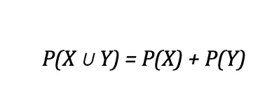
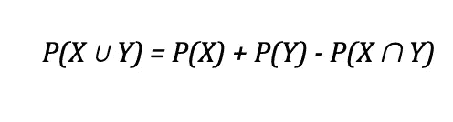
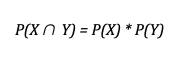
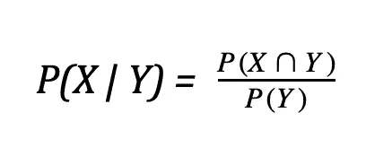

# 概率和机会世界导论

> 原文：<https://medium.com/analytics-vidhya/an-introduction-to-probability-and-the-world-of-chance-cde799b3f3d5?source=collection_archive---------21----------------------->

## 探索概率的意义和用途

吉列尔莫·贝拉尔德在 [Unsplash](https://unsplash.com/s/photos/dice?utm_source=unsplash&utm_medium=referral&utm_content=creditCopyText) 上拍摄的照片

概率的概念几乎涉及到我们生活的所有方面。事实上，我们做出的许多决定都是基于我们认为最有利的事件的概率。因此，正确理解概率论并学会如何将其应用于其他问题是至关重要的。

通常，当我们考虑概率时，首先想到的场景是骰子或卡片。毕竟，这两个物体通常与游戏、赌博或任何涉及*几率*的事物联系在一起。有趣的是，术语“机会”实际上相当准确地总结了概率的定义。简单来说，概率就是某事发生的可能性。

> "许多不可能发生的事会发生，这是概率的一部分."
> 
> -亚里士多德

然而，如果我们想得到更多的数学知识，我们可以将概率描述为分数。

*P(E)=(E 为真的方式数)/(结果总数)*

其中 P(E)表示发生*事件*的概率。

P(E)的值将始终是区间[0，1]中的一个小数值(尽管这个小数值可以乘以 100 得到一个百分数)；值越高，事件发生的可能性越大，概率为 0 表示事件发生的不可能性，概率为 1 表示不可挽回的确定性。现在，让我们来看几个简单而有意义的例子，看看我们的定义在问题的上下文中是如何工作的。

*在普通骰子上掷出三的几率有多大？*

使用直觉可以相对快速地解决这个问题，但是让我们尝试应用之前生成的公式。只有一面显示数字三，总共有六面。应用定义，我们现在可以清楚地看到 P(“三”)= 1 / 6。

*从一堆正常的扑克牌中挑出一张杰克的几率有多大？*

再一次，我们需要问自己一些基本的问题:我们有多少种选择千斤顶的方法？我们总共从多少张卡片中挑选？我们知道，一副标准的扑克牌包含 52 张牌，每张牌有 4 张正面牌，也就是说总共有 4 张 j。所以挑到千斤顶的概率是 4 / 52 或者 1 /13。

前面两个例子都是相对简单的问题，旨在引导一个经验很少的人进入概率领域。现实情况是，需要许多更复杂的数学分析方法来处理一些更困难的问题。

# 并集和交集的概率

联合是复合事件的两种常见类型之一(当涉及两个或更多事件时)。我们把事件 X 和 Y 的并的概率定义为 X 或 Y 或者两者都发生的概率。根据这个定义，根据事件 X 和 Y 是否能同时发生，得出了两个不同的计算概率的公式:这取决于它们的互斥性。

> 如果两个事件不能同时发生，它们被认为是互斥的，而如果它们能同时发生，它们被认为不是互斥的。

在事件 X 和 Y 确实互斥的情况下，我们有下面的等式。

互斥的联合方程

例如，假设我们想计算掷出 5 或 6 的概率。这些事件不可能同时发生，所以我们只需要把各个概率加起来。掷出五的几率是 1 /6，掷出六的几率也是 1/6；因此，掷出五或六的机会是 1 / 3。

然而，在 X 和 Y 不互相排斥的情况下，这个公式会稍微改变。

没有互斥的联合方程

你会注意到，这个等式的末尾附加了一个额外的概率，带有一个有点像倒 u 形的符号。这被称为*交集*，是两种常见复合事件类型中的第二种。两个事件相交的概率被定义为事件一和事件二在一次运行中发生的概率。我们将讨论交集公式，但事实是，当处理非互斥事件的概率时，交集的概念极其重要。

一个经典的例子展示了以前的联盟公式是与卡。假设我们想确定抽到黑桃或皇后的概率。有了牌，我们现在必须转移到非互斥的世界，因为抽一张既是黑桃又是皇后的牌是可能的。根据我们的公式，我们需要找到选择黑桃、皇后、*和*黑桃皇后的概率，分别是 13 / 52、4 / 52 和 1 / 52。通过将前两个分数相加，然后用最后一个分数减去该和，可以获得最终的概率。这样做得到 16 / 52 或 4 / 13。

现在我们已经了解了交集的概念，让我们更深入地研究一下这个公式。我们通常在*独立、*的背景下处理交集，即一个事件的概率不影响另一个事件的概率。在这种情况下，交集的公式如下。

交集方程；独立事件

例如，如果翻转两个 25 美分硬币，它们都是反面的概率是 0.5 * 0.5 = 0.25。思考这个问题的另一种方法是看看我们对概率的第一个定义，它包括事件发生的次数和结果的总数。首先，让我们列出翻转两个季度的所有可能结果。

{H，H}，{H，T}，{T，H}，{T，T}

有多少结果包含两条尾巴？只有四分之一。

# 条件概率

条件概率是指给定事件 y 发生的情况下，事件 X 发生的概率。

给定 Y，X 的条件概率

> (你会注意到交集的表达式在这个等式中。如果我们分离出该项，我们可以看到它等于 P(X | Y) * P(Y)。这个版本的交集公式用于彼此不独立的事件)

假设我们得到一些关于高年级学生在某一周练习出勤的数据。该团队的经理创建了一个图表，其中包含 41 名学生的以下信息。

*在队里的 22 个低年级学生中，9 个参加了不到 3 天的训练，13 个参加了超过 3 天的训练。此外，在团队的 19 名高年级学生中，12 人参加了不到 3 天的练习，而 7 人参加了超过 3 天的练习。*

教练想知道学生参加少于 3 天训练的概率，假设他们是三年级学生，或者 P( < 3 days | junior ). First, let’s compute the probability of the intersection. Out of the total 41 students, we know that 9 juniors attended less than 3 days of practice, so this probability is 9 / 41\. The second probability we need to determine is the probability of being a junior, which is simply 22 / 41\. Therefore, our conditional probability is (9 / 41) / (22 / 41), or 9 / 22.

# **最终想法**

希望你现在对概率论及其基本原理有了更深的理解。这些公式和想法每天都在使用，无论是在高中教室里还是在实验室里。它之所以如此重要，是因为它给我们一种机会和风险感，让我们能够在医学、统计学、金融等领域做出决策。没有它，我们对世界的数学理解将会不同。