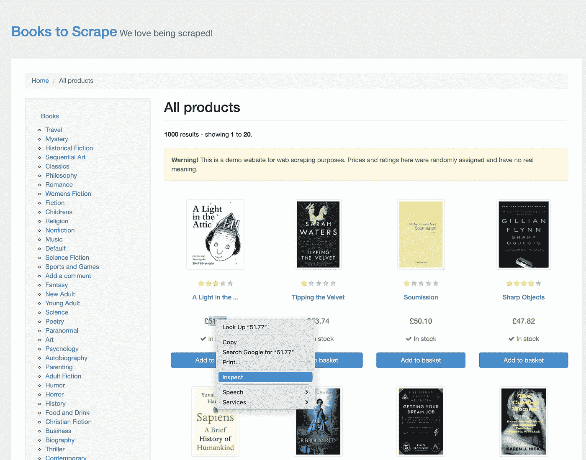
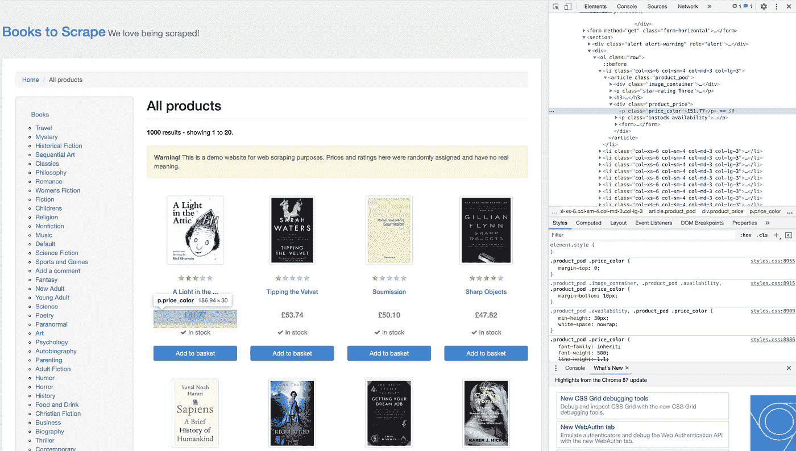
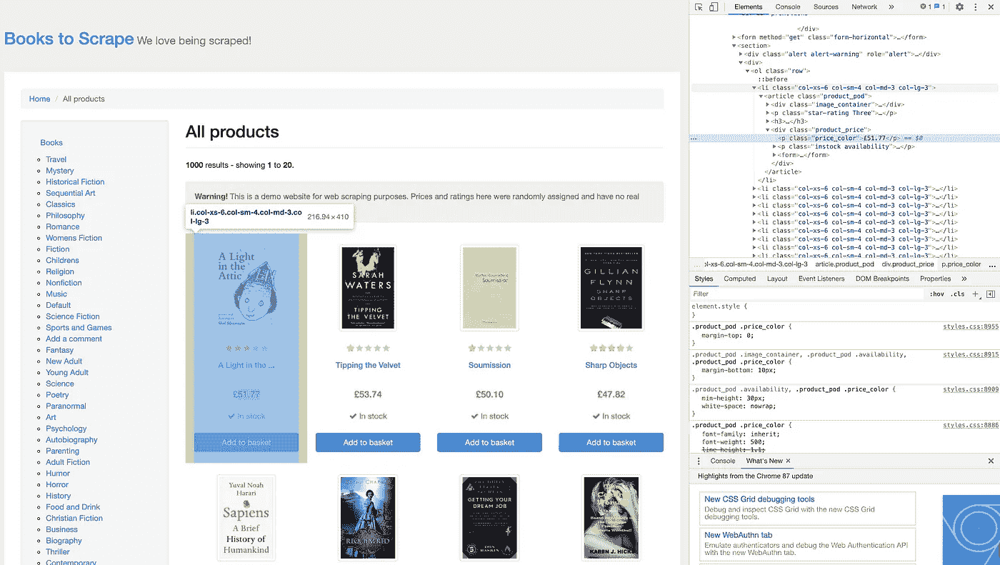
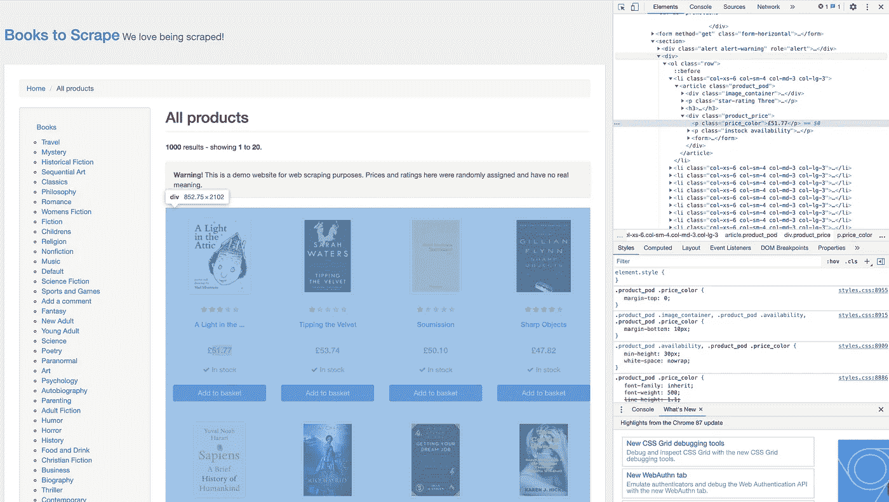
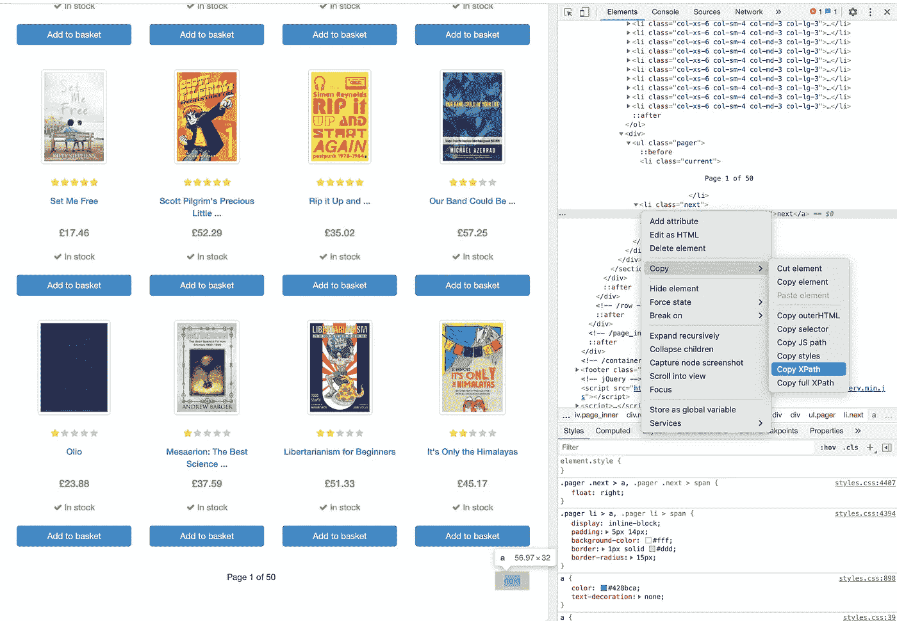

# 硒和美丽的汤介绍

> 原文：<https://medium.com/analytics-vidhya/an-introduction-to-selenium-and-beautiful-soup-11e19e7697dc?source=collection_archive---------5----------------------->


尼古拉斯·皮卡德在 [Unsplash](https://unsplash.com?utm_source=medium&utm_medium=referral) 上拍摄的照片

在学习 python 时，你可能听说过的许多事情之一就是 web 抓取。当我在做一个个人项目时，我必须从多个国家收集天气数据，并通过网络搜集来收集这些数据。两个最有用的工具，你可以利用当处理网页抓取是硒和美丽的汤。

Beautiful Soup 是一个 python 库，可以让用户轻松地从网页中抓取数据。这些工具使浏览 html 或 XML 文件以及通过树状结构搜索信息变得更加容易。您可以搜索特定的标签、属性或 id。这些工具还允许用户浏览诸如子女和兄弟姐妹之类的关系。

Selenium 是一套允许用户自动化 web 驱动程序的工具。为了真正理解这一点的重要性，让我们举个例子。在我的项目中，当我需要天气数据时，我需要几个月的数据。然而，这些信息不仅仅出现在一个网页上。我不得不移动到多个页面来收集这些数据。您最不想做的事情就是手动移动到每个站点，获取您正在寻找的特定数据，然后继续移动到下一个站点。selenium 的工具允许用户自动访问每个站点并收集必要的信息。这使得收集数据更快、更顺畅。更不用说在收集数据时你不必呆在电脑上。你可以设置一个程序，让它为你收集数据。

**美汤**

当然，使用这个库的第一步是安装包。这个包截至 2020 年 10 月 3 日的当前版本是美人汤 4.9.3。一个简单的方法来安装美丽的汤是

```
pip install beautifulsoup4
```

如果您使用的是 jupyter notebook，在您设置了一个新的笔记本后，您希望使用以下代码导入该包:

```
from bs4 import BeautifulSoup
```

既然库已经设置好了，我们希望能够访问一个网页。如果你刚刚开始，想尝试抓取一个页面，我建议你使用请求模块。请求模块允许用户收集网页。

```
import requests
```

接下来就是找网站刮了。有一些网站是专门设计来让人们学习如何刮胡子的。一个例子是从书上刮来的。这只是一个演示网站，所以一些信息，如价格和评级被分配了随机值，但你不会有被踢出网站的危险。

```
html_page = requests.get(‘http://books.toscrape.com/’)
```

一旦我们有一个网站要求，我们想通过美丽的汤页面。

```
soup = BeautifulSoup(html_page.content, 'html.parser')
```

当通过 Beautiful Soup 构造函数时，页面被转换成 Unicode。Unicode 是“使用不同语言和文字的国际编码标准”通过使用下面的代码，我们可以快速浏览信息并了解其结构。

```
soup.prettify
```

这将显示页面上的所有信息，这是很多。当抓取时，我们只想要该信息的特定部分。因此，我们可以使用 Inspect Element 特性，而不是尝试通读整个页面。当你在一个特定的页面上，如果你右击该页面，有一个检查按钮。例如，在 Book to Scrape 页面上，如果你右击第一本书的价格，你会看到一个 Inspect 按钮。



按下此按钮，将打开一个侧窗口，直接导航到文档上的位置并高亮显示。



如果突出显示“检查元素”页面的不同部分，它将突出显示页面的相应部分。



一本书



书籍的

因此，如果我们想专门寻找书籍的价格，我们会想要一个变量，我们只通过选择查看。第一步是使用 find 方法。当我们在网站上时，我们可以使用 inspect 元素找到包含所有书籍的

。在那之上，有一个独特的有一个警戒警告。

```
select = soup.find('div', class_="alert alert-warning")
```

从那里，我们可以向下导航到装有书籍的容器。

```
books = select.next_sibling.next_sibling
```

既然我们有了所有的书，我们可以仔细看看价格。如果你仔细观察元素，你会发现价格在一个段落中，这个段落有一个名为`price_color`的类。有一个 findAll 方法允许我们在 books 容器中查找每个案例。

```
prices = books.findAll('p', class_='price_color')
```

这给了我们一份价目表。如果我们想在页面上找到更多的信息，比如价格的最小值、最大值或平均值，我们需要首先将信息转换成文本，然后将文本从 string 转换成 float。

```
prices_text = [price.text for price in prices]
```

现在我们有了一个字符串格式的价格列表，如果去掉英镑符号，我们可以转换成浮点数。

```
prices_fl = [float(price[1:]) for price in prices_text]
```

现在我们在页面上有一个价格列表，我们可以通过找到这样的信息来了解更多，比如列表中哪本书最贵。然而，如上所述，有时您需要来自多个网站的信息，这就是 Selenium 可以进入的地方。

**硒**

和以前一样，第一步是安装工具套件。

```
pip install selenium
pip install webdriver-manager
pip install selectorlib
```

接下来，我们将一些工具导入笔记本。

```
from selenium import webdriver
from webdriver_manager.chrome import ChromeDriverManager
from selenium.webdriver.support.ui import WebDriverWait
from selenium.webdriver.support import expected_conditions as EC
from selenium.webdriver.common.by import By
from selenium.common.exceptions import NoSuchElementException
from selenium.common.exceptions import TimeoutExceptionfrom 
from selectorlib import Extractor
import time
```

现在这看起来似乎很多，但是如果你正在检查多个网站，并且你的互联网移动缓慢，你不希望因为第一个网站没有加载而跳过一个网站。

回到我收集天气数据的例子，我运行了一个函数，它从多个页面获取一个表格。然而，当我在功能完成后返回时，我发现我的数据集有一半是重复的，因为网站还没有加载。

关于如何访问多个网站的基本示例，让我们回到 Books to Scrape 网站。这个网站有多页书要迭代。在这种情况下，第一步是决定要使用哪个浏览器。

```
driver = webdriver.Chrome(ChromeDriverManager().install())
```

这将在电脑控制的 Chrome 浏览器中打开一个新窗口。接下来，我们命令电脑去网站。

```
driver.get('http://books.toscrape.com/’)
```

使用 Selenium，我们可以让计算机点击某些按钮，如果你知道你想点击什么元素的话。在驱动程序中，你可以使用 find_element 方法，你可以选择你想要的查找元素的方式，然后选择这个元素是什么。在这种情况下，将查找 XPath。要查找 XPath，可以使用想要单击的按钮上的 inspect 元素，然后右键单击突出显示的元素，并选择复制 XPath。



然后，下面的代码将单击按钮，将浏览器带到下一页。

```
click_next = driver.find_element(By.XPATH, /html/body/div/div/div/div/section/div[2]/div/ul/li[2]/a)
```

然后，可以将页面放入漂亮的汤里，并在漂亮的汤里经历与上面看到的相同的过程。

```
soup = BeautifulSoup(driver.page_source, 'html.parser')
```

**确认你的页面已经加载**

如前所述，有时页面在整个程序中不会以相同的速度加载。要确认页面已经加载，一种方法是等待元素显示。

```
timeout = 5
    try:
        element_present = EC.presence_of_element_located((By.ID, 'main'))
        WebDriverWait(driver, timeout).until(element_present)
    except TimeoutException:
        print("Timed out waiting for page to load")
    finally:
        print("Page loaded")
```

看这段代码，`presence_of_element_located()`方法会告诉我们网站是否已经被加载。`WebDriverWait`将使用`until`方法强制程序等待，直到元素被定位，这就是确认页面已经被加载。

当一起使用时，Selenium 和 Beautiful Soup 是强大的工具，允许用户高效快速地从 web 上收集数据。我希望这篇介绍能帮助你对使用这些伟大的工具进行网络抓取感到更舒服一些。

有关更多信息，您可以查看以下工具的文档:

靓汤:[https://www.crummy.com/software/BeautifulSoup/bs4/doc/](https://www.crummy.com/software/BeautifulSoup/bs4/doc/)

硒:[https://www.selenium.dev/documentation/en/](https://www.selenium.dev/documentation/en/)