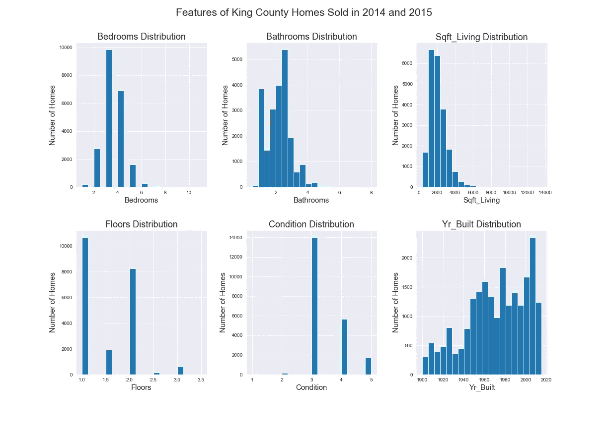
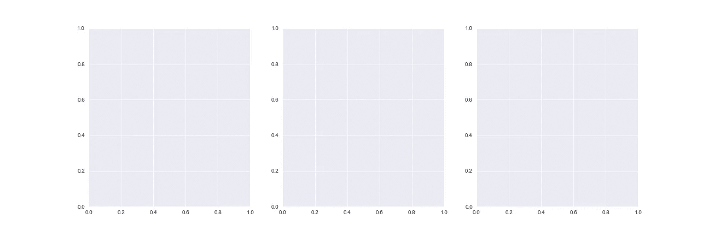
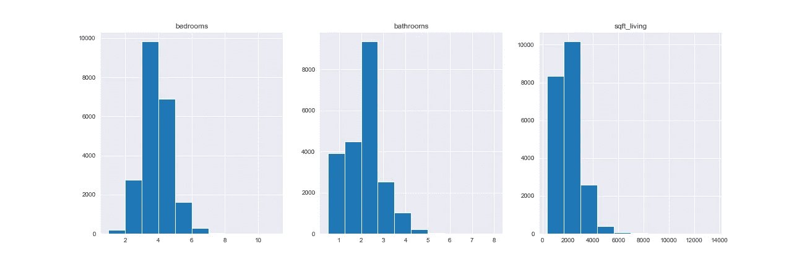
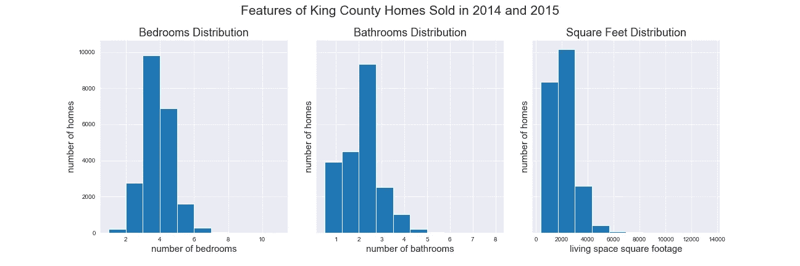

# Matplotlib 中的支线剧情介绍

> 原文：<https://medium.com/analytics-vidhya/an-introduction-to-subplots-in-matplotlib-b8b4821b47d1?source=collection_archive---------4----------------------->

在这个故事中，我将讨论:

1.  [如何在 matplotlib 中创建支线剧情](#957a)
2.  [添加标签和填充](#778e)
3.  [如何使用 for 循环自动创建支线剧情](#98f7)

作为一个 python 初学者，我发现自己在尝试创建支线剧情时出乎意料地困惑。plt.subplot()和 PLT . subplot()函数有什么区别？plt.subplot(131)等隐晦的三位数有哪些？“无花果，斧子”是什么意思？下面我会试着揭开支线剧情语法的神秘面纱。


照片由 [Unsplash](https://unsplash.com?utm_source=medium&utm_medium=referral) 上的 [Amber Engle](https://unsplash.com/@twistsandzests?utm_source=medium&utm_medium=referral) 拍摄

# 什么是支线剧情，为什么有用？

使用支线剧情仅仅意味着在同一个人物中放置多个情节。例如，这里有一个包含六个支线剧情的图形。该数据来自 Kaggle 上的[国王郡房屋销售数据集](https://www.kaggle.com/harlfoxem/housesalesprediction?select=kc_house_data.csv)。



呈现数据时，一目了然地显示多个图表会很有帮助，以便进行比较和更好地理解整个数据集。向幻灯片添加一个图像也比粘贴和对齐多个图像更容易。

# **基本支线剧情创建**

下面是创建支线剧情的一些基本代码:

```
# import pandas, matplotlib and seaborn
import pandas as pd
import matplotlib.pyplot as plt
import seaborn as sns# choose style for plots
sns.set_style(“darkgrid”)# import data
df = pd.read_csv('kc_house_data.csv')# define figure and axes for subplots
fig, ax = plt.subplots(figsize=(15,4), nrows=1, ncols=3);
```

这里，我们定义了图形(fig)和轴(ax ),它们组成了**子图()**函数的输出。一个“图形”意味着包含所有支线剧情的整个图像。“斧子”指的是单独的支线剧情。因为我们指定行数为 1，列数为 3，所以我们的输出将是:



我们来补充一些数据。

```
# add plots to each axisfig, ax = plt.subplots(figsize=(15,4), nrows=1, ncols=3);ax[0].hist(df['bedrooms'])
ax[0].set_title('bedrooms')ax[1].hist(df['bathrooms'])
ax[1].set_title('bathrooms')ax[2].hist(df['sqft_living'])
ax[2].set_title('sqft_living');
```



这里，我们使用第一、第二和第三轴来绘制直方图。我们对数组' ax '中的每一项调用了 **hist** 和 **set_title** 方法。定义每个

轴会产生相同的结果:

```
# add plots to each axis - alternative codefig, [ax1, ax2, ax3] = plt.subplots(figsize=(15,4), nrows=1, ncols=3);ax1.hist(df[‘bedrooms’])
ax1.set_title(‘bedrooms’)ax2.hist(df[‘bathrooms’])
ax2.set_title(‘bathrooms’)ax3.hist(df[‘sqft_living’])
ax3.set_title(‘sqft_living’)
```

好的，很好。现在你猜怎么着——还有一种方法可以创造完全相同的支线剧情。您可能会看到使用 plt.subplot()单独定义的子情节:

```
# create axes individually using plt.subplot()plt.figure(figsize = (18,6)); # need this step to set figure sizeax1 = plt.subplot(1, 3, 1)
df['bedrooms'].hist()
plt.title('bedrooms')ax2 = plt.subplot(1, 3, 2)
df['bathrooms'].hist();
plt.title('bathrooms')ax3 = plt.subplot(1, 3, 3)
df['sqft_living'].hist()
plt.title('sqft_living')plt.savefig('images/hist_no_figure')
```

子情节函数中的数字指的是参数 **nrows** 、 **ncols** 和 **index** 。因此

```
ax1 = plt.subplot(1, 3, 1)
```

意味着我们要将该图添加到一个 1 行 3 列的图中，并且该图应该是图中的第一个轴。逗号也可以省略，只要数字顺序正确:总行数、总列数和图的索引。例如:

```
ax1 = plt.subplot(131)
```

# **让支线剧情可读——标签和填充**

在我们开始自动创建支线剧情之前，让我们给支线剧情添加标签并调整它们之间的空白。上面，我们给每个支线剧情添加了标题，但是如果我们想要整个人物的标题呢？为此，我们可以调用图上的**【sup title()】**方法。

```
fig.suptitle(‘Histograms’, fontsize=15)
```

此外，x 轴和 y 轴标签可以添加到每个子图中，如下所示。

```
ax[0].set_xlabel(‘number of bedrooms’)
ax[0].set_ylabel(‘number of homes’)
```

**plt.subplots_adjust()** 函数用于调整图之间以及图形标题和图之间的空白空间(为此使用参数“top”)。将所有这些放在一起:

```
fig, ax = plt.subplots(figsize=(18,6), nrows=1, ncols=3, sharey=True);
fig.suptitle('Features of King County Homes Sold in 2014 and 2015', fontsize=21)ax[0].hist(df['bedrooms'])
ax[0].set_title('Bedrooms Distribution', fontsize=18)
ax[0].set_xlabel('number of bedrooms', fontsize=15)
ax[0].set_ylabel('number of homes', fontsize=15)ax[1].hist(df['bathrooms'])
ax[1].set_title('Bathrooms Distribution', fontsize=18)
ax[1].set_xlabel('number of bathrooms', fontsize=15)
ax[1].set_ylabel('number of homes', fontsize=15)ax[2].hist(df['sqft_living'])
ax[2].set_title('Square Feet Distribution', fontsize=18)
ax[2].set_xlabel('living space square footage', fontsize=15)
ax[2].set_ylabel('number of homes', fontsize=15)plt.subplots_adjust(top=0.85, wspace=0.15)
```



请注意， **plt.subplots()** 函数在这里指定了一个额外的参数:

```
sharey=True
```

这将所有三个图形的 y 轴设置为相同，以便于它们之间的比较。

# 自动创建子情节

现在是有趣的部分！如果你有很多支线剧情要包含呢？例如，让我们从 King County 的房屋销售数据中挑选 6 列，并为每一列做一个直方图，就像我们在本文开头看到的那样。

为六个(或更多)轴分配一个图、标题和标签会很耗时，所以我们可以使用 for 循环。首先，请注意，对于包含多行子情节的图形，轴必须由它们的行和列位置来标识。如果我们要为这六个图编写代码，我们应该这样开始:

```
fig, ax = plt.subplots(figsize=(15,10), nrows=2, ncols=3, sharey=True);
fig.suptitle('Histograms', fontsize=15)ax[0,0].hist(df['bedrooms'])
ax[0,0].set_title('Bedrooms Distribution')
ax[0,0].set_xlabel('number of bedrooms')
ax[0,0].set_ylabel('number of homes')ax[0,1].hist(df['bathrooms'])
ax[0,1].set_title('Bathrooms Distribution')
ax[0,1].set_xlabel('number of bathrooms')
ax[0,1].set_ylabel('number of homes')# I don't want to write these out anymore... let's automate them
```

因为这个图有不止一行的支线剧情，所以坐标轴必须用**【行，列】**来标识，而不仅仅是**【列】**。例如， **[0，0]** 表示轴在第一行第一列， **[0，1]** 表示轴在第一行第二列。(不得不喜欢 python 使用 0 而不是 1 作为所有数字序列的开始。)如果我们想要调用第二行第一列中的轴，我们将使用 **[1，0】**。对于第三行第二列，我们将使用**【2，1】**。你明白了！

现在，我们如何自动创建多行支线剧情？要使用 for 循环创建每个**【行，列】**标识符，我们可以使用以下代码:

```
# choose features for the subplots
features = ['bedrooms', 
       'bathrooms', 
       'sqft_living', 
       'floors', 
       'condition', 
       'yr_built' ]# choose how many columns you want
num_cols = 3# set a number of rows
if len(features)%num_cols == 0:
    num_rows = len(features)//num_cols
else:
    num_rows = (len(features)//num_cols) + 1# define the figure and axes
fig, ax = plt.subplots(figsize=(17,12), 
                       nrows=num_rows, 
                       ncols=num_cols)# add a figure title
fig.suptitle('Features of King County Homes Sold in 2014 and 2015', 
             fontsize=21)#use a for loop to create each subplot:
for feat in features:
    row = features.index(feat)//num_cols
    col = features.index(feat)%num_cols

    ax[row, col].hist(df[feat], bins=20)
    ax[row, col].set_title(feat.title()+' Distribution', 
                           fontsize=18)
    ax[row, col].set_xlabel(feat.title(),
                            fontsize=15)
    ax[row, col].set_ylabel('Number of Homes',
                            fontsize=15)

plt.subplots_adjust(top=0.9, wspace=0.3, hspace=0.3)
```

我们先来看 for 循环。这里，我们根据特性在列表中的索引位置，将“特性”列表中的每个特性分配到一个特定的子情节**【行，列】**。

为此，我们使用了 **//** 和 **%** 操作符。

Floor Division 运算符//返回两个数的商，然后向下舍入到最接近的整数。模运算符%将第一个数字除以第二个数字，并返回余数。

让我们回想一下四年级的时候。还记得 11 除以 3 不叫 3.67 而是叫“3 余数 2？”同样的，

11 // 3 = 3

和

11 % 3 = 2

地板除法运算符给出的是没有余数的商，而模运算符给出的是余数。

这对我们的 for 循环很有用。我们可以通过将‘features’列表中的特性索引除以图中的列数来自动创建子情节。向下舍入的商将是要素的行位置，余数将是要素的列位置。所以，对于我们“壮举”列表中的第六项，

```
ax[row, col]
```

等同于说:

```
ax[5 // 3, 5 % 3]
```

或者

```
ax[1, 2]
```

这就把这个支线剧情放在了第二行第三列。

上面代码中的“if”语句还使用//和%运算符，根据您选择的列数为数字分配行数:

```
# set a number of rows
if len(features)%num_cols == 0:
    num_rows = len(features)//num_cols
else:
    num_rows = (len(features)//num_cols) + 1
```

这段代码的意思是:如果特性列表长度除以列数的余数为 0，那么行数应该就是这个数——特性列表长度除以列数。如果余数不为 0，那么增加一行(来保存剩余的支线剧情)。


现在我们有了它——使用 for 循环创建多个轴，并使用//和%操作符为每个轴设置行和列的位置。这篇文章的所有代码都可以在这里找到。感谢您的阅读，我很乐意听到您的意见和建议。