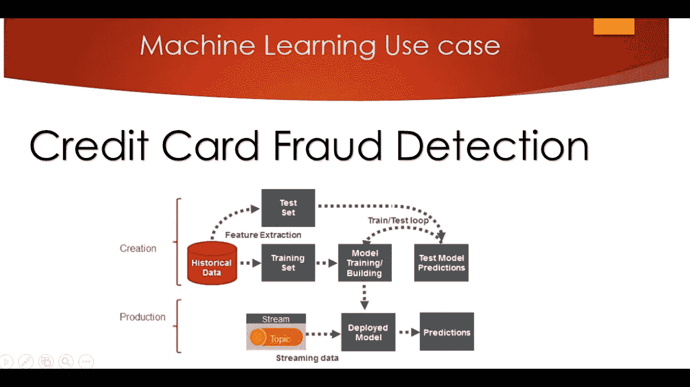

# 基于机器学习的信用卡欺诈检测研究

> 原文：<https://medium.com/analytics-vidhya/an-investigation-on-credit-card-fraud-detection-using-machine-learning-eacdd2d5cb?source=collection_archive---------24----------------------->

在本文中，我们将以信用卡欺诈检测为例，分析各种机器学习算法如何在平衡和不平衡数据集上执行。

使用机器学习的信用卡欺诈检测

# 介绍

在过去的几年中，机器学习在解决垃圾邮件检测、推荐、对象检测等各种商业问题中发挥了重要作用。对于银行、医疗和商业行业来说，欺诈检测是一项痛苦的任务。黑客和犯罪分子正在不断寻找新的方法来寻找系统中的漏洞，因此公司认证他们的交易变得越来越困难。根据 cyber source 的欺诈基准报告，83%的美国企业正在进行手动审查，平均而言，他们手动审查 29 %的订单。印度正在见证在线交易的巨变。据《印度斯坦时报》报道，印度在信用卡欺诈方面排名前五，2017 年与借记卡/信用卡欺诈相关的案件激增至 42%。根据 RBI 的数据，在截至 5 月份的过去 12 个月中，信用卡数量增加了四分之一，达到 3800 万张，而同期借记卡数量增长了 17%，超过 9.25 亿张。

# 动机

在信用卡欺诈检测中，人工审查存在许多问题，如成本高、耗时且导致高误报，这意味着完全拒绝正常用户进行交易。通过分析这方面的机器学习算法，我的主要工作是减少人类的时间、计算和努力。人工智能通过在提供的数据集基础上可视化和分析数据，并在短时间内根据特征集采取适当的行动，帮助机器代替人类识别和扩展模式的重要性。由于数据的增加和交易类型的更多变化，基于规则的传统方法和传统方法已经失败。还有一个缺点是，由于高假阳性率，它导致合法客户的损失，并且高不平衡数据集仍然是一个值得关注的问题，也是机器学习中的一个广泛的研究领域。

# 目标

这项工作的目的是研究和分析像 boosting 和 ensembling 这样的机器学习算法以及像 smote、adasyn 和 allknn 这样的数据平衡算法如何在不平衡和平衡数据集上执行欺诈检测问题。

# 数据集描述

数据集包含 284，807 笔交易，其中有 492 笔，即 0.172%的交易是欺诈交易。它还包含持卡人在 2013 年 9 月的两天内进行的交易。该数据集非常不平衡。出于安全原因，数据集中的大多数要素都使用主成分分析(PCA)进行转换。V1、V2、V3、…、V28 是 PCA 应用特征，包括“时间”、“数量”和“类别”的其余特征是非 PCA 应用特征。

# 使用的指标

*   准确度= TP + TN / TP + TN + FP + FN
*   精度= TP / TP + FP
*   召回= TP / TP + FN
*   F1score = 2 *精度*召回率/精度+召回率
*   MCC = TP * TN—FP * FN/sqrt((TP+FP)*(TP+FN)*(TN+FP)*(TN+FN))
*   Roc =假阳性率和真阳性率之间的曲线下面积

# 结果

调查结果可在此处查看:

 [## jainyk/An-信用卡欺诈调查-检测

### 本文通过实例分析了各种机器学习算法在平衡和不平衡数据集上的表现

github.com](https://github.com/jainyk/An-investigation-on-credit-card-fraud-detection#results) 

# 结论

整个项目讨论了信用卡欺诈检测的问题，以及如何使用机器学习来处理它。如方法论中所述，各种机器学习算法基于准确度、精确度、召回率、f1 得分、roc 和 mcc 进行比较。在研究过程中，在比较各种机器学习的各种指标时，发现使用 allknn 观察到 xgboost 的最高准确性，使用 minmaxscaler [23]观察到使用 allknn 的逻辑回归的最高召回率，使用 allknn 观察到 xgboost 的最高精确度和 f1 分数，使用 smote 观察到逻辑回归的最高 roc 和 mcc 分数。与其他结果相比，有些结果是相当异常的，例如整体 minmaxscaler 没有提高模型性能，而是在 smote 和 adasyn 方面与逻辑回归一起使用时显示下降趋势。它显示负 mcc 得分，精度值为零，与 smote 一起使用时显示召回、f1 得分。在进一步观察中，发现用 smote 和 adasyn 进行的逻辑回归的真阳性为 0，用 minmaxscaler 进行的逻辑回归的真阴性和假阴性以及用 minmaxscaler 和 allknn 进行的逻辑回归的真阴性和假阴性为 0。在分析过程中，当 smote 和 adasyn 用作数据平衡算法时，发现“V14”是最主要的特征，并且它们都是过采样方法，当不使用数据平衡算法时，发现“V17”是最主要的特征。在 allknn 作为数据平衡算法的情况下，观察到大多数变化。

如有任何疑问，请在下方留言。欢迎任何进一步的建议。