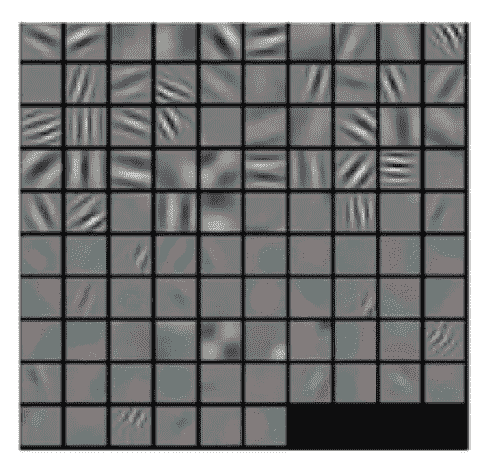
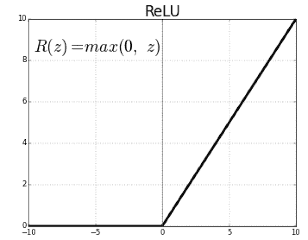
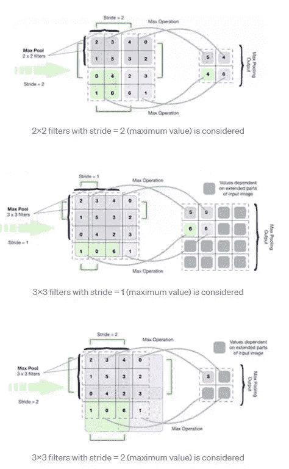
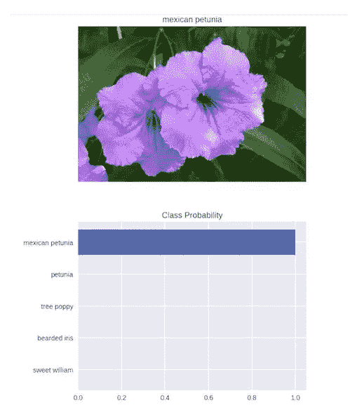

# 卷积神经网络综述

> 原文：<https://medium.com/analytics-vidhya/an-overview-of-convolutional-neural-network-cnn-a6a3d67ce543?source=collection_archive---------7----------------------->

*来源:*[*https://medium . com/@ RaghavPrabhu/understanding-of-convolutionary-neural-network-CNN-deep-learning-99760835 f148*](/@RaghavPrabhu/understanding-of-convolutional-neural-network-cnn-deep-learning-99760835f148)

卷积神经网络(CNN)是一类深度学习神经网络。CNN 代表了图像识别的巨大突破。它们最常用于分析视觉图像，并且经常在图像分类的幕后工作。从脸书的照片标签到无人驾驶汽车，它们都是一切事物的核心。从医疗保健到安全，他们都在幕后努力工作。

图像分类是获取输入(如图片)并输出类别(如“猫”)或输入是特定类别的概率(该输入有 90%的概率是猫)的过程。你可以看着一张照片，知道你正在看一张你自己的可怕的照片，但是计算机怎么能学会这样做呢？卷积神经网络。

CNN 有 4 个主要层:

*   卷积层
*   ReLU 层
*   池层
*   全连接层

一个经典的 CNN 架构应该是这样的:

**输入- >卷积- > ReLU - >卷积- > ReLU - >汇集- > ReLU - >卷积- > ReLU - >汇集- >全连接**

CNN 将学习到的特征与输入数据进行卷积，并使用 2D 卷积层。这意味着这种类型的网络是处理 2D 图像的理想选择。与其他图像分类算法相比，CNN 实际上很少使用预处理。这意味着他们可以学习其他算法中必须手工制作的过滤器。CNN 可用于大量应用，从图像和视频识别、图像分类和推荐系统到自然语言处理和医学图像分析。

CNN 受到生物过程的启发。它们是基于 Hubel 和 Wiesel 在 60 年代对猫和猴子的视觉所做的一些很酷的研究。CNN 的连接模式来自他们对视觉皮层组织的研究。在哺乳动物的眼睛中，单个神经元只在感受野对视觉刺激做出反应，这是一个受限制的区域。不同区域的感受野部分重叠，从而覆盖整个视野。这就是 CNN 的工作方式。

CNN 有一个输入层，一个输出层和隐藏层。隐藏层通常由卷积层、ReLU 层、池层和全连接层组成。

*   卷积层对输入应用卷积运算。这将信息传递到下一层。
*   汇集将神经元簇的输出组合成下一层中的单个神经元。
*   完全连接的层将一层中的每个神经元连接到下一层中的每个神经元。

在卷积层中，神经元仅接收来自前一层的子区域的输入。在全连接层中。每个神经元接收来自前一层的每个元素的输入。

CNN 的工作原理是从图像中提取特征。这消除了手动特征提取的需要。这些特征没有被训练。它们是对计算机视觉任务极其精确的学习模型，CNN 通过数十或数百个隐藏层学习特征检测。每一层都增加了所学特征的复杂性。

# CNN 的一步一步的过程

*   从输入图像开始
*   对其应用许多不同的过滤器以创建特征地图
*   应用 ReLU 函数来增加非线性
*   将池化图层应用于每个要素地图
*   将合并的图像展平成一个长矢量。
*   将向量输入到完全连接的人工神经网络中，
*   通过网络处理要素。最后的全连接层提供了我们所追求的类的“投票”。
*   通过前向传播和后向传播进行多次训练。这一过程一直重复，直到我们拥有一个定义明确的神经网络，该网络具有经过训练的权重和特征检测器。

换句话说，在这个过程的最开始，输入图像被分解成像素。对于黑白图像，这些像素被解释为 2D 阵列(例如 2 x 2 像素)。每个像素的值都在 0 到 255 之间。(零全黑，255 全白。灰度存在于这些数字之间。)基于这些信息，计算机可以开始处理这些数据。

*阵列中的灰度图像表示*

对于彩色图像，这是一个包含蓝色层、绿色层和红色层的 3D 阵列。每一种颜色都有自己的值，在 0 到 255 之间。可以通过组合三层中每一层的值来找到颜色。

*数组中的 RGB 图像表示*

# CNN 中的基本构件

## 盘旋

卷积步骤的主要目的是从输入图像中提取特征。卷积层永远是 CNN 的第一步。

您有一个输入图像、一个特征检测器和一个特征图。你把滤镜一个像素一个像素地应用到输入图像上。你可以通过矩阵相乘来实现。

假设你有一个手电筒和一张泡泡纸。你的手电筒照亮了一个 5 个泡泡 x 5 个泡泡的区域。要查看整张纸，你可以用手电筒扫过每个 5 x 5 的正方形，直到看到所有的气泡。

手电筒发出的光是你的过滤器，你滑过的区域是感受野。滑过感受野的光是你的手电筒。您的过滤器是一组数字(也称为权重)。手电筒发出的光行进时滑动的距离称为步幅。例如，步幅为 1 意味着您一次移动一个像素的滤镜。大会是一步两个脚印。

滤镜的深度必须与输入的深度相同，所以如果我们看的是彩色图像，深度应该是 3。这使得该过滤器的尺寸为 5×5×3。在每个位置，滤镜将滤镜中的值与像素中的原始值相乘。这是元素式乘法。将乘法相加，创建一个代表左上角的数字。现在你移动你的过滤器到下一个位置，重复这个过程。最终得到的数组称为功能图或激活图。您可以使用多个过滤器，这样可以更好地保留空间关系。

*高级过滤器的可视化*

您将指定过滤器数量、过滤器大小、网络架构等参数。CNN 在训练过程中自己学习滤波器的值。您有许多选项可以用来为您的任务制作最佳的图像分类器。您可以选择用零填充输入矩阵(零填充)来应用过滤器以控制要素地图的大小。加零填充是宽卷积，不加零填充是窄卷积。

这就是我们检测图像的基本方式。我们不会查看图像的每个像素。我们看到像帽子、红色连衣裙、纹身等特征。每时每刻都有如此多的信息进入我们的眼睛，我们不可能处理其中的每一个像素。我们允许我们的模型做同样的事情。

如果这是卷积后的特征图，则为结果。它比原始输入图像小。这使得处理起来更加容易和快速。我们会失去信息吗？一些，是的。但同时，特征检测器的目的是检测特征，这正是它的作用。

我们创建了许多功能地图，以获得我们的第一个卷积层。这允许我们识别程序可以用来学习的许多不同的特征。

可以用不同的值设置特征检测器，以获得不同的结果。例如，可以应用能够锐化和聚焦图像或者使图像变蓝的过滤器。这将赋予所有的价值以重要性。您可以进行边缘增强、边缘检测等操作。您可以通过应用不同的特征检测器来创建不同的特征地图。计算机能够确定哪些过滤器最有意义并应用它们。

这里的主要目的是在输入图像中查找要素，将它们放入要素地图中，并仍然保留像素之间的空间关系。这一点很重要，这样像素才不会变得混乱。

## ReLU 层

ReLU(校正线性单位)层是我们卷积层的另一个步骤。您正在对要素地图应用激活函数以增加网络的非线性。这是因为图像本身是高度非线性。它通过将负值设置为零来从激活图中移除负值。

卷积是一种线性运算，包括元素间的矩阵乘法和加法。我们希望 CNN 了解的真实世界数据将是非线性的。我们可以用 ReLU 这样的操作来说明这一点。您可以使用其他操作，如 tanh 或 sigmoid。ReLU 是一个受欢迎的选择，因为它可以更快地训练网络，而不会对泛化精度产生任何重大影响。

*ReLU 激活功能图*

## 联营

您最不希望看到的是网络在确切位置的确切阴影中查找某个特定要素。这对一个好的 CNN 来说是没用的。您想要翻转、旋转、挤压等的图像。你想要同一事物的许多照片，以便你的网络可以在所有的图像中识别一个物体(比如说，一只猫)。无论大小或位置如何。不管有多少闪电或斑点，也不管那只猫是在熟睡还是在碾压猎物。你想要空间变化。你需要灵活性。这就是联营的意义所在。

池逐渐减小输入表示的大小。这使得检测图像中的物体成为可能，无论它们位于何处。池有助于减少所需参数的数量和所需的计算量。这也有助于控制过度拟合。

过度拟合有点像你在考试前不理解信息的情况下记忆超级具体的细节。当你记住细节的时候，你可以在家里用你的抽认卡做得很好。但是，如果给你提供新的信息，你将无法通过真正的测试。

*不同粒径不同走向的池*

## 完全连接

在这一步，我们将一个人工神经网络(ANN)添加到我们的卷积神经网络中。

人工神经网络的主要目的是将我们的特征组合成更多的属性。这些将更准确地预测类别。这结合了可以更好地预测类的特征和属性。

当有一个以上的神经元时，输出神经元是如何工作的？

首先，我们必须了解什么样的权重应用于连接输出的突触。我们想知道哪些先前的神经元对输出是重要的。

例如，如果您有两个输出类，一个是猫的，一个是狗的，则读取“0”的神经元绝对不能确定该特征属于猫。一个读到“1”的神经元绝对确定这个特征属于一只猫。在最终完全连接的层中，神经元将读取 0 和 1 之间的值。这意味着不同层次的确定性。值 0.9 表示 90%的确定性。

当一个特征被识别出来时，猫的神经元就知道这个图像是一只猫。他们说数学上相当于，“这些是我的神经元！我应该被触发了！”如果这种情况发生多次，网络就会知道当某些特征被激活时，这个图像就是一只猫。

通过大量的迭代，猫神经元知道当某些特征被激活时，图像就是一只猫。例如，狗的神经元知道当某些其他特征被激发时，这个图像就是一只狗。例如，狗神经元再次了解到，“大湿鼻子”神经元和“软耳朵”神经元对狗神经元有很大的贡献。它赋予“大湿鼻子”神经元和“软耳朵”神经元更大的权重。狗神经元学会或多或少忽略“胡须”神经元和“猫虹膜”神经元。猫神经元学会给予像“胡须”和“猫虹膜”这样的神经元更大的权重。

一旦训练好网络，你就可以传入一幅图像，神经网络将能够非常确定地确定该图像的图像分类概率。

全连接层是传统的多层感知器。它在输出层使用一个分类器。分类器通常是 softmax 激活函数。完全连接意味着前一层中的每个神经元都连接到下一层中的每个神经元。这一层的目的是什么？使用来自前一层的输出的特征来基于训练数据对输入图像进行分类。

一旦你的网络建立并运行，你可以看到，例如，你有 95%的可能性你的图像是一只狗，5%的可能性你的图像是一只猫。为什么这些数字加起来都是 1.0？(0.95 + 0.05).

没有任何东西表明这两个输出是相互联系的。是什么让他们联系在一起？本质上，它们不会，但是当我们引入 Softmax 函数时，它们会。这使值介于 0 和 1 之间，并使它们相加为 1 (100%)。Softmax 函数获取一个分数向量，并将其压缩为一个介于 0 和 1 之间的值的向量，这些值的总和为 1。

应用 Softmax 函数后，可以应用损失函数。交叉熵通常与 Softmax 密切相关。我们希望最小化损失函数，以便最大化网络性能。

在反向传播的开始，你的输出值会很小。这就是为什么你可能会选择交叉熵损失。梯度会非常低，神经网络很难开始向正确的方向调整。使用交叉熵有助于网络评估甚至一个微小的错误，并更快地达到最佳状态。

*使用 CNN 的分类结果*

# 结论

在这篇文章中，我介绍了什么是 CNN，它是如何工作的，以及每一层的流程是什么。CNN 让深度学习变得更好。如果你有任何问题，请随时联系我。干杯！

# 关于作者:

本文由马来西亚 [Arkmind](https://arkmind.com.my) 技术负责人韩胜撰写。他对软件设计/架构相关的东西、计算机视觉以及边缘设备充满热情。他开发了几个基于人工智能的网络/移动应用程序来帮助客户解决现实世界的问题。你可以通过他的 [Github 简介](https://github.com/hansheng0512)来了解他。