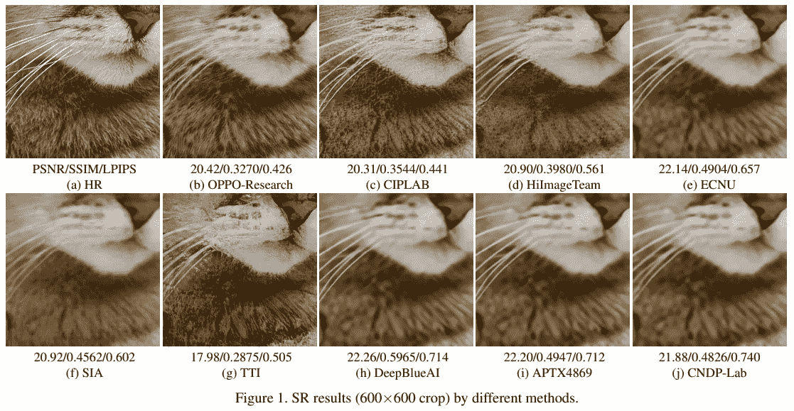
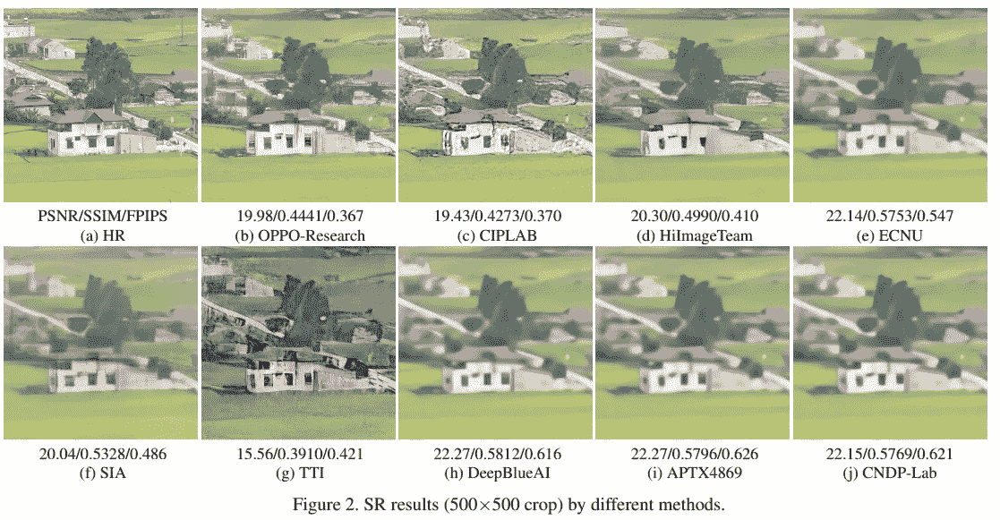
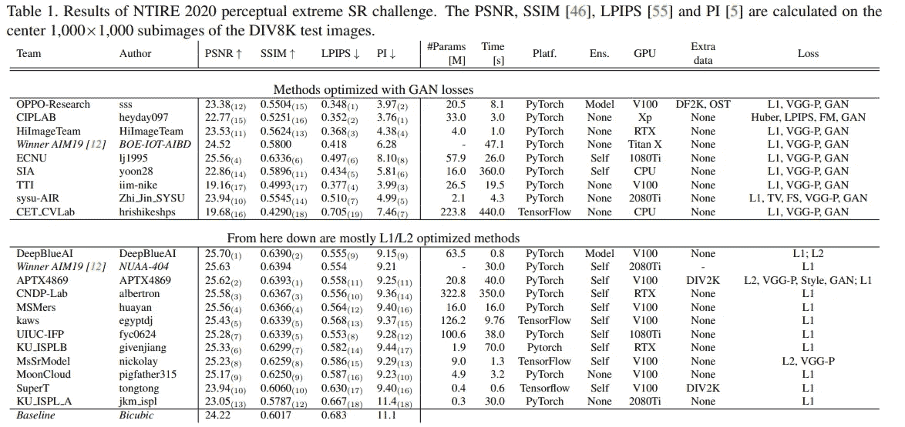
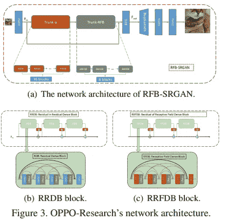
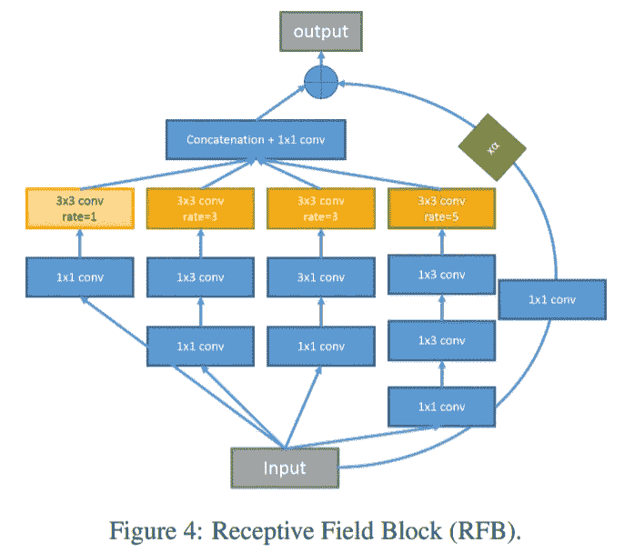
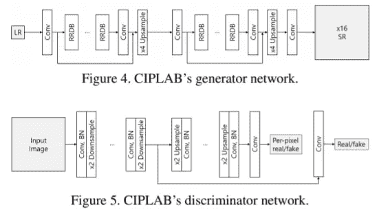
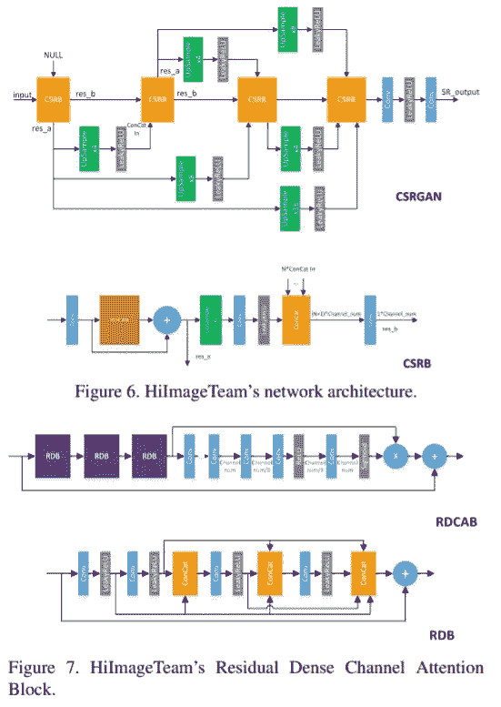

# NTIRE 2020 极限超分辨率挑战综述

> 原文：<https://medium.com/analytics-vidhya/an-overview-of-ntire-2020-extreme-super-resolution-challenge-c69b4daf41fd?source=collection_archive---------14----------------------->

# 对抗挑战

2020 NTIRE 极限超分辨率挑战[1]是关于以 x16 的缩放因子超分辨率图像。挑战赛论文回顾了 19 种方法，这些方法旨在解决这一问题并争夺感知性能。我们将概述比赛是如何进行的，以及挑战参与者提出的一些高分方法的直觉。

与 SISR 对 x4 等中等因子的积极研究相比，对极端超分辨率的研究并不多。传统的基于 MSE 的解决方案继承了为 SR 输出平滑图像的行为，这种现象在这个挑战中变得更加极端，因为可以从给定的 LR 图像生成更多的 HR 片。

[NTIRE 2020](https://data.vision.ee.ethz.ch/cvl/ntire20/) ， [NTIRE 2020 感知极限超分辨率挑战:方法与结果](https://openaccess.thecvf.com/content_CVPRW_2020/papers/w31/Zhang_NTIRE_2020_Challenge_on_Perceptual_Extreme_Super-Resolution_Methods_and_Results_CVPRW_2020_paper.pdf)

## 资料组

具有 1，700 个 8K 图像的 Div8K 数据集用于挑战中的训练和测试数据。该数据集只有在参加了 [Codalabs 挑战赛](https://competitions.codalab.org/competitions/22217)后才可用。我也在 Google Drive 上传了数据集，尽管由于我不确定数据集提供商的政策，我不会公开分享链接。

## 感知评价

这一挑战是基于感知测量而不是 PSNR/SSIM 来排名的。这两个测量是学习感知图像块相似性(LPIPS)[2]和感知指数(PI)。LPIPS 通过专门训练的 CNN 的激活来测量，PI 通过用户调查来评估。

# 趋势和概述

主要地，网络结构和损失函数被修改以增加模型的能力和改善超分辨率图像的感知质量。

几个团队扩展了现有的架构，如 RCAB、ESRGAN，并针对该问题逐步升级，一些团队直接重建了 16 倍的缩放因子。

大多数团队采用了 L1 损失，或者通过结合使用 L1、VGG 感知和相对论 GAN 损失，使用了 ESRGAN 的相同损失。CIPLAB 用 LPIPS 损失替换了 VGG 损失，一些团队用类似 U-Net 的架构来区分鉴别器。

与 2019 年 AIM 感知极限 SR 挑战赛的结果相比，感知和 PSNR 测量的 SOTA 都有所提高。虽然，从结果可以看出，挑战远未解决。特别是对于空间信息的恢复，所提出的方法似乎没有输出视觉上令人满意的结果(第二图)。

# 方法

我们将回顾挑战中提出的前 3 种方法。下表对通过不同方法评估的各种指标的性能进行了排名。官方文件[1]中提供了所有方法的详细描述。

## OPPO-Research[3]

像挑战赛中的许多其他作品一样，提议的 RFB-斯尔根架构也是基于 ESRGAN 的。第一个 Trunk-A 模型由 ESRGAN 中提出的 16 个 RRDBs 组成。以下 Trunk-RFB 模块由一个基于感受野块(RFB)的 DenseNet 架构组成，该架构可以有效地从不同尺度捕获信息。然后，通过亚像素卷积和最近邻插值的交替层来重构特征图，这两种方法都可以大大减少时间开销。提议的 RFB 区块和网络管道如下图所示。

## CIPLAB[4]

CIPLAB 团队使用 LPIPS 损失代替 VGG 损失来计算感知损失。因为 VGG 网络是为图像分类而训练的，所以它可能不是 SR 的最佳选择。建议的生成器由两个 ESRGAN 生成器组成，鉴别器是具有连续下采样和上采样操作的 U-Net 架构，旨在提供逐像素和全局上下文鉴别。

## HiImageTeam[5]

> HiImageTeam 提出了用于感知极限 SR 的级联 SR-GAN (CSRGAN)。如图 6 所示，CSRGAN 通过四个连续的×2 子网(CSRB)实现了×16 的升级。为了提高性能，提出了一种新的剩余密集信道关注块(见图 7)。最终 CSRGAN 使用 VGG 感知损失和 GAN 损失来增强超分辨率图像的感知质量。

# 参考

[1]张，顾，苏，，等(2020).感知极限超分辨率的 NTIRE 2020 挑战:方法和结果。IEEE/CVF 计算机视觉和模式识别研讨会会议录(第 492–493 页)。

[2]张，r .，伊索拉，p .，埃夫罗斯，A. A .，谢克特曼，e .，&王，O. (2018)。深度特征作为感知度量的不合理有效性。在*IEEE 计算机视觉和模式识别会议论文集*(第 586–595 页)。

[3]尚，戴，朱，杨，郭，杨(2020).具有感受野块的感知极限超分辨率网络。在*IEEE/CVF 计算机视觉和模式识别研讨会论文集*(第 440–441 页)。

[4]乔，杨，s .，，金，S. J. (2020)。研究超高分辨率的损失函数。在*IEEE/CVF 计算机视觉和模式识别研讨会论文集*(第 424–425 页)。

[5]王，郑，叶，米，杨，方，白，谢，佐藤信一.(2018 年 7 月)。用于尺度自适应低分辨率个人再识别的级联 SR-GAN。在 *IJCAI* (Vol. 1，№2，p. 4)。