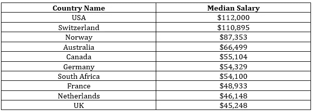

# 高级数据科学家工作概述

> 原文：<https://medium.com/analytics-vidhya/an-overview-of-senior-data-scientists-job-b0197d8727e7?source=collection_archive---------2----------------------->

*2026 年，对数据科学专家的需求预计将增长至少 19%。* - **燃烧的玻璃**

数据科学是现代世界的一个新兴领域。如今，几乎所有行业都在以某种形式利用数据科学。这导致了对数据专业人员的需求，他们拥有解决数据相关问题的技能，有助于推动企业走向成功。

数据专业人员发挥着关键作用，因为他们综合并利用企业的数据集来提高企业实现目标的整体能力。高级数据专家有助于企业继续向分析型和数据驱动型文化发展。

在本文中，让我们了解成为一名**高级数据科学家意味着什么的一些要素。**

# 成为高级数据科学家的要求

高级数据专业人员使用数据来塑造组织的发展方向。在领导各种数据驱动的项目时，他们指导并雇用初级员工的工作。以下是成为高级大数据科学家**的几项要求:**

# 教育

统计学、机器学习、数学、计算机科学、经济学或任何其他相关定量领域的学士学位。

# 经验

作为数据科学家，在任何行业都有丰富的经验，即至少 5 年的工作经验

# 技能

精通一种或多种编程语言

应该能够胜任机器学习、库、原理和技术

自然语言处理(NLP)工作经验

设计和监督以数据为中心的项目的可证明的历史

能够传达可用于商业决策的见解

遵守持久的道德标准

出色的指导和监督能力

培养健康工作环境的能力，这有助于团队合作

# 成为高级数据科学家的重要技能

高级数据专业人员与业务利益相关者密切合作，了解他们的目标，并确定如何使用数据来实现目标。为了完成所有这些，他们需要掌握一些日常工作所需的重要技能:

# 技术

**编程—** 编写计算机程序，分析庞大的数据集，得出复杂问题的答案。他们需要用 Java、R、Python 和 SQL 等语言编写代码。

**统计分析—** 识别数据中的模式，这也包括对异常和模式检测的良好理解。

**机器学习—** 应用算法和统计模型，让计算机从给定的数据中自动学习。

**计算机科学—** 应用数据库系统、人工智能、数值分析、软件工程、人机交互的概念。

**数据讲述—** 使用数据传达可操作的见解，通常面向利益相关者和非技术受众。

# 非技术技能

除了技术技能，数据科学专业人员还需要软技能，因为他们在帮助公司做出以目标为导向的决策方面发挥着至关重要的作用。这些是以下软技能:

**人际交往技巧—** 与公司各个层面的不同受众沟通。

**商业直觉—** 他们还与利益相关者联系，以便更好地理解他们想要解决的问题。

**批判性思维——在得出结论之前对事实进行客观分析。**

**分析思维—** 为抽象的业务问题寻求更好的分析解决方案。

**求知欲—** 透过表面现象发现数据中的模式和解决方案。

# 高级数据科学家的职责

与非高级数据科学家相比，高级数据科学家在数据科学中的角色是提供各种概念的高级专业知识，这有助于组织的发展。他们的工作职责包括许多重要的职责。下面提到了其中的一些:

保持对数据科学和相邻领域的最新进展的更新，以确保有更好的结果。

建议和管理对企业利益有价值的数据驱动项目。

整理和清理来自不同实体的数据，以便初级数据科学家使用。

为利用数据库中企业的大量数据收集制定创造性的想法。

监控初级数据科学家的表现，并给予他们必要的实际指导。

管理初级数据科学家的活动，并确保他们正确履行其工作职责，这应与企业的愿景和目标保持一致。

寻找并应用先进的统计程序，以获得可操作的见解。

与初级数据科学家合作，构建最新和改进的分析系统，例如从原型到生产。

交叉验证模型，将工作委托给初级数据科学家，以获得更好的结果，并按时完成项目。

制作和传播非技术性报告，详细说明每个项目的成就和局限性。

# 大数据科学家薪酬最高的国家

**大数据科学家**的薪酬因地域而异，北美的薪酬通常高于欧洲。这里列出了工资最高的国家，以及以美元计算的工资中位数。

此外，随着高级数据专业人员获得经验，他们通常会转向薪酬更高的更高级职位。其中包括:

数据科学经理:每年 135，401 美元

数据科学主任:每年 157，273 美元

# 塑造您作为高级数据科学家的职业生涯

掌握数据科学领域需要良好的知识和技能，可以通过参加认证计划来获得，这也有助于加快职业发展。其中一项认证是高级数据科学家(**SDS**)**T5**D**[**ATA 美国科学委员会(DASCA)**](https://www.dasca.org/) 提供世界上最强大的第三方、供应商中立认证，专为有成就的数据科学和分析专业人士设计。该认证计划为个人提供了一个在数据科学领域不断发展的职业生涯。**

掌握数据科学领域需要理解并运用对分析大数据至关重要的核心概念。 [**SDS 认证**](https://www.dasca.org/data-science-certifications/senior-data-scientist) 证明个人在掌握数据科学领域方面迈出了巨大的一步。通过认证获得的技能和知识将使他们在竞争中处于领先地位。立即注册成为数据科学专家，掌握激动人心的数据世界。

# 包扎

数据目前是任何行业中最重要的工具。几乎所有组织都需要专业的数据科学专业人员，他们凭借自己的专业知识为其业务增加更多价值，并为组织的发展而努力。获得认证将确保个人成为高度渴望的人才库的一部分。