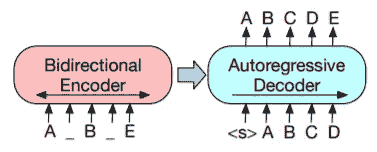
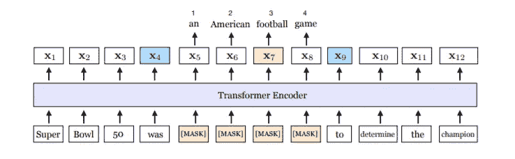
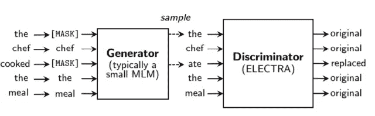

# 各种 BERT 预训练方法概述

> 原文：<https://medium.com/analytics-vidhya/an-overview-of-the-various-bert-pre-training-methods-c365512342d8?source=collection_archive---------6----------------------->

训练前可视化。图来自[伯特](https://arxiv.org/pdf/1810.04805.pdf)论文。

如果你对机器学习感兴趣，那么在过去的几年里，你可能听说过变革了自然语言处理的 Transformer 模型。

Transformer 的一个非常流行的变体叫做 BERT，它使用 Transformer 编码器从无标签的语料库中学习文本表示。你会问他们如何从未标记的数据中学习？嗯，他们定义了一组预训练任务供模型学习。即掩蔽语言建模(MLM)和下一句预测(NSP)。

注意:在本文中，我将假设您具有关于 BERT 的背景知识，并且您正在寻找关于培训前目标的更多信息。

# 伯特

## **蒙面语言造型**

这是预测句子中缺失单词的任务。正如你所想象的，你不需要这个学习目标的标签，因为你可以从输入的句子中屏蔽掉任何单词。因此，如果我们的数据集中有一个像这样的样本

> 机器学习超级酷

在训练过程中，伯特实际上可能会输入类似

> 机器[面膜]超级酷

模型的目标是预测丢失的单词。具体来说，BERT 将随机屏蔽输入句子的某个百分比(通常为 15%)，然后要求模型填充空白。

## **下一句预测**

由于许多重要的下游任务涉及两个句子之间的关系，BERT 还预先训练了一种叫做下一句预测的东西。

简而言之，这里的目标是，给定两个句子 *A* 和 *B* ，使用【CLS】标记来预测 B 实际上是否是 A 后面的句子

> [CLS]第一句第二句

然后我们把这个输入到 BERT 中，目标是让[CLS]令牌学习一个表示，允许我们识别句子 B 是否应该在句子 A 之后！

BERT 的作者声称，这个非常简单的想法在 BERT 执行诸如问题回答和自然语言推理等需要比较两个句子的任务的能力中发挥了巨大的作用。

# **其他预培训目标**

上面我们已经建立了所谓的“基线”训练前目标。近年来，研究人员已经找到了更好的方法来预先训练 BERT 体系结构，以鼓励学习更好的文本表示。本文的剩余部分将重点介绍其他流行的培训前方法。

# **RoBERTa:一种稳健优化的 BERT 预训练方法**

在 RoBERTa 的论文中，作者强调了基线 BERT 预训练目标的缺陷。

1.  罗伯塔不同意伯特使用静态蒙版。在最初的 BERT 实现中，作者在其预处理阶段执行一次屏蔽。具体来说，每个样本被复制 10 次，每次都以独特的方式被掩盖。因此，在 40 个时期的训练中，模型将看到相同的样本以 10 种不同的方式被掩盖。

    在 RoBERTa 中，作者提出使用动态掩码，即每次将样本输入模型时随机生成掩码。结果显示与静态掩码非常相似的性能，但是，这种方法更有效，因为不需要将数据复制 10 倍。

2.RoBERTa 表明 BERT 中使用的 NSP 任务实际上是不必要的，删除它可以提高性能。具体来说，这指的是询问“句子 B 是句子 A 后面的句子”的二元分类任务。BERT 使用该分类任务的损失来指导训练。

相反，RoBERTa 只需输入两个连续的完整句子

> [CLS]第一句第二句

而不要求模型预测句子是否是连续的。

# **BART:用于自然语言生成、翻译和理解的去噪序列间预训练**

巴特模型。图来自原[纸](https://arxiv.org/pdf/1910.13461.pdf)

我不确定我是否应该在这篇文章中包括 BART，因为它与 BERT 有一点不同，因为它包含一个解码器。冒着过于简化的风险，BART 就是 BERT +一个自回归解码器(比如 GPT-2)。给定解码器的存在，该模型在如何制定预训练目标方面具有更大的灵活性。

BART 培训方式的高级概述如下。1)破坏输入的句子。2)用 BERT 编码。3)解码 BERT 输出 4)将解码与基本事实语句进行比较。如你所见，这是一个奇特的去噪自动编码器。

## 文本腐败策略(培训前目标)

## **令牌屏蔽**

这和伯特的蒙版是一样的。BART 将简单地屏蔽输入中的一些标记，并尝试让解码器预测丢失了什么。

## 令牌删除

随机删除输入句子中的标记。这迫使模型不仅要预测丢失的令牌，还要预测它们在哪里。

## 文本填充

删除输入句子的某些部分，并用单个掩码标记替换它们。这迫使模型学习需要解码成多少个单词(掩码)。

## 文档旋转

从输入中随机选择一个令牌，然后旋转/包装输入，使得输入现在从随机选择的令牌开始。

在 BART 中，通过将一个句子输入到 BERT 编码器中，并使用解码器的[CLS]等价物进行预测，对分类任务进行微调。

# 斯潘伯特:通过描述和预测跨度来改善预训练

斯潘伯特提出了一个非常简单的想法，在基线预训练目标的基础上提供了一个巨大的性能提升。考虑原始[论文](https://arxiv.org/pdf/1907.10529.pdf)中的下图:

斯潘伯特在训练前做了两件新奇的事情

1.  它们掩盖了原句中文本的连续范围。在上图中，您可以看到一组 4 个连续的标记被替换为[MASK]。该模型的任务是预测这些缺失的信息。
2.  他们引入了一个跨度边界目标(SBO ),该目标迫使模型使用沿掩蔽区域边界(上图中的 x4 和 x9)的记号的表示来预测缺失的记号。

此外，SpanBERT 从 BERT 中移除了 NSP 目标，并且仅在单句输入上进行训练。

# 即时记笔记有助于语言前期训练(TNF)

这篇[论文](https://arxiv.org/abs/2008.01466#:~:text=Specifically%2C%20TNF%20maintains%20a%20note,semantics%20of%20the%20current%20sentence.)指出，BERT 训练在某种程度上如此昂贵，因为它必须学习极其罕见的单词的良好表示。如果你考虑句子“新冠肺炎已经花费了成千上万的生命”，你可以想象新冠肺炎在给定的训练语料库中不是一个常见的术语。此外，如果我们需要预测“新冠肺炎已经花费了数千[面具]”，那么这种情况下，一个罕见的词是唯一有用的信息片段，我们必须预测丢失的令牌。

TNF 通过保存一个字典来解决这个问题，字典中的关键字是这些罕见的单词，值是单词历史上下文的向量表示。换句话说，每个罕见的单词都有一个表示，根据它在其他句子中的上下文进行更新。通过这样做，当一个生僻字再次出现时，我们可以使用这种历史上下文嵌入来辅助生僻字存在时的学习任务。

实际上，如果检测到一个稀有单词，只需在稀有单词查找表中找到历史上下文向量，并将其添加到最终的输入嵌入中。例如(word _ embedding+position _ embedding+TNF _ embedding)。

# ELECTRA:预训练文本编码器作为鉴别器而不是生成器

训练前可视化。图来源于[原创论文](https://arxiv.org/pdf/2003.10555.pdf)

这种预训练方法也旨在使训练 BERT 更有效。这里的关键思想是使用替换令牌检测进行训练。

## 替换令牌检测

为了执行这一步，我们需要两个变压器模型 1)生成器和 2)鉴别器。

我们首先如上所示屏蔽一些输入标记，生成器输出预测标记。接下来，鉴别器(这是伊莱克特的关键创新)*必须决定哪些输入是真实的，哪些是合成的。*

效率如此之高的原因是，现在我们需要计算所有输入令牌的损耗，而不是只计算屏蔽令牌的损耗(如 BERT 中所做的)。这提供了对资源的更好利用，并允许人们更快地训练 BERT 模型。

# 问答的跨度选择预训练

图来自原[论文](https://arxiv.org/pdf/1909.04120.pdf)

我不会详细讨论这一点，但最重要的想法是使用外部资源来预测屏蔽语言建模过程中丢失的信息。在上面的图像中，我们看到[空白]标记不是由模型本身填充的(如 BERT 中所做的)，而是实际上从其他相关段落中预测的。该模型在机器阅读理解任务上比 BERT 高出 3 F1 分。[来源](https://arxiv.org/abs/1909.04120)

# SenseBERT:让 BERT 明白一些道理

在这篇[论文](https://arxiv.org/abs/1908.05646)中提出的预训练思想迫使模型不仅执行屏蔽语言建模，而且使用 WordNet 预测每个屏蔽令牌的超级含义。

# CAPT:学习去噪序列表征的对比预训练

如果你熟悉 ML 中的对比学习，那么你可能会对 [CAPT](https://arxiv.org/abs/2010.06351#:~:text=CAPT%3A%20Contrastive%20Pre%2DTraining%20for%20Learning%20Denoised%20Sequence%20Representations,-Fuli%20Luo%2C%20Pengcheng&text=The%20proposed%20CAPT%20encourages%20the,unsupervised%20instance%2Dwise%20training%20signals.) 感兴趣。这项工作的目标是鼓励输入句子的表示尽可能接近被破坏的输入句子的表示。这有助于模型变得对噪声更加不变，以及更好地捕捉给定句子的全局语义。

# 极限测试:语言学指导的多任务测试

[极限伯特](https://arxiv.org/pdf/1910.14296.pdf)做了两件与传统伯特不同的事情。1)它们不是随机屏蔽记号，而是屏蔽从预先训练的语言学模型中确定的语义上有意义的记号。2)他们改变了 BERT 训练目标以具有多任务损失，这要求 LIMIT-BERT 不仅执行 MLM，而且能够学习关于输入数据的语言属性(识别词性、识别语义角色等)。).