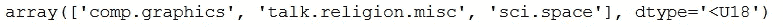

# 自然语言处理的主题建模综述

> 原文：<https://medium.com/analytics-vidhya/an-overview-of-topic-modeling-with-nlp-17d3bf3e3624?source=collection_archive---------1----------------------->

## 学习使用奇异值分解和 NMF 在文本语料库中查找主题


[Edurne Tx](https://unsplash.com/@edurnetx?utm_source=medium&utm_medium=referral) 在 [Unsplash](https://unsplash.com?utm_source=medium&utm_medium=referral) 上拍摄的照片

自然语言处理(NLP)是计算机理解人类语言的能力。NLP 是一个广阔的领域，包含各种任务，包括*词性标注、命名实体识别、问答、语音识别、文本到语音、语言建模、翻译、语音到文本和主题建模*。主题建模是对文本集合中内容的课程级分析。话题是话语的主题或主题，其中话题被表示为词的分布，而文档被假设为话题的混合。不同的主题建模方法是可用的，包括概率潜在语义分析(PLSA)、潜在狄利克雷分配(LDA)、奇异值分解(SVD)和非矩阵分解(NMF)。

为了实际执行任务，我们将使用来自 sklearn 库的[20 个新闻组](https://www.kaggle.com/crawford/20-newsgroups)数据集。我们将使用奇异值分解和 NMF 进行我们的实验，因为 LDA 和 PLSA 还有其他很好的资源。要获得完整的代码，请访问 GitHub [链接](https://github.com/Adeelzafar/NLP-Course/blob/main/NLP_Lab_1_Topic_Modeling.ipynb)。

# 让我们深入研究代码

```
import numpy as np
from sklearn.datasets import fetch_20newsgroups
from sklearn import decomposition
from scipy import linalg
import matplotlib.pyplot as plt
from sklearn.feature_extraction.text import CountVectorizer, TfidfVectorizer
```

我们将使用类别的样本子集来测试我们的模型。该数据集包括 20 个主题的 18，000 篇新闻组帖子

```
categories = ['alt.atheism', 'talk.religion.misc', 'comp.graphics', 'sci.space']
remove = ('headers', 'footers', 'quotes')
newsgroups_train = fetch_20newsgroups(subset='train', categories=categories, remove=remove)
newsgroups_test = fetch_20newsgroups(subset='test', categories=categories, remove=remove)newsgroups_train.filenames.shape, newsgroups_train.target.shape
```


文件名和目标的形状

让我们看一条新闻

```
print("\n".join(newsgroups_train.data[:3]))
```


**那么它看起来像什么，让我们看看**

```
np.array(newsgroups_train.target_names)[newsgroups_train.target[:3]]
```



# 数据处理

对于数据处理，我们将使用 sklearn 的*计数矢量器*方法。它将为我们提取所有字数。2034 是总发帖量，26576 是字数。

```
vectorizer = CountVectorizer(stop_words='english')
vectors = vectorizer.fit_transform(newsgroups_train.data).todense()
vectors.shape
```


让我们来看看词汇或词组

```
vocab = np.array(vectorizer.get_feature_names())
vocab[7000:7020]
```


# 奇异值分解

SVD 算法将一个矩阵分解成一个具有**正交列**的矩阵和一个具有**正交行**的矩阵(以及一个对角矩阵，其中包含每个因子的**相对重要性**)。


参考:[https://research.fb.com/fast-randomized-svd/](https://research.fb.com/fast-randomized-svd/)

SVD 广泛用于线性代数，尤其是数据科学，包括语义分析、协同过滤/推荐和数据压缩。潜在语义分析(LSA)使用奇异值分解。你有时会听到主题建模被称为 LSA。我们将使用 sklearn 的 SVD 实现。

```
%time U, s, Vh = linalg.svd(vectors, full_matrices=False)
```


让我们看看结果矩阵的形状，并对主题进行建模。函数 show_topics 遍历所有的 vocab，选择最大的值作为每个主题的顶部单词。

```
print(U.shape, s.shape, Vh.shape)
```


```
num_top_words=8

def show_topics(a):
    top_words = lambda t: [vocab[i] for i in np.argsort(t)[:-                     num_top_words-1:-1]]
    topic_words = ([top_words(t) for t in a])
    return [' '.join(t) for t in topic_words]
#Show topics 
show_topics(Vh[:10])
```


第一个不映射到我们的任何主题，第二个映射到图形，下一个映射到宗教，等等。这些聚类显示了**一种无监督算法**的有用性——也就是说，我们实际上从未告诉算法我们的文档是如何分组的。现在让我们进入下一个主题建模技术: *NMF。*

# 非负矩阵分解(NMF)

NMF 是一个非负数据集的因子分解:分解成非负矩阵。通常积极的因素会**更容易解读**(这也是 NMF 受欢迎背后的原因)。NMF 是一种非精确因式分解，分解成一个瘦正矩阵和一个短正矩阵。NMF 的应用包括:[人脸分解](http://scikit-learn.org/stable/auto_examples/decomposition/plot_faces_decomposition.html)、[协同过滤、](http://www.quuxlabs.com/blog/2010/09/matrix-factorization-a-simple-tutorial-and-implementation-in-python/)和[基因表达](https://www.ncbi.nlm.nih.gov/pmc/articles/PMC2623306/)。


图取自 NMF 的[教程](https://perso.telecom-paristech.fr/essid/teach/NMF_tutorial_ICME-2014.pdf)

我们将使用 sklearn 的 NMF 实现。

```
m,n=vectors.shape
d=5  # num topics
clf = decomposition.NMF(n_components=d, random_state=1)

W1 = clf.fit_transform(vectors)
H1 = clf.components_
show_topics(H1)
```


NMF 既快又容易使用。然而，创造 NMF 需要多年的研究和专业知识。

下次见！快乐编码…

# 学分:

这篇博客的内容灵感来自 Coursera 课程*Python 中的文本挖掘应用*和 *Fast-ai NLP 课程。*