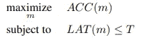

# MnasNet 综述:面向移动设备的平台感知神经架构搜索

> 原文：<https://medium.com/analytics-vidhya/an-overview-on-mnasnet-platform-aware-neural-architecture-search-for-mobile-8a681d17a80c?source=collection_archive---------17----------------------->

# 神经结构搜索(NAS)

神经架构搜索是使用学习算法和深度学习自动寻找有效神经网络架构的任务。基于强化学习的方法通常用于这项任务。NAS 设计的网络在许多指标上都优于手工制作的神经架构。

# 关键概念

*   本文没有使用间接的延迟测量方法(例如 FLOPS ),而是使用移动设备上的真实延迟作为优化目标。建议的 NAS 结合了现实世界的延迟和验证准确性。
*   提出一个*分解的层次搜索空间*，允许每层之间的多样性。

# 目标函数

先前的工作试图优化单个度量(准确性),其中 T 是固定的目标等待时间。一个共同的目标是在延迟的约束下最大化 *ACC(m)* 。

非正式地，帕累托最优模型是指模型在不增加延迟的情况下具有最高的准确性，或者在不降低准确性的情况下具有最低的延迟。上面的目标函数不能找到多个帕累托最优模型，因为它没有适当地调节准确性和等待时间。

本文建议优化上述目标，以优化延迟和准确性，同时限制过大的延迟。这两个目标基于超参数α和β进行缩放。基于延迟加倍通常会增加 5%的准确度的现象，如果没有明确说明，则使用α=β=-0.07。

# 分解的层次搜索空间

大多数以前的 NAS 方法搜索空间以构建复杂的单元，并以相同的配置重复该单元以构建整个网络。然而，这些方法不允许分层多样性。为此，MNasNet 定义了多个块，并为每个块搜索不同的超参数。如上图所示，有 7 个模块，每个模块将被分配不同的体系结构。

每个块发现以下内容:

*   Conv op:常规 Conv/深度方向 conv/移动反向瓶颈 conv
*   内核大小:3x3/5x5
*   挤压与激励比(SERatio): 0/ 0.25
*   输出过滤器大小:{0.75，1.0，1.25} * MobileNetV2 过滤器大小
*   层数:{-1，0，+1 }+MobileNetV2 #层

使用这种分块设计代替逐层搜索，搜索大小从 10 ⁹减少到 10。

# 搜索算法

使用强化学习方法来寻找优化所提出的目标函数的模型架构。在每一步，控制器首先通过基于其 RNN 网络预测一系列表征来对一批模型进行采样。每个模型 m 在 ImageNet 数据集上训练 5 个时期以获得准确度 ACC(m ),并在真实电话上执行以获得延迟 LAT(m)。在该步骤结束时，按照上述公式计算 R(m ),并使用{近似策略优化(PPO )}更新 RNN 的参数。

# 实验

我们在 ImageNet 和 COCO 对象检测数据集上展示了所提出的 MnasNet 的结果。如下图所示，提议的网络 MnasNet-A1 优于之前的 SOTA MobileNetV2。

## ImageNet

## COCO 对象检测

## 消融研究

## 提议的模型架构

# 摘要

提出的新的目标函数优化了准确性和等待时间。纸张流水线允许分层多样性，因此与以前的方法相比实现了更好的性能。使用这种方法找到的模型架构:MnasNet 优于 MobileNetV2，在 ImageNet 分类和 COCO 对象检测中表现出优越的性能。