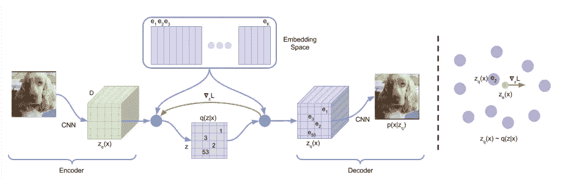
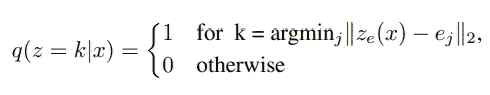
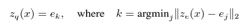
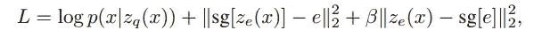
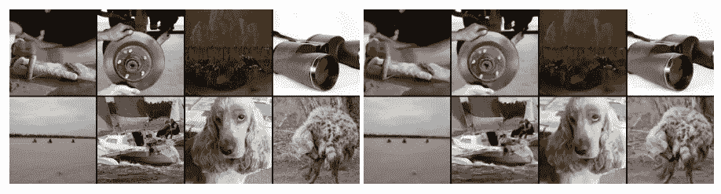

# VQ-VAE 研究综述:学习离散表征空间

> 原文：<https://medium.com/analytics-vidhya/an-overview-on-vq-vae-learning-discrete-representation-space-8b7e56cc6337?source=collection_archive---------11----------------------->

# 关键概念

本文提出了一种自动编码器，它学习一个**离散的**潜在空间，并提出了一种损耗和一种通过本文提出的不可微流水线反向传播的方法。是的，这篇论文提出了用 argmin 函数离散表示潜在空间的“0 或 1”。

*   再次，本文介绍了一个简单的 VQ-VAE 模型，使用离散的潜在的，因此，没有遭受后验崩溃和方差问题。
*   该论文提出了具有 3 个分量的损失，其将通过矢量量化(VQ)损失来训练嵌入空间。
*   VQ-VAE 可与经典的 VAE 相媲美，具有连续的潜在表现。

你可能想知道我们如何能像我一样反向传播和训练由离散的、底层变量组成的模型。这似乎是一个与 DL 的一个非常不同的领域相关的问题:强化学习。让我们深入探讨作者在 VQ-VAE 学习离散向量的想法。

# VQ-VAE

编码器网络将图像 x 编码成 zₑ(x ),解码器解码矢量 zq(x ),目的是重建图像。与经典的 VAE 不同的是，向量 zq(x)是通过嵌入 zₑ(x).来计算的我们定义 e 为形状(K，D)的潜在嵌入空间，这意味着维数为 D 的 K 个嵌入。

如下面第一个等式所示，通过使用共享嵌入空间 e 的最近邻查找来计算离散潜在 z。总之，解码器的输入是 eₖ的相应嵌入，其最小化到给定嵌入的 L2 距离{zₑ(x)-eₖ}。

因此，编码的每个通道都被映射到最近的嵌入向量中。

## 反向传播

这个使用 argmin 映射编码的推理过程的明显问题是这个过程是不可微分的。总之，梯度∇ᶻL 直接从解码器传递到编码器，忽略了嵌入过程。如上图所示。我相信这种怪异的、不那么严格的抽象是通过假设嵌入类似于编码(zₑ(x)≈eₖ)而成为可能的，因为这在嵌入的训练损失中是强制的，我们将很快讨论这一点。

# 培训损失

建议的培训损失由三部分组成。我们将按顺序讨论每个部分。sg 表示[停止梯度操作](https://www.tensorflow.org/api_docs/python/tf/stop_gradient)，不进行梯度计算输出相同的值。

1.  第一项是重建损失，它优化了编码器和解码器。然而，由于梯度反向传播中的跳跃，嵌入 e 没有接收到这种损失的梯度。
2.  第二项是 VQ 损耗，它将嵌入向量移向编码器输出 zₑ(x，用 L2 损耗测量。
3.  最后一个组件确保编码不会任意增长，并且编码器只进行一次嵌入。

最终训练目标(损失函数)

# 结论

左:ImageNet 128x128x3 图像，右:用 32x32x1 潜在空间重建的 VQ-VAE，K=512。

上图是在 ImageNet 数据集上训练的 VQ-VAE 的一些重建图像的示例。VAE、VQ-VAE 和 VIMCO 型号分别获得 4.51 位/dim、4.67 位/dim 和 5.14 位/dim。描述了音频和视频数据重建的实验和模型结构。

原文：<https://arxiv.org/abs/1711.00937>

*令人惊讶的是，[下标 q(小 q)在 Unicod](https://www.quora.com/Why-is-there-no-character-for-superscript-q-in-Unicode) e 中并不存在！因此，我不得不使用常规的 q 符号。