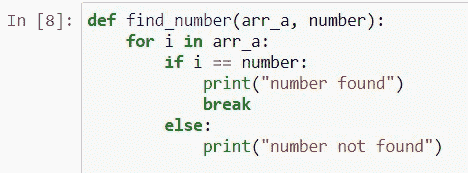
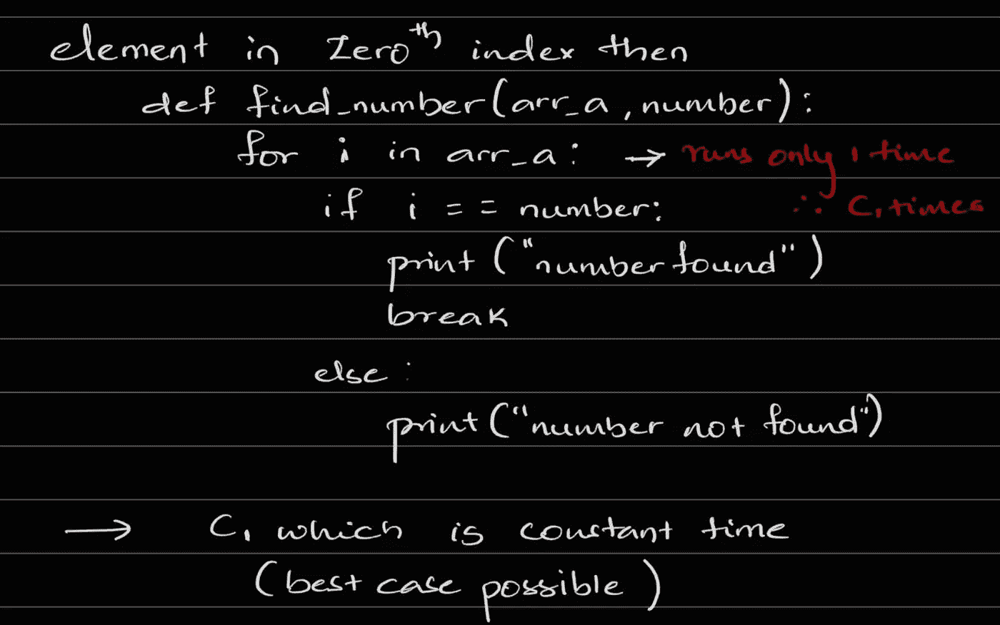
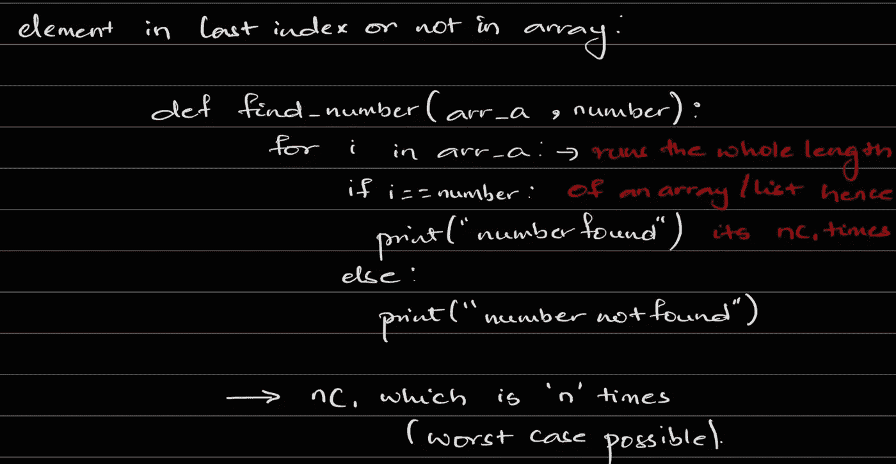
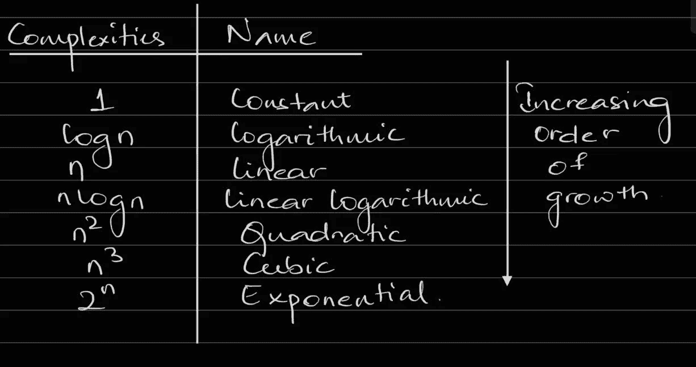
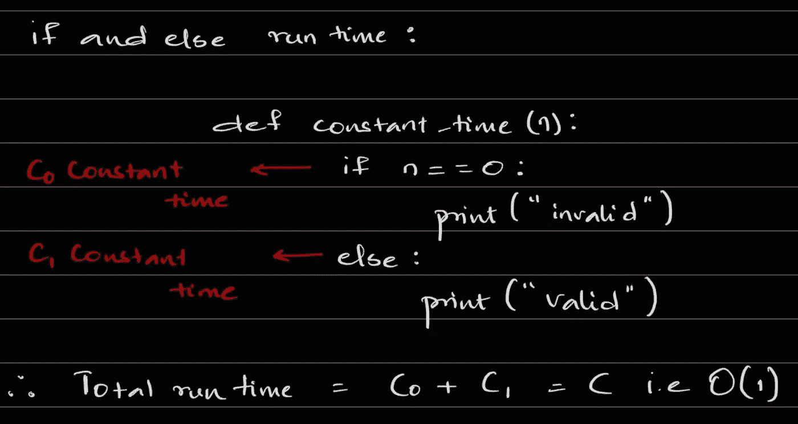
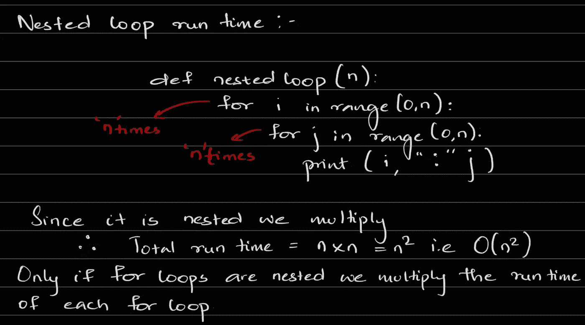
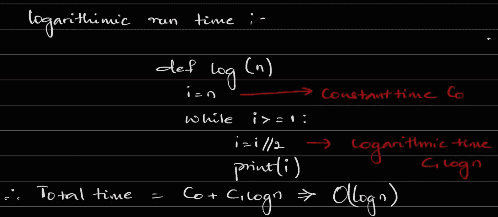

# 算法及其重要性分析

> 原文：<https://medium.com/analytics-vidhya/analysis-of-algorithms-and-its-importance-8c731de6815a?source=collection_archive---------12----------------------->

总之，这篇博客旨在解释什么是算法，为什么需要根据增长的顺序以及存在的共同渐近符号和它们之间的差异来分析和概括算法。我会尽可能用简单的语言来解释它，并希望你们喜欢阅读这篇文章。

# 什么是算法？

有一天，你决定给自己做一个蛋糕，但是你不知道怎么做。当你决定用谷歌搜索做蛋糕的步骤时，你会发现不同种类的蛋糕有 n 个步骤。所有这些不同的一步一步的做蛋糕的程序可以被称为一种算法。在计算机科学领域，为解决特定任务或问题(例如，对未排序的数组进行排序)而遵循的一步一步的过程称为算法。

# 对算法的分析意味着什么？

从前面的做蛋糕的例子中，你可以选择一种简单、容易和最方便的做蛋糕的方法。类似地，人们可以选择最佳算法来对数组进行排序。为了将算法分为最佳和最差，我们根据增长的顺序对它们进行分析，即，随着输入大小“n”的增加，算法的性能如何，或者增加输入大小“n”对算法的运行时间有何影响。我们基于增长顺序来概括和分析算法，主要是因为增长顺序独立于两个因素，因为它们是大量速度不同的编程语言，并且有更快的机器可以更快地处理事情。然而，很少有像规模复杂性这样的权衡，并不是所有的最佳运行时间算法在空间上都是有效的，我们将在稍后阶段讨论权衡。

# **增长顺序和渐近符号**

算法的增长顺序是一种方式，在这种方式中，可以说算法的运行时间或内存消耗随着输入大小的增加或给定大小而变化。换句话说，当输入大小“n”大于“0”时，计算运行时间或空间复杂度的函数“f(n)”让我们知道算法如何执行。

我们对增长顺序做了一些假设，例如输入大小“n”应该大于或等于零，函数“f(n)”也应该大于或等于零。假设我们有两个多项式函数“f(n) = 2n + 1”和“g(n) = 3n +2n + 9 ”,我们需要知道哪个函数增长得更快，然后我们比较两个多项式函数的最高次数，并选择最高次数的函数作为增长最快的函数。根据示例，多项式函数 f(n)的最高次数为 1，而 g(n)函数的次数为 2，因此我们可以得出结论，g(n)函数比 f(n)增长得更快。

现在让我们找到实际程序的增长顺序并更好地理解它:

简单的线性搜索

上面的代码是对一个数字的线性搜索，它基本上是一个元素一个元素地搜索整个数组/列表，并与要查找的实际元素进行比较。如果我们想得更多一点，我们知道如果要查找的数字存在于第 0 个索引中，则循环仅运行一次，但是如果它存在于最后一个索引值，则循环运行直到最后一个元素，我们有两种情况，前者可以被分类为代码的最佳情况，后者可以是上述代码的性能的最差情况。还有一种称为平均情况的额外情况，它告诉我们代码的平均性能。

最好的情况

可能的最坏情况

因为我们不知道未来会发生什么，我们总是倾向于引用算法的最坏情况性能。随着程序的复杂性随着更多控制流语句的增加而增加，多项式方程变得越来越复杂，因此为了便于所有这些，有三个主要的渐近符号作为标准来表示算法的时间/空间复杂性。在我们进一步了解它们之前，找到任何多项式方程的渐近符号的一个快速方法是忽略低次项和系数。

快速简单的方法找到增长的顺序

## a)大 O 符号:

它总是表示增长级的精确或上界，换句话说，我们可以说它表示已知的(精确的)或不是不确定的但很大的(上界)增长级。

大 o 的数学定义如下“我们说' f(n) = O(g(n))'如果存在一个常数' c '和'nₒ'使得' f(n) ≤ C(g(n))'对于所有' n ≥ nₒ'”。我们可以从定义中推断出，我们需要找到一个函数 g(n ),使得在输入大小“n”大于或等于'nₒ'.的条件下，它在乘以常数“c”时总是大于或等于 f(n)

## b)欧米伽符号:

它与大 O 符号相反，表示增长顺序的精确或下限。

ω记数法的数学定义如下“我们说' f(n)=ω(g(n))'如果存在一个常数' c '和'nₒ'使得' 0 ≤ C(g(n)) ≤ f(n)'对于所有的' n≥ nₒ'”。换句话说，这意味着我们需要一个函数 g(n ),使得在输入大小总是大于或等于'nₒ'.的条件下，当它与常数“c”相乘时，总是小于或等于 f(n)

## c)θ符号:

θ符号是一种只表示精确界限的符号，也就是说，如果一个程序的精确增长顺序是已知的，那么θ符号可以用来表示它的增长顺序。

θ符号的数学定义如下“我们说‘f(n)=θ(g(n))’如果存在常数'C₁'、'C₂'和'nₒ'使得'c₁(g(n)≤f(n)≤c₂(g(n))'对于所有'n>nₒ'”。因为它涵盖了上限和下限，我们称之为精确界，并需要两个常数'C₁'和'C₂'.

一些有用的和常见的增长顺序及其增长率列表:

# 权衡:

我们需要记住一些权衡，同时考虑运行时间方面的最低增长顺序，因为最低运行时间算法有时会占用更多空间，从而增加算法的空间复杂性。如前所述，最快的蛋糕制作技术可能不是最好的蛋糕，所以这是一个简单的权衡。编程中的一个简单例子是合并排序，它的时间复杂度为 O(nlogn ),空间复杂度为 O(n ),它需要“n”个空间来对数组进行完全排序。而其他具有较高运行时间的排序技术具有非常低或恒定的空间复杂度。

# 一些常见的算法运行时间分析:'

if 和 else 运行时示例

简单循环运行时示例

嵌套循环运行时示例

对数运行时间复杂性示例

# 结论:

我们看到了如何为每个问题定义一个算法，以及为什么分析它很重要，我们还了解了找到算法增长顺序的快速方法，以及找到运行时间的一些常见分析。这将是理解递归及其分析的延续，可以在这篇延续文章中找到“ [**递归使简单的**](/analytics-vidhya/recursion-made-simple-ba1349f1a542) ”。算法是计算机科学旅程的一部分，理解它的基础非常重要。我已经尽力用简单的语言解释了它，希望你喜欢阅读它。