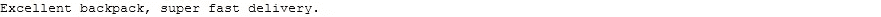
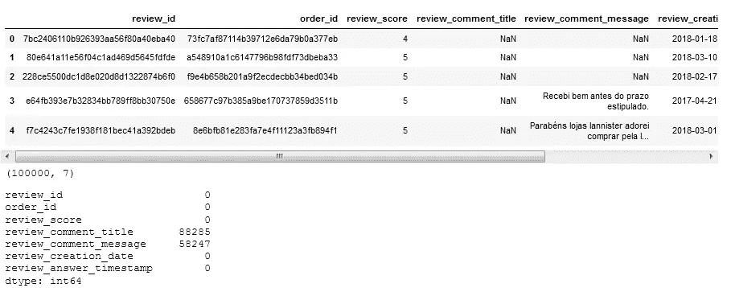
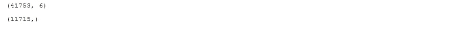
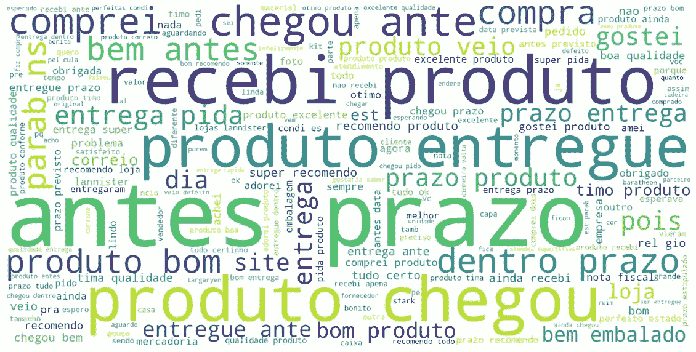
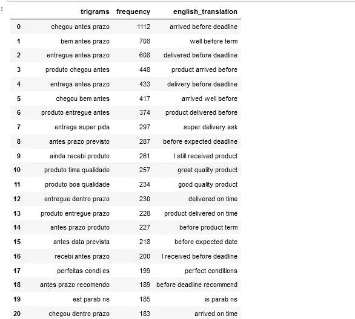
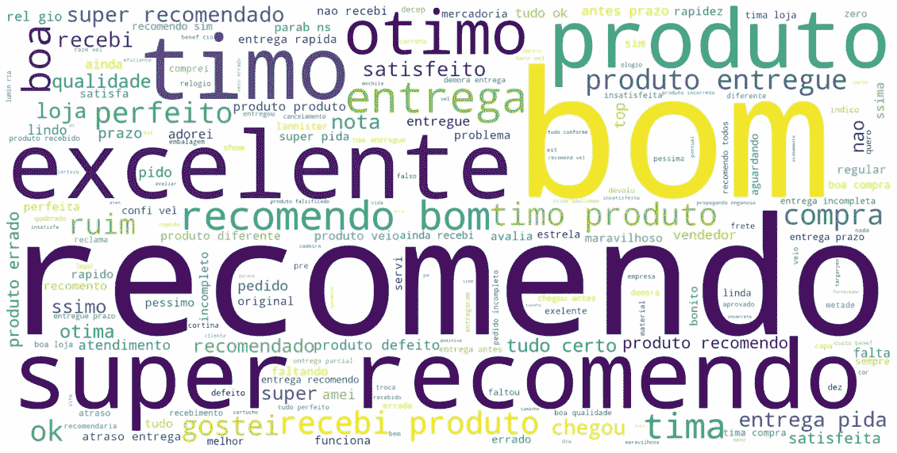
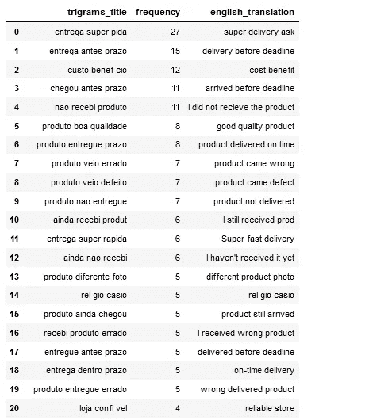
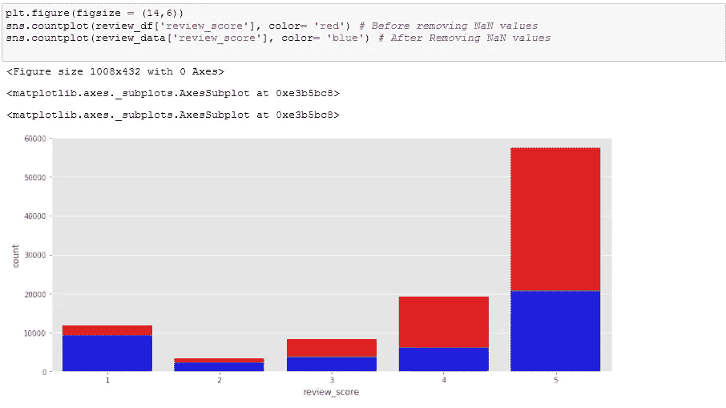
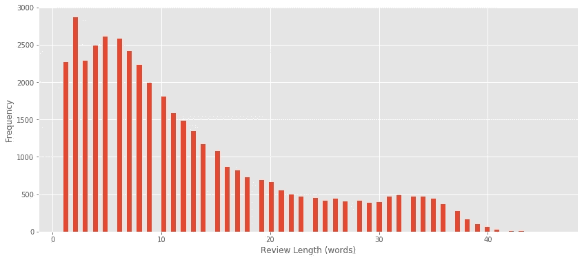

# 使用 NLP 和 Google Translate 分析巴西电子商务文本评论数据集

> 原文：<https://medium.com/analytics-vidhya/analysis-of-brazilian-e-commerce-text-reviews-dataset-using-nlp-and-google-translate-c8b6238d6bb1?source=collection_archive---------14----------------------->

## 翻译、分析和可视化文本数据，以获取有用的见解

阿拉娜·哈里斯在 [Unsplash](https://unsplash.com/s/visual/28364792-49b7-47e8-9e7a-7e7313f6dd83?utm_source=unsplash&utm_medium=referral&utm_content=creditCopyText) 上拍摄的照片

# 介绍

理解顾客的评论对企业的成功至关重要。分析评论有助于正确辨别顾客不同的偏好、喜好、厌恶等。这些提取的见解可用于改善客户服务和体验。

在本文中，我们将处理巴西电子商务评论数据集，在该数据集上，我们将对评论文本执行一些探索性数据分析(EDA)，从我们的分析中获得有意义的见解，然后将我们的输出从葡萄牙语翻译成英语，以便更好、更容易理解。

# 数据集描述

这个数据集取自 Kaggle，由巴西的 Olist 在线商店慷慨提供。这里是[数据集](https://www.kaggle.com/olistbr/brazilian-ecommerce)的链接。

这个 Kaggle 项目有多个数据集，包含不同的字段，如订单、支付、地理位置、产品、产品类别等。但是我们将只关注文本评论数据集来进行分析。评论数据集有 100，000 个数据点，去掉 NaN 值后，剩下 40，000 个评论，足以进行分析。一些评论有标题，所有的评论都有分数，所以我们也必须考虑这些。

# 方法学

# 安装和导入库

首先，我们必须为我们的自然语言处理导入重要的库(如 pandas、numpy 和 matplotlib)和 NLTK 工具。

对于我们的语言翻译，我们需要安装谷歌翻译 API。我最初在使用原始 API 时遇到了一些错误，但几天前我找到了一个名为“Google_trans_new”的工作版本，有效地解决了这个问题。可以访问[这里](https://github.com/lushan88a/google_trans_new)了解更多。

如果您尚未安装它，请继续安装，因为我们稍后的翻译会用到它。从上图中，我们可以看到这个翻译 API 支持的语言列表。目前，我们只对葡萄牙语和英语感兴趣。让我们快速运行一个例子；

我们可以看到我们的葡萄牙语文本是如何翻译的，我们可以决定翻译成该 API 支持的任何其他语言。

# 数据预处理

接下来，我们将读入数据，并执行一些初始 EDA 和数据集修改。

评论数据集在评论文本和评论标题中有大量的 NaN 值，因此我们将确保删除那些丢失的值并重置索引。

就像正常的日常 NLP 任务一样，我们需要实现一些必要的预处理步骤，包括:通过删除停用词、使用正则表达式模块仅接受字母、对文本进行标记以及使所有单词小写以保持一致性来转换评论数据。在这种情况下，我们必须删除葡萄牙语停用词。

# 数据可视化

在我们的数据预处理之后，是时候使用 Wordclouds 可视化我们的评论文本了。单词云是相关文本数据的可视化表示，它通过字体大小显示单词的重要性。

WordCloud 显示评论文本中单词重要性

上面的单词云显示了葡萄牙语中最常见的单词，如果你不懂葡萄牙语，这没有多大意义，所以我们需要将这些单词翻译成英语。此时，Countvectorizer 用于获取最重要的单字(一个单词)、双字(两个单词)和三元字(三个单词)。下面是代码和图像显示三元模型和各自的英文翻译。要获得单字和双字，分别替换 *ngram_range =(1，1)和(2，2)* 。

从得到的单字母词、双字母词和三字母词中，我们可以有把握地推断出大多数顾客对送货服务感到满意，还有一些顾客对产品质量感到满意。

类似的预处理步骤也应用于评论标题栏，并使用 Wordcloud 来可视化这些标题。

在 reviews 标题列上执行类似的操作，我们能够更好地理解不满意的客户的不满意的评论。这些评论包括:获得不完整的交货，没有收到订购的货物，交货延迟，交货质量低，收到错误/有缺陷的产品。到目前为止，这些是不满意的客户的主要抱怨，但我们也看到了其他客户的高度满意度。

为了进一步了解给出低/高评价分数的客户和给出评价的客户之间的关系，我们需要做一个显示这些数字的计数图；

我们可以注意到，大约 36%的 5 星评论者给出了评论，而 79%的 1 星评论者给出了评论，因此当客户不高兴时，他/她更有可能给出评论。

我们也来看看平均每篇评论的字数；

# 结论

到目前为止，我们已经能够对客户的文本评论进行分析，我们已经看到了一些客户提出的不满意的评论。现在，数据科学家/分析师需要找出确保这些问题得到解决的最佳方法。

在这篇文章的结尾，我相信你知道如何能够实现基本的文本可视化，并且能够使用 Google Translate API 将文本语言转换成你喜欢的语言。还有其他许多想法可以在这个数据集上实现，如情感分析和主题建模，这些也在我的笔记本中涉及。完整的 Github 笔记本可以在[这里](https://github.com/Johnne32/Sample/blob/main/Brazilian%20reviews%20analysis.ipynb)找到。

快乐学习！