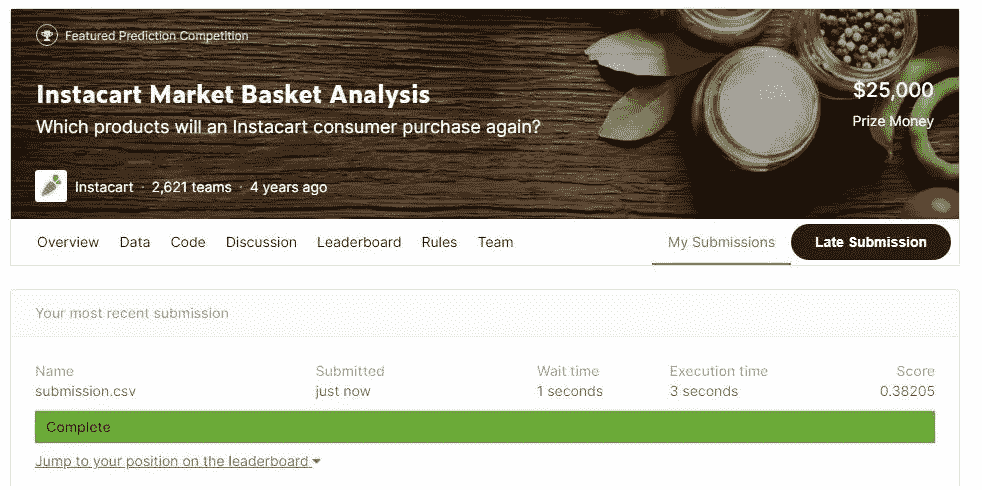
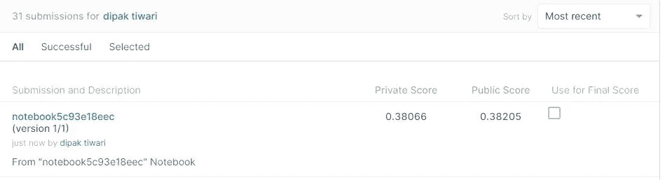

# 从 Kaggle 竞赛看 Instacart

> 原文：<https://medium.com/analytics-vidhya/analysis-of-instacart-from-kaggle-competition-12a26a24ef4b?source=collection_archive---------0----------------------->


[源链接](https://www.google.com/imgres?imgurl=https%3A%2F%2Ffloridanowblog.files.wordpress.com%2F2020%2F06%2Finstacart.jpg&imgrefurl=)

如今，由于全球互联网的建立，世界各地的大量零售企业引入了在线购物，顾客可以通过浏览提供在线服务的选定购物网站来订购他们的基本产品。在网上购物过程中，顾客的交易数据以数据的形式存储，用于分析目的，以了解顾客的购买行为。

已经进行了大量的研究并且仍在进行中，以建立能够使零售或电子商务企业通过向客户提供出色的服务来在客户和销售企业之间建立良好关系的算法。交易明细的全部目的是了解客户的购买模式以及客户销售的产品。因此，我想分析一下三年前举办的 [instacart 竞赛](https://www.kaggle.com/c/instacart-market-basket-analysis)提供的交易数据。

# **让我们进入 instacart 问题**

来源:-[https://www.kaggle.com/c/instacart-market-basket-analysis](https://www.kaggle.com/c/instacart-market-basket-analysis)

**业务问题:**

Instacart 是一个电子商务网站，客户可以在这里从附近的杂货店在线购买产品，instacart personal shopper 将提货并将订单送到客户所在地。在 Instacart 竞赛中，已经提供了用户购买历史，这是每个客户的完整的基于时间的数据，问题陈述是预测哪些先前购买的产品将出现在用户的下一个订单中。

客户先前购买了一个产品，并且在数据集中给定了一个标签后再次订购，通过分析客户先前的订购模式，我们必须解决问题陈述。根据给定的数据，它不存在我们必须为新用户预测产品的冷启动问题，因为所有用户细节都已经在数据中可用。

# 关于 Instacart 购物篮数据集

已经给出了 6 个不同的用户数据集。在下一节中，我们将详细讨论数据集。


**毫升配方:**

给定问题陈述的解决方案可以通过监督的方式接近，因为每个查询的标签已经被提供。这是一个二元分类问题，其中 1 代表重新排序，0 代表不重新排序。随着案例研究的进展，我们构建的最终模型类似于预测给定查询点的分类标签，其中查询点包括用户的所有特征。我们必须根据性能指标找出最佳重量。

**性能指标:**

根据业务需求，模型的性能通过平均 f1 分数来验证。正如我们所知，f1 分数涉及精确度和召回率。它被定义为精确度和召回率的调和平均值，并且测量假阳性和假阴性有多低。f1 得分 1 表示所有预测的 Y 标签与真实的 Y 标签相同，0 表示模型完全失败。因此，除了准确性之外，它还涉及如何对标签进行分类。

**公式:**

F1_score = 2*(精度*召回率)/(精度+召回率)

# 来自上述数据集的摘要

数据集详细解释了每个用户的订购模式。从用户注册 instacart 应用程序购买商品的第一天到最近购买的商品已经在数据集中给出。前一个文件中的用户详细信息告诉我们用户是否已经购买了他们以前购买的商品，或者他们是第一次购买。用户历史记录文件告诉我们用户在一月中的哪一天、哪一小时、哪一天购买了特定的产品，以及产品、部门和过道之间的关系。

分析用户订购模式就足够了，这是本次竞赛的唯一目的。

# **我们如何开始这个问题？**

因为我们的目标是预测用户的下一个订单中会出现之前购买的商品。这个问题可以分为两部分。一种方法是建立用户和购买之间的关系，另一种方法是建立用户和再订购之间的关系。我将解释前一个，它是在用户和产品之间建立一种联系，因为它告诉我们许多关于他们两者的故事。

# **让我们对数据集**执行 EDA

在本节中，我们将详细讨论 Instacart 提供的数据集分析。我所做的详细解释分析解释如下:

**再订购相关信息:**


从上面给出的图来看，由于重新订购的数量多于未重新订购的数量，看起来数据几乎平衡到了某个部分。

# 数据集的单变量分析

**过道相关信息:**


%的产品按通道重新订购

从图中可以清楚地看到，用户的大部分日常或常规产品都是从一些过道区购买的。在新鲜水果和新鲜蔬菜的前两个通道部分，用户购买的商品比其他商品多。

**部门相关信息:**


按部门重新订购产品的百分比

从图中可以清楚地看到，用户的大部分日常或常规产品都是从一些部门购买的。与其他部门相比，生产和日常鸡蛋的前 2 个部门和用户购买的项目更多。

**产品相关信息:**


%的产品以产品方式重新订购

在这个图中，我们讨论的是用户日常订购的产品。正如我们从图表中看到的，这些是用户最常购买的前 20 种产品。

**订单相关信息 _dow:**


%的产品重新订购 DOW wise

从图表中我们可以看出，用户通常每天都在网上购物。一周的前两天，用户下的订单会更多，但很明显，无论是哪一天，网上购物每天都在继续。下面我们将进一步讨论一天中哪一个小时的订单更多。

**与订单日期相关的信息:**


%的产品按订单方式在一天中的 _ 小时 _ 重新订购

大部分购物是在下午进行的。高峰从早上 9 点开始，下午 1 点达到最大值，一直持续到下午 6 点。这意味着用户喜欢在给定的时间间隔内购买他们的基本物品，峰值随着一天的过去而缓慢下降。

**与自上次订单以来的天数相关的信息:**


产品再订购天数百分比 _since_prior_order wise

正如我们从图中看到的，用户下的大多数订单都在一个月的第一周和最后一天。从图中可以清楚地看出，用户主要在第一周购物，购物量从每月的第 8 天到第 29 天逐渐减少。它还表明，在购物较多的日子里，重新订购产品的可能性很高。还要注意的是，有一些用户希望购买整个星期的产品。从图中我们可以看到，在一个月的第 7、14、21 和 28 天，一周内的再订购率很高，我们称之为活跃用户。

**add _ to _ cart _ order 相关信息:**


对于大多数用户来说，添加到购物车中的产品数量最多约为 30 件。大多数用户的购物车中平均会添加 15 件产品。

# 数据集的双变量分析

**双变量分析 order_dow 在一天中的几个小时:**


从上面的热图可以清楚地看到，几乎每天，市场都在早上 7 点达到高峰，一直持续到下午 6 点。一周的前两天，上午 9 点到下午 4 点，采购更忙。

**双变量分析 order_dow 自上一次下单后的一天:**


从图中可以看出，一个月的第一周比该月的其他几天都要忙，并且在该月的最后一天突然增加。如果我们仔细观察第 7 天、第 14 天、第 21 天和第 28 天，会看到一条浅色的垂直线，表示某个用户每周都会购物。

**双变量分析自上一次订单以来一天中的小时:**


在上午 7 点到下午 6 点之间，订购产品被发现在一个月内是稳定的，尽管购买产品的强度在一个月的第一周之后缓慢下降。在一周的最后一天绘制的 4 条浅色垂直线将在购物时间之间进行每周购物的特定类型的用户分类。

**添加到购物车的产品类型的双变量分析:**


从图中可以清楚地看到，在 1 到 45 的范围内，用户将产品添加到购物车并重新订购。与此同时，时间很少，产品添加更多，并重新订购。

**产品、部门和通道的每周购买者分析:**


这些是每周购买者喜欢购买一整周的产品。平均而言，前 10 种产品每天都有更多的再订购。


这是每周购买者选择订购产品的前 10 个部门。发现前 2 个部门是订购产品最多的部门。


这些是每周购买者选择为其整个 1 周的商品订购产品的前 10 个通道。发现顶部的两个通道是订购产品较多的通道。

**各部门再订购产品数量分析:**


从上图可以看出，每个部门的产品有多少比例被用户定期重新订购。产品再订购数量最多的部门是日常鸡蛋、农产品、零食和饮料。

# **特征工程**

这里有一些特征工程，我已经做了，以提高我的模型。

**重新排序模式和日期时间名称:**

我们从图表中看到，用户购买模式在一天内以及一个月内是如何变化的。因此，我将一个月中的小时和天指定到一个名称中，该名称定义了一天的名称，例如:- morning 和 reorder_pattern，例如:- weekly。

**数据扩充:**

由于我计划使用最近 5 个购买项目的历史作为一个特性来提升模型，所以我避免了训练和测试评估集。

**重新排序 _ 计数:**

我们正在查找特定产品在过去被用户重新订购的次数。

**产品 _ 重新订购 _ 数量:**

我们正在查找特定产品在过去被重新订购的次数。

**产品 _ 计数 _ 字典、过道 _ 计数 _ 字典和部门 _ 计数 _ 字典:**

有些产品已经被用户订购了很多次，也有一些部门和通道的名称经常被取走。所以，我想在我的模型中考虑这一点。

**dow_dict，hour_of_day，days_since_prior，new_name_of_day_time 和 order_reorder_pattern:**

我基本上是指订单、订单小时、订单日期、订单日期、订单日期和订单模式。用户购买与上述属性成比例的产品。因此，我计算了用户在给定时间段内购买商品的次数，同时也计算了该功能的权重。

**dow_by_user:**

它表示特定用户在一周的某一天购物的次数。

**订单 _ 小时 _ 日 _ 由 _ 用户:**

它表示特定用户在一个小时内购物的次数。

**新 _ 天 _ 自 _ 前 _ 订单 _ 按用户:**

它表示特定用户在一个月的给定时间段内购物的次数。

**新订单订单**

它指示特定用户在一周的给定日期购买特定商品的次数。

**新订单日小时:**

它显示了特定用户在一天的给定时间内购买特定商品的次数。

**新 _ 天 _ 自 _ 前 _ 顺序:**

它表示特定用户在一个月的给定时间段内购买特定商品的次数。

**新产品数量 y:**

它指示特定用户在一天的给定时段和一周的给定日期购买特定商品的次数。

**新产品数量:**

它指示特定用户在一天的给定时间段、一周的给定日期和一个月的时间段内购买特定商品的次数。

**按周排名函数:**

我正在创建一个函数，该函数反过来创建一个数据框，在该数据框中，用户在一周的给定日期购买的产品以排名的形式排列。具有较低等级的产品指示用户较少购买该产品，而较高等级指示用户较多购买该产品。通过这种方式，我们可以基于一周中的某一天给产品赋予权重，因为用户发现在一周内购物的次数更多。

**时间秒:**

我从购买特定产品的那个月的第一天开始，以秒为单位捕捉时间。

**退出:**

在训练和测试数据集中，产品已经与用户相关联，我们必须在其上训练和测试模型。我正在捕捉一个特征，它告诉我们，如果用户在之前的同一时间段购买了特定的产品。

例如:=如果在训练数据集中，如果产品 P 与用户 A 相关联，并且给定的时间范围是 C dow，D hour，E days_since_prior_order，那么，我想知道在以前的购买历史中，用户 A 是否在相同的 C 或 D 或 E 时间范围内购买了相同的产品 P，如果答案是肯定的，则“退出”表示 1，如果答案是否定的，则表示 0。

**平均 W2V:**

我做的是平均 w2v，而不是一袋单词或 Tfidf，因为 W2V 可以帮助我们预测类似的产品、过道和部门名称。

**per:**

我正在创建一个关于在一周的某一天、某一小时或某一月的某一天，用户重新订购特定产品的百分比的功能。它是针对活跃客户进行的，从图中可以看出，在每个周末，即 7 日、14 日、21 日和 28 日，都有一些用户希望购买他们一整周的产品。

**再订购 _ 状态 _5:**

创建一个功能，告诉我们特定产品在过去 5 个订单中被用户重新订购了多少次。

**创建需要训练的列车数据:**

```
#order id  on which we have to perform training
train_data = pd.read_csv("order_products__train.csv", usecols=["order_id"]).drop_duplicates()# merging trainig order id with order data
train_data = pd.merge(train_data, orders, how="inner", on="order_id")train_data = pd.merge(train_data, use_prod1, how="inner", on="user_id") 
```

**为列车数据创建标签:**

```
train = pd.read_csv("order_products__train.csv", usecols=["order_id", "product_id", "reordered"])train = pd.merge(train, orders, how="inner", on="order_id")
train = train[["user_id", "product_id", "reordered"]]train_data = pd.merge(train_data, train, how="left", on=["user_id", "product_id"])train_data["reordered"].fillna(0)
```

**创建测试数据，通过这些数据来测试我们的模型:**

```
#order id  on which we have to predict product which could be in user next order
test_data = pd.read_csv("sample_submission.csv", usecols=["order_id"])# merging trainig order id with order data
test_data = pd.merge(test_data, orders, how="inner", on="order_id")
test_data = pd.merge(test_data, use_prod1, how="inner", on="user_id")
```

**型号:**

我总共使用了 6 个模型，在这些模型上我应用了随机搜索，度量等于 f1 分数。由于数据量巨大，系统无法承受网格搜索。此外，我还尝试了一个 MLP 架构，看看 DL 的表现如何。

我使用的模型如下:

1.  逻辑回归
2.  catboost 分类器
3.  随机森林
4.  Xgb 分类器
5.  lgbm 分类器
6.  AdaBoost 分类器
7.  MLP 建筑

既然从商业问题的角度来看。我必须在 f1 平均分数的基础上验证我的模型。我对所有模型都使用了 performance matric f1，并得出结论，LGBMClassifier 给了我最好的结果。

# 我如何使用 LGBMClassifier:

**寻找最佳参数:**

```
lgbm=lgb.LGBMClassifier(n_jobs=-1)
prams={
    'learning_rate':[0.001,0.01,0.1],
     'n_estimators':[100,500,1000,1500],
     'max_depth':[5,10,15,20],
     'num_leaves':[25,50,75],
     'class_weight':[{0:1,1:2},{0:1,1:4},{0:1,1:6}],
}
lgbm_cfl1=RandomizedSearchCV(lgbm,param_distributions=prams,scoring='f1',return_train_score=True,cv=3)
lgbm_cfl1.fit(X_train,y_train) lgbm_cfl1.best_params_
{'class_weight': {0: 1, 1: 4},
 'learning_rate': 0.1,
 'max_depth': 15,
 'n_estimators': 1000,
 'num_leaves': 75}
```

**用最佳参数训练我的模型:**

```
lgbm=lgb.LGBMClassifier(class_weight={0:1,1:4},learning_rate=0.1,max_depth=15,n_estimators=1000,num_leaves=75,random_state=0)
lgbm.fit(X_train,y_train)
```

**我从训练和测试数据的模型中得到的 F1 分数:**

```
from sklearn.metrics import f1_score
print('Train f1 score',f1_score(y_train,lgbm.predict(X_train)))
print('Test f1 score',f1_score(y_test,lgbm.predict(X_test)))Train f1 score 0.4665766693810759
Test f1 score 0.44187727674179583
```

**列车和测试数据的混淆矩阵:**


**特性重要性:**


特征重要性

**表中解释的所有型号的汇总:**


**我对 Kaggle 的臣服:**

最佳模型的 Kaggle 得分为 0.38205

公开得分为 0.38205

私分是 *0.38066*



这个分数让我进入了排行榜的 20%。

# 部署:

我使用 Flask 来部署这个 DL 模型。

 [## Instacart 产品预测

### 编辑描述

insta-pro-pre.herokuapp.com](https://insta-pro-pre.herokuapp.com/) 

**我未来想做的工作:**

因为我只使用了第一种方法，即用户和产品之间的关系。在未来，我想使用用户与再订购概率的关系，并将其与上述合并，并找到最大平均 f1 分数。我仍然认为我可以做得更好。因此，我会阅读更多的研究论文，并带来更多潜在的功能工程，这将有助于我的模型得分更多。Kaggle 排行榜上最高的 f1 分是 0.407。我很想在未来深入下去，找到更多的解决方案。

# 参考:

1.  [https://medium . com/ka ggle-blog/insta cart-market-basket-analysis-feda 2700 cded](/kaggle-blog/instacart-market-basket-analysis-feda2700cded)
2.  [https://www . ka ggle . com/c/insta cart-market-basket-analysis/discussion/38126](https://www.kaggle.com/c/instacart-market-basket-analysis/discussion/38126)
3.  [https://github . com/pratikparija 93/insta cart-Market-Basket-Analysis](https://github.com/pratikparija93/Instacart-Market-Basket-Analysis)
4.  [https://www . ka ggle . com/c/insta cart-market-basket-analysis/discussion/38161](https://www.kaggle.com/c/instacart-market-basket-analysis/discussion/38161)
5.  [https://vishalmendekarhere . medium . com/insta cart-market-basket-analysis-challenged-e 39 d3c 550 bbd](https://vishalmendekarhere.medium.com/instacart-market-basket-analysis-challenged-e39d3c550bbd)
6.  [https://www.appliedaicourse.com/](https://www.appliedaicourse.com/)

**你可以从下面我的 GitHub 链接中查看这个案例研究的所有细节:**

[](https://github.com/tiwaridipak103/instacart-product-prediction) [## tiwaridipak 103/insta cart-产品-预测

### 在 GitHub 上创建一个帐户，为 tiwaridipak 103/insta cart-产品预测开发做出贡献。

github.com](https://github.com/tiwaridipak103/instacart-product-prediction) 

**我的 LinkedIn** :

[](https://www.linkedin.com/in/dipak-kr-tiwari/) [## 迪帕克 Kr。Tiwari -培训生-应用人工智能课程| LinkedIn

### 查看 Dipak Kr。蒂瓦里在全球最大的职业社区 LinkedIn 上的个人资料。迪帕克 Kr。有 3 个工作列在…

www.linkedin.com](https://www.linkedin.com/in/dipak-kr-tiwari/)