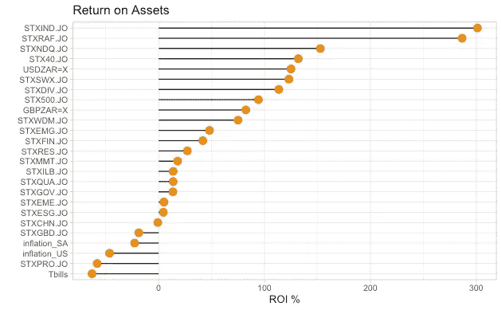

# 混合久期被动股票投资组合分析

> 原文：<https://medium.com/analytics-vidhya/analysis-of-mixed-duration-passive-equity-portfolios-54e0eb6f2fd7?source=collection_archive---------7----------------------->

## 投资论文

> 个人投资者可以期待短期股票投资组合的高收益吗？

# 问题说明

假设你想建立一个稳健的投资组合。进一步假设，你已经确定了一个长期战略。出现了一个问题:

> 应如何处理短期资金？

短期投资需求往往与长期投资需求脱节。短期投资通常表现为:

*   为特殊事件保存。
*   作为安全缓冲。
*   有更高的流动性和稳定性要求。

> 在这里，我考虑采用长期被动多元化投资组合方法进行短期资产配置的可行性。并通过统计调查评估预期绩效。
> 
> 这一论点是建立在这样一个前提上的，即来自多元化市场的任意样本都比令人震惊的现金收益率表现更好。这很有意思，因为市场多样化的好处不仅需要在很长的时间范围内积累。

# 假设和前提

让我们比较两个投资组合选项:

1.  投资现金。
2.  **投资一个随机抽样的股票组合**。

声明:成本和复杂性被忽略了——在我们的案例中，这可能是一种悲观的偏见。

## 投资现金

*   银行和股票公司对闲置现金提供统一的 2.5%年复利。

## 随机指数投资组合

我们希望以任意的方式代表市场，独立于时间、特定的股票组合、全球事件等，以捕捉市场的预期行为(在极限范围内)。我们还希望展示个人可以利用廉价投资平台构建的实际投资组合。

> 然后，我们可以创建简单的聚合投资组合&引导它们的表现，以在数据的时间跨度内，在所有可能的投资组合的空间中访问投资组合的表现。

这些高度随机化显著地消除了偏见。

> 目标是衡量短期内可能的股票投资组合的表现(&变化)，&将这种投资组合分布与现金回报的分布进行比较。

# 试验设计

为此，我们实现了一个简单的算法:

1.  获取过去 20 年的市场数据。对于个人来说，ETF 是投资市场的一个非常便宜的工具，因此非常适合我们的实验。因此，我们使用 ETFs &而不是个人股票。我选择使用公开市场上出售的 Satrix ETFs，因为它们既提供利基市场，也提供多样化的细分市场(涵盖所有投资组合类型)。
2.  现在我们有了数据，对于给定的几年(从 1 年到 10 年)，我们评估所有可能的投资组合的回报。这通过以下方式实现:

*   随机抽取 3 种资产(ETF)代表一个投资组合。
*   随机抽样开始日期。
*   计算持续时间内的回报率和回报率的标准差。
*   重复 2000 次 bootstrap——代表所有可能的投资组合(如果你倾向于数学:把这个想象成*投资组合空间*)。
*   Bootstrapping 还捕获投资组合的分布，而不仅仅是样本统计，因此我们捕获这些估计的变化。
*   这一过程会重复很多次(1 至 10 年)。

最后，我们预测现金投资组合的年复合收益率为 2.5%。为了帮助回答这个问题:

> 从短期来看，市场收益率值得冒险吗？

# 履行

现在我们可以用 r 实现这个算法。

# 分析

既然我们已经生成了样本，我们可以将这些发现与现金投资进行对比。我们首先来看看每个时间段的收益分布。

下面的代码生成每个持续期的回报分布。y 轴给出了投资年数(1 到 10 年)& x 轴给出了投资组合样本的投资回报率。

因此，每个直方图/分布都是给定持续时间内所有可能投资组合的自举估计。注意:

*   其中 0 在 x 轴上(资本收益没有变化)。
*   持续时间越长，回报的差异就越大。
*   回报的变化是非常积极的，大大增加了长期的预期回报。

> 很明显，长期持有任意的股票组合可以获得高投资回报率。

## 现在我们可以将回报分布与现金投资进行比较

上图中，我们看到:

*   y 轴:y 轴上回报率(ROI)的分布。
*   x 轴:年持有期。
*   蓝色虚线:平均(预期)投资组合回报。
*   粉色虚线:现金投资

解释:

*   股票投资组合的回报持续稳定，远远超过现金投资的预期(平均值)。
*   这种分布在现金投资之上是偏斜的，尽管在现金投资之下确实存在。
*   收益率的差异随着时间的推移而增加，因为投资组合的复合速度更快。

> 尽管持续时间较长的投资组合具有较高的变动，但从长期来看(9 年和 10 年的持股)，投资组合的变动会减少，而收益率会继续上升，这表明长期股票市场的稳定高收益率投资回报有所收敛。

风险容忍度为投资工具的选择提供了一些决定性的力量，但是不清楚投资组合是否值得为非常短的期限(2 年以下)而烦恼，因为抽样变异似乎超过了额外预期收益的好处。

# **问题资产**

我们的市场指数尽可能随机，提供最悲观的估计。这里有一些数字可以更好地理解实验中使用的资产。下面我们看到了每项资产在整个 20 年期间的回报。

最后，我们通过相关性提供资产，因为我们希望建立去相关的投资组合来实现市场多样性。资产已通过相关性进一步聚类(利用层次聚类)。

# 最后的

Tada！理解股票投资组合的自然变化有助于围绕投资工具建立直觉&多样化的投资组合回报。我们从统计学的角度对此进行了探索，通过抽样来估计极限范围内的人口行为。

完整代码可在[这里](https://gist.github.com/ZachWolpe/071dd2c4d397df66d0952871d685c54c)获得。