# 截至 2021 年 6 月的创业行业分析

> 原文：<https://medium.com/analytics-vidhya/analysis-of-startup-industry-as-of-june-2021-683e1b213a5c?source=collection_archive---------1----------------------->

> 该分析将为您提供对创业行业的深入了解，尤其是该行业中由最新一轮融资中估值≥10 亿美元(又名独角兽)的公司组成的罕见子行业。

**数据来源:**[https://drive . Google . com/file/d/1 gpvrem 7 drlkwutlk 7a _ t 7 la cob 10 cxmi/view？usp =分享](https://drive.google.com/file/d/1gpVrEm7drLkwutlK7A_T7lacob10cXmI/view?usp=sharing)

**NB-Viewer 链接:**[https://NB Viewer . jupyter . org/github/strike rsps/explorative-Data-Analysis/blob/main/Analysis-of-Startups-As-of-June-2021/unicorn _ Startups _ explorative _ Analysis _ June _ 2021 . ipynb](https://nbviewer.jupyter.org/github/strikersps/Exploratory-Data-Analysis/blob/main/Analysis-of-Startups-As-of-June-2021/unicorn_startups_exploratory_analysis_june_2021.ipynb)

**源代码:**[https://github . com/strike rsps/explorative-Data-Analysis/tree/main/Analysis-of-Startups-As-June-2021](https://github.com/strikersps/Exploratory-Data-Analysis/tree/main/Analysis-of-Startups-As-of-June-2021)

**注:**数据摘自 [CB Insights 网站](https://www.cbinsights.com/research-unicorn-companies)上发布的文章，并保存到`.csv`文件中，因为网站上的数据会随着时间的推移而频繁更新/核对。

**请在桌面模式而非移动模式下查看本文，以正确查看所有可视化内容。**

美国旧金山硅谷的日出

nicorns 是估值≥10 亿美元的私人公司/初创公司。它们可以进一步分为 Decacorns(即估值≥100 亿美元的初创公司)和 Hectocorns(即估值≥1000 亿美元的初创公司)。

据 [CB Insights 报道，截至 2021 年 6 月，全球至少有 700 家创业公司，其中近 95.02%的估值为<100 亿美元。](https://www.cbinsights.com/research-unicorn-companies)

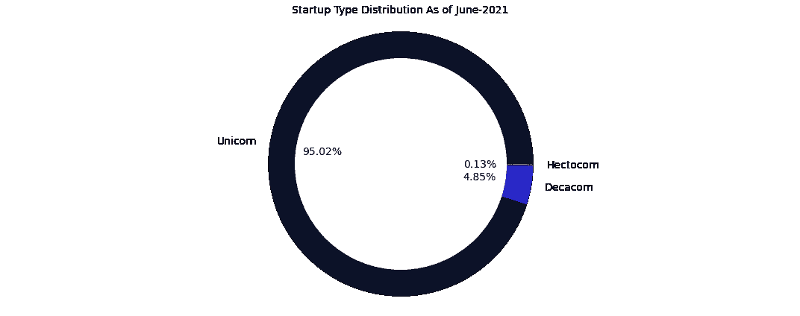

截至 2021 年 6 月按类别划分的初创企业分布

[**【字节跳动】**](https://www.bytedance.com/) 是全球唯一一家估值>1000 亿美元，即 1400 亿美元的创业公司，其次是估值 950 亿美元的 [**Stripe**](https://stripe.com/en-in) 其次是估值 740 亿美元的 [**SpaceX**](https://www.spacex.com/) 。

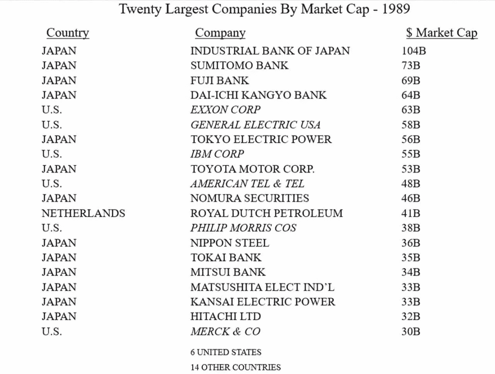

市值最大的 20 家上市公司-1989 年(截屏来自伯克希尔年度股东大会-2021 年开幕词)

如果你从市值的角度将今天最有价值的初创公司与 1989 年最有价值的上市公司进行比较，即 [**日本产业银行**](https://en.wikipedia.org/wiki/Industrial_Bank_of_Japan) ，在估值上有很大差异，而且大约 30 年前大多数有价值的公司都在银行业，但在 21 世纪就不是这样了。

你可以看到在过去三十年左右的时间里发生了指数级的发展，技术在这些创新中发挥了非常关键的作用，这些创新不仅提高了生活质量，而且大大提高了经济产出，开辟了新的机会。

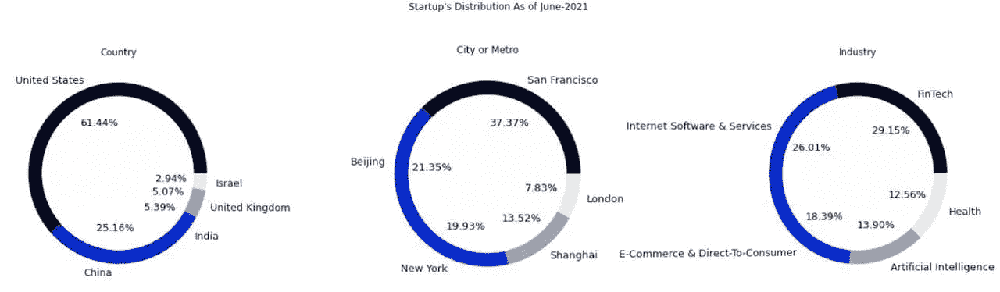

截至 2021 年 6 月的创业公司分布

上面的饼状图显示了初创公司在国家、城市或地铁以及行业中的分布情况。很明显，几乎 61.44%的初创公司位于美国，其次是中国(25.16%)和印度(5.39%)。

从城市或地铁的角度来看，分布在世界顶级城市中，包括旧金山、纽约、北京、上海和伦敦，这些城市也是各自经济的 GDP 的最大贡献者之一。

下面的树形图给了你一种以更详细和互动的方式查看地理基础上的启动分布的方法。

截至 2021 年 6 月，初创公司的详细地理分布

有一点你会注意到，尽管初创公司遍布全球，但它们都集中在特定的城市，比如印度。60%的初创公司位于班加罗尔、古尔冈和孟买，而不是遍布全国。

从行业角度来看，初创公司瞄准的顶级行业/领域是金融科技、互联网软件和服务、电子商务和 D2C、人工智能和医疗保健。在后大流行时代，这种分布可能会发生变化，我认为人工智能和医疗保健将占主导地位，但所有这些行业的一个共同点是:它们中的每一个都将由基于技术的创新驱动。

截至 2021 年 6 月的行业初创公司总数

教育行业只有一家估值 24 亿美元的创业公司，即美国的******，这很奇怪，因为教育行业有很多问题可以解决，也是一个赚钱的行业。除了美国，顺便说一下，美国只有一家初创公司，没有其他国家在这个行业有价值十亿美元的初创公司。******

******截至 2021 年 6 月的行业初创公司总估值******

******根据上面的条形图，下面的饼状图给出了一个详细的前景，即哪个国家针对前 6 大行业的创业公司数量最多。******

******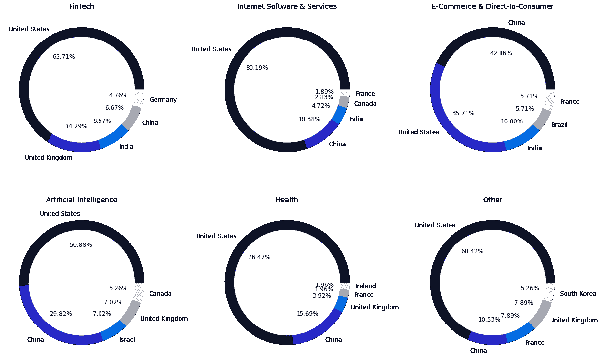******

******截至 2021 年 6 月的创业公司行业分布******

******下面的树形图可以让你以一种更加详细和互动的方式，从一个独立于地理位置的行业/部门的角度来观察全球所有的创业公司。******

******截至 2021 年 6 月按行业详细的创业公司分布******

******全球所有估值≥10 亿美元的初创公司的总价值约为 2.3 万亿美元，其中美国贡献的价值最大(约为 1.5 万亿美元)。1.2 万亿美元)，其次是中国(约为 5180 亿美元)，然后是印度(大约。1150 亿美元)。******

******截至 2021 年 6 月各国的创业公司估值******

******虽然从国家的角度来看，初创公司的累计估值存在显著差异，但前三名之间的显著差距将会缩小，因为未来几年将会有更多的初创公司，原因是推动解决一些最重要的问题，首要问题是气候变化以及我们如何通过转向可再生能源来减少碳足迹。 有利的政府政策和技术不仅在解决这些问题方面，而且在提高生活质量方面将发挥重要作用，这反过来将进一步提高经济产出。******

******截至 2021 年 6 月创业最多的前 15 个国家******

******下面的饼状图从城市或地铁和行业的角度给出了前 5 名国家的创业公司分布的更详细的前景(根据上面的条形图)。******

******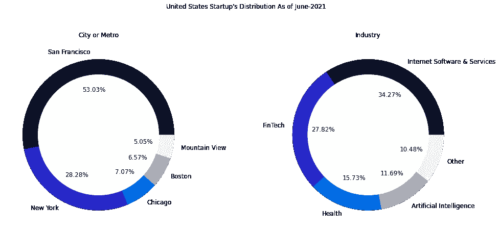******

******截至 2021 年 6 月的美国创业分布******

******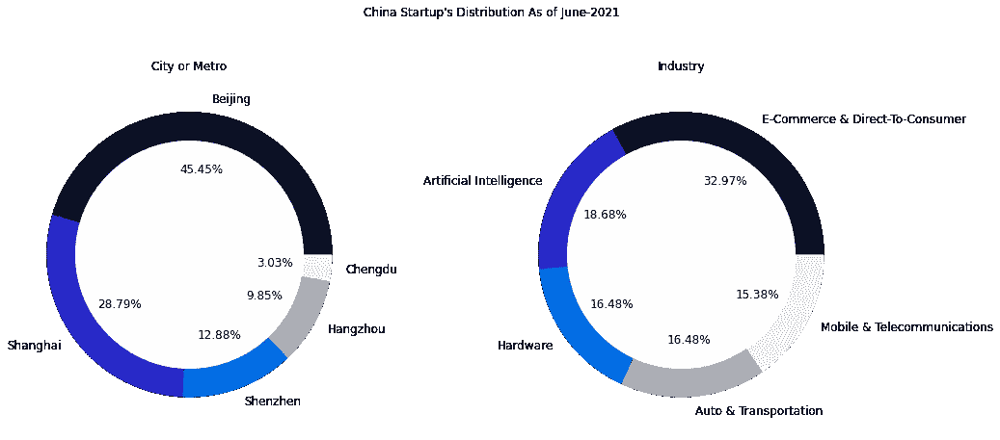******

******截至 2021 年 6 月的中国初创企业分布******

******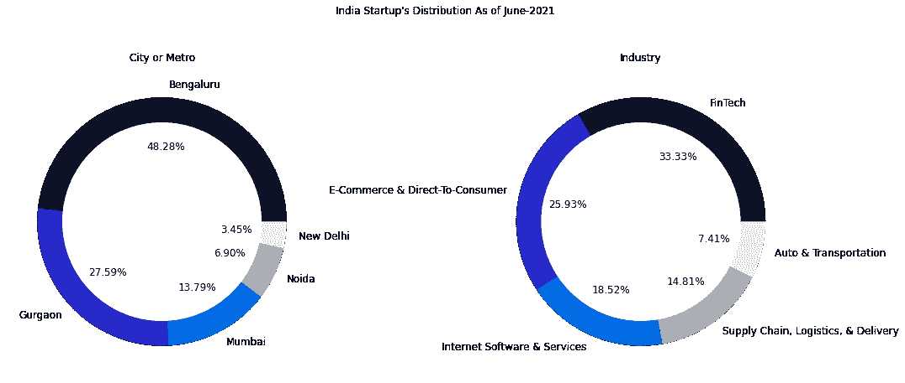******

******截至 2021 年 6 月的印度初创企业分布******

******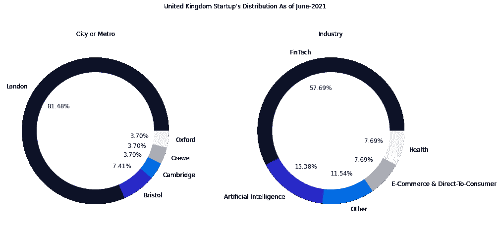******

******截至 2021 年 6 月的英国初创企业分布******

******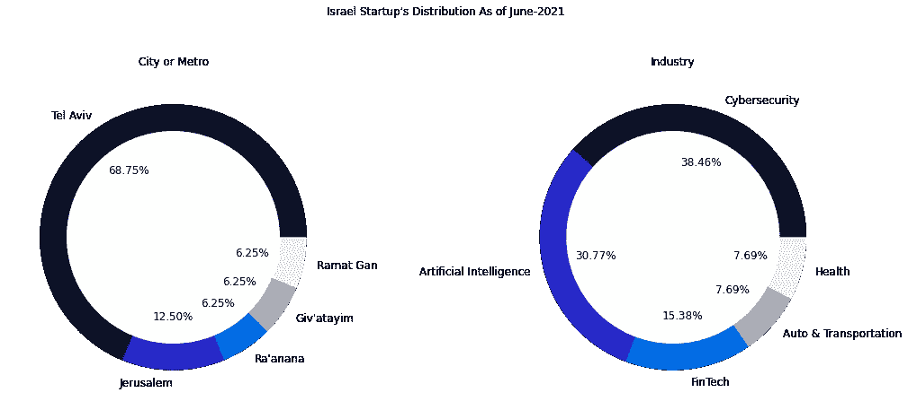******

******截至 2021 年 6 月的以色列初创企业分布******

******从上面的饼状图可以清楚地看出，行业分布并不是所有前 5 名国家都一样，以色列的情况很有趣，那里大多数有价值的初创公司都瞄准了网络安全行业(38.46%)，其次是人工智能(30.77%)，然后是金融科技(15.38%)。******

******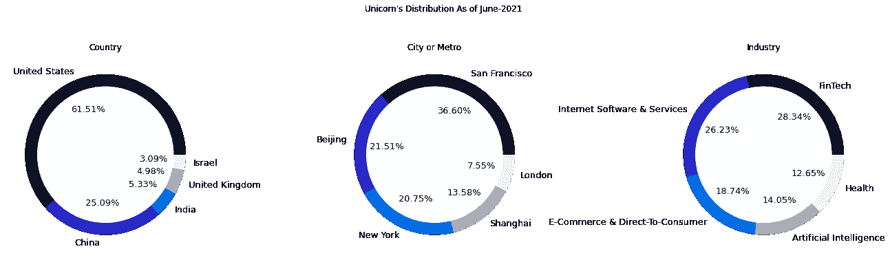******

******截至 2021 年 6 月的独角兽分布，不包括 Decacorns 和 Hectocorns******

******当我们观察那些估值≥100 亿美元的初创公司的分布时，它告诉我们一个不同的故事，特别是从行业的角度，与估值< $10 billion.******

******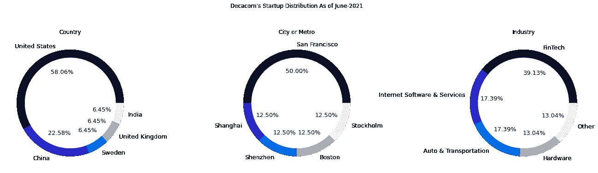******

******Decacorn Startup Distribution As of June-2021, Excluding Unicorns and Hectocorns******

******Most of the decacorns are present in FinTech (39.13%) followed by Internet Software & Services (17.39%), Auto & Transportation (17.39%), Hardware (13.04%), and Other (13.04%) industries which tell us that pattern doesn’t remain the same as it was when we have considered all the startups irrespective of their valuation or only the startups having < $10 billion valuations. It’s mainly due to either bankruptcy or reduction in valuation or merger & acquisition by other public/private companies.******

******The following treemap shows the distribution of the decacorns by geography in a more detailed and interactive way.******

******Decacorns Distribution By Geography As of June-2021 (Excluding Unicorns and Hectocorns)******

******Change in industry distribution also tells us about the volatility in valuations of startups in different industries or sectors even though the most valuable startup i.e. ByteDance does have a valuation of $140 billion which operates in the Artificial Intelligence industry but the industry itself doesn’t have a significant number of decacorns rather most of the startups have a valuation of < $10 Billion which you can observe from the tree-map and the following bar plot.******

******Decacorns Valuation As of June-2021 (Excluding Unicorns and Hectocorns)******

******The following treemap shows the distribution of the decacorns from an industry perspective irrespective of geography in a more detailed and interactive way.******

******Industry-Wise, Distribution of Decacorns As of June-2021 (Excluding Unicorns and Hectocorns)******

********结论:**通过分析，我们可以说，初创公司行业的未来将由那些使用技术解决一些最重要问题的公司驱动，因为它允许我们用更少的资源做更多的事情，将我们的基本能力提升到更高的水平。******

****正如彼得·泰尔在他的《零比一**一书中所说:******

> ******商业中的每一刻都只会发生一次。下一个比尔·盖茨不会开发操作系统，下一个拉里·佩奇或谢尔盖·布林不会开发搜索引擎，下一个马克·扎克伯格不会创建社交网络。如果你在模仿这些人，你就没有向他们学习。******

******不是全球化把世界从 0 带到 1，而是创新，由技术驱动，把世界从 0 带到 1。******

********参考文献:********

1.  ****[http://blog . elad Gil . com/2021/06/unicorn-market-cap-June-2020-almost . html](http://blog.eladgil.com/2021/06/unicorn-market-cap-june-2020-almost.html)****