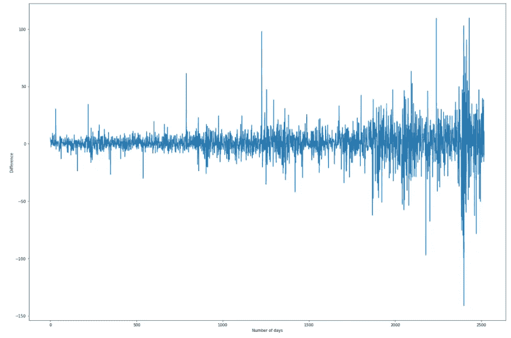

# 用 LSTM 模型分析股票价格预测

> 原文：<https://medium.com/analytics-vidhya/analysis-of-stock-price-predictions-using-lstm-models-f993faa524c4?source=collection_archive---------0----------------------->

## 通过深度学习可以确定合适的交易策略吗？


**简介**

股票交易是一种利用上市公司股价波动获利的方法。具体来说，在新冠肺炎疫情期间，许多人被困在家里，这已经成为许多人的一种方便的投资形式，有可能获得巨额回报，仅今年股票期权交易就增加了 50 %[ 1]。

因此，毫无疑问，许多公司都在不断寻找获得优势和预测市场趋势的方法。然而，由于信息的巨大复杂性和难以预测的突然变化，这仍然是一项可能非常艰巨的任务。

因此，我想了解一个训练有素的模型能否为我们提供准确的价格预测，以及在上涨/下跌发生之前预测上涨/下跌的最佳方式是什么。

具体来说，如果我在我的模型上投资 10000 美元，根据预测的百分比变化，我的进场/出场能让我赚钱吗？

**文献综述**

已经有大量的文章探讨了这一领域[2][3][4]，并且对我的文章的形成是非常宝贵的。然而，我注意到对这些条款有一些评论:

(1)组合测试/训练数据的标准化或将测试数据泄露到训练输入中


来源:[https://corporatefinanciinstitute . com/resources/knowledge/finance/look-ahead-bias/](https://corporatefinanceinstitute.com/resources/knowledge/finance/look-ahead-bias/)

当模型依赖于当前不可用的信息时，会发生这种情况，由于模型已经拥有未来的信息，因此会给出比预期更好的结果。

(2)难以预测第二天的价格

有许多文章声称他们有某种通过机器/深度学习赚钱的方法，但问题是他们很难获得普遍利润，因为第二天的预测价格只是基于今天的价格调整的。Schmalz 在他的文章[5]中解释得非常清楚。

因此，本文的目的不是声称一种据称具有突破性的预测价格的方法，而是通过机器/深度学习管道来了解模型是如何改进的，以慢慢消除提到的问题，同时尝试看看来自我的模型的见解是否有助于合理的交易策略。

在我们深入研究之前，我们需要确定为什么我们要对时间序列数据进行分析，因为价格波动似乎是任意的。从本质上讲，技术分析的理论基础是:

(I)价格反映了所有相关信息。

(二)价格变动不是完全随机的，历史会在一定程度上重演。

请随意参考我在[https://github.com/yuhaoleeyh/stock-project](https://github.com/yuhaoleeyh/stock-project)的 github 回购协议获取我的代码:)

我们开始吧！

**探索性数据分析**

我首先选择放大雅虎财经 API 中 10 年间(从 2010 年 8 月 31 日到 2020 年 9 月 1 日)的谷歌股票数据。

在我们开始生成模型之前，了解数据需要什么以及识别对我们来说重要的特征是至关重要的:


谷歌股票数据的前 5 行


谷歌股票数据的统计

我们注意到出现的特征数量非常少(只有 6 列)。换句话说，这些专栏本身可能不会给我们提供很好的训练结果。以下是 GOOGL 过去 10 年的调整后收盘价:


为什么我们关注调整后的收盘？这个价格考虑了股息、股票分割和任何配股，以及闭市后发生的任何因素。因此，这是我们试图预测的特征，因为它比易受非市场力量影响的其他指标更可靠。

在图表中，我们看到调整后的收盘价总体呈上升趋势。为了查看可能对此有贡献的可能特征，我们检查了各种特征之间的关系。我们意识到交易量与调整后的收盘价成负相关。因此，体积似乎会成为我们模型中使用的一个重要特征。


因此，我将首先使用调整后的收盘价和成交量作为我的预测模型的参数。然而，这些功能本身是不够的。

**特色工程**

可以说，机器/深度学习的一个不太受重视但却很关键的部分是适当特征的工程设计。模型本身非常强大，但是如果没有合适的特征，模型可能会发现很难从数据中得出准确的推论。

在我们开始任何模型训练之前，我尝试加入一些额外的特征:

(1)关于平衡量

此指标是一个动量技术指标，使用交易量的变化作为股价变化的指标。当当天的收盘价高于昨天时，我们增加交易量，当当天的收盘价低于昨天时，我们减去交易量。随着需求激增，正的数量压力将导致价格上涨，同样，负的数量压力将最终导致价格下跌。

接下来，我使用了 finta 库，它有差不多 76 个技术指标可供使用。([https://pypi.org/project/finta/](https://pypi.org/project/finta/))我特别关注了几个领先指标，这些指标可能会赋予模型对股票变化做出快速反应的能力:

(2)指数移动平均线

均线是一条移动平均线，它比远离当前时间段的价格更重视最近的价格。这有助于减少滞后量，并允许对价格变化做出更快的反应。

(3)布林线


来源:[https://www . daily FX . com/education/bollinger-bands/forex-trading . html](https://www.dailyfx.com/education/bollinger-bands/forex-trading.html)

布林线定义了 2 条线，距离时间序列的简单移动平均线有 2 个偏差。它限制了第二天价格的可能性，因为大多数价格行为都发生在这个区域内。波段越近，价格波动越大，因此当前趋势结束甚至逆转的可能性越大。

**数据处理**

一旦我们添加了特性，就该准备我们的数据作为模型的输入了！

数据集被分成 70%训练集和 30%测试集。重要的是，这种训练-测试分离必须在两种条件下进行:( 1)训练集必须总是在测试集周期之前，因为这是一个时间序列预测;( 2)这种分离必须在任何标准化/缩放之前进行，以避免前瞻偏差。

请注意，对于大多数数据，进行 K 倍交叉验证会更理想，因为我们可以通过使用各种折叠作为验证集来评估模型。虽然这种方法更准确，并且也导致更高的数据使用效率，但问题是使用 K-Fold 违反了时间序列数据的时间过程，因为验证数据集在训练数据点的时间帧之前。因此，我将简单地使用 keras 的 validation_split 来提取训练集的最后 10%作为我的验证集。

我们接下来执行归一化，当列的幅度不同时，这是重要的，因此一个列的变化的影响比另一个更显著。在标准化过程中，我们对训练数据进行拟合变换，以确保所有训练数据都在 0 和 1 之间。

```
normaliser = preprocessing.MinMaxScaler()
train_normalised_data = normaliser.fit_transform(train_data)test_normalised_data = normaliser.transform(test_data)
```

接下来，我开始为训练集和测试集构建输入和输出特性。对于输入，它由前 21 天的特征组成。我选择 21 天，因为这是一个月的平均交易日数，这将为模型提供足够的学习功能。产量是调整后收盘价的第 22 天。

```
history_points = 21X_train = np.array([train_normalised_data[i : i + history_points].copy() for i in range(len(train_normalised_data) - history_points)])y_train = np.array([train_normalised_data[:,0][i + history_points].copy() for i in range(len(train_normalised_data) - history_points)])X_test = np.array([test_normalised_data[i : i + history_points].copy() for i in range(len(test_normalised_data) - history_points)])y_test = np.array([test_data['Adj Close'][i + history_points].copy() for i in range(len(test_normalised_data) - history_points)])
```

**长短期记忆(LSTM 模型)**

现在是有趣的时候了！！深度学习！

我将尝试使用长短期记忆(LSTM)模型，这是一种常用的深度学习递归神经网络(RNN)，常用于预测时间序列数据。


鸣谢:[https://blog . floydhub . com/long-short-memory-from-zero-to-hero-with-py torch/](https://blog.floydhub.com/long-short-term-memory-from-zero-to-hero-with-pytorch/)

LSTM 有逻辑门(输入、输出和遗忘门),这些逻辑门赋予它保留更相关信息和放弃不必要信息的内在能力。这使得 LSTM 成为长期解释模式的一个很好的模型。

关于 LSTM，需要注意的重要一点是输入，它需要以 3D 矢量的形式出现(样本、时间步长、特征)。因此，必须对输入进行整形以适应这种情况。

我们首先导入所有必需的 keras 和 tensorflow 库。请注意，我们还必须设置一个随机种子，以确保结果是可复制的:

```
import tensorflow as tf
import keras
from keras import optimizers
from keras.callbacks import History
from keras.models import Model
from keras.layers import Dense, Dropout, LSTM, Input, Activation, concatenate
import numpy as np
tf.random.set_seed(20)
np.random.seed(10)
```

接下来，我们从最简单的 LSTM 图层开始，将密集图层作为输出。我们用 30 个时期和 0.1 的 validation_split 来运行它，以了解模型学习的总体情况。

请注意，仅对 train_data 而不是验证数据进行混洗，并且验证 _split 是从提供的最后 x 和 y 数据中获得的，这确保了为训练保持数据的时间顺序。

```
lstm_input = Input(shape=(history_points, 6), name='lstm_input')
inputs = LSTM(21, name='first_layer')(lstm_input)
inputs = Dense(1, name='dense_layer')(inputs)output = Activation('linear', name='output')(inputs)
model = Model(inputs=lstm_input, outputs=output)adam = optimizers.Adam()model.compile(optimizer=adam, loss='mse')model.fit(x=X_train, y=y_train, batch_size=15, epochs=30, shuffle=True, validation_split = 0.1)
```

我们绘制了验证测试集的结果，其合理的 RMSE 为 12.698:


完成后，我们对 x_test 进行预测，并根据下面的实际结果绘制结果:


体面！大方向是存在的，似乎 LSTM 模型能够学习谷歌股票的趋势。然而，RMSE 相当高(76.976)，因此它可能不是一个好的预测模型。仅仅添加合适的特征不足以使模型获得最佳结果。

**超参数/图层调整**

大多数机器/深度学习模型都有内部参数，通常需要改变这些参数才能实现更准确的预测。

调整时期的数量是一个重要的因素。时期数量的增加将减少误差，但是太多的时期将导致模型学习训练数据的噪声。我们需要注意验证损失，当它在最低点时停止，因为超过最低点，我们过度拟合我们的特征只是为了增加我们的精度。我运行了超过 1000 个时期的模型，并绘制了相对于时期数的训练和验证损失:


因此，我运行了提前停止的模型，在这种情况下，一旦验证精度在连续 20 个时期内没有提高，模型就不会运行，并选择时期= 170，此时验证损失最低。

接下来，我对进行了系统的网格搜索，以获得最佳结果。运行超过 100 个模型，我试验了增加密集层、增加密集层中的神经元、神经网络的学习速率、增加漏层和 LSTM 堆叠。模型的学习率如下图所示:


演职员表:【https://www.jeremyjordan.me/nn-learning-rate/ 

必须选择最佳学习速率，以避免不可靠的训练结果/无法训练模型。同样，LSTM 层的垂直叠加会增加模型的复杂性，因此有望提高结果的准确性。

经过大量测试后，我根据从网格搜索中获得的最佳超参数对模型进行了调整，网格搜索的图层如下:

```
lstm_input = Input(shape=(history_points, 6), name='lstm_input')inputs = LSTM(21, name='first_layer')(lstm_input)inputs = Dense(16, name='first_dense_layer')(inputs)inputs = Dense(1, name='second_dense_layer')(inputs)output = Activation('linear', name='output')(inputs)model = Model(inputs=lstm_input, outputs=output)adam = optimizers.Adam(lr = 0.0008)model.compile(optimizer=adam, loss='mse')model.fit(x=X_train, y=y_train, batch_size=15, epochs=170, shuffle=True, validation_split = 0.1)
```

这设法在测试集上获得了 48.997 的合理 RMSE。它能够相对较好地模拟价格上涨/下跌。


**第一个模型的局限性**

模特看起来还过得去！是时候开始挣钱了吗？把钱投到我的模型里可能很诱人(请不要！)，我决定测试一下。

以 10000 美元作为基础资金，我做了一个算法，当第二天的价格变动超过预测的 0.15%时，买入尽可能多的股票，当第二天的价格变动超过预测的 0.15%时，卖出尽可能多的股票。

然而，在这种模式下，我们实际上得到 8424 美元！上面的图显示了模型在实际测试集上的买入(绿色箭头)/卖出(红色箭头)，而下面的图显示了同一时间段内(第二天预测的)百分比变化:


换句话说，我们最好不要投资任何钱！为什么会这样呢？这是由于领先/滞后模型的概念。

领先模型:在价格发生之前提供指导价格变化的能力。

滞后模型:只在价格变化发生后才做出反应的模型。

在股票分析中，我们需要集中精力识别能够准确预测价格位置的领先模型。这通常通过季节性培训来实现:

**季节性模型**

平稳性的概念在时间序列数据中至关重要。本质上，时间序列数据将具有趋势、季节性和噪声:


来源:[https://anomaly . io/seasonary-trend-decomposition-in-r/index . html](https://anomaly.io/seasonal-trend-decomposition-in-r/index.html)

我们应该明白，当 LSTM 模型能够更好地训练持续的季节性，而不是试图学习当前的趋势时，这样的模型效果最好。

为了尝试让模型学习数据的季节性，这主要是由于股票价格在波动超过平均值后最终恢复到稳定点造成的，我尝试使用差异(P(t +1) -P(t))作为唯一的输入特征。这将有望产生一个领先的模型。同时，这防止了模型参考昨天的价格，这有望避免滞后模型的问题。谈一石二鸟:)



数据的季节性一旦我取 P(t) — P(t — 1)

之后，我在 LSTM 模型上训练数据。具体来说，我决定雇用更多的 LSTM 层。LSTM 层的垂直叠加会增加模型的复杂性，因此有望提高结果的准确性。注意，我只使用了 25 个历元，因为超过这一点，验证损失会急剧增加。

在做了进一步的网格搜索后，我设法使用下面的层在验证集上获得了一个 RMSE 为 45.273 的不错的性能模型:

```
lstm_input = Input(shape=(data_set_points, 1), name='lstm_input')
inputs = LSTM(21, name='first_layer', return_sequences = True)(lstm_input)
inputs = Dropout(0.1, name='first_dropout_layer')(inputs)
inputs = LSTM(64, name='lstm_1')(inputs)
inputs = Dropout(0.05, name='lstm_dropout_1')(inputs)
inputs = Dense(32, name='first_dense_layer')(inputs)
inputs = Dense(1, name='dense_layer')(inputs)
output = Activation('linear', name='output')(inputs)model = Model(inputs=lstm_input, outputs=output)
adam = optimizers.Adam(lr = 0.002)model.compile(optimizer=adam, loss='mse')
model.fit(x=X_train, y=y_train, batch_size=15, epochs=25, shuffle=True, validation_split = 0.1)
```

有两件重要的事情需要注意。首先，应该为多个 LSTM 层设置 return_sequences = True，以便输出可以提供给下一层。第二，为了提高精确度，我一直在每个 LSTM 层之后添加漏失层，这将有助于减少过度拟合，这是神经网络非常容易发生的事情。


测试集预测乍看起来不太好，但首先，即使测试集中的趋势急剧增加，第二个模型也设法简单地从训练集中的差异(不参考价格)来正确预测价格方向。

第二，这个模型似乎能够学习一些主要特征。在 t = 20 时，预测价格会下降，这反映在 t = 25 时的价格下降上，此后，从 t = 30 到 t = 40，预测价格也会上升，反映在实际的蓝色图表中。t = 550 时的预测下降也反映在 t = 600 时。这一结果表明，趋势的去除可能降低了准确性，但可能提供了进入/退出股票市场的最佳时机的见解。

下面，我尝试使用同样的 10000 美元算法，看看我是否能从我的模型中赚钱。你可以看到，在这个例子中，我的算法在根据我的预测低买高卖方面做得很好。


从这个预测中，我总共赚了 7683 美元，与买入并持有策略相比，我赚了 6558 美元，相当于赚了 1135 美元！厉害！换句话说，虽然它没有很好地模拟数量，但它设法提供了价格变化的领先指标，这使我的算法获得了收益。

这可能看起来像是巧合，因此我决定使用差异，并将其合并到实际价格中。对于时间 t 时的每个实际价格，我使用获得的预测差异来获得 t + 1 时的价格，我们获得了以下结果:


了不起！我比 RMSE 提高了 24.014 分！这表明，由于季节性不变，该模型通常能够相当准确地预测正确的方向。它证明了基于差异而非幅度的训练实际上导致了更高的准确性和更好的生成潜在领先模型的能力。

然而，我要重申的是，只在一只股票上训练一个模型并不意味着这可以推广到所有股票或其他时间段。然而，这一结果为预测进入/退出市场的方法提供了巨大的机会，并为基于恒定平稳性的更好调整/特征工程提供了潜力，以生成可持续的模型。

**结论和要点**

总的来说，看起来我的 LSTM 模型能够通过特征工程和超调整成功地预测股票价格。然而，去除趋势并让模型仅训练季节性成分似乎赋予了模型拥有领先指标的能力，并给予了预测更好的准确性。有很大的潜力来预测进入/退出市场的基础上，一个适当的阈值，以实现最佳的结果。

**演职员表**

我想真诚地感谢 https://heicodersacademy.com 严敏和黑码学院([)](https://heicodersacademy.com/)，他们投入了大量的时间来指导、建议我，并在这篇文章的撰写过程中给了我很多帮助。

**重要免责声明**

这个项目纯粹是从教育和研究的角度出发，不应该被天真地用作金融投资的指南或基准。任何股票交易都包含巨大的风险，因为此类投资组合的估值会波动，因此应该谨慎从事。本文绝不作为股票投资指南，使用的任何信息风险自担。

这是我第一篇关于媒体的文章，所以我欢迎任何关于改进我的模型/未来方向的反馈:)

**参考文献**

[1][https://www . CNBC . com/2020/12/04/疫情-induced-options-trading-craze-shows-no-signs-of-downing . html](https://www.cnbc.com/2020/12/04/pandemic-induced-options-trading-craze-shows-no-signs-of-slowing-down.html)

[2][https://towards data science . com/get-rich-quick-with-machine-learning-and-stock-market-predictions-696802 da 94 Fe](https://towardsdatascience.com/getting-rich-quick-with-machine-learning-and-stock-market-predictions-696802da94fe)

[3][https://towardsdatascience.com/aifortrading-2edd6fac689d](https://towardsdatascience.com/aifortrading-2edd6fac689d)

[4][https://towards data science . com/stock-price-prediction-based-on-deep-learning-3842 ef 697 da 0](https://towardsdatascience.com/stock-price-prediction-based-on-deep-learning-3842ef697da0)

[5][https://towards data science . com/using-neural-networks-to-predict-stop-be-focked-c 43 a4 e 26 AE 4e](https://towardsdatascience.com/using-neural-networks-to-predict-stock-prices-dont-be-fooled-c43a4e26ae4e)

[6][https://medium . com/@ Currie 32/predicting-the-news-and-deep-learning-7 fc 8 f 5 f 639 BC](/@Currie32/predicting-the-stock-market-with-the-news-and-deep-learning-7fc8f5f639bc)

[7][https://towards data science . com/pandemics-impact-financial-markets-9 a4 feb 6951 F5](https://towardsdatascience.com/pandemics-impact-financial-markets-9a4feb6951f5)