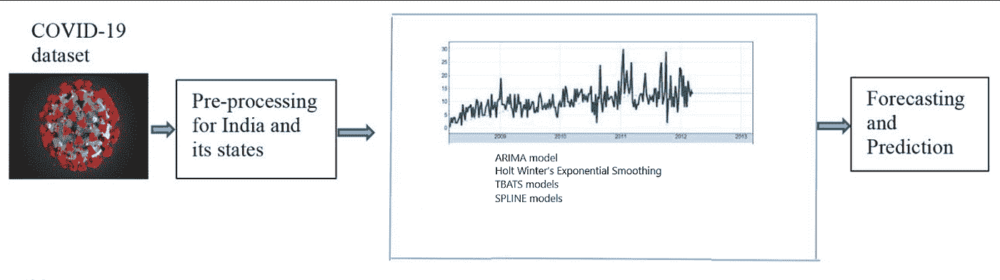
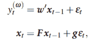

# 时间序列数据分析

> 原文：<https://medium.com/analytics-vidhya/analysis-of-time-series-data-dad4afa56358?source=collection_archive---------4----------------------->

# 什么是时间序列数据？

时间序列数据是在不同时间点收集的数据，目的是预测结果。预测是预测未来事件的行为。预测是一个跨领域的重要问题，包括商业、工业、政府、经济学、环境科学、医学、社会科学、政治和金融。

我们可以在各种领域构建大量应用程序，这些应用程序以时间序列数据为基础，帮助您做出决策。在统计和机器学习环境中，时间序列数据分析起着至关重要的作用。

让我们通过一些例子来说明这一点。

*   研究过去的数据是否有助于你预测气候灾害，以便我们为未来采取预防措施
*   观察在一个时间范围内收集的 ECG 数据有助于诊断患者在 ECG 数据中的异常模式
*   分析日志数据有助于发现软件领域中的错误
*   时间序列数据发挥重要作用的一个领域是股票市场，在这里，对过去数据的研究有助于您做出买卖股票的决策

通常有三种类型的预测问题:短期、中期和长期。

这篇文章涵盖了时间序列分析的基础，以及如何利用它来预测临床数据系列，主要集中在新冠肺炎疫情。

> **时间序列** : *一个变量的值以相等的时间间隔有序排列*。

在软件中，行业很难从时间序列数据中做出传统的统计推断，因为它们的统计特征经常违背假设。时间序列分析师需要专业技能和经验来生成正确的预测。数据分析师可能不像那些具有数据分析专业知识的人那样熟悉预测过程。时间序列分析有其独特的性质，不应被误认为是经典的统计推断。因此，时间序列数据分析需要一套独特的工具和方法，统称为时间序列分析。

# 基本理解

时序数据是在给定时间间隔内收集的数量的集合，按时间顺序显示。时间序列频率是指收集数据的频率。

时序数据有四个组成部分:

*   时间趋势数据
*   数据的季节性
*   非线性或结构性中断
*   噪音

## **时间趋势数据:-**

ime 趋势对测试和建模都有影响。为了获得准确的时间序列模型，必须正确识别和说明时间趋势。它指的是数据在一段时间内持续向上或向下移动。每当我们用一条线来拟合一个数据集时，如果这条线的斜率是正的，我们就可以断定趋势是向上的。

## **数据中的季节性**

时间序列数据的另一个特征是季节性，它可以在时间序列图中直观地识别出来。季节是任何时间序列，其模式在时间间隔上表现出规律性和可预测性。季节性因素是趋势向上或向下运动的模式，在一年、一月或一周内以固定的间隔发生。季节性总是遵循相同的可预测模式。心电图就是这种成分的一个最好的例子。PQRST 尖峰是在一段时间内记录的有规律的可预测尖峰。

## **非线性或结构突变**

ime 序列数据有时会在某个时间点显示行为的突然变化。因此，时间序列的平均值表现为序列在某些断点处水平的突然变化。例如，在下面的时间序列图中，数据的平均值在 2011 年初有一个明显的跳跃，在 2016 年突然下降。

## **噪音**

一个 **时间序列**是白噪声**如果变量是独立的并且同分布，均值为零，因此我们称该时间序列为高斯白噪声。**

**高斯白噪声**:高斯白噪声(GWN)是一个平稳、遍历的随机过程，均值为零。GWN 的基本属性是这两个值在统计上总是独立的，不管这两个值发生的时间有多接近。这个性质的直接结果是 GWN 的自相关函数是正的。

# 时间序列数据的建模

时间序列模型对于检查过去的结果、预测未来的事件和建议政策改变是有用的。

时间序列模型与横截面或面板数据模型有许多相同的目标。另一方面，时间序列分析必须包含时间序列相关性。

## 平稳时间序列:

平稳时间序列是指其所有统计特征在一段时间内保持不变的序列。从技术定义上来说，严格平稳性是指(yt，…，yt*h)只随滞后 h 变化而不随时间单位 t 变化的分布，一般时间序列分析不需要严格平稳性。

## 非平稳时间序列数据:

非平稳数据在本质上是不可预测的，根据定义，不能预测或建模。如果使用非平稳时间序列，结果可能是虚假的，因为它们可能导致变量之间的关系并不存在。

## 周期性和季节性时间序列数据:

周期包括上升和下降的周期以及不同周期的周期。周期性成分是由趋势线周围随机间隔的波动(周期之间的时间是随机的)引起的，例如由季节变化、经济波动或撤销引起的；

当一个系列受季节因素(例如，一年中的某个季度、一个月或一周中的某一天)影响时，就会出现季节模式。每当我们谈到季节性时，我们总是指一个已知的固定时期。因此，周期性时间序列有时被称为季节性时间序列。

在下图中，中间的图显示了美国新建单户住宅的月销售额(1973-1995)。经济的季节性很强，每年都有一个大约 6 到 10 年的周期。

# 新冠肺炎（新型冠状病毒肺炎）

新冠肺炎·疫情将政府和公共卫生系统置于巨大的压力之下。除了社会和政治问题之外，医院中稀缺的医疗设备，如病床、ICU 病床、工作人员、呼吸机等，是影响社区心理健康的一些主要问题。上述挑战的存在，以及诸如缺乏资源等问题，例如到目前为止缺乏对这种疾病的治疗。这种病毒的动态结构，以及它的全球传播，突出了对这种不寻常的病毒行为进行更多研究的必要性。预测模型，如统计和数学模型，可用于预测疾病的未来轨迹。

> 在这种情况下，不同的部门和形式的预测和建模。

根据确诊病例数，估算未来感染病例数的模型就是这些预测领域之一。尽管不完全正确，但对未来患者数量的预测有助于政府和卫生决策者做出适当的决定。

为了减轻病毒的灾难性影响，必须预测未来的爆发、预期的病毒突变和传播以及高峰时间。通过实施严格有效的政策，艾滋病预测决策者可以预防甚至控制疾病的传播。

用于预测新冠肺炎确诊病例、死亡人数和康复人数的四种不同的高引用时间序列模型是:

1.  ARIMA 模型
2.  霍尔特·温特指数平滑法
3.  TBATS 型号
4.  样条模型

ARIMA 模型在一系列应用中产生了最一致的结果。与 Holt 和 TBATS 模型相比，ARIMA 和三次平滑样条的预测误差更小，预测范围更窄。下图给出了更好的理解

**阿玛& ARIMA 模特**

ARMA 自回归移动平均模型可以处理季节性和周期性行为。

自回归综合移动平均(ARIMA)模型是基本的工作时间序列模型之一。

这两种型号都是在 20 世纪 30 年代和 40 年代推出的。在第二次世界大战期间，它们是信号分析的基础。

**AR-** 自动回归:

该模型使用线性回归根据过去的值来估计变量本身的未来值。线性回归模型由 p 滞后观测值和白噪声组成，白噪声用于捕捉回归无法解释的一切。

**I**-综合
它是指不同的方法，计算连续观测值之间的差异，从非平稳过程中获得平稳过程。有一个参数 d，指出了观测值之间的差异数。

**MA**-移动平均模型
这是一个类似回归的模型，它依靠过去的预测误差来预测感兴趣的变量，加上白噪声。移动平均的阶数为 q，它定义了移动平均窗口的大小。

因此，要设置的参数是:

Y- N x 1 向量，包含时间序列。

**p**-标量，自回归阶。

**d**——可选标量，求差的顺序。默认值= 0。

**q**-可选标量，移动平均顺序。默认值= 0。

**ctl** -可选控制结构。包含评估的附加设置，如优化容差、初始值以及对打印输出的控制等。

ARMA 模型能够处理季节性和周期性变化。ARIMA (p，q)模型可以是循环的。p > 1 尽管为了获得 AR(2)的循环性，在参数上有一些条件，其中

并且εt 是白噪声，则观察到循环行为，如果

在这种情况下，周期的平均周期为

## 霍尔特·温特的指数平滑法

三个顺序参数α、β和γ定义了霍尔特-温特斯模型。

水平平滑系数由α指定。趋势平滑系数由β指定。季节性平滑的系数由 Gamma 指定。

季节性的类型也有一个参数:

附加季节性，每个季节都有一个常数的变化。倍增的季节性，每个季节都有一个因子的变化。该运算符仅适用于数字时间序列。

霍尔特-温特加法指数平滑用于预测，

**TBATS 型号**

借助 TBATS，用户可以轻松处理多个季节的数据。当季节性随时间波动时，像这样的模型是优选的。

使用指数平滑，这种预测方法使用复杂的季节模式来模拟数据。最流行的模型(如 ARIMA 和指数平滑)只能解释一个季节性。该模型可用于创建详细的长期预测，而不管复杂的季节性(例如，非整数季节性、非嵌套季节性等)。).

*   t:三角季节性
*   b:Box-Cox 变换
*   答:ARIMA 错误
*   t:趋势
*   学生:季节性成分

在新冠肺炎数据的情况下，首先使用其他时间序列模型，研究数据图中的任何季节性模式，但数据没有显示任何季节性模式。为了进一步调查新冠肺炎数据中的任何季节性痕迹，重新定义了数据以使其适合 TBATS 模型。

TBATS 模型需要估计 2(k1 +k2 + +kT)个初始季节值。此外，线性新息状态空间模型的特殊情况在这里适用于合并 Box-Cox 变换来处理非线性。它具有以下形式:

其中 w’是行向量，g 是列向量，F 是矩阵，xt 是 t 时刻未观察到的状态向量

## 样条模型

样条曲线通过拼接不同的多项式线段来实现平滑过渡和微妙的结构变化，这是一种处理新冠肺炎案例号特征的替代模型。

## **其他一些周期性和季节性时间序列模型:**

**ETS 车型:**

ETS 模型(状态空间框架中的指数平滑)允许季节性，但不允许周期性。作为一个例子，ETS(A，A，A)模型展示了一个附加的季节模式和一个附加的趋势。然而，没有 ETS 模型可以复制非周期性的循环行为。

**萨里玛型号:**

**SARIMA 模型(季节性自回归综合移动平均)用于具有季节性成分的时间序列。该模型是 ARIMA 的扩展，为 ARIMA 增加了季节术语。集合的参数不仅有 *p，d，q* ，还有 *m* ，季节周期。**

****参考文献:****

1.  **Gecili E，Ziady A，Szczesniak RD (2021)预测新冠肺炎确诊病例、死亡和康复:通过美国和意大利的新应用重新审视已建立的时间序列模型。PLoS ONE 16(1): e0244173。https://doi.org/10.1371/journal.pone.0244173。**
2.  **n .塔尔希、n .阿哈旺·法特米、z .阿塔伊和 m .贾巴里·诺加比(2021)。伊朗新冠肺炎确诊人数和死亡人数的建模和预测:时间序列预测方法的比较。*生物医学信号处理与控制*， *66* ，102494。【https://doi.org/10.1016/j.bspc.2021.102494】T4。**