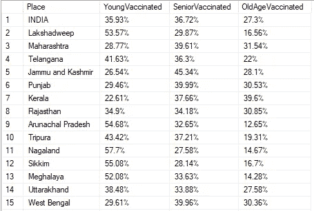

# 使用 SQL 进行分析:新冠肺炎印度疫苗接种背后的一瞥

> 原文：<https://medium.com/analytics-vidhya/analysis-using-sql-a-look-behind-covid-19-india-vaccinations-354cc6aec4a9?source=collection_archive---------7----------------------->

## 使用 SQL Server 分析 Covid 疫苗接种

# **数据集**

本项目数据取自 [Kaggle](https://www.kaggle.com/sudalairajkumar/covid19-in-india) 。这是 Covid 数据 2 部分分析的第 2 部分。点击[第一部分](https://itsmerohanraj.medium.com/data-analysis-using-sql-a-look-behind-covid-19-india-cases-1dfbad1dc82a)查看第一部分。
用于本分析的表格包含了从疫情开始到 2021 年 6 月 24 日的数据。

该项目包含对 Covid 疫苗接种的深入分析，使用 Excel & SQL 实现，并使用 Tableau 可视化。SQL 分析在 Microsoft SQL Server 上实现。

# 清理数据:

在数据集中，一半的日期是“Date”格式，其他的是“Varchar”格式。这必须更改为正确的日期格式，这已经使用 Excel 完成。编辑后的数据可以从[这里](https://github.com/rohanraj-9654/Covid-19-in-India-SQL-Tableau/blob/main/CovidVaccinations/vaccineState.csv)下载。

这里还删除了一些与疫苗信息无关的列，并使用现有的要素列创建新的要素，如**每天接种的总人数**、**每天总剂量**病例，以从累计疫苗数据中获取每天的疫苗信息。要详细了解对数据集执行的更改，请查看这个 [DDL](https://github.com/rohanraj-9654/Covid-19-in-India-SQL-Tableau/blob/main/CovidVaccinations/CovidVaccinations_DDL.sql) 文件。

创建新功能

输出:

# 我们开始分析吧！！

在这里，我们分析数据，首先是印度和各个邦的疫苗接种总数，最后是每个邦的每日疫苗接种数据。

***1。TopVaccinated 州***
***2。各州管理的 Covishield、Covaxin、Sputnik 的比例***

输出: **Covishield** 在所有州以**最大**数量进行管理，其次是 Covaxin。在各邦中，**德里**使用 Covaxin 的比例最高(30%),为其人口接种疫苗。

***3。不同年龄组的疫苗接种比例***

产出:在印度以及在不同的邦中，接种疫苗的老年人的比例低于，这也可能是因为印度的大部分人口来自其他类别。

各年龄组的疫苗接种

***4。第一剂受试者中完成第二剂受试者的百分比***

产出:在印度，21.21%的疫苗接种者完成了两种 Covid 剂量，德里(31.43%)的疫苗接种者完成剂量的百分比最高。

完整剂量

各州接种人群的可视化表示

***5。各州浪费的剂量百分比***

产出:根据给定数据，最大剂量浪费发生在 5 月份的查提斯加尔邦(57.94%)，其次是特伦甘纳邦(49.33%)。

剂量浪费(各州)

# 摘要

从上述数据分析中可以得出以下结论:

1.  在印度，北方邦(2，39，18，186)接种的疫苗数量最多，而最大剂量浪费发生在德里(23.91%)。
2.  **德里** (31.43%)在接种疫苗的人群中也拥有最高的**全剂量人口比例**。
3.  在印度，接种疫苗的人中，53.86%是男性，46.12%是女性。除了安得拉邦以外，其他各邦都保持了几乎相同的比例，在安得拉邦，54.03%的接种者是女性，45.95%是男性。
4.  **Covishield** 已用于该国约 80%的接种人群，其次是 Covaxin。

COVID 疫苗接种仪表板

要详细了解这个项目，请查看 GitHub 库。此外，用户还可以通过 [Tableau](https://public.tableau.com/profile/rohan.raj4726#!/) 链接访问仪表板。

如果你对这篇文章有反馈、建议或问题，请随时在 GitHub 上发表评论或补充，或者在 LinkedIn 上联系我。