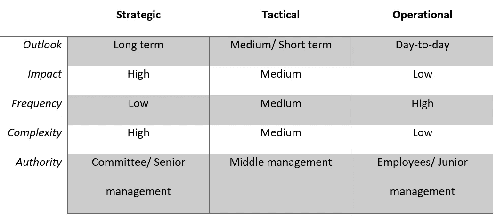
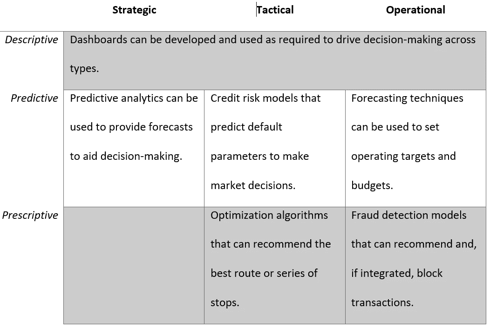

# 商业决策分析

> 原文：<https://medium.com/analytics-vidhya/analytics-for-business-decision-making-purposes-68724bd64850?source=collection_archive---------8----------------------->

决策是经营成功企业的重要组成部分。奥地利管理大师彼得·德鲁克指出了决策的重要性，他说:“做出好的决策是每个层面的关键技能。”[【我】](#_edn1)。然而，2018 年的一项调查发现，只有 20%[【ii】](#_edn2)的员工表示他们的组织擅长决策。我在 EMEA 地区的多家银行、金融服务和技术公司工作的时间与这次调查的结果相呼应。作为一名风险专业人士，我在商业决策过程中屡屡受挫。我认为一个有效的分析程序为支持业务决策提供了巨大的机会。

我的文章将首先总结商业决策实践，然后继续探讨其中的问题。最后，我将解释现代分析可以提供的改善和缓解一些主要问题的实质性途径。

***商业决策的什么、谁、为什么、如何***

商业决策可以大致分为三种类型[【1】](#_ftn1)[【iii】](#_edn3):

传统上，战略决策是由某种形式的决策委员会做出的。高级管理层的经验、敏锐度、洞察力甚至直觉对于做出适当的战略决策至关重要。这些决策通常有很高的下行风险，并涉及公司的“大赌注”。一个例子是对一项创新技术的重大投资决策，这可能会推动公司成为市场领先地位。

战术决策通常由中层管理人员以某种形式授权做出。根据公司的业务性质和手头的决策，可能有也可能没有关于如何做出决策的明确指示或指导方针。考虑一个会影响或吸引一部分客户的新产品特性。不利的一面是次优的客户体验和功能的返工或召回。

**运营**决策是围绕公司的核心业务活动制定的。它们通常由记录的过程和系统支持，由监督员工检查错误和异常值。围绕电子商务网站的客户退款或退货的决策将被归类为运营决策。员工通常有一个 IT 系统来记录这些决定。这些企业系统具有内置的规则、工作流，并且在定义的参数和约束内做出决策。有趣的是，参数和约束定义本身通常是战术决策。

***是什么让决策变得如此棘手，为什么它如此重要？***

**首先**，决策非常昂贵。除了做出错误决策的业务影响之外，做出决策所花费的时间和资源也是巨大的。考虑一下在一个典型的大公司做出一个战术决策的总努力和相应的成本。它包括开展研究，从收集与即将做出的决策相关的数据和指标开始。这些信息通常不容易获得，而是被“跳过”以听取专家意见或关键利益相关者的评论。如果内部不具备这方面的专业知识，则寻求咨询服务形式的外部帮助。所有这些都形成了与公司内关键利益相关者和决策者一致的意见或建议。不要忘了完善最佳幻灯片所花费的时间，以便在终点线完成决策。

**其次**，决策可能因偏见而无效，并可能与公司战略相背离。其中一个主要原因是与人类的决策过程有关。[【iv】](#_edn4)。人类通过使用启发法来做出决定，即通过利用从经验中发展的规则和关联。可用性启发可以引导商业决策者更加重视那些容易想到的东西。例如，最近媒体对特定商业模式或技术融资的显著报道可能会影响初创企业创始人对其的追求。认知偏差[【v】](#_edn5)如框架、锚定、确认等等，也会对决策产生负面影响。

为了了解决策的成本和无效性，最近的一项调查研究结果表明，员工平均花费 37%的时间做出他们认为 58%无效的决策。该研究估计，对于一个典型的财富 500 强公司经理来说，这相当于每年损失超过 530，000 天的工作时间和大约 2.5 亿美元的劳动力成本。

**最后一点**，以我的经验来看，决策，尤其是那些不是基于数据的决策，往往需要太长时间。因此，他们对市场波动或机遇的反应并不迅速。对于战略和战术决策来说尤其如此，在当今竞争激烈的商业环境中，公司不能失去市场提供的任何竞争优势。

本质上，有三个问题需要我们关注:

1.成本，

2.质量和，

3.速度。

***分析学来救援！***

等等……那么它是什么，它能做什么？

分析被定义为使用数据来获得洞察力并推动行动[【VII】](#_edn7)，这两者都是决策环境中的有益结果。现代分析可以分为:

**描述性**分析旨在描述数据，最好是以特定于其受众和主题的方式。如果配置得当，访问 Tableau 和 Power BI 等实时自助式仪表盘和分析工具可以帮助决策者利用数据，根据正确的理由快速做出正确的决策。

**预测**分析分析过去的数据并应用统计方法来预测未来。回归和决策树等建模技术可用于预测感兴趣的事件或结果。它们可以帮助决策者非常快速地做出数据驱动的决策。

**规定性**分析建立在预测技术的基础上，在某些情况下更进一步，提出建议并采取行动。

*按问题划分的用例*

**成本**:通过采用基于分析的记分卡和决策模型，可以显著降低制定日常运营决策的资源成本，例如银行的贷款决策。

**质量**:电子商务网站的退款决定可能会受到确认偏差的影响，并且可能会以不符合通过取悦客户来赢得客户的公司战略的方式做出。这可以通过采用机器学习算法来自动化决策来解决。

**速度**:就其本质而言，分析技术能够实现速度和快速决策。

*按决策类型划分的用例*

下面介绍了一些分析用例，用于节省成本、提高决策质量和加快速度:

***前进的方向是什么？***

那有很多工作要做！现在可以实现什么？

*   为员工提供自助服务分析能力。
*   关键决策委员会中的插件 BI 和数据专家(至少随叫随到)。
*   通过标准化决策数据和指标以及常规决策的演示内容[【VIII】](#_edn8)来避免确认偏差。
*   通过标准化类似决策的决策语言来避免框架偏见。
*   利用已有的技术[【IX】](#_edn9)如决策矩阵、SWOT 分析、帕累托分析、成本效益分析等。，并用数据支持他们。

我现在能做些什么来建立这种关系呢？

第一步是在组织内建立一个数据职能部门，并聘用一名首席数据官(CDO)或同等职位的人员。然后，CDO 将致力于建立基础设施，以实现企业级和大规模的分析。除了基础设施之外，还迫切需要围绕数据治理和管理建立健全的原则。我建议在初始阶段这样做，以确保数据的完整性和安全性，并在早期阶段提高可用性。

**—————**

**分析利用提供了一个强大的解决方案，帮助解决困扰业务决策的一些问题。无论公司规模和复杂程度如何，帮助关键决策流程和类型的经过深思熟虑和实施的分析计划都是触手可及的。这是由于进入分析领域的人才增加以及特定行业解决方案的发展速度。**

**—————**

参考

[【1】](#_ftnref1)对相当比例的企业决策有效。

[【我】](#_ednref1)(德鲁克，2004)

[【ii】](#_ednref2)(麦肯锡&公司，2019)

[【iii】](#_ednref3)(BBC Bitesize，未注明日期)

[【iv】](#_ednref4)(罗杰斯，2020)

[【v】](#_ednref5)(memory . ai，2020)

[【VI】](#_ednref6)(麦肯锡&公司，2019)

[【VII】](#_ednref7)(罗杰斯，从数据到洞察:实用分析简明指南，2020 年)

[【VIII】](#_ednref8)(克里希南，2019)

[【IX】](#_ednref9)(geek nack . com，2020)