# 分析运营中心(AoC) — Azure 现代数据/ML 平台数据运营

> 原文：<https://medium.com/analytics-vidhya/analytics-operation-center-aoc-azure-modern-data-platform-data-ops-8441a8837819?source=collection_archive---------4----------------------->

能够将 Azure 现代数据湖/数据仓库架构作为数据操作(DataOps)进行监控。了解每天在数据接收、处理和存储以及向客户交付数据的过程中会发生什么，有助于运营部门向客户提供 SLA。

当作业在任何步骤或数据移动时的处理或数据点失败时，正确的报告和警报至关重要。

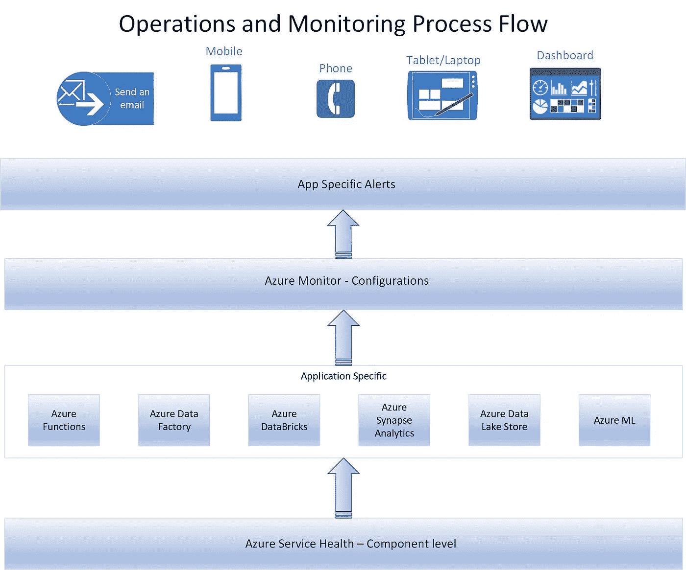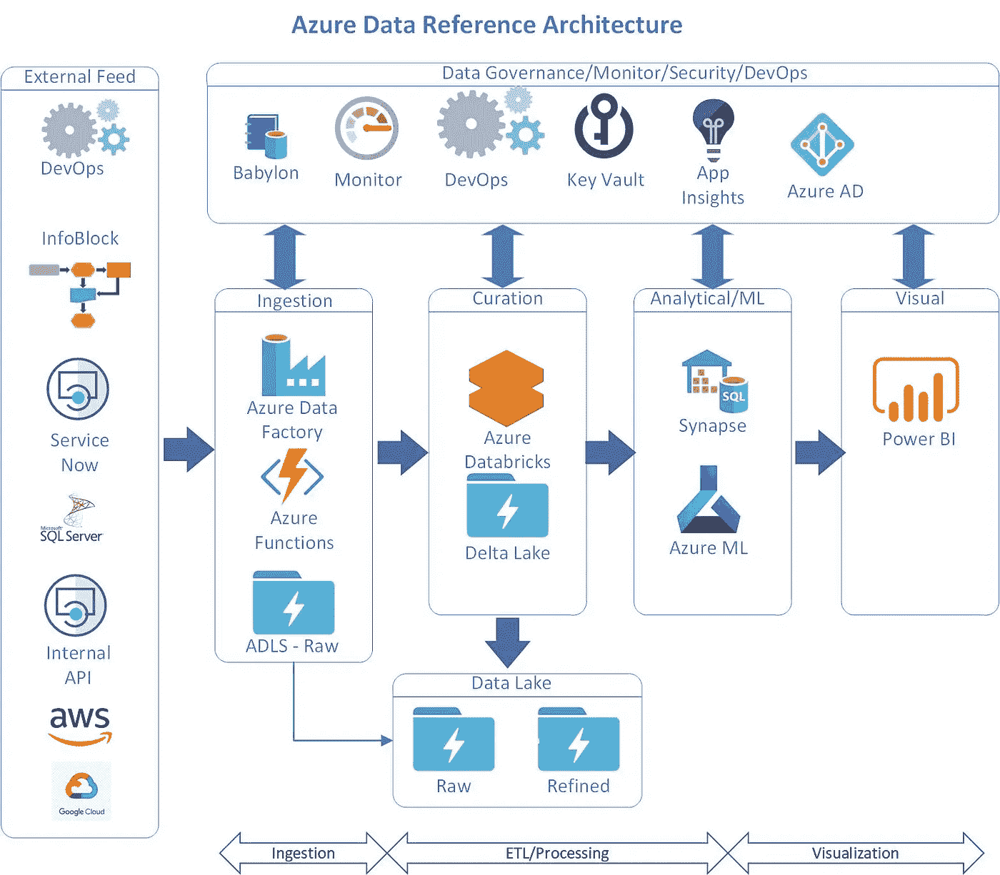

使用日志分析获取所有日志，然后构建一个操作控制面板。还要为单个服务构建多个 dashbaord

*   日志分析仪表板开发人员
*   Kusto 查询知识
*   工作簿创建
*   构建用于监控的 KPI
*   为支持和监控构建运行操作
*   Azure 数据工厂
*   Azure 函数
*   Azure 数据湖商店
*   Azure 数据块
*   Azure 数据块增量
*   Azure 数据工厂
*   Azure 数据工厂—数据流
*   Azure Synapse 分析工作区
*   Azure 机器学习工作区
*   功率 BI
*   Azure DevOps
*   Azure KeyVault
*   应用洞察
*   Azure Synapse 分析—工作区
*   创建一个高级仪表板来查看整个解决方案
*   成功处理的 ETL 作业+成功的数据块作业+可处理的数据可用性=可用性
*   成功作业总数/成功作业总数(ADF) +成功作业总数/成功作业总数(ADB) = SLA
*   ADF ETL 的时间和 ADB 的时间，x 分钟=性能
*   ADF 或 ADB =容量中触发作业失败
*   成本管理
*   作业警报

[https://docs . Microsoft . com/en-us/azure/service-health/service-health-overview](https://docs.microsoft.com/en-us/azure/service-health/service-health-overview)

状态页面:

*   转到 Azure 门户网站
*   搜索服务运行状况
*   单击服务健康资源
*   选择订阅
*   选择部署应用程序的地区
*   选择应用程序的服务
*   另存为并为视图命名。

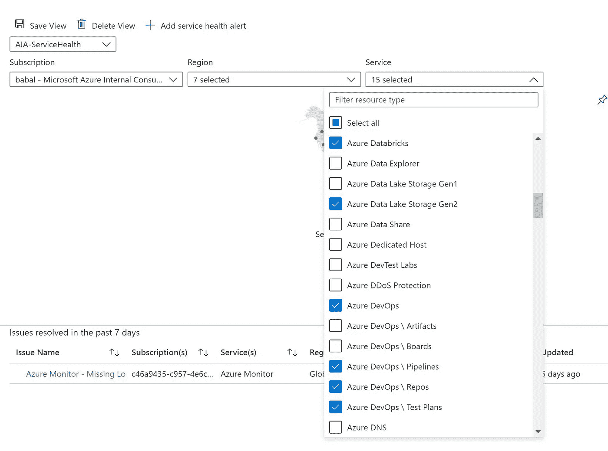

范围要监视的相关指标/事件*要使用的指标/源源监视平台(监视器、日志分析等。)ServiceNow 集成方法(直接或通过其他工具)

*   高水平的 SRE KPI
*   总体总结
*   Azure 数据工厂+ Azure 数据块+ Azure Synapse 分析(SQL DW)
*   由于 Azure Data Factory 是编排引擎，任何端到端的数据处理都可以在这里进行编排
*   因此，对于通过监控 Azure Data factory 进行的数据处理，我们几乎可以涵盖整个数据处理

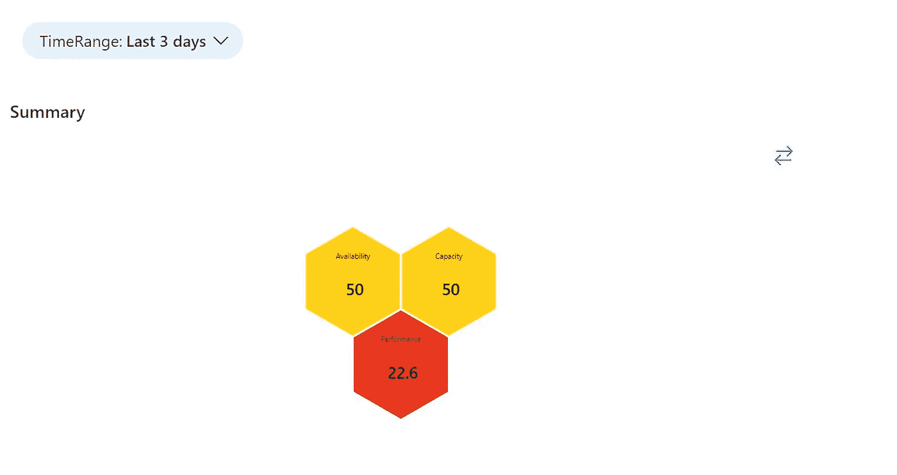

*   服务级别摘要
*   Azure 数据工厂+ Azure 数据块=数据处理
*   Azure Synapse Analytics (SQL DW) =服务/可视化
*   Azure 机器学习=机器学习

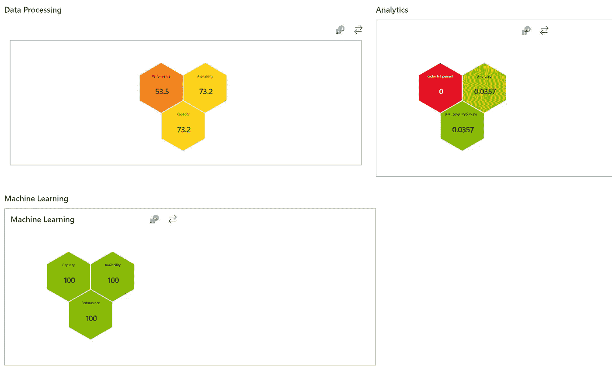

```
let Query1 = view () {
let query3 = view () { 
ADFPipelineRun 
| project Status, Start, End, datetime_diff("Minute",End,Start)
| where Status == "Succeeded" or Status == "Failed" 
| summarize Total = todouble(countif(Status == "Succeeded"))/(todouble(countif(Status == "Succeeded")) + todouble(countif(Status == "Failed"))) * 100
| project sre = 'Availability', Total 
};
let query4 = view () { 
AzureMetrics
| where ResourceProvider == "MICROSOFT.SQL"
| where MetricName == "dwu_consumption_percent"
| summarize Total = avg(Total) by MetricName
| project sre = 'Availability', Total
};
let query5 = view () { 
DatabricksJobs
| project TimeGenerated, ActionName
| where ActionName == "runSucceeded" or ActionName == "runFailed"
| summarize Total = todouble(countif(ActionName == "runSucceeded"))/(todouble(countif(ActionName == "runSucceeded")) + todouble(countif(ActionName == "runFailed"))) * 100 
| project sre = 'Availability', Total
};
union withsource="TempTableName" query3, query4, query5
| summarize Total = avg(Total) by sre
| project sre, Total
};
let Query2 = view () {
let query3 = view () { 
ADFPipelineRun 
| project Start, End, datetime_diff("Minute",End,Start), Status
| where Status == "Succeeded"
| summarize duration=avg(datetime_diff("Minute",End,Start)) by Status
| project sre = "Performance" , Total = (duration/10) * 100
};
let query4 = view () { 
AzureMetrics
| where ResourceProvider == "MICROSOFT.SQL"
| where MetricName == "dwu_used"
| summarize Total = avg(Total) by MetricName
| project sre = 'Performance', Total
};
let query5 = view () { 
DatabricksJobs
| project TimeGenerated, ActionName
| where ActionName == "runSucceeded" or ActionName == "runFailed"
| summarize Total = todouble(countif(ActionName == "runSucceeded"))/(todouble(countif(ActionName == "runSucceeded")) + todouble(countif(ActionName == "runFailed"))) * 100 
| project sre = 'Performance', Total
};
union withsource="TempTableName" query3, query4, query5
| summarize Total = avg(Total) by sre
| project sre, Total
}; 
let Query3 = view () {
let query3 = view () { 
ADFPipelineRun 
| project Status
| where Status == "Succeeded" or Status == "Failed" 
| summarize Total = todouble(countif(Status == "Succeeded"))/(todouble(countif(Status == "Succeeded")) + todouble(countif(Status == "Failed"))) * 100
| project sre = 'Capacity', Total
};
let query4 = view () { 
AzureMetrics
| where ResourceProvider == "MICROSOFT.SQL"
| where MetricName == "cache_hit_percent"
| summarize Total = avg(Total) by MetricName
| project sre = 'Capacity', Total
};
let query5 = view () { 
DatabricksJobs
| project TimeGenerated, ActionName
| where ActionName == "runSucceeded" or ActionName == "runFailed"
| summarize Total = todouble(countif(ActionName == "runSucceeded"))/(todouble(countif(ActionName == "runSucceeded")) + todouble(countif(ActionName == "runFailed"))) * 100 
| project sre = 'Capacity', Total
};
union withsource="TempTableName" query3, query4, query5
| summarize Total = avg(Total) by sre
| project sre, Total
};   
union withsource="TempTableName" Query1, Query2, Query3
| project sre, Total
| order by sre asclet Query1 = view () {
let query3 = view () { 
ADFPipelineRun 
| project Status, Start, End, datetime_diff("Minute",End,Start)
| where Status == "Succeeded" or Status == "Failed" 
| summarize Total = todouble(countif(Status == "Succeeded"))/(todouble(countif(Status == "Succeeded")) + todouble(countif(Status == "Failed"))) * 100 by bin(Start, 1d)
| project sre = 'Availability', TimeVal = Start, Total 
};
let query4 = view () { 
AzureMetrics
| where ResourceProvider == "MICROSOFT.SQL"
| where MetricName == "dwu_consumption_percent"
| summarize Total = avg(Total) by bin(TimeGenerated, 1d)
| project sre = 'Availability', TimeVal = TimeGenerated, Total
};
let query5 = view () { 
DatabricksJobs
| project TimeGenerated, ActionName
| where ActionName == "runSucceeded" or ActionName == "runFailed"
| summarize Total = todouble(countif(ActionName == "runSucceeded"))/(todouble(countif(ActionName == "runSucceeded")) + todouble(countif(ActionName == "runFailed"))) * 100 by bin(TimeGenerated, 1d)
| project sre = 'Availability', TimeVal = TimeGenerated, Total
};
union withsource="TempTableName" query3, query4, query5
| summarize Total = avg(Total) by sre, TimeVal
| project sre, TimeVal, Total
};
let Query2 = view () {
let query3 = view () { 
ADFPipelineRun 
| project Start, End, datetime_diff("Minute",End,Start), Status
| where Status == "Succeeded"
| summarize duration=avg(datetime_diff("Minute",End,Start)) by bin(Start, 1d)
| project sre = "Performance", TimeVal = Start , Total = (duration/10) * 100
};
let query4 = view () { 
AzureMetrics
| where ResourceProvider == "MICROSOFT.SQL"
| where MetricName == "dwu_used"
| summarize Total = avg(Total) by bin(TimeGenerated, 1d)
| project sre = 'Performance', TimeVal = TimeGenerated, Total
};
let query5 = view () { 
DatabricksJobs
| project TimeGenerated, ActionName
| where ActionName == "runSucceeded" or ActionName == "runFailed"
| summarize Total = todouble(countif(ActionName == "runSucceeded"))/(todouble(countif(ActionName == "runSucceeded")) + todouble(countif(ActionName == "runFailed"))) * 100 by bin(TimeGenerated, 1d)
| project sre = 'Performance', TimeVal = TimeGenerated, Total
};
union withsource="TempTableName" query3, query4, query5
| summarize Total = avg(Total) by sre, TimeVal
| project sre, TimeVal, Total
}; 
let Query3 = view () {
let query3 = view () { 
ADFPipelineRun 
| project Status, TimeGenerated
| where Status == "Succeeded" or Status == "Failed" 
| summarize Total = todouble(countif(Status == "Succeeded"))/(todouble(countif(Status == "Succeeded")) + todouble(countif(Status == "Failed"))) * 100 by bin(TimeGenerated, 1d)
| project sre = 'Capacity', TimeVal = TimeGenerated, Total
};
let query4 = view () { 
AzureMetrics
| where ResourceProvider == "MICROSOFT.SQL"
| where MetricName == "cache_hit_percent"
| summarize Total = avg(Total) by bin(TimeGenerated, 1d)
| project sre = 'Capacity', TimeVal = TimeGenerated, Total
};
let query5 = view () { 
DatabricksJobs
| project TimeGenerated, ActionName
| where ActionName == "runSucceeded" or ActionName == "runFailed"
| summarize Total = todouble(countif(ActionName == "runSucceeded"))/(todouble(countif(ActionName == "runSucceeded")) + todouble(countif(ActionName == "runFailed"))) * 100 by bin(TimeGenerated, 1d)
| project sre = 'Capacity', TimeVal = TimeGenerated, Total
};
union withsource="TempTableName" query3, query4, query5
| summarize Total = avg(Total) by sre, TimeVal
| project sre, TimeVal, Total
};   
union withsource="TempTableName" Query1, Query2, Query3
| project sre, TimeVal, Totallet Query1 = view () {
ADFPipelineRun 
| project Status, Start, End, datetime_diff("Minute",End,Start)
| where Status == "Succeeded" or Status == "Failed" 
| summarize Total = todouble(countif(Status == "Succeeded"))/(todouble(countif(Status == "Succeeded")) + todouble(countif(Status == "Failed"))) * 100
| project sre = 'Availability', Total 
};
let Query2 = view () {
ADFPipelineRun 
| project Start, End, datetime_diff("Minute",End,Start), Status
| where Status == "Succeeded"
| summarize duration=avg(datetime_diff("Minute",End,Start)) by Status
| project sre = 'Performance' , Total = (duration/10) * 100
}; 
let Query3 = view () {
ADFPipelineRun 
| project Status
| where Status == "Succeeded" or Status == "Failed" 
| summarize Total = todouble(countif(Status == "Succeeded"))/(todouble(countif(Status == "Succeeded")) + todouble(countif(Status == "Failed"))) * 100
| project sre = 'Capacity', Total
};   
union withsource="TempTableName" Query1, Query2, Query3
| project sre, Total
| order by sre asclet Query1 = view () {
AzureMetrics
| where ResourceProvider == "MICROSOFT.SQL"
| where MetricName == "dwu_consumption_percent"
| summarize Total = avg(Total) by MetricName
| project sre = 'Capacity', Total
};
let Query2 = view () {
AzureMetrics
| where ResourceProvider == "MICROSOFT.SQL"
| where MetricName == "dwu_used"
| summarize Total = avg(Total) by MetricName
| project sre = 'Availability', Total
}; 
let Query3 = view () {
AzureMetrics
| where ResourceProvider == "MICROSOFT.SQL"
| where MetricName == "cache_hit_percent"
| summarize Total = avg(Total) by MetricName
| project sre = 'Performance', Total
};   
union withsource="TempTableName" Query1, Query2, Query3
| project sre, Total = 100-Total
| order by sre asclet Query1 = view () {
AmlRunStatusChangedEvent  
| project Status
| where Status == "Completed" or Status == "Failed" 
| summarize Total = todouble(countif(Status == "Completed"))/(todouble(countif(Status == "Completed")) + todouble(countif(Status == "Failed"))) * 100
| project sre = 'Availability', Total 
};
let Query2 = view () {
AmlRunStatusChangedEvent  
| project Status
| where Status == "Completed" or Status == "Failed" 
| summarize Total = todouble(countif(Status == "Completed"))/(todouble(countif(Status == "Completed")) + todouble(countif(Status == "Failed"))) * 100
| project sre = 'Performance', Total
}; 
let Query3 = view () {
AmlRunStatusChangedEvent  
| project Status
| where Status == "Completed" or Status == "Failed" 
| summarize Total = todouble(countif(Status == "Completed"))/(todouble(countif(Status == "Completed")) + todouble(countif(Status == "Failed"))) * 100
| project sre = 'Capacity', Total
};   
union withsource="TempTableName" Query1, Query2, Query3
| project sre, Total
| order by sre asc
```

*   仪表板构建监控数据生命周期操作
*   Azure 数据工厂和数据块
*   可用性和性能

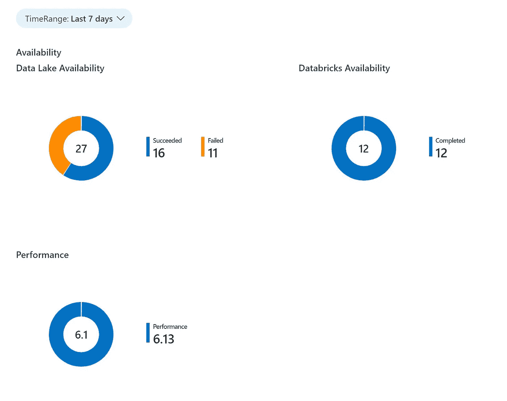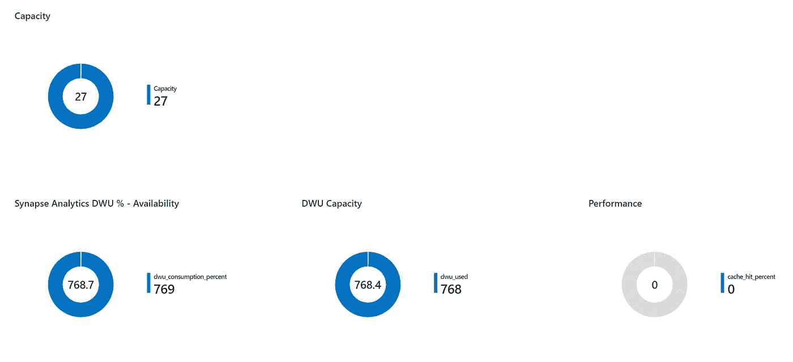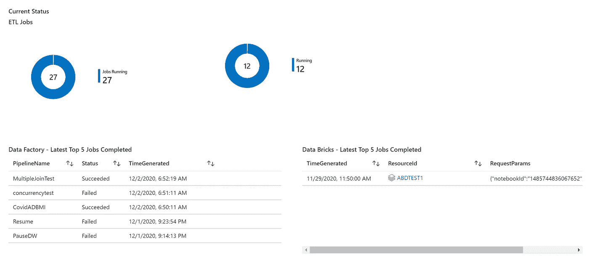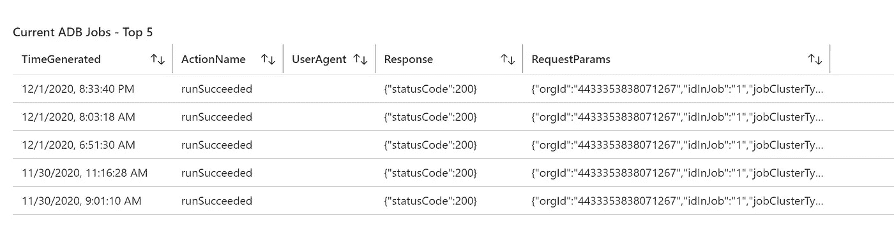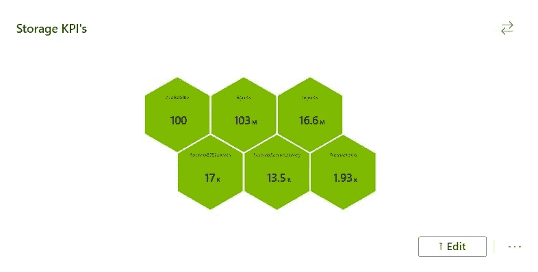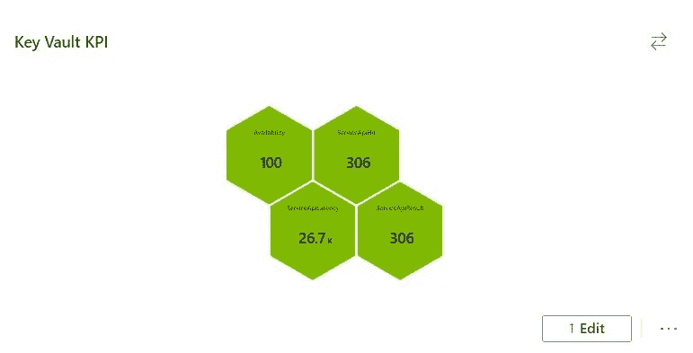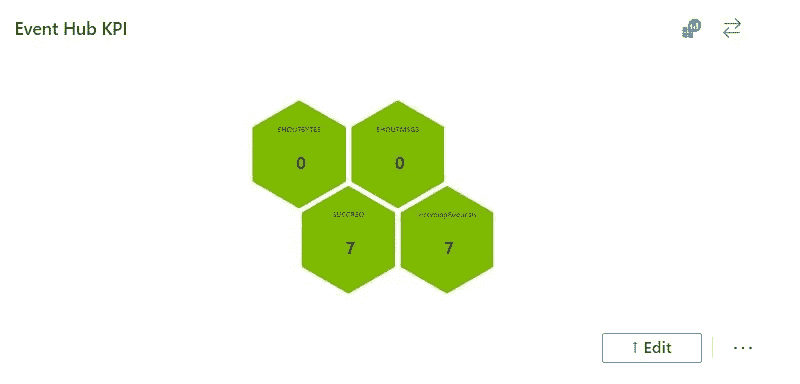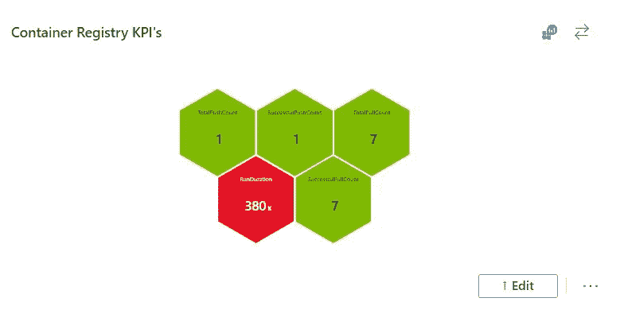

*   Azure Synapse 工作区
*   安装在里面的

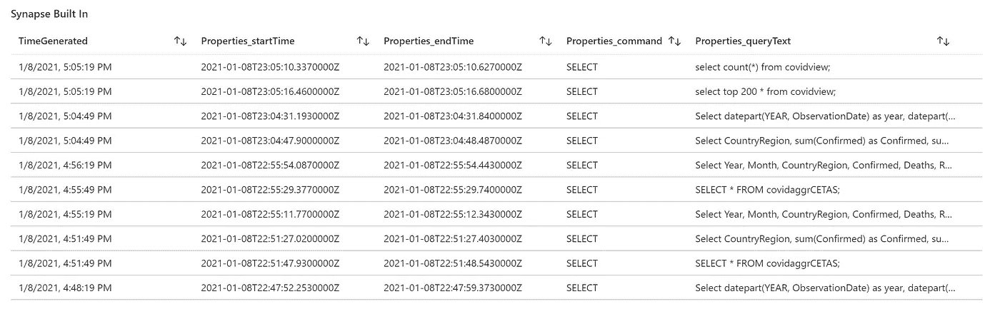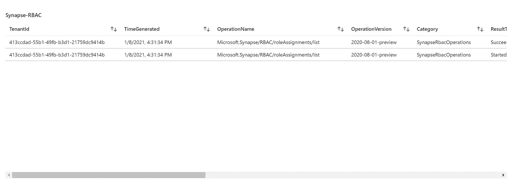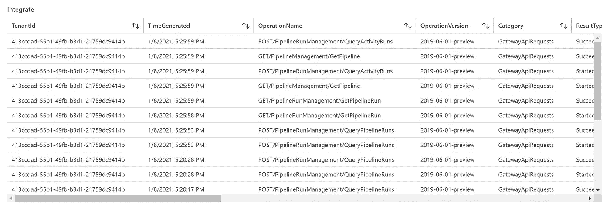

*   数据湖可用性
*   查询 KQL
*   有效性

```
ADFPipelineRun 
| project Status
| where Status contains "Succeeded" or Status contains "Failed" 
| summarize Count=count() by Status
| project Status, Count

DatabricksClusters 
| where RequestParams contains "Terminated"
| summarize Count=count() by RequestParams
| project 'Completed', CountADFPipelineRun 
| project Start, End, datetime_diff("Minute",End,Start), Status
| where Status == "Succeeded"
| summarize duration=avg(datetime_diff("Minute",End,Start)) by Status
| project "Performance" , durationADFPipelineRun
| where Status == "Succeeded" or Status == "Failed"
| summarize Count=count()
| project 'Capacity', CountAzureMetrics
| where ResourceProvider == "MICROSOFT.SQL"
| where MetricName == "dwu_consumption_percent"
| summarize sum(Total) by MetricName

AzureMetrics
| where ResourceProvider == "MICROSOFT.SQL"
| where MetricName == "dwu_used"
| summarize sum(Total) by MetricName

AzureMetrics
| where ResourceProvider == "MICROSOFT.SQL"
| where MetricName == "cache_hit_percent"
| summarize avg(Total) by MetricNameADFPipelineRun 
| where OperationName contains "InProgress"
| summarize Count=count()
| project 'Jobs Running', Count

DatabricksClusters 
| where RequestParams contains "Running"
| summarize Count=count() by RequestParams
| project 'Running', CountADFPipelineRun
| where Status  contains "Succeeded" or Status contains "Failed"
| order by TimeGenerated desc 
| project PipelineName, Status, TimeGenerated
| limit 5

DatabricksNotebook 
| project TimeGenerated, ResourceId, RequestParams
| order by TimeGenerated desc 
| limit 5DatabricksJobs 
| project TimeGenerated, ActionName, UserAgent, Response, RequestParams
| where ActionName == "runSucceeded"
| order by TimeGenerated desc
| limit 5let Query1 = view () {
AzureMetrics
| project MetricName, Average, Total, TimeGenerated, ResourceProvider
| where ResourceProvider == "MICROSOFT.STORAGE" and MetricName == "Availability"
| summarize Total = avg(Average) by MetricName
| project MetricName, Total
};
let Query2 = view () {
AzureMetrics
| project MetricName, Average, Total, TimeGenerated, ResourceProvider
| where ResourceProvider == "MICROSOFT.STORAGE" and MetricName != "Availability"
| summarize Total = sum(Total) by MetricName
| project MetricName, Total
}; 
union withsource="TempTableName" Query1, Query2
| project MetricName, Total
| order by MetricName asclet Query1 = view () {
AzureMetrics
| project MetricName, Average, Total, TimeGenerated, ResourceProvider
| where ResourceProvider == "MICROSOFT.KEYVAULT" and MetricName == "Availability"
| summarize Total = avg(Average) by MetricName
| project MetricName, Total = (Total * 100)
| order by MetricName asc 
};
let Query2 = view () {
AzureMetrics
| project MetricName, Average, Total, TimeGenerated, ResourceProvider
| where ResourceProvider == "MICROSOFT.KEYVAULT" and MetricName != "Availability" and MetricName != "ServiceApiLatency"
| summarize Total = sum(Total) by MetricName
| project MetricName, Total
}; 
let Query3 = view () {
AzureMetrics
| project MetricName, Average, Total, TimeGenerated, ResourceProvider
| where ResourceProvider == "MICROSOFT.KEYVAULT" and MetricName == "ServiceApiLatency"
| summarize Total = sum(Total) by MetricName
| project MetricName, Total
};
union withsource="TempTableName" Query1, Query2, Query3
| project MetricName, Total
| order by MetricName ascAzureMetrics
| project MetricName, Average, Total, TimeGenerated, ResourceProvider
| where ResourceProvider == "MICROSOFT.EVENTHUB"
| summarize Total = sum(Total) by MetricNameAzureMetrics
| project MetricName, Average, Total, TimeGenerated, ResourceProvider
| where ResourceProvider == "MICROSOFT.CONTAINERREGISTRY"
| summarize Total = sum(Total) by MetricNameStorageBlobLogs 
| project TimeGenerated, AccountName, OperationName, StatusCode, DurationMs, ServerLatencyMs

StorageBlobLogs 
| project TimeGenerated, AccountName, OperationName, StatusCode, DurationMs, ServerLatencyMs
| summarize DurationMs=avg(DurationMs), ServerLatencyMs=avg(ServerLatencyMs) by OperationName
```

*   Azure Synapse 分析工作区 KPI
*   工作空间数据、集成、spark 和内置 sql 和 sql 池
*   缺失内置 sql 指标

```
SynapseBigDataPoolApplicationsEnded 

SynapseBigDataPoolApplicationsEnded
| project TimeGenerated, Properties.startTime, Properties.endTime, Properties.applicationName, Properties.livyState, minute = datetime_diff('minute',todatetime(Properties.endTime), todatetime(Properties.startTime))

SynapseSqlPoolDmsWorkers 

SynapseSqlPoolExecRequests 

SynapseSqlPoolExecRequests 
| project TimeGenerated, OperationName , Status, StartTime, EndTime ,minute = datetime_diff('day',todatetime(EndTime), todatetime(StartTime))

SynapseSqlPoolRequestSteps 

SynapseSqlPoolRequestSteps 
| project TimeGenerated, Status, StartTime, EndTime, Command

SynapseSqlPoolSqlRequests 

SynapseSqlPoolSqlRequests
| project TimeGenerated, Status, StartTime, EndTime, Command

SynapseBuiltinSqlPoolRequestsEnded 

SynapseBuiltinSqlPoolRequestsEnded 
| project TimeGenerated, Properties.startTime, Properties.endTime, Properties.command, Properties.queryText
| sort by TimeGenerated desc 
| limit 10

SynapseRbacOperations 
| sort by TimeGenerated desc
| limit 10

SynapseGatewayApiRequests 
| sort by TimeGenerated desc
| limit 20
```

*   基于每个服务
*   监控什么
*   活动失败
*   管道故障运行
*   TriggerFailedRuns
*   SSISIntegrationRuntimeStartFailed 失败
*   管道成功运行
*   有效性
*   数据工厂的可用性就像完成的任务和失败的任务。例如，运行了 100 个作业，10 个失败，因此可用性为 90%。这是用于作业操作的。我相信 PipelineSucceededRuns 和 PipelineFailedRuns 可以提供这些细节来计算公式。
*   Azure Datafactory 服务的正常运行时间显示在 Azure 服务可用性仪表板中。
*   数据流的度量包括接收器处理时间、写入每个接收器的行数和从每个源读取的行数。更多信息可在[这里](https://docs.microsoft.com/en-us/azure/data-factory/concepts-data-flow-monitoring)找到。

```
ADFActivityRun 
| where  OperationName == "dataflow1 - Succeeded"
```

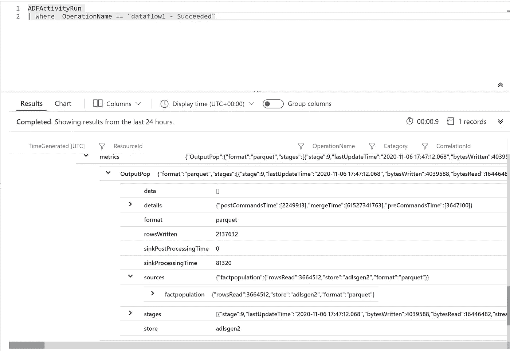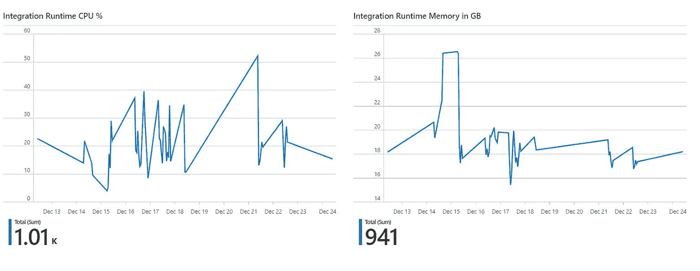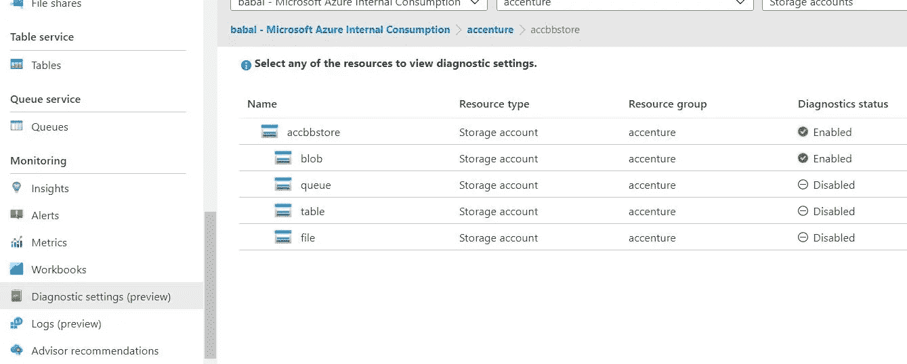

```
let Query1 = view () {
AzureMetrics
| project MetricName, Average, Total, TimeGenerated, ResourceProvider
| where ResourceProvider == "MICROSOFT.STORAGE" and MetricName == "Availability"
| summarize Total = avg(Average) by MetricName
| project MetricName, Total
};
let Query2 = view () {
AzureMetrics
| project MetricName, Average, Total, TimeGenerated, ResourceProvider
| where ResourceProvider == "MICROSOFT.STORAGE" and MetricName != "Availability"
| summarize Total = sum(Total) by MetricName
| project MetricName, Total
}; 
union withsource="TempTableName" Query1, Query2
| project MetricName, Total
| order by MetricName asc
```

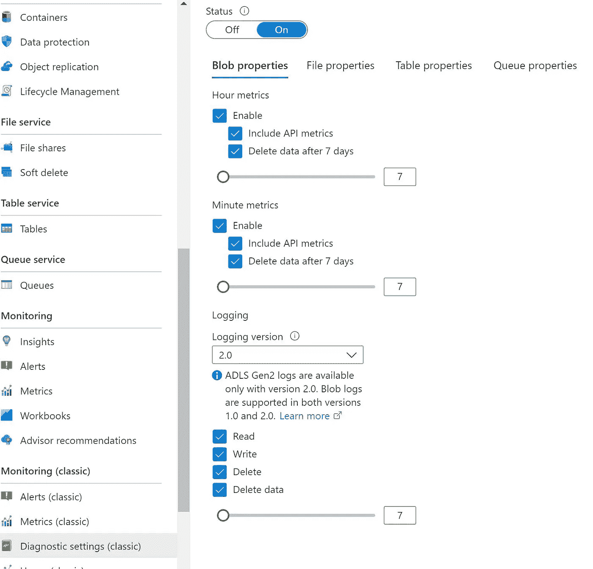

[https://github . com/balakreshnan/Accenture/blob/master/cap/adlscontainersize . MD](https://github.com/balakreshnan/Accenture/blob/master/cap/ADLScontainerSize.md)

[https://github . com/balakreshnan/Accenture/blob/master/cap/sparkadlslogview . MD](https://github.com/balakreshnan/Accenture/blob/master/cap/SparkADLSlogview.md)

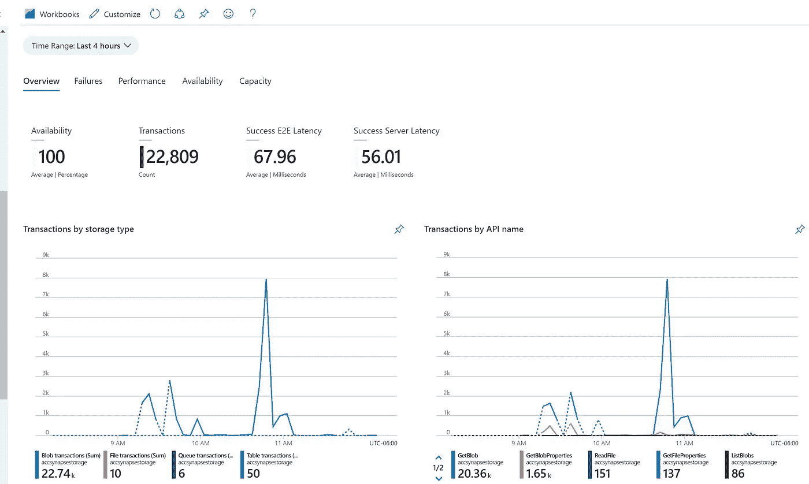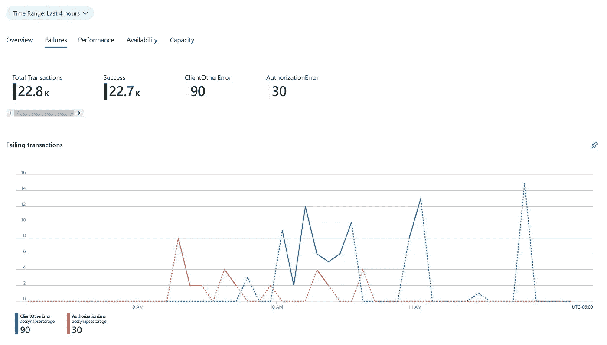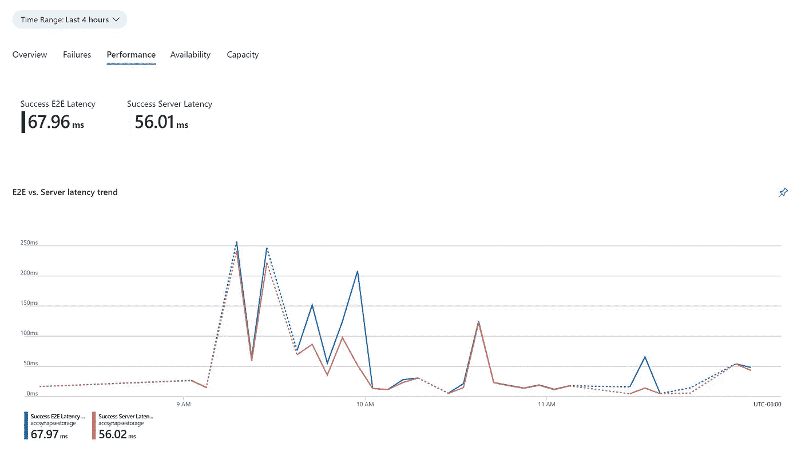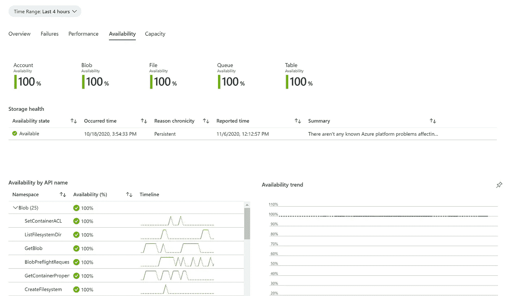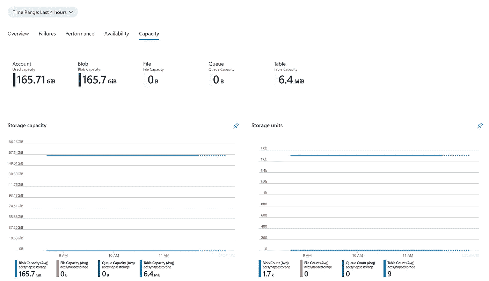

*   失败的请求
*   服务器响应时间
*   服务器请求
*   可用性
*   代码错误必须更新到 application insights 中，以构建自定义仪表板。
*   容量

```
import json 
import pandas as pd 
from pandas.io.json import json_normalize

end_point = '/api/2.0/jobs/runs/list?limit=50'

response = requests.get(
  DOMAIN + end_point,
  headers={'Authorization': 'Bearer ' + TOKEN}
 )
data = response.json()
pdf = json_normalize(data['runs'])
pdf.to_csv("/dbfs/tmp/Export_data.csv",index=False)
df = spark.read.csv("/tmp/Export_data.csv")
jobs = (df.filter("_c0<>'job_id'")
       .select(col("_c0").alias("job_id"),
               col("_c1").alias("run_id"),
               col("_c4").alias("start_time_unix"),
               col("_c5").alias("setup_duration"),
               col("_c6").alias("execution_duration"),
               col("_c7").alias("cleanup_duration"),
               col("_c8").alias("trigger"),
               col("_c10").alias("run_name"),
               col("_c12").alias("run_type"),
               col("_c16").alias("schedule"),
               col("_c19").alias("notebook"),
               col("_c27").alias("cluster_id"),
               col("_c26").alias("libraries"))
          )

jobs.createOrReplaceTempView("jobs")
display(jobs)
```

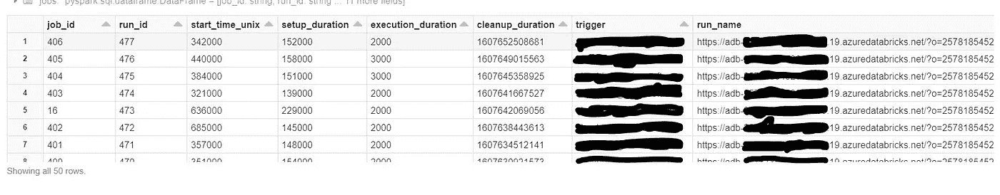

*   CPU 百分比—可用性
*   数据 IO 百分比
*   记忆百分比
*   DWU 百分比—容量
*   本地温度百分比
*   排队查询
*   DWU 百分比是一个很好的观察，因为更多的 DWU 使用性能将下降(容量)。
*   计算(DWU 百分比/DWU 限制)* 100 将给出容量。
*   DWU 极限-DWU 百分比-将给出可用性。
*   平均排队查询—性能
*   工作簿根据顶部设置的时间范围进行过滤

```
ADFPipelineRun 
| where OperationName contains "Queued" or OperationName contains "Succeeded"

// count of Job Queued

ADFPipelineRun 
| project Status
| where Status contains "Succeeded" or Status contains "Failed" 
| summarize Count=count() by Status
| project Status, Count

ADFPipelineRun 
| project Start, End, datetime_diff("Minute",End,Start), Status
| where Status == "Succeeded"
| summarize duration=avg(datetime_diff("Minute",End,Start))

ADFPipelineRun
| where Status == "Succeeded" or Status == "Failed"

ADFPipelineRun
| where Status == "Succeeded" or Status == "Failed"
| summarize Count=count()
| project 'Capacity', Count

ADFPipelineRun 
| where OperationName contains "Queued"
| where TimeGenerated > ago(62d)
| summarize count()

//Count of Jobs in Progress
ADFPipelineRun 
| where OperationName contains "InProgress"
| where TimeGenerated > ago(62d)
| summarize count()

//count of job succeeded
ADFPipelineRun 
| where OperationName contains "Succeeded"
| where TimeGenerated > ago(62d)
| summarize count()

//top 10 pipeline in progress
ADFPipelineRun
| where OperationName  contains "InProgress"
| where TimeGenerated > ago(62d)
| order by TimeGenerated desc 
| limit 10

//top 10 pipeline in progress
ADFPipelineRun
| where OperationName  contains "Succeeded"
| where TimeGenerated > ago(62d)
| order by TimeGenerated desc 
| limit 10

//Pipeline runs and count over time period
ADFPipelineRun
| project TimeGenerated, OperationName
| where TimeGenerated > ago(62d)
| order by TimeGenerated desc 
| summarize Count=count() by OperationName

DatabricksNotebook 

DatabricksClusters 

//Cluster succeeded
DatabricksClusters
| where OperationName contains "startResult" and Response contains "200"
| where TimeGenerated > ago(62d)

//cluster failure
DatabricksClusters
| where OperationName contains "startResult" and Response !contains "200"
| where TimeGenerated > ago(62d)

DatabricksClusters 
| project RequestParams
| where RequestParams contains "Running"

DatabricksClusters 
| project RequestParams
| where RequestParams contains "Terminated"

DatabricksClusters 
| project RequestParams
| where RequestParams contains "Failed"

//cluster running count
DatabricksClusters 
| where RequestParams contains "Running"
| where TimeGenerated > ago(62d)
| summarize count()

//Clusters that got terminated
DatabricksClusters 
| where RequestParams contains "Terminated"
| where TimeGenerated > ago(62d)
| summarize count()

//clusters that failed
DatabricksClusters 
| where RequestParams contains "Failed"
| where TimeGenerated > ago(62d)
| summarize count()

//List of notebooks ran
DatabricksNotebook 
| where TimeGenerated > ago(31d)
| order by TimeGenerated desc 

//Current Top 20 notebooks
DatabricksNotebook 
| project TimeGenerated, RequestParams
| where TimeGenerated > ago(31d)
| order by TimeGenerated desc 
| limit 10

AzureDiagnostics
| where ResourceProvider == "MICROSOFT.SQL"
| where TimeGenerated > ago(62d)
| limit 1000

AzureMetrics
| where ResourceProvider == "MICROSOFT.SQL"
| where TimeGenerated > ago(62d)
| summarize avg(Total) by MetricName

//display consumption used
AzureMetrics
| where ResourceProvider == "MICROSOFT.SQL"
| where TimeGenerated > ago(62d)
| where MetricName contains "dtu_consumption_percent"
| summarize avg(Total) by MetricName

//Average storaged used
AzureMetrics
| where ResourceProvider == "MICROSOFT.SQL"
| where TimeGenerated > ago(62d)
| where MetricName == "storage"
| summarize Total=avg(Total) by MetricName

//Failed connection
AzureMetrics
| where ResourceProvider == "MICROSOFT.SQL"
| where TimeGenerated > ago(62d)
| where MetricName == "connection_failed"
| summarize Total=avg(Total) by MetricName

AzureMetrics
| where ResourceProvider == "MICROSOFT.SQL"
| where TimeGenerated > ago(62d)
| where MetricName == "dtu_used"
| summarize Total=avg(Total) by MetricName

//active connection session percent
AzureMetrics
| where ResourceProvider == "MICROSOFT.SQL"
| where TimeGenerated > ago(62d)
| where MetricName == "sessions_percent"
| summarize Total=avg(Total) by MetricName

//Data Stored
AzureMetrics
| where ResourceProvider == "MICROSOFT.SQL"
| where TimeGenerated > ago(62d)
| where MetricName == "allocated_data_storage"
| summarize Total=avg(Total) by MetricName

//DWU used by synapse analytics
AzureMetrics
| where ResourceProvider == "MICROSOFT.SQL"
| where TimeGenerated > ago(62d)
| where MetricName == "dwu_used"
| summarize Total=avg(Total) by MetricName

//Get query status
AzureDiagnostics
| where ResourceProvider == "MICROSOFT.SQL"
| where Category contains "QueryStoreRuntimeStatistics"
| where TimeGenerated > ago(62d)
| limit 1000

//Audit logs for Azure KeyVault
AzureDiagnostics
| where ResourceProvider == "MICROSOFT.KEYVAULT"
| where TimeGenerated > ago(62d)
| limit 1000

AzureMetrics
| where ResourceProvider == "MICROSOFT.SQL"
| where MetricName == "dwu_consumption_percent"
| summarize sum(Total) by MetricName

AzureMetrics
| where ResourceProvider == "MICROSOFT.SQL"
| where MetricName == "dwu_used"
| summarize sum(Total) by MetricName

AzureMetrics
| where ResourceProvider == "MICROSOFT.SQL"
| where MetricName == "cache_hit_percent"
| summarize avg(Total) by MetricNameDatabricksClusters
| limit 100 

DatabricksNotebook
| limit 1000

ADFPipelineRun
| limit 100

AmlComputeClusterEvent
| limit 1000

Alert
| limit 1000

AzureDiagnostics
| limit 1000

AzureDiagnostics
| where ResourceProvider == "MICROSOFT.SQL"
| limit 1000

Usage
| limit 1000

Usage
| summarize sum(Quantity) by DataType
| limit 1000

AzureMetrics
| limit 1000

AzureMetrics
| where ResourceProvider == "MICROSOFT.SQL"
| summarize avg(Average) by MetricName

DatabricksAccounts
| limit 1000

ADFActivityRun
| limit 100

SynapseBigDataPoolApplicationsEnded 

SynapseSqlPoolDmsWorkers 

SynapseSqlPoolExecRequests 

SynapseSqlPoolRequestSteps 

SynapseSqlPoolSqlRequests 

StorageBlobLogs
```

# 可以通过审计日志或活动日志来访问用户活动

*   审核日志(需要全局管理员权限)—可通过 [Office 365 Securirt &合规中心](https://login.microsoftonline.com/common/oauth2/authorize?client_id=80ccca67-54bd-44ab-8625-4b79c4dc7775&response_mode=form_post&response_type=code+id_token&scope=openid+profile&state=OpenIdConnect.AuthenticationProperties%3dWRK9KZQqQFYyvDJMx2gsCDvNRAXsW_yPWi6mVSfpkFHUoKnolNp2G_zAs_3qT8tpiIEvZVEdD0KKLgP9PO1-CKla2nlIeBSEViJeMsDHGpstT9Nh5JuAM3v-kXs3ePi2D_tBoctidZfql5oVsud9iQ&nonce=637402999850476896.YjdkZWMzNDUtNjgwNS00NDZiLTk2YTktOTJlZjAyZDdjYmQ5YzZjMWY0YmYtZGUwZi00ZmMzLTk2ODItZmQ4ZDYwZWY3MzM2&redirect_uri=https%3a%2f%2fsip.protection.office.com%2f&sso_nonce=AQABAAAAAAB2UyzwtQEKR7-rWbgdcBZI15x292ADpHdlvN0n9XD4R-rlvhfX4kYgbGSwB1x7famWSCY260PTbf-mxRtnFc_zjTx0MZGLV-_mKp9iCKx6OCAA&client-request-id=30cc94a0-8550-490c-ac91-4a26a579f591&mscrid=30cc94a0-8550-490c-ac91-4a26a579f591#/unifiedauditlog)获得
*   Power BI 活动日志(需要 Power BI 服务管理员或全局管理员权限)—Power BI REST API 可用于生成类似于以下请求的活动事件。更多信息可在[这里](https://docs.microsoft.com/en-us/power-bi/admin/service-admin-auditing#activity-log-requirements)找到

```
[https://api.powerbi.com/v1.0/myorg/admin/activityevents?startDateTime='2019-08-31T00:00:00'&endDateTime='2019-08-31T23:59:59](https://api.powerbi.com/v1.0/myorg/admin/activityevents?startDateTime='2019-08-31T00:00:00'&endDateTime='2019-08-31T23:59:59)
```

*   已创建电源 BI 报告
*   已创建电源 BI 数据集
*   请求的 Power BI 数据集刷新
*   完整名单可以在[这里找到](https://docs.microsoft.com/en-us/power-bi/admin/service-admin-auditing#operations-available-in-the-audit-and-activity-logs)

# 通过管理门户和容量指标应用程序监控高级容量

*   概述—应用程序版本、容量和工作空间数量
*   系统摘要—内存和 CPU 指标
*   数据集摘要—数据集数量、DQ/LC、刷新和查询指标
*   数据流摘要—数据流数量和数据集指标
*   分页报告摘要—刷新和查看指标

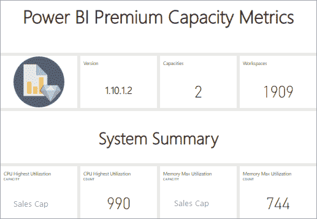

*   创建一个专业团队
*   创建一个组织
*   创建运行手册
*   设计和开发运行操作手册
*   提供上报流程
*   自动化支持相关问题

贡献者

*   巴拉穆鲁甘·巴拉克雷什南
*   罗伯特·诺托里
*   凯特·托马斯
*   亚伯拉罕·帕巴蒂
*   托尼奥·洛拉
*   马特·鲁玛
*   迪·库马尔

【https://github.com】最初发表于[](https://github.com/balakreshnan/Accenture/blob/master/cap/dataops.md)**。**