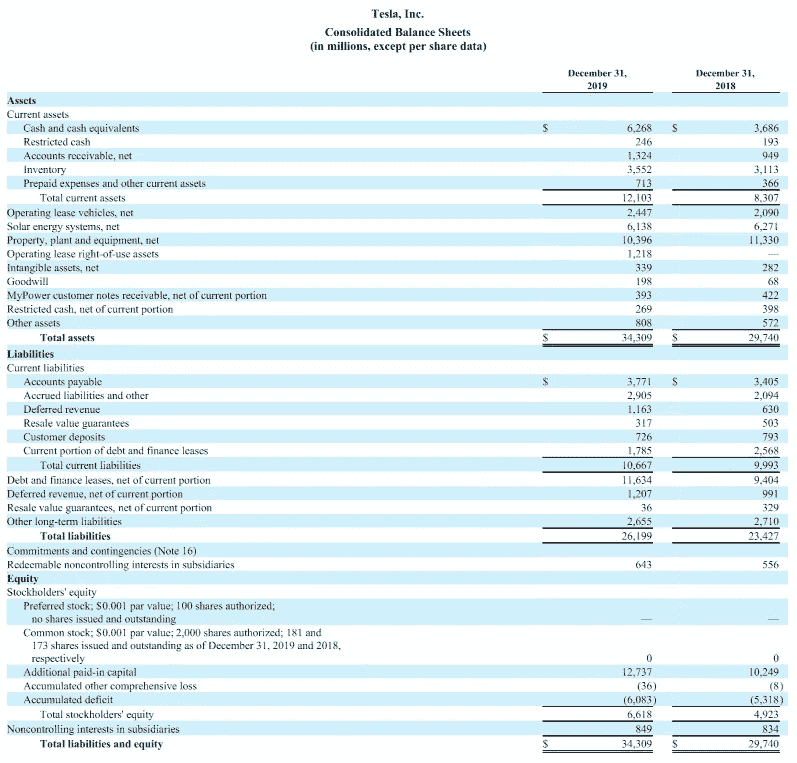

# 用 Python 分析特斯拉的资产负债表

> 原文：<https://medium.com/analytics-vidhya/analyze-teslas-balance-sheet-with-python-94773133c301?source=collection_archive---------4----------------------->

## 让我们一起来回顾一下 tech 吧！


由[弗拉德·乔姆帕洛夫](https://unsplash.com/@tchompalov?utm_source=medium&utm_medium=referral)在 [Unsplash](https://unsplash.com?utm_source=medium&utm_medium=referral) 拍摄的照片

## 介绍

特斯拉汽车公司(对于那些生活在岩石下的人来说)是一家电动汽车公司，于 2010 年 6 月 29 日上市。自从首次公开募股以来，特斯拉的股价一直是金融界许多有趣时刻的中心。从埃隆·马斯克(特斯拉首席执行官)[开玩笑地出售“空头”](https://www.businessinsider.nl/elon-musk-sells-red-satin-tesla-short-shorts-2020-7?international=true&r=US)到嘲笑华尔街的卖空者，再到埃隆·马斯克自己说[特斯拉的股票在他看来定价过高](https://www.businessinsider.nl/elon-musk-sells-red-satin-tesla-short-shorts-2020-7?international=true&r=US)。

好吧，让我们来测试一下最后一句话吧！由于特斯拉是一家上市公司，他们所有的财务报表都必须向公众公开。这意味着特斯拉的财务数据可以用 Python 使用 [fibooks](https://pypi.org/project/fibooks/) 进行分析，这是一个专门为财务报表分析而制作的 Python 库。对于那些 fibooks 新手，请阅读我以前关于这个库的文章，其中解释了基础知识。对于已经知道 fibooks 的人；我们开始吧！

[](/analytics-vidhya/start-accounting-in-python-433324e5eb34) [## 开始用 Python 记账

### 一个伟大的领域，一种伟大的编程语言

medium.com](/analytics-vidhya/start-accounting-in-python-433324e5eb34) 

## 获取数据

如前所述，特斯拉的资产负债表是公开的(见下图)。然而，要将这些数据加载到 Python 中，我们需要或者手动将它插入到每个条目中(这非常繁琐)*或者*将其作为 json 文件导入。

最后一个选项只有在包含特斯拉资产负债表的 json 文件可用时才有可能。幸运的是，fibooks 有一个用户社区，他们一直在上传 json 文件。本文对应的 json 文件也可以在这里下载[。](https://gist.github.com/TimoKats/b74246f4a43b7780bb5539aa6e73423f)

然而，为了实际使用和分析这些数据，您需要通过`import_json(filename)`函数将其下载并导入到资产负债表对象中。下面给出了对应于该操作的 Python 代码。

```
**>>> from** fibooks **import** balance_sheet

**>>>** tesla2018 = balance_sheet(**'tesla in 2018'**)
**>>>** tesla2018.import_json(**'tesla2018.json'**)
**>>>** tesla2018.make()

**>>>** tesla2019 = balance_sheet(**'tesla in 2019'**)
**>>>** tesla2019.import_json(**'tesla2019.json'**)
**>>>** tesla2019.make()
```

该代码片段随后加载的数据来自下面的资产负债表。



特斯拉汽车 2019 年和 2018 年的资产负债表

## 分析数据

既然数据已经加载，我们可以开始分析它了。对于财务报表分析来说，有一些比率可以让我们对公司的财务表现有所了解。Fibooks 通过`compute`类内置了很多这样的比率。

在这个例子中，我们将计算一个称为“债务资本比率”的杠杆比率和一个称为“现金比率”的流动性比率。通过这样做，我们可以了解特斯拉与行业标准相比的现状，以及特斯拉 2019 年的财务表现与 2018 年相比有何变化。

先来计算一下 2018 年和 2019 年的现金比例。为此，只需导入 compute 类并使用内置的 cash ratio 函数。该函数将资产负债表作为参数，并自动计算比率作为结果。

```
**>>> import** compute **>>>** compute.cash_ratio(**tesla2018**)
0.37
**>>>** compute.cash_ratio(**tesla2019**)
0.59
```

该代码输出 2018 年的现金比率为 0.37，2019 年为 0.59。该指标的首选行业标准[范围从 0.5 到 1](https://corporatefinanceinstitute.com/resources/knowledge/finance/cash-ratio-formula/#:~:text=There%20is%20no%20ideal%20figure%2C%20but%20a%20ratio%20of%20at,hold%20large%20amounts%20of%20cash.) 。这意味着特斯拉在当年已经认真提高了他们的现金比例，现在符合行业标准。为了进一步分析，让我们也计算两年的债务资本比率。

```
**>>>** compute.debt_to_capital_ratio**(tesla2018**)
0.79
**>>>** compute.debt_to_capital_ratio(**tesla2019**)
0.76
```

这段代码片段的输出显示的是，特斯拉的债务资本比在那一年没有太大变化。事实上，与行业标准的 40%相比，特斯拉的杠杆率也相当高。然而，对于较年轻的公司来说，杠杆率高一点是正常的，这一指标的趋势似乎是向下的(这是一件好事)。因此，这里没有真正的危险信号。

## 最后的话

本文希望展示在您的财务报表分析中实现 Python 是多么简单。这篇文章**绝对不是给**提供投资建议的。本文中特斯拉的用法纯粹是作为一个例子。

对于那些想试验代码和 fibooks 提供的所有其他选项的人来说，可以自由地这样做。本文中使用的源代码和数据在下面的列表中给出。