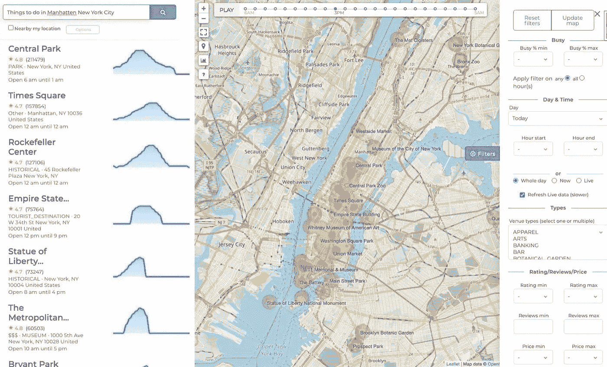
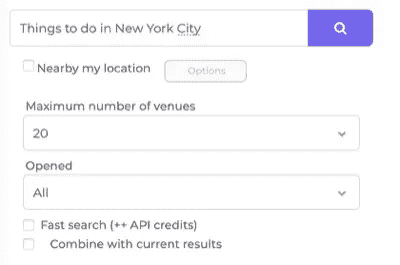
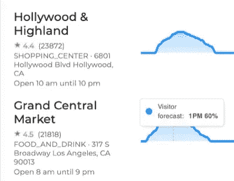
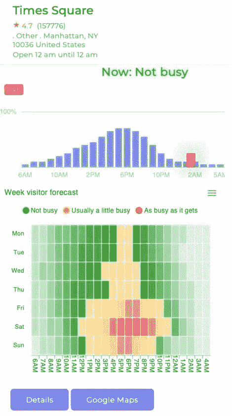
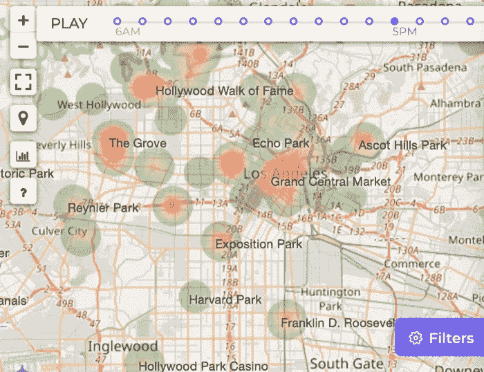
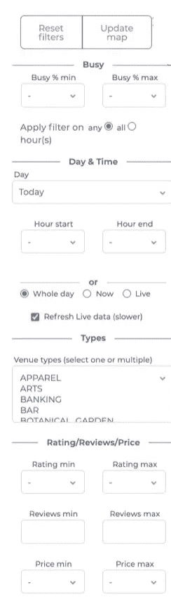

# 通过分析全球步行交通数据，成为房间里最聪明的人

> 原文：<https://medium.com/analytics-vidhya/analyze-venue-foot-traffic-around-the-world-software-api-9156db71620f?source=collection_archive---------8----------------------->

在一个城市里，有很多方法可以找到你想要的东西，但并不是所有的方法都能发挥应有的作用。本文讨论了如何利用客流量数据成为房间里最聪明的人。使用该工具，您可以搜索和过滤全球场馆客流量数据，以便找到满足您需求的最佳场馆。无论是寻找周五晚上去哪里，在不太忙的时候去杂货店，提高数字户外广告的效率，还是研究移动趋势，这都可能是你的工具。

BestTime.app 步行交通 API 搜索场馆步行交通，并过滤步行交通强度、日期、时间、位置、类型、评级等-作者提供的来自 BestTime.app 的截图

使用雷达工具中的 BestTime.app [Venue Search，您将能够过滤游客高峰、日期/时间、地理区域、商业类型、评论、评级和价格水平的客流量数据。例如，“旧金山繁忙的酒吧，星期五晚上”，“安静的超市，悉尼，澳大利亚，星期天，从早上 8 点到 11 点”，或者“纽约市要做的事情”。](https://besttime.app/demo/radar?radius=41770&lat=40.74&lng=-73.91&map_lat=40.74&map_lng=-73.91&map_z=12q=things+to+do+in+new+york+city)  数据也可以通过 BestTime.app 软件 API 获得。

在本教程中，我们将描述场地搜索和雷达工具的一般工作原理，而不考虑任何用例。在未来的教程中，我们将描述如何使用 API 和用例特定的版本来使用这个工具。对于这个教程，你需要一个[免费的 BestTime.app 账户](https://besttime.app/signup)来开始，但是需要一个[付费订阅](https://besttime.app/subscription/pricing#pricing)来分析更大容量的步行数据。免费账户只包含 100 [API 积分](https://documentation.besttime.app/?python#new-foot-traffic-forecast)。您也可以使用[免费演示](https://besttime.app/demo/radar?map_lat=40.73&map_lng=-73.97&map_z=13&lat=40.73&lng=-73.97&radius=19926)而无需注册，但并非所有功能都包括在内，并且仅限于每天几次搜索。

BestTime 快速入门。 [BestTime.app](https://besttime.app/) 是一家数据分析公司，为 150 多个国家的场馆提供即时客流量数据。

*   **预测**一周中大多数游客会在什么时候来到某个场所(如商店、酒吧、景点、健身房或餐厅)。
*   **实时**更新场馆的繁忙程度(实时)。
*   **根据类别(如伦敦的超市)或名称(如旧金山的麦当劳)搜索**场馆客流量。
*   **根据游客高峰、日期、时间和业务类型过滤整个区域的场馆。**
*   **使用 developer REST-API 将所有数据直接集成到您的应用/研究中。**

你可以将它与一个超级强大的 four square/Google Popular Times API 进行比较，后者具有更多的人流量数据分析功能。

# 添加新数据

我们首先打开 BestTime.app [雷达工具](https://besttime.app/api/v1/radar/filter)。Radar 工具用于过滤用户自己已经添加到 BestTime 的场馆。如果你没有使用过 BestTime 之前，雷达工具将显示一个空的地图。你可以在 BestTime 上添加有步行交通的场馆，具体方法是通过名称和地址添加场馆(使用预测[工具](https://besttime.app/api/v1/forecast) / [API](https://documentation.besttime.app/?python#new-foot-traffic-forecast) )，使用[添加区域](https://besttime.app/api/v1/addarea)工具，或者使用场馆搜索[工具](https://besttime.app/api/v1/searchvenues) / [API](https://documentation.besttime.app/?python#venue-search) ，我们现在将讨论这些。

BestTime.app 步行交通 API 搜索场馆步行交通，并对其进行过滤步行交通强度、日期、时间、位置、类型、评级等-图片由作者提供，截图来自 BestTime.app-截图来自 best time . app 由作者提供

使用屏幕左上角的场馆搜索栏添加新的场馆客流量。例如“纽约市要做的事情”或“旧金山的酒吧”。或者，您也可以通过点击“我的位置附近”并结合搜索查询(如“酒吧”)来查找附近的场馆。您的浏览器可能会显示共享位置权限弹出窗口。然后，地点搜索工具将使用您的浏览器提供的估计位置(地理坐标)来查找您附近的地点。

点击“选项”按钮，将出现更多搜索选项。—作者截图来自 BestTime.app

**Number**
更改“场馆最大数量”以增加搜索结果的数量。数字越大，搜索完成所需的时间越长。场馆搜索工具将使用内部“预测”[工具](https://besttime.app/api/v1/forecast) / [API](https://documentation.besttime.app/?python#new-foot-traffic-forecast) 直接分析每个找到的步行交通场馆。除了用于该搜索的场地搜索[信用](https://documentation.besttime.app/?python#credits)之外，它还将信用用于每个内部预测。所以场地越多，花费的时间就越长，积分就越多。

**已开放**
默认搜索所有开放时间类型的场馆(选项‘全部’)。使用“24H”选项，仅返回 24H 开放的场馆。通过选择“现在”,仅返回当前开放的场地。

**快速搜索**
场馆搜索工具有两种速度选项。“快速”和“正常”。两个选项的结果 99%相似，但选择“快速”选项，搜索过程会更快。然而，“快速”选项使用了更多的[信用](https://documentation.besttime.app/?python#credits)。“快速”选项只能用于每次搜索最多 60 个场馆。“正常”搜索速度支持每次搜索多达 200 个地点(将来这个数字可能会增加)。如果您选择“快速”选项和一个大于 60 的数字，它将自动使用“正常”速度。

**结合当前结果**
通常情况下，每个新的场馆搜索结果只会显示最近一次搜索请求的场馆数据。通过选择“与当前结果结合”，新的结果将与雷达工具中已经显示的数据结合。这样，您可以将餐馆和超市的搜索结果组合在一起。在内部，这是通过将新结果中的场馆添加到现有的[场馆集合](https://documentation.besttime.app/?python#venue-collections)中来完成的。稍后更多关于场馆集合。

**更多搜索选项**
雷达工具中的场馆搜索栏只显示少数搜索选项。要获得更多搜索选项，您可以使用专用的[场馆搜索页面](https://beta.besttime.app/api/v1/searchvenues)，或[场馆搜索 API](https://documentation.besttime.app/#venue-search) 端点。稍后更高级的搜索请求将在本教程中讨论。

**搜索结果**
点击搜索图标开始搜索。搜索可能需要一段时间，这取决于您的搜索速度、场地数量以及最近是否进行过类似的搜索。搜索完成后，页面将重新加载新的搜索结果。

雷达工具将在中间以热图的形式显示场馆客流量数据。在雷达工具的左侧，显示了一个场馆列表，包括今天的场馆信息和客流量数据。您可以将鼠标悬停在客流量数据上以使用相应的时间。向下滚动以查看雷达图中显示的所有场馆。

**已加载的场馆将显示在左侧，包括基本信息和今天的步行交通图。将鼠标悬停在图表上，您将看到每小时的预测百分比。点击场地了解更多信息。** —作者截图自 BestTime.app

**步行交通详情**
点击左侧或热点图上的场馆，查看更多场馆步行交通详情。

**今天的场馆步行交通详情和本周的总体预测。** —作者截图自 BestTime.app

顶部显示了今天的客流量预测(以 0 到 100%的百分比表示)。有时实时数据可用，并以粉红色显示(从 0 到 200%)。下图是一周的客流量预测图。颜色代表预测的一小时有多忙。将鼠标悬停在该小时上以查看相应的百分比(也是从 0 到 100%)。点击“详细信息”按钮，在最佳时间预测工具中打开此场地。该工具将显示更深入的客流量分析。

# 热图

雷达工具中心的热图将在一张地图上显示所有已加载场馆的客流量数据，并用一种颜色表示根据给定小时的预测或使用实时数据的实时预测的繁忙程度。默认情况下，热图以地图的本地时区显示当前小时和日期的步行交通数据。绿色表示 0%的客流量预测百分比，红色表示 100%(类似于日和周预测)。当放大到足够大时，每个彩色点代表一个单独的场地。缩小时，点和颜色混合在一起。最终的颜色是基于多个场地的平均值。然而在场地名称的热图上。点击一个地点点了解更多信息。

时间线显示一天中各小时的步行交通热图。—作者截图来自 BestTime.app

热图顶部的时间线默认显示地图当地时区的当前时间。如果没有活动过滤器，时间线中的时间范围是从早上 6 点到第二天早上 5 点(遵循默认的最佳时间[日窗口](https://documentation.besttime.app/#forecast-day-window-and-weekdays))。通过点击时间线的另一个小时，将显示所选小时的客流量。点击“播放”按钮，自动循环播放一天中的每个小时，生成动画热图。

 [## BestTime.app 雷达热图步行交通动画

### 使用 BestTime.app 演示洛杉矶商店和餐馆的步行交通热图动画

www.youtube.com](https://www.youtube.com/watch?v=o6wovV7v4Bw?loop=1) 

**地图左上角的地图按钮**
是显示的附加按钮。从上到下:使用+和-按钮放大和缩小。使用方形全屏图标全屏显示热图。点按地图大头针以在地图上显示您自己的位置。图表图标将打开，显示一个弹出窗口，将当前加载的场馆导出到[比较仪表板工具](https://besttime.app/api/v1/compare)(参见今天的步行交通并排)。有关更多帮助信息，请单击问号图标。

在屏幕的中间右侧是紫色的“过滤器”按钮。默认情况下，会显示过滤器面板，但可以使用此按钮隐藏/显示它。

# 过滤

过滤器选项显示在屏幕的右侧。使用这些过滤器，我们可以基于预测的步行交通、实时步行交通、地理位置、星期几、一天中的时间、场所类型、评级、评论、价格水平、收藏或前述过滤器的组合来过滤当前加载的场所。该工具使用了罩下的[场地过滤器 API](https://documentation.besttime.app/#query-filtered-venues-radar) 。每次过滤器被改变时，API 被调用并收费 [API 信用](https://documentation.besttime.app/#credits)(取决于被过滤的场所的数量)。

使用过滤器缩小特定场馆的搜索范围——来自 BestTime.app 的作者截图

**重置/查看全部**
点击此按钮可移除所有过滤器和集合。地点搜索结果被自动加载到新的集合中。通过点击这个按钮，所有以前从你的帐户加载的地点，在这个位置，将被显示。当过滤器过于严格时，将弹出一个窗口，显示没有场馆符合过滤标准。取消选择最后选择的过滤器或使用此按钮删除所有过滤器。

**更新地图**
拖动/缩放地图后，更新地图按钮很有用。这将加载新地图区域中符合过滤器的所有场馆。

**最小繁忙时间&最大繁忙时间&配置**根据客流量预测或实时数据，使用最小或/和最大百分比过滤场馆。默认情况下，过滤器将返回所选日期和时间中至少有一个小时符合最小和/或最大忙过滤器的地点。将配置从“任意”更改为“全部”,以使过滤器仅返回在所有选定时间满足最小值和/或最大值的地点。

**Day & Time**
通过选择星期几过滤一天的客流量数据，或选择今天以当地时间自动显示当天的客流量。通过调整最小和最大小时数(使用最佳时间[日窗口](https://documentation.besttime.app/?python#forecast-day-window-and-weekdays)，可以缩小一天的时间范围。

**全天&现在&直播**
默认情况下，选择“全天”。调整最小和最大小时数后，您可以再次单击“全天”来重置小时过滤器。
点击“现在”切换按钮，将客流量“预测”过滤到地图上场馆所在时区的今天当前时间。
使用“实时”切换会显示与“现在”切换类似的结果，但会实时显示此时的繁忙程度(与其他设置相反，其他设置会根据过去几周的历史访问量显示 na 客流量预测)。当选择“现在”或“实时”模式时，左侧会显示一个步行交通量表，而不是今天的步行交通图。

默认情况下，为了节省 API 积分，它将加载场馆的实时数据，而不刷新数据。勾选“刷新实时数据”按钮，刷新每个场馆的实时数据。过滤结果将花费更长时间，并将对雷达工具中加载的每个单独场馆收取实时积分。建议每小时仅刷新一次实时数据。并非所有有预测客流量数据的场馆都有实时数据。有些根本没有，有些场馆只在一天中的特定时间开放。因此，当选择“实时”数据时，雷达工具中显示的场馆较少或没有场馆是正常的。

**类型**
根据场馆类型(类别)过滤场馆结果。所有类型见[场馆过滤器 API](https://documentation.besttime.app/#input-attributes-venue-filter) 文档。可以选择一种或多种类型。取消选择所有类型以移除类型过滤器。

**评分&评论&价格**
根据用户评分、用户评论、价格水平过滤加载的场馆。并非所有的场所都有等级、评论和价格水平。当选择其中一个过滤器时，没有该数据的场馆将不会显示。

**动画**
在热图上按下‘播放’后配置热图的动画速度(这不是滤镜)。

**位置**
根据地图上半径为米的点过滤场馆。地图上的点可以用“纬度”和“经度”来定义。在[场馆过滤器 API](https://documentation.besttime.app/?python#query-filtered-venues-radar) 中，场馆也可以在边界框上进行过滤。

**API 关键字**
雷达工具/场馆过滤器 API 仅过滤之前已经使用特定私有 API 关键字“预测”的场馆。只有当您有多个 API 键集时(大多数用户只有一个键集)，才需要选择不同的键集。

**集合**
集合是一组场馆，每个集合都有唯一的“集合 id”。对于每个地点搜索，将自动创建一个新集合，并将搜索结果中的地点添加到该集合中(除非搜索结果与当前结果相结合)。collection_id 会自动显示在过滤器面板中。通过移除 collection_id，radar 工具将在地图的当前位置上显示所有先前加载的场馆(满足过滤标准)。您还可以从手动管理的集合或以前的地点搜索结果中填写以前的集合 id。如前所述，通过在场所搜索选项中选择“与当前结果合并”,新的搜索结果将被添加到当前加载的集合中。您可以在[收藏页面](https://besttime.app/api/v1/collection_list)找到您现有的收藏。由地点搜索自动生成的集合以搜索查询命名。通过点击收藏 id，您将在 Radar 工具中找到打开收藏的链接，或者显示所有包含场馆的列表。

**没有符合过滤标准**
的结果请记住，过滤器只返回用户之前添加的场馆(使用这个特定的 API 键集)。因此，当过滤器没有返回任何地点时，并不意味着没有符合过滤标准的地点。使用场馆搜索[工具](https://besttime.app/api/v1/searchvenues) / [API](https://documentation.besttime.app/?python#venue-search) 、 [AddArea](https://besttime.app/api/v1/addarea) 工具添加更多场馆，或者使用场馆名称和地址([工具](https://besttime.app/api/v1/forecast) / [API](https://documentation.besttime.app/#new-foot-traffic-forecast) )逐个添加场馆。
根据您的账户，每个场馆的客流量预测仅在服务器上存储预定义的天数(参见定价页面上的“存储天数”)。我们建议每月更新场馆客流量预测。这可以使用[新预测 API 端点](https://documentation.besttime.app/?python#new-foot-traffic-forecast)批量完成，或者使用新预测网站工具为每个场馆手动完成。

# 高级场地搜索过滤器

雷达工具(场馆过滤器 API)中的过滤器也可以直接应用于场馆搜索[工具](https://besttime.app/api/v1/searchvenues) / [API](https://documentation.besttime.app/?python#venue-search) 。例如，如果我们想要查找旧金山繁忙的酒吧，我们可以使用场所搜索工具来搜索“旧金山的酒吧”，然后添加过滤器“繁忙最小值= 50%”，日=星期五，小时最小值=下午 6 点，最大值=上午 12 点。
除了“过滤器”一节中讨论的输入，场馆搜索还理解几个文本过滤器输入(更多信息参见搜索查询中的自然语言过滤器[作为过滤器](https://documentation.besttime.app/?python#natural-langauge-in-the-search-query-as-filters))。这些文本过滤器将被转换成正常的过滤器参数。当使用地点搜索直接搜索“旧金山星期五晚上的繁忙酒吧”时，与前面提到的过滤器相结合，相同的结果将显示为“旧金山的酒吧”搜索查询。您还会看到，文本过滤器激活雷达搜索右侧的相同过滤器。其他文本过滤器示例有:

*   “澳大利亚悉尼周六晚上 8 点到 11 点的繁忙酒吧”导致搜索“澳大利亚悉尼的酒吧”，过滤器设置为:日=周六，小时最小值=晚上 8 点，小时最大值=晚上 11 点，繁忙最小值= 50%
*   选中“安静超市”+“我附近”复选框，会在您附近半径为 5 公里(使用您的设备提供的纬度和经度)的“超市”中显示过滤器设置为:“最大繁忙时间”= 50%

过滤器不会直接影响场馆搜索本身的场馆搜索结果(除了“开放”和“实时”)，但会将过滤器应用于链接的雷达工具/场馆过滤器 API 结果。所以当搜索“旧金山的酒吧”时

# 其他用例示例

*   通过避开人群来节省时间，通过寻找安静的超市、商店和购物中心来降低风险。
*   使用用户评级、评论、客流量、日期和时间过滤器找出何时何地最时髦的酒吧)
*   通过跟踪社区的人流量来优化户外广告，从而节省资金。
*   分析特定场所或社区的需求，如潜在的出租车客户，或酒店业的弹性承包商。
*   使用实时数据分析场馆推广或活动是否会带来更多访客。
*   理解人类行为，例如当大多数人去海滩或健身房。
*   使用实时数据查找比正常情况拥挤或不拥挤的场馆
*   如果你是一名营销人员或公关人员，你现在可以找到在你的目标日期和时间哪个场馆的客流量最大。如果你是活动策划人、场地所有者或广告商
*   当你寻找一个场地时，很难找到一天中的什么时间或一周中的哪一天是最好的。这些数据有助于回答这个问题，因此您可以更好地决定去哪里。
*   避免在博物馆和主题公园等热门景点排队等候
*   使用 BestTime.app，您可以找到参观场馆的最佳时间，并在更多潜在客户面前展示您的产品。
*   通过建议去或避开某个地点的最佳时间来优化议程会议地点。

这篇博文最初发表在 [BestTime.app 博客](https://blog.besttime.app)上:

https://blog.besttime.app/search-venue-foot-traffic-api/