# 分析和预测在钦奈市开设受欢迎餐馆的最佳地点

> 原文：<https://medium.com/analytics-vidhya/analyzing-and-predicting-optimal-locations-for-popular-restaurants-in-chennai-city-4ec13b6b5fb6?source=collection_archive---------10----------------------->

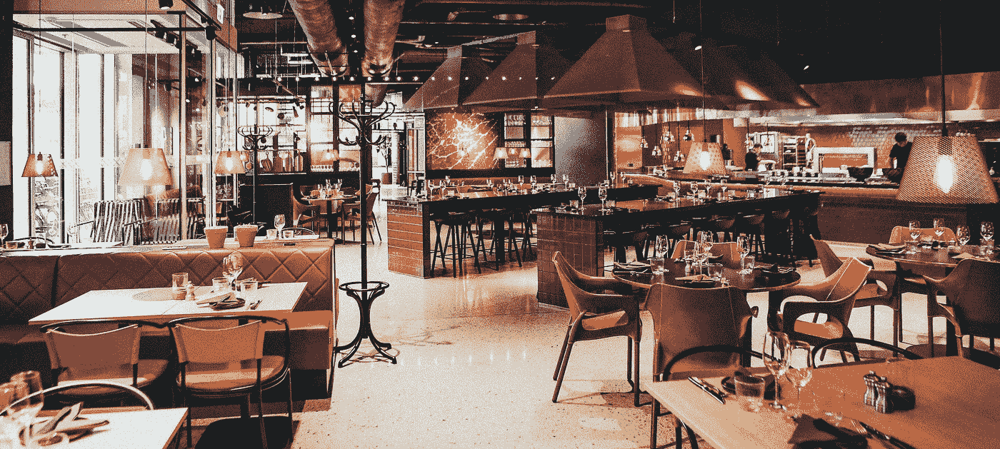

尼克·卡沃尼斯在 [Unsplash](https://unsplash.com/s/photos/restaurant?utm_source=unsplash&utm_medium=referral&utm_content=creditCopyText) 上的照片

T 他的博文是 *IBM 数据科学专业证书*的一部分，作业名为“*邻里之战*”*应用数据科学顶点*下。

## 目录

*   介绍
*   数据采集
*   方法学
*   分析
*   结果
*   讨论
*   结论
*   参考

# A.介绍

## A.1 背景

亨奈，也被称为马德拉斯，是印度泰米尔纳德邦的首府。它位于孟加拉湾的科罗曼德尔海岸，是南印度最大的文化、经济和教育中心之一。根据 2011 年印度人口普查，它是印度第六大人口城市和第四大人口密集城市。钦奈大都市区是世界上人口第 36 大城市。2019 年，钦奈在全球访问量排名第 36 位。生活质量调查将钦奈评为印度最安全的城市。钦奈拥有印度第五大城市经济体。

美食的多样性反映了钦奈社会和经济的多样性。*印度*，*中国*，*亚洲*，*意大利*，*中东*，*泰国*都是这个城市里最受欢迎的一些。我们将对这些餐厅进行分析，以*预测各个餐厅的合适位置*。

## A.2 .问题定义

由于钦奈有很多餐馆，我们尽量选择那些在该地区内餐馆不太拥挤、人口较多的地方。由于餐馆密度低，建立一个新餐馆的机会可能是一个巨大的成功。

## A.3 .利息

特别是，总结分析将针对想要在印度泰米尔纳德邦*钦奈*建立**受欢迎餐馆**之一的**利益相关方**。我们将使用各种数据科学和分析技术来实现选择最佳位置的目标。每个领域的优势将被清楚地表达出来，以便利益相关者可以选择最佳的最终位置。

# B.数据采集

下面讨论对我们有用的数据和它们各自的数据源，

*   钦奈市的*主要地区和街区*由[维基百科](https://en.wikipedia.org/wiki/Areas_of_Chennai)网页提供。
*   *区域的地理坐标*由 Python 的[地理编码库](https://geocoder.readthedocs.io/index.html)提供。
*   *钦奈市各地的场地*由 [Foursquare API](https://foursquare.com/) 提供。Foursquare API 使用坐标信息来获取指定半径和场地限制内的场地。

# C.方法学

首先，我们初始化了一个**爬虫**来从维基百科网页上抓取关于钦奈市*地区*的数据。总共提取了 **163 个邻域**名称。然后，我们利用 **python 的地理编码库**，以 **ArcGIS** 作为地理编码提供者，来获取街区的*坐标。样本数据显示为:*

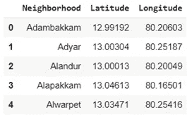

钦奈市的街区及其坐标

邻域使用 **python 的叶子包**可视化。这允许我们执行健全性检查，以确保地理编码器返回的地理坐标数据被正确绘制。钦奈市及其邻近地区的地图如下所示:

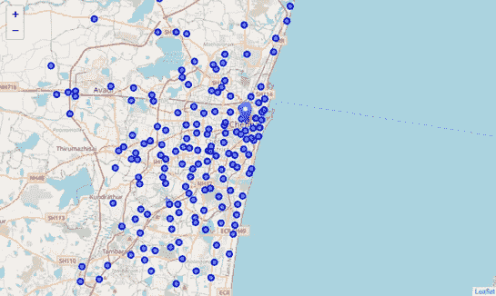

带街区的钦奈市地图

然后， **Foursquare API** 使用该坐标数据来获取钦奈市每个街区指定半径(我们使用半径 **1500 米**)内所有*场馆的信息，只针对相关信息，如*场馆名称*、*场馆坐标*和*场馆类别*。钦奈市共有 **211 个独特场馆类别**和 **1864 个场馆**，其中包括各种餐厅、商场、影城等。最后，我们得到一个表格，*

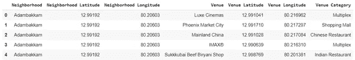

周边场馆的详细信息

然后我们使用**一键编码**，这使得*分类数据*的表示更具表现力。许多机器学习算法不能直接处理分类数据。在我们的例子中，*场地类别*按邻域分组，并表示为每个类别出现频率的**平均值。样本数据显示为:**

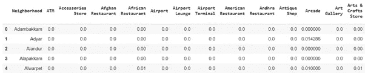

每个街区的场馆密度分布

然后，我们对上述数据应用*聚类算法*、 **KMeans** ，根据**一般场地密度**对*邻近区域*进行聚类，并对&进行分析，比较每个聚类中的集合，以得出每个餐馆类型的最有希望和最佳位置。然后，我们只过滤出每个邻域中感兴趣的目标餐馆，以便在聚类中进行分析。

# D.分析

答在对邻近区域进行分割后，在每个聚类中，我们将把那些**小于整个餐馆密度的 20%** 且**没有目标餐馆**的邻近区域作为目标。我们将 **4** 确定为最佳聚类值，以根据**轮廓得分**对相似的邻域进行分组，该得分计算所有样本的*平均轮廓系数。在应用 KMeans 聚类算法后，所有的邻域都被分离，得到的样本输出显示为:*

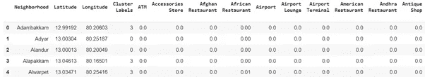

每个邻近区域中带有集群标签的场馆密度

集群是使用 **python 的**的叶子包可视化的。具有 4 种不同颜色的群集以及群集图例显示为，

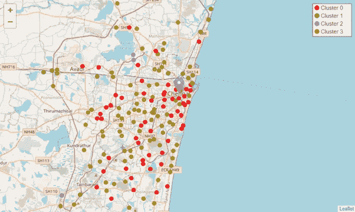

带有聚集街区的钦奈城市地图

# E.结果

在彻底分析了集群和它们各自的邻域之后，结论如下:

## E.1 .群组 0

集群 0 总共有 57 个邻域。那里有很多餐馆和其他食品店。在一个已经建立的市场上开一家新餐馆不是一个好主意。只有 **8%** 的地区有机会新开餐厅。描述聚类 0 中每种餐馆类型的比例的饼图显示为，

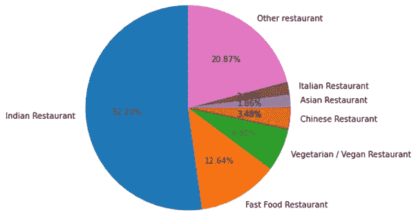

群组 0 中餐馆的比例

## E.2 .第一组

簇 1 总共有 **14 个邻域**。它的市场密度*很高*，中受欢迎的餐厅类型*较少*。这个集群可以被认为是开设**中等受欢迎餐馆类型**的最佳地点之一。大约 74%的地区有希望开一家新餐馆。描述聚类 1 中每种餐馆类型的比例的饼图显示为，

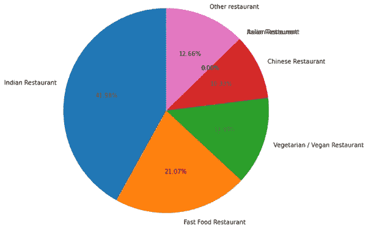

群组 1 中餐馆的比例

## E.3 .第二组

簇 2 只有 **3 个邻域**。它的*餐厅密度*可以忽略不计。在这个聚集地开一家新餐馆可以**盈利**。三分之二的地区没有一家餐厅。描述聚类 2 中每种餐馆类型的比例的饼图显示为，

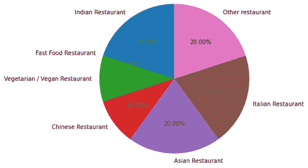

群组 2 中餐馆的比例

## E.4 .第三组

簇 3 总共有 83 个邻域。与*高餐厅密度*的集群 0 非常*相似。大约 36%的地区有机会开设新餐厅。描述聚类 3 中每种餐馆类型的比例的饼图显示为，*

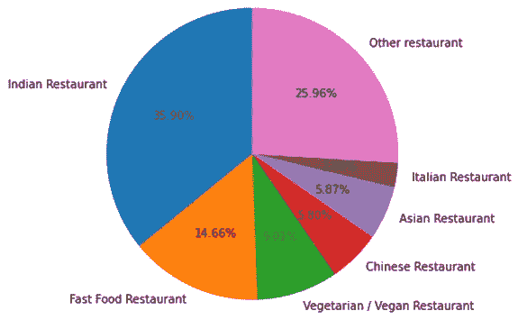

群组 3 中餐馆的比例

更详细的分析可以在[项目报告](https://github.com/MohammedIsmailP/Coursera_Capstone/blob/master/Battle%20of%20Neighborhood/Analysing%20and%20Predicting%20optimal%20locations%20for%20popular%20restaurants%20in%20Chennai%20city%20-%20Report.pdf)中找到。

# **F .讨论**

这里有一些没有特定餐馆类型的聚类。例如，分类 1 没有一家亚洲和意大利餐馆，分类 2 没有一家快餐店。因此，由于各种因素，如*人口*、*居民收入*、*财务报告*等，开设这种类型的餐馆有很高的成功和失败的可能性。因此，在采取进一步行动之前，需要对这些利益领域进行进一步的*分析*和*调查*。

我们也可以对**更大的数据集**应用相同的方法。这种方法也可以用于确定**其他场所**的有前途的地点，如购物中心、电影院、沙龙和其他相关企业。在本项目中，我们只考虑了一个因素，即*场馆密度分布*。还有一些其他因素，如*人口*和*居民收入*、*房地产可获得性*、*周边地区*、*财务报告*等。，通过**更精确的分析**，这将有助于进一步缩小选择最佳位置的范围。

# **G .结论**

到总之，该分析的目的是*确定开设一些受欢迎的餐厅类型*的最佳位置，即印度餐厅、快餐餐厅、素食餐厅、中式餐厅、亚洲餐厅和意大利餐厅。像**场馆密度分布**这样的因素被用来完成我们的任务。

首先，我们*从**维基百科**网站上搜集*钦奈市的街区信息，并使用 **python 的地理编码库**获取每个街区的*坐标*信息。然后，我们利用 **Foursquare API** 获取并识别在每个提供半径的邻域内的所有*场地*。然后，我们根据*场地密度分布*对邻近区域进行聚类。每个集群都提供了关于场馆和餐厅的有用信息和见解，这些信息和见解在项目报告的*分析*和*结果*部分中进行了简要讨论，这对利益相关方很有帮助。

选择餐厅最佳位置的最终决定将由**利益相关方**根据社区和位置的具体特征做出，如*竞争*、*未来增长*、*健康法规*、*安全/犯罪率*，并考虑上面讨论的其他因素。

# H.参考

1.  [钦奈市—维基百科](https://en.wikipedia.org/wiki/Areas_of_Chennai)
2.  [Python 的地理编码器库](https://geocoder.readthedocs.io/index.html)
3.  [Foursquare API](https://foursquare.com/)
4.  [顶点项目报告](https://github.com/MohammedIsmailP/Coursera_Capstone/blob/master/Battle%20of%20Neighborhood/Analysing%20and%20Predicting%20optimal%20locations%20for%20popular%20restaurants%20in%20Chennai%20city%20-%20Report.pdf)
5.  [顶石 Jupyter 笔记本](https://github.com/MohammedIsmailP/Coursera_Capstone/blob/master/Battle%20of%20Neighborhood/Analysing%20and%20Predicting%20optimal%20locations%20for%20popular%20restaurants%20in%20Chennai%20city.ipynb)