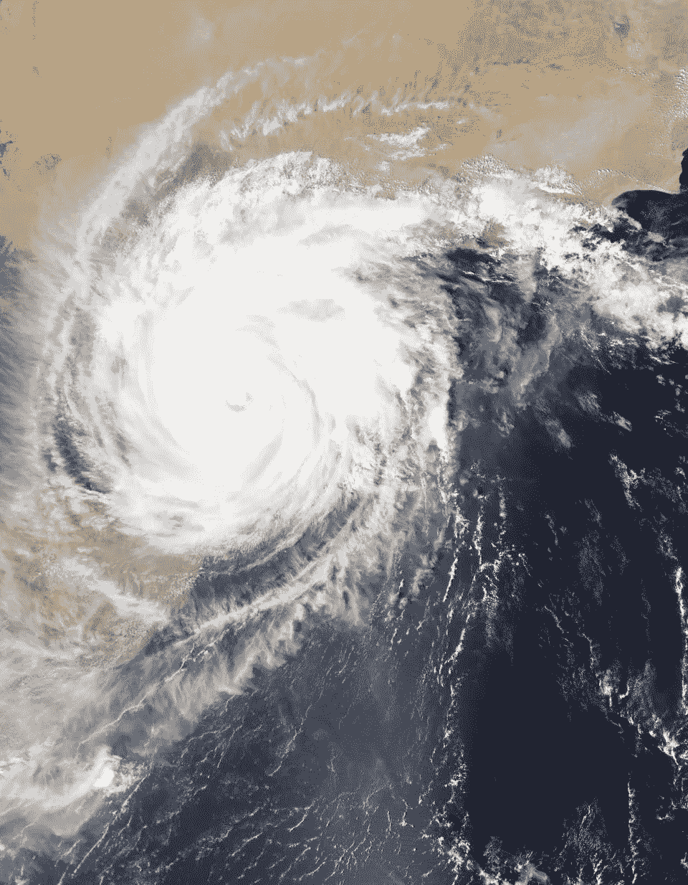
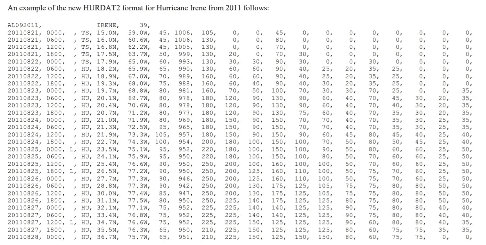
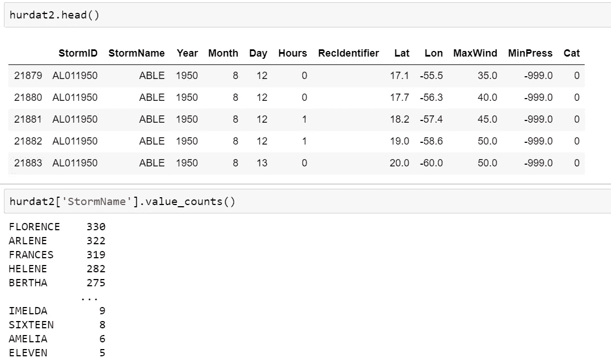
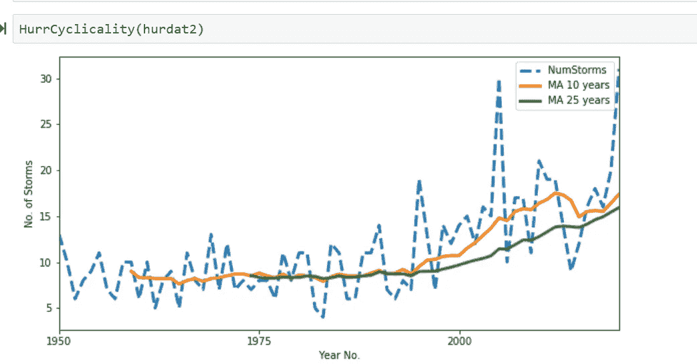
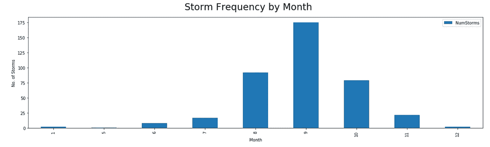
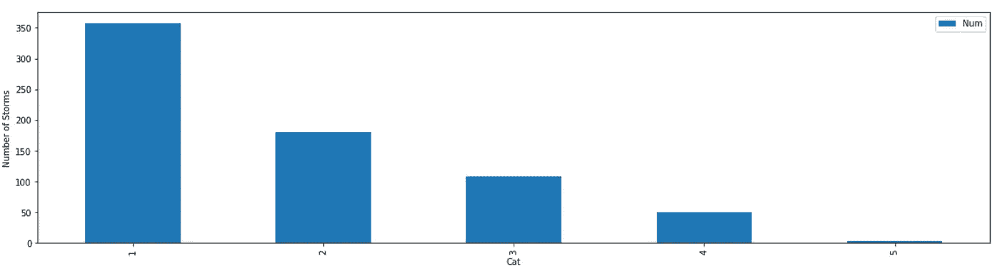

# 分析大西洋飓风数据库(HURDAT2)

> 原文：<https://medium.com/analytics-vidhya/analyzing-atlantic-hurricane-database-hurdat2-4d508a3bba5b?source=collection_archive---------15----------------------->

飓风是发生在大西洋和东北太平洋的风暴，如果发生在西北太平洋，它被称为台风，如果发生在南太平洋或印度洋，它被称为 T2 飓风。

美国宇航局的地球空间照片显示了一场风暴

飓风在热带温暖的海水上形成。当水面上温暖潮湿的空气上升时，它被较冷的空气所取代。冷空气将会变暖并开始上升。这个循环导致巨大的风暴云形成。这些风暴云将开始随着地球的旋转而旋转，形成一个有组织的系统。如果有足够的温水，循环将继续，风暴云和风速将增加，导致飓风形成。

现在，让我们分析一下飓风数据库，它包含了所有已知的热带和亚热带风暴的信息，以便更好地了解飓风。

**数据收集:**

我从国家飓风中心网站下载了数据库 HURDAT2。这个数据集([称为 Atlantic HURDAT2]有一个逗号分隔的文本格式，每六小时提供一次关于所有已知热带气旋和亚热带气旋的位置、最大风力、中心气压和(从 2004 年开始)大小的信息。

有关大西洋飓风数据库再分析项目的详细信息可从 HURDAT2 数据库上的飓风研究部门[信息中获得。](https://www.nhc.noaa.gov/data/hurdat/hurdat2-format-atlantic.pdf)

原始数据快照

**数据清理:**

我使用了轨迹分割研究工作中的 python 脚本[感谢 Etemad，m .，Júnior，A. S .，Hoseyni，a .，Rose，j .，& Matwin，S. (2019)]将 HURDAT 转换为易于处理的数据帧。

我做了进一步的数据处理，例如根据最大持续风速创建了一个名为“类别”的新变量，根据当年和风暴年的大西洋盆地、ATCF 气旋数创建了另一个名为“风暴”的变量，删除了几列(所有象限方向的风半径)并重命名了变量。

已处理数据帧的快照

**周期性:**

研究一年中飓风的周期性，可以清楚地看到，风暴的数量在 2000 年左右开始增加，并且呈增加趋势。

**季节性:**

飓风季节从 7 月到 11 月，9 月达到高峰。

**类别频率:**

从 1950 年到 2020 年，大约有 700 个命名的风暴。其中 50%是最大强度为 1 级的飓风。风速在每小时 74 到 95 英里之间，最大风速只有 4 级。风速超过每小时 156 英里。

