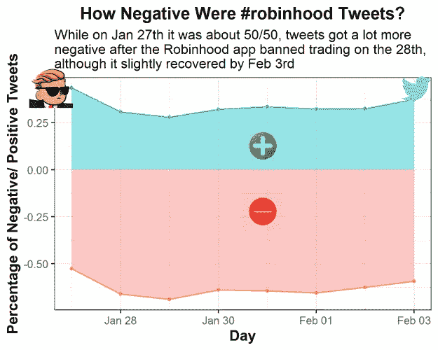
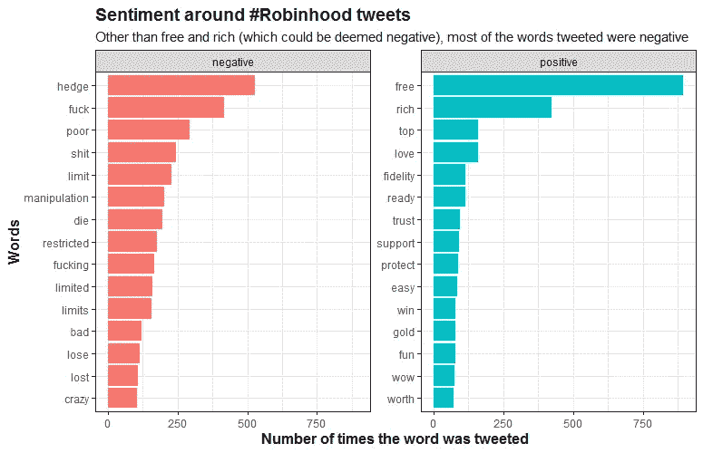
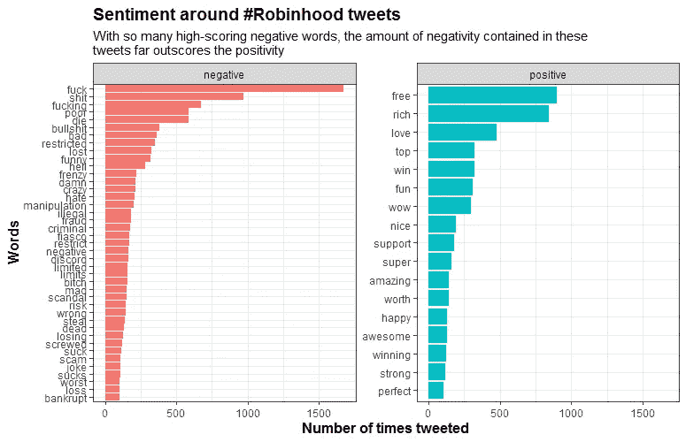
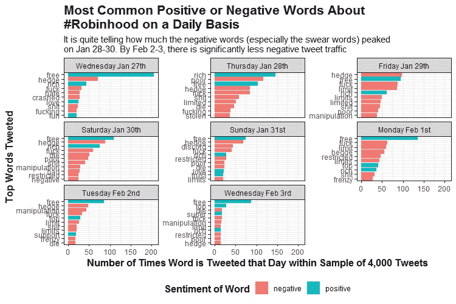
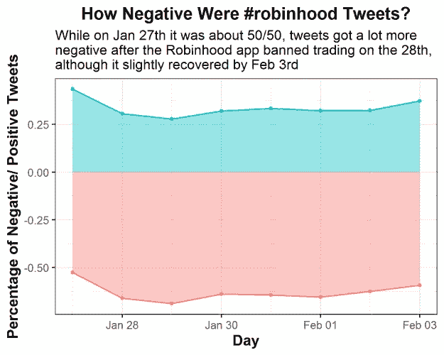

# 用 Robinhood、Gamestop & R 分析品牌情感

> 原文：<https://medium.com/analytics-vidhya/analyzing-brand-sentiment-with-robinhood-gamestop-r-d6518133498e?source=collection_archive---------17----------------------->

## 使用相关的推文来了解人们对品牌的感受(现在你可以把它放在你的简历上了！)


所有的情绪，由鸡蛋来证明！—照片由来自 Unsplash 的 Tengyart 拍摄

品牌必不可少。它们以想法的形式存在于我们的脑海中，每个人每天都会与数百个品牌不断互动，有时是积极的，有时是消极的。

但是它们在数据科学中的作用是什么？鉴于大多数技术都是由强大的商业品牌推动的，**对于任何数据科学家来说，对品牌有一个基本的了解可能都是必不可少的**。

在这篇文章中，我想解释如何使用 Twitter 做一个简单的品牌情感分析。我的重点？**交易应用 Robinhood。**你可能听说过几个月前发生的 GameStop (GME)狂潮，Reddit 用户试图与 GME 短兵相接。自那以后，该股一直没有平静下来，从大约 40 美元涨到目前的 200 美元。在最初的高峰时期(达到 400 美元)，这些 Reddit 用户的主要交易应用 Robinhood 停止了个人购买 GME 股票的功能。**当你阻止你的客户/用户在他们喜欢的活动中使用你的品牌时，这绝对是大品牌的大忌**

因此，我决定做一个**快速和肮脏的 Twitter 情绪分析**，向大家展示这如何有助于了解趋势、公司以及它们在社交媒体上的表现。结果呢？对罗宾汉来说不太好… **但留下来自己做分析吧！**



图 1-在停止交易后，对罗宾汉的整体情绪非常负面

## 步骤 1:加载包并下载数据

所以我通常会说安装`twitteR`或`rtweet`包，然后开始工作，但不幸的是，Twitter 上的趋势**只允许你在过去 7 天内发布推文**。幸运的是，我得到了从 1 月 27 日周三到 2 月 3 日周三的大部分数据，这给了我们从交易暂停前到交易结束后一周的推文。在我的 Github 下载数据[。如果你想了解更多关于搜集 Twitter 趋势的信息，请查看我用来帮助我的教程](https://github.com/danderson222/robinhood-sentiment-analysis)。注意我借用了很多代码来进行我自己的情感分析，但是添加了额外的特性，允许你制作更多信息的情感图表。

出于信息的目的，这里是我用`twitteR`包抓取 Twitter 的代码，因为它允许我在日期之间移动并过滤掉转发:

```
rh_tweets_day <- searchTwitter(
  searchString = "#robinhood -filter:retweets", n = 4000, # searches for #robinhood and grabs 4000 tweets, but no retweets
  since = "2021-01-01", until = "2021-01-25") %>% # The until argument does not include the day of
  twListToDF() %>% # turns the list output into a dataframe
  select(text, created, screenName) # selects three columns we want in our analysis
```

这是我做的清理 Twitter 数据的函数:

```
# make a function to unnest the various words and then get rid of common words with anti_join(stop_words)
find_words <- function(x) {
  x %>% 
    unnest_tokens(word, text) %>% 
    anti_join(stop_words)
}# Create a list of the dataframes from all the days
df.list <- list(rh_tweets_jan_27, rh_tweets_jan_28, rh_tweets_jan_29,rh_tweets_jan_30, rh_tweets_jan_31, rh_tweets_feb_01, rh_tweets_feb_02, rh_tweets_feb_03)# Apply the function to the list of dataframes
df.list <- lapply(df.list, find_words)
```

无论如何，你可以不用那段代码运行我的分析，所以**不要用它**，因为**它不会工作**，因为日期是很久以前的事了。

因此，相反，对于我们的情感分析，我们将在这里使用的主要软件包是`tidytext`和`tidyverse`，它们**允许我们收集每条推文的单词，找出情感并以一种很好的方式绘制出来**。

```
# Step 1: Set your working directory and load the required packages in RStudio. 
if(!require("tidyverse")) install.packages("tidyverse")
if(!require("tidytext")) install.packages("tidytext")# Read in the data from my Github
# [https://github.com/danderson222/robinhood-sentiment-analysis](https://github.com/danderson222/robinhood-sentiment-analysis)
df <- readRDS("tweets.rds")
```

## 第二步:基本情感分析

数据加载完毕，是时候看看大家的感受了！你可以很容易地找到推特上的热门词汇，但相同的词汇会一次又一次地出现(如 GME、AMC、罗宾汉等)。)，这并没有告诉我们人们对罗宾汉品牌的感受。这就把我们带到了 tidytext 函数`get_sentiment`。您可以评估两种类型的情绪:

1.  **冰** —这种类型只是为这个词提供一种积极或消极的情绪
2.  **afin** —这种类型根据每个词的积极/消极程度给它打分

让我们来进行这些情感分析:

```
# First we make a new dataframe with three columns: the word, the sentiment its conveying and number of times it is used
df.bing <- df %>% 
  inner_join(get_sentiments("bing")) %>% 
  count(word, sentiment, sort = T) %>% 
  ungroup()# Then we can run 
df.bing %>% 
  group_by(sentiment) %>%
  # Pull out the top 15 words
  top_n(15) %>% 
  # Reorder top to bottom
  mutate(word = reorder(word, n)) %>% 
  # Make the graph
  ggplot(aes(x = word, y = n, fill = sentiment)) +
  geom_col(show.legend = FALSE) +
  # Facet_wrap makes multiple graphs by the sentiment value in this case
  facet_wrap(~sentiment, scales = 'free_y') +
  labs(title = "Sentiment around #Robinhood tweets",
       subtitle = "Other than free and rich (which could be deemed negative), most of the words tweeted were negative",
       y = "Number of times the word was tweeted",
       x = "Words") +
  coord_flip() + 
  theme_bw() +
  theme(plot.title = element_text(face="bold", size =14), 
        axis.title.x = element_text(face="bold", size = 12),
        axis.title.y = element_text(face="bold", size = 12))
```



图 2-Bing 情感分析显示了所有#robinhood 推文中的热门词汇

从这里我们可以看到“免费”是最积极的词汇之一，但负面词汇的数量远远超过了其他一切。现在让我们看看 afin 情绪类型显示了什么:

```
# Another cool sentiment method is called "afin"
# This assigns a positive or negative score to each word based on its apparent positivity or negativity
df.afin <- df %>% 
  inner_join(get_sentiments("afin")) %>% 
  count(word, value, sort = T) %>% 
  ungroup()
# Here we create a new column to combine the value of each word with the number of times it was used
df.afin$combined_value <- df.afin$value * df.afin$n
# Now let's merge the two sentiment dataframes
df2 <- merge(df.afin, df.bing[-3], by = "word") #Don't merge the n column from df.bing# This chart shows the total scores for each word by their positive/ negative score and number of times tweeted
df2 %>% 
  group_by(sentiment) %>% 
  top_n(15) %>%
  # We have to take the absolute value for the combined_value column given negative words receive a negative score
  mutate(word = reorder(word, abs(combined_value))) %>%
  # We only want the words that have a score above 100
  filter(abs(combined_value) > 100) %>% 
  ggplot(aes(x = word, y = abs(combined_value), fill = sentiment)) +
  geom_col(show.legend = FALSE) +
  # facet_wrap splits out the charts by the sentiment
  facet_wrap(~sentiment, scales = 'free_y') +
  labs(title = "Sentiment around #Robinhood tweets",
       subtitle = "With so many high-scoring negative words, the amount of negativity contained in these \ntweets far outscores the positivity",
       y = "Number of times tweeted",
       x = "Words") +
  coord_flip() + 
  theme_bw() +
  theme(plot.title = element_text(face="bold", size =14), 
        axis.title.x = element_text(face="bold", size = 12),
        axis.title.y = element_text(face="bold", size = 12))
```



图 2-Afin 情感分析，通过分数描述情感词；骂人的话在这里真的占了上风…对不起那些学语言的孩子

所以**这个图表显示了所有情感得分超过 100 分的单词**。如你所见，得分较高的负面词汇比正面词汇多得多。一些愤怒的推特用户！

## 第三步:按天绘制情绪图表

所以在做了最初的情绪图表后，我想**评估一下这些词在不同的日子里有什么不同**。为此，我们 1)按推文创建的日期分组，2)获取推文点击率最高的前 10 个单词，3)取消单词分组，4)更新日期值并将其转换为因子，5)按日期和推文次数排列单词，6)最后对它们进行排序，以便它们能很好地图形化。

为了绘制图表，我们使用 ggplot 和`facet_wrap`来绘制每天收集的 tweets 的图表。**这就是为什么我们必须创建 day 因子来确保日子被正确排序，而不是像 R 通常做的那样按字母顺序排序**。最后我们有 8 张图，显示了负面词汇是如何在 1 月 28 日和 29 日达到顶峰，然后在一周后的 2 月 2 日和 3 日再次下降的。

```
# Sentiment by day chart
df3 <- merge(df, df.bing, by = "word")
df3 <- df3 %>%
  group_by(created) %>%
  count(word, sort = T) %>%
  top_n(10) %>%
  # Remove grouping
  ungroup() %>%
  # Arrange by facet group & number of occurences 
    arrange(created, n) %>%
  # Add order column of row numbers
  mutate(order = row_number())
df3 <- inner_join(df3, df.bing[-3], by = "word")
# Change the date names 
df3 <- df3 %>%
  mutate(created=ifelse(created=="2021-01-27", "Wednesday Jan 27th",
                        ifelse(created == "2021-01-28", "Thursday Jan 28th",
                               ifelse(created== "2021-01-29", "Friday Jan 29th",
                                      ifelse(created=="2021-01-30", "Saturday Jan 30th",
                                             ifelse(created == "2021-01-31", "Sunday Jan 31st",
                                                    ifelse(created== "2021-02-01", "Monday Feb 1st",
                                                           ifelse(created== "2021-02-02", "Tuesday Feb 2nd",
                                                                  "Wednesday Feb 3rd"))))))))# Change the factor levels to make sure the plot appears properly. I'm lazy and don't want to type it so create a vector using the unique function instead
days <- unique(df3$created)
days
# And turn the column into a factor
df3$created <- factor(df3$created,levels=c(days[1:8]))
# Graph it
ggplot(df3, aes(x = order, y = n, fill = sentiment)) +
  geom_col() +
  facet_wrap(~created, scales = 'free_y') +
  xlab(NULL) +
  coord_flip() +
  theme_bw() +
  # Add categories to axis
  scale_x_continuous(
    breaks = df3$order,
    labels = df3$word,
    expand = c(0,0)) +
  labs(x = " Top Words Tweeted",
       y = "Number of Times Word is Tweeted that Day within Sample of 4,000 Tweets",
       title = "Most Common Positive or Negative Words About \n#Robinhood on a Daily Basis",
       subtitle = "It is quite telling how much the negative words (especially the swear words) peaked \non Jan 28-30\. By Feb 2-3, there is significantly less negative tweet traffic",
       fill = "Sentiment of Word") +
  theme(plot.title = element_text(face="bold", size =16),
        axis.title.x = element_text(face="bold", size = 12),
        axis.title.y = element_text(face="bold", size = 12),
        legend.title = element_text(face="bold", size = 12),
        legend.position = "bottom")
```



图 3——每日情绪显示，随着时间的推移，负面情绪真的消失了，并且在 1 月 27 日星期三交易暂停之前并不存在

## 第四步:正面/负面字数的百分比

这一切都很棒，但整体观点是什么？我的最后一个图表是一个面积图，它将情绪转化为每天的百分比。为了找到这一点，我观察了每天情绪词汇的总得分，并确定了它们积极或消极的百分比。我使用了归属于 afin 类型的正值/负值，使百分比更能反映更强烈的情感词。

```
df3 <- merge(df, df2, by = "word") %>% 
  select(word, created, value, n, sentiment)
# Create another data frame to merge the two and get the number of times tweeted each day
x <- df %>% 
  group_by(created) %>% 
  count(word, sort = T) %>% 
  ungroup()
df3 <- merge(df3, x, by = c("word", "created"))
colnames(df3) <- c("word", "created", "value", "total_n", "sentiment", "daily_n")
df3 <- df3[!duplicated(df3), ] #get rid of duplicate rows
# Create the combined daily total which looks at the score for positive/ negative by day
df3$combined_daily <- df3$value * df3$daily_n# I create another dataframe called plot.df for plotting my final chart
plot.df <- df3 %>% 
  group_by(sentiment, created) %>% 
  summarize(area = sum(combined_daily))
totals <- df3 %>% 
  group_by(created) %>% 
  summarize(total_score = sum(abs(combined_daily)))
plot.df <- merge(plot.df, totals, by = "created")
# Calculate the percentage to be graphed
plot.df$percentage <- plot.df$area / plot.df$total_score
class(plot.df$created)
# Graph it with an area chart
plot.df %>% 
  ggplot(aes(x = as.Date(created), y = percentage, color = sentiment, fill = sentiment)) +
  # I like the area plot showing the percentage totals for positive and negative
  geom_area(stat = "identity", alpha = 0.4) +
  geom_point(size = 1) +
  theme_bw() +
  labs(x = "Day",
       y = "Percentage of Negative/ Positive Tweets",
       title = "How Negative Were #robinhood Tweets?",
       subtitle = "While on Jan 27th it was about 50/50, tweets got a lot more \nnegative after the Robinhood app banned trading on the 28th, \nalthough it slightly recovered by Feb 3rd") +
  theme(plot.title = element_text(face="bold", size =14, hjust = 0.5),
        axis.title.x = element_text(face="bold", size = 12),
        axis.title.y = element_text(face="bold", size = 12),
        legend.position = "none") +
  # Save the plot so we can add some icons to it
  ggsave(filename = "output/PositiveNegativeBreakdown.png",
         width = 5, height = 4, dpi = 300)
```



图 4 —基本正/负面积图

## 第五步:添加一些图标

最后，因为我们可以，让我们添加一些图标到最终的图形。为此，我们使用`magick`包将互联网上的一些图像`image_read`到您的本地环境中。然后我们用`image_scale`缩小图像，并用`image_composite`将它们放到保存的图上。实际上，找出图像最适合的位置需要一段时间和大量的重新运行代码，**但这就是将图像添加到你的情节中的乐趣！**

```
# Load the magick library and call back your created plot
if(!require("magick")) install.packages("magick")
plot <- image_read("output/PositiveNegativeBreakdown.png")
# And bring in your images
nice_img <- image_read("https://cdn2.iconfinder.com/data/icons/primitive-gradient/512/xxx014-512.png")
neg_img <- image_read("https://cdn1.iconfinder.com/data/icons/modifiers-essential-glyph-1/48/Mod_Essentials-02-512.png")
wsb_logo <- image_read("https://i.pinimg.com/originals/29/24/89/292489e7d0bf8ce7d5ffd81be62d0800.png") 
twt_logo <- image_read("https://assets.stickpng.com/images/580b57fcd9996e24bc43c53e.png")# Scale down the logo and give it a border and annotation
# This is the cool part because you can do a lot to the image/logo before adding it
nice_img <- nice_img %>%
  image_scale("100")
neg_img <- neg_img %>%
  image_scale("150")
wsb_logo <- wsb_logo %>%
  image_scale("150")
twt_logo <- twt_logo %>%
  image_scale("150")# Stack them on top of each other
final_plot <- plot %>% 
  image_composite(nice_img, offset = "+850+450") %>% 
  image_composite(neg_img, offset = "+825+650") %>% 
  image_composite(wsb_logo, offset = "+100+220") %>% 
  image_composite(twt_logo, offset = "+1350+230") 
final_plot
# And overwrite the plot without a logo
image_write(final_plot, "output/FinalPlotWithLogos.png")
```


图 5——添加一些有趣的图标，使图表真正流行起来！

这样，你就对 Robinhood 这样的流行品牌做了一个小的情感分析。显然，你可以看到，在 GME 交易丑闻期间，负面词汇主导了推特，这个品牌肯定受到了打击。虽然最后似乎只过了几天就回到了平均水平。当罗宾汉停止交易时，也许这不会产生我认为会产生的长期影响。

无论如何，我希望你喜欢并学到了一些关于品牌情感分析的知识。是的，这很快。是的，这是脏的。但有时这就是你所需要的，让你了解公众眼中的品牌。我希望通过几个月前发布的哑铃图表和 Twitter 信息来进行对比。

**参考文献:**
【1】Twitter， [#Robinhood 主题推文](https://twitter.com/search?q=%23robinhood&src=typed_query)，(2021)
【2】Tengyart，[彩蛋图片](https://unsplash.com/s/photos/emotion)，2021
【3】si pra，V. (2020) [Twitter 情感分析与可视化利用 R](https://towardsdatascience.com/twitter-sentiment-analysis-and-visualization-using-r-22e1f70f6967) ，走向数据科学

*我是 Monitor Deloitte 的模拟&战略顾问，我使用统计和分析为数字孪生模型提供信息，这些模型重新发明了公司进行战略决策的方式。在我的空闲时间，我痴迷于政治和政策，一直在数字* *的* [*政策上写博客。你可以在那里找到我或者在我的*](https://www.policyinnumbers.com/)[*LinkedIn*](https://www.linkedin.com/in/dylansjanderson/)*和*[*Twitter*](https://twitter.com/dylansjanderson)*账号(随意连接或者给我一个关注)*