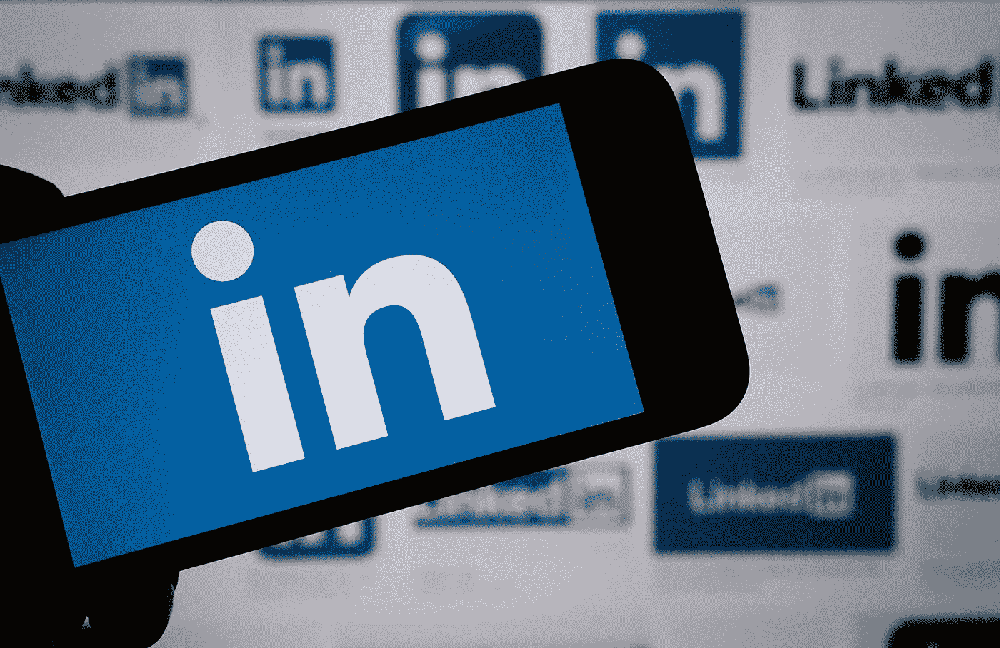

# 使用 LinkedIn 数据集分析职业道路和 STEM 职业发展

> 原文：<https://medium.com/analytics-vidhya/analyzing-career-paths-and-stem-professional-development-using-linkedin-datasets-4c47e87678ba?source=collection_archive---------0----------------------->

从 Shutterstock 获得许可的图像

你有没有想过是什么让人们选择一条职业道路而不是另一条？或者说为什么有些人似乎对 **STEM** (科学、技术、工程、数学)领域有天生的天赋，而有些人却没有？LinkedIn 有答案。通过**分析其平台上数百万用户的公开可用数据**，LinkedIn 可以描绘出人们的职业生涯如何随着时间发展的详细画面。这些信息有助于人力资源经理设计员工培训计划，有助于社会科学家研究劳动力模式和流动性，**非政府组织和非营利组织**为代表性不足的族裔群体赞助特别 STEM 计划，有助于职业顾问帮助他们的客户对职业未来做出明智的选择。在本帖中，我们将探索提取相关 LinkedIn 数据的一些基础知识，用于分析职业道路和 [STEM 职业发展](https://thestemconnection.org/programs/)。敬请期待！

# 如何提取更新的 LinkedIn 数据集进行分析

LinkedIn 平台拥有丰富的数据，对于希望更好地了解劳动力和行业格局的企业、组织和研究人员来说非常有用。访问这些数据的一种方式是通过 LinkedIn API，它允许开发者构建利用 LinkedIn 数据的应用程序。然而，该 API 有严重的局限性，在本文中，我们将重点关注如何在不使用 API 的情况下收集 LinkedIn 数据，以及在哪里可以找到现成的社交媒体和 [**LinkedIn 数据集**](https://brightdata.com/lp/datasets/product#social-media) ，这些数据使得网络收集变得多余。

图片来自 Bright Data

# 网页抓取 LinkedIn

有许多不同的库和工具可用于网络抓取。对于 Python 程序员来说，首选库是请求和美丽的声音。然而，对于那些不完全精通这些的人来说，有一个开源的和有良好文档记录的工具叫做 Scrapy，它是一个基于 Python 构建的抓取框架，但是需要较少的编码技能。

一旦我们设置好了我们的刮刀，我们就可以运行它，让它工作。第一步是提取我们想要分析的 LinkedIn 用户资料的 URL 列表。这可以通过几种方式来实现。

下一步将是自动访问我们指定的每个 URL，并解析我们正在寻找的数据。

**有用的公共配置文件数据可以是:**

*   名字
*   地区
*   国家
*   位置
*   当前公司
*   教育
*   关于；在…各处 ；大约
*   语言
*   课程
*   推荐
*   跟随
*   变更日志
*   证书

更多相关的**数据点**将有助于您验证此人是否属于 STEM 工作类别，并分析其职业轨迹中的各种相应事件和相关性。

然后，它会将数据以 **JSON 或 CSV** 文件的形式保存到我们的项目目录中。

LinkedIn 数据集示例

然而，无论是在 Python 还是 Scrapy 中， [**从 LinkedIn 中以** **的规模抓取数据可能会比较棘手**](https://www.quora.com/What-makes-LinkedIn-more-difficult-to-scrape-than-other-sites) 。这个专业社交网络平台的算法几乎每周更新，这使得持续的 LinkedIn 抓取项目很难保持高成功率。它需要编码人员跟上算法的变化，不断修改自己的刮刀。除此之外，LinkedIn 尽最大努力将数据(即使是公开的)保密，部署先进的**反机器人和浏览器指纹**技术，甚至可以阻止执行最好的抓取器。

**绕过 LinkedIn blocks**

对此的解决方案通常是将旋转住宅代理集成到您的 web scraper 代码中，这有助于抓取机器人模仿真实用户行为，还包括智能浏览器指纹管理。使用真实用户代理对于提高你不被阻塞的机会是很重要的。但是，请记住，如果您使用外部服务来部署这些工具，它们会增加大量额外成本，并且会降低 web 抓取过程的速度。

# 购买 LinkedIn 数据集

如果你只是想要数据，没有麻烦，最好的选择是简单地购买结构化的、最新的 LinkedIn 数据集。这些数据库通常有数百万条记录，您可以轻松地过滤和组织这些记录，以便进行分析。

还有其他数据集可能提供见解，如 Indeed.com、Glassdoor.com 和其他工作列表网站数据集，但 LinkedIn 的数据集非常适合人力资源或研究需求。

**LinkedIn 个人资料数据集的一些好资源:**

1.  亮眼的数据
2.  Datarade.ai
3.  卡格尔
4.  数据世界
5.  开源代码库

您会发现上述一些数据集资源之间存在一些差异。例如， [**亮数据**](https://brdta.com/3MUgmpe) 提供对正在进行的项目非常重要的数据的定期刷新。此外，它允许您使用智能查询过滤数据集，并在购买数据集之前缩小范围(相应地降低价格)。另一方面， [**数据贸易**](https://datarade.ai/data-categories/linkedin-data) 是一个大型数据市场，在这里你可以比较不同数据提供商的产品。 [**Kaggle**](https://www.kaggle.com/search?q=linkedin+in%3Adatasets) 在数据科学家中是一个家喻户晓的名字，也是获取数据集的好地方。

一个强大的数据丰富选项可以通过将用户档案数据与 **LinkedIn 公司页面数据集**交叉的形式来确定特定个人的 STEM 状态。

从 Shutterstock 获得许可的图像

既然有了数据，就可以开始做一些分析了。

大学等教育机构希望**更好地了解 STEM 领域收入最高/表现最佳的专业人士是如何取得成功的。他们提出并回答的一些问题是:*这些人是从哪里获得学士和硕士学位的？他们在哪些公司实习？他们参加了什么爱好/社团或课外活动？***

这些数据可以帮助大学更好地了解他们应该招收什么样的学生，以及如何更好地支持他们的 STEM 项目。

同样，求职应用程序构建者希望利用这些数据来改进他们的产品。通过了解人们如何从一份工作转到下一份工作，这些公司可以为他们的用户提供更好的推荐和建议。

最后，[劳动研究所](https://www.thelaborinstitute.org/)和关注**工作场所多样性的非政府组织**的决策者希望利用这些数据来改善 STEM 职业的公共政策。他们可以回答这样的问题:STEM 专业人士最受欢迎的职业道路是什么？人们在试图进入这样的职业时面临的最大障碍是什么？我们可以制定什么政策来帮助人们克服这些障碍？

在这一点上，重要的是要提到像 **Bright Initiative** 这样的组织为**的学术研究人员**和世界各地的非政府组织提供免费访问 LinkedIn 数据集的机会，用于非营利性的数据有益项目。

LinkedIn 数据集可以做很多事情。这些只是可以完成的分析类型的几个例子。如果你有其他想法，请与我们分享！