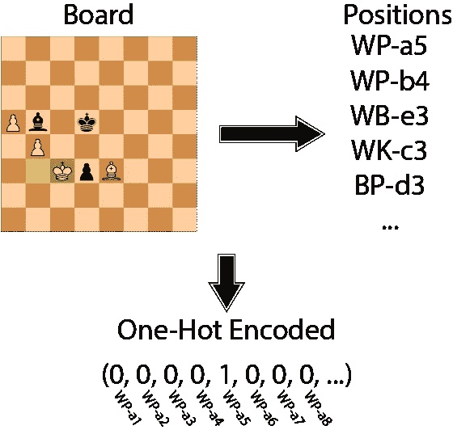
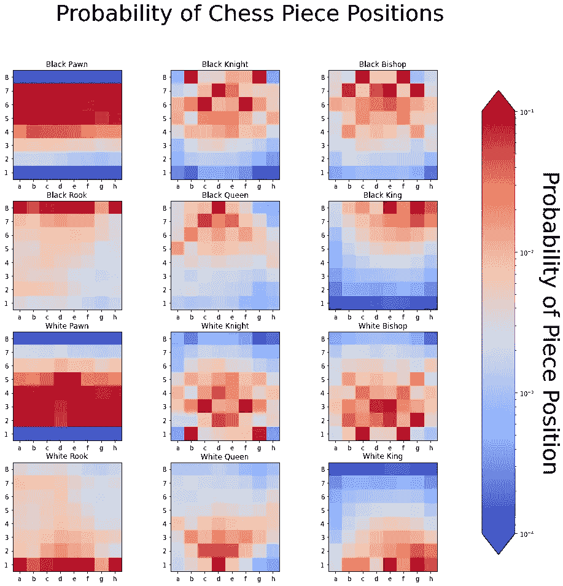

# 用 Python 分析国际象棋的位置

> 原文：<https://medium.com/analytics-vidhya/analyzing-chess-positions-with-python-26d73b7c892?source=collection_archive---------6----------------------->

下棋时，我发现我的棋落在相似的位置。这是故意的。专注于几个不同的空位有助于提高你的比赛，因为你会一遍又一遍地看到相同的位置。但我一直很好奇，更普遍地说，棋子的常见和不常见位置是由什么构成的。为了找到答案，我开始用 Python 和 chess.py 分析一年的国际象棋比赛。

[将](https://github.com/matteson/chess-positions/tree/main)链接到该项目的 Git 回购。


由 [Artur Shamsutdinov](https://unsplash.com/@roketpik?utm_source=unsplash&utm_medium=referral&utm_content=creditCopyText) 在 [Unsplash](https://unsplash.com/s/photos/chess-tournament?utm_source=unsplash&utm_medium=referral&utm_content=creditCopyText) 上拍摄的照片

## 分析的初始目标

一盘国际象棋是由棋手移动定义的棋盘位置序列。如果我随机下一盘棋，并随机停止它，那么棋子更有可能在某些地方。从直觉上来说，一个王在棋盘上一直游荡，比他安全地留在自己的起始位置上的可能性要小。

在国际象棋中，有 6 个棋子，2 种颜色，8 个等级和 8 个档。将这些相乘，我们得到总共 768 个可能的棋子位置。作为最初的目标，我想找出这 768 个位置中的每一个出现在从国际象棋数据库中选择的随机棋盘位置中的概率。

有了目标，下一步就是“获取大量数据”

## 解析大量国际象棋游戏

当我第一次开始探索国际象棋的位置时，我为可移植游戏符号(PGN)文件编写了自己的解析器。如果你想知道解析国际象棋符号工作的细节，请查看我关于这个主题的文章。随着我工作的扩展，我决定使用 [chess.py](https://python-chess.readthedocs.io/en/latest/) ，因为它提供了 PGN 解析以及对导出董事会职位的支持。

本周我在国际象棋中从[下载了 14 个月的国际象棋锦标赛数据。我们的工作流程将是:](https://theweekinchess.com/twic)

1.  加载 PGN 文件。
2.  迭代游戏。
3.  迭代每一步棋，导出棋盘位置。
4.  将游戏格式转换成可以用数字处理的格式。

Chess.py 通过导出到[Forsyth-Edwards-Notation](https://en.wikipedia.org/wiki/Forsyth%E2%80%93Edwards_Notation)(FEN)为步骤 1-3 提供现成的支持。FEN 是一个描述性的字符串，列出了棋盘上每个棋子的位置。为了便于分析，我们想将这个字符串转换成棋盘的[一键编码](https://en.wikipedia.org/wiki/One-hot)。一位热码是一个 768 位的向量，表示某个棋子位置是否出现在棋盘上(如下图所示)。



国际象棋位置的一键编码(作者)

```
# Find the function fentohot in the linked Git repository.import chess# Load the first game
pgn = open('twic980.pgn')
game = chess.pgn.read_game(pgn)# Iterate through the moves of the game outputting the board.
board = game.board()
for move in game.mainline_moves():
  board.push(move)
  hot = fentohot(board.fen()).reshape((768,))
  positions[:, iter] = hot
  iter = iter + 1
```

在链接 Git repo 中，我循环了 60 个 PGN 文件中的所有游戏。我总共有 1460 万多一点的棋局头寸要分析。

## 初始统计和可视化

从这些数据中，我们可以找到某个特定棋子位置出现在随机棋盘位置的概率。从这里，我们可以问这样的问题，什么是常见的工件位置？什么不常见？并由此产生一些概率的可视化

排除非法位置(一级和八级的棋子)，最不常见的位置是 a1 上的黑王(13000 个位置中的 1 个)，其次是 a8 上的白王(9800 个位置中的 1 个)。最常见的棋子位置是 f7 上的黑卒(1.6 位置中的 1)。概率有助于一些美好的形象化。



棋子位置的概率(按作者)

## 我将何去何从

在我工作的下一阶段，我正在寻找位置共现。总的来说，我从信息论的角度来描述整个董事会。如果你想看更多，请跟我来！