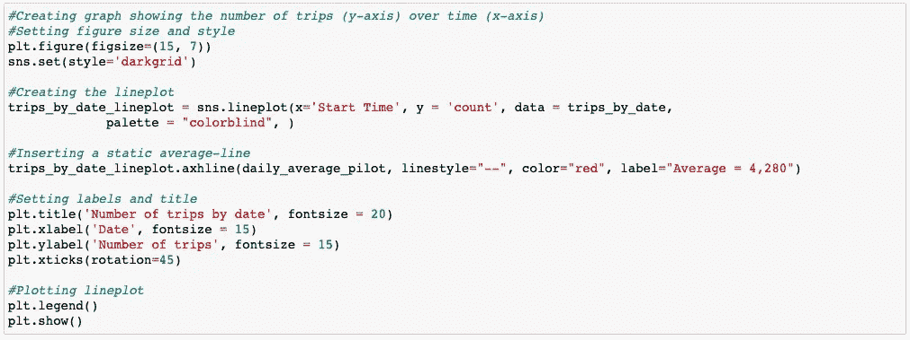
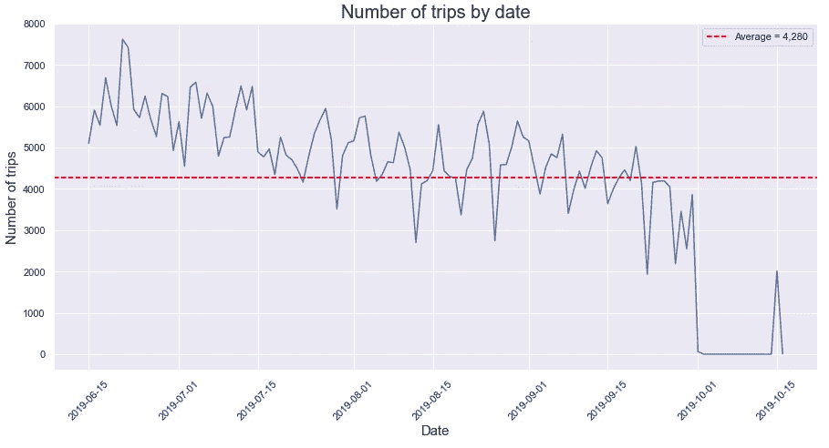
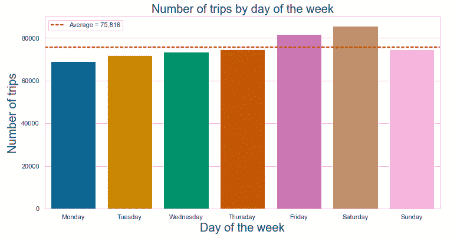
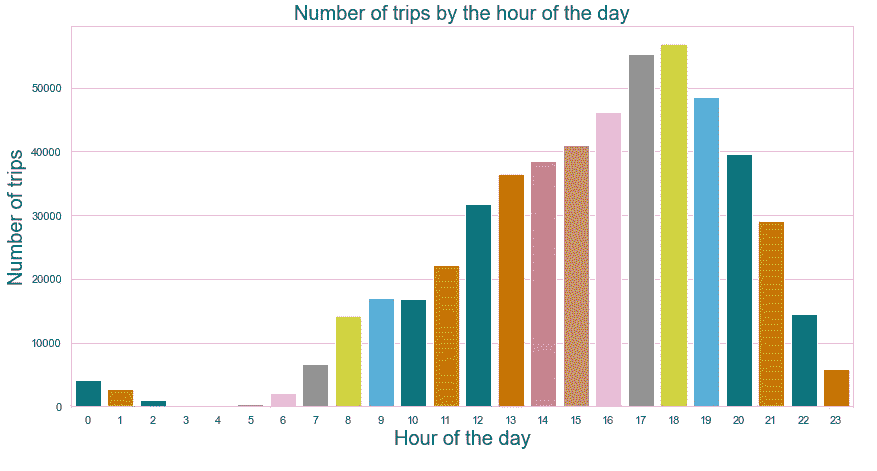
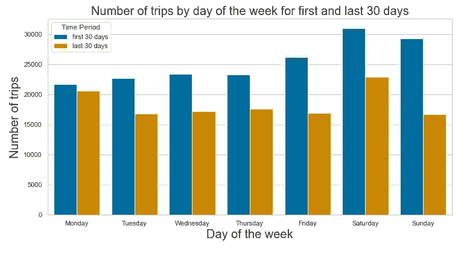
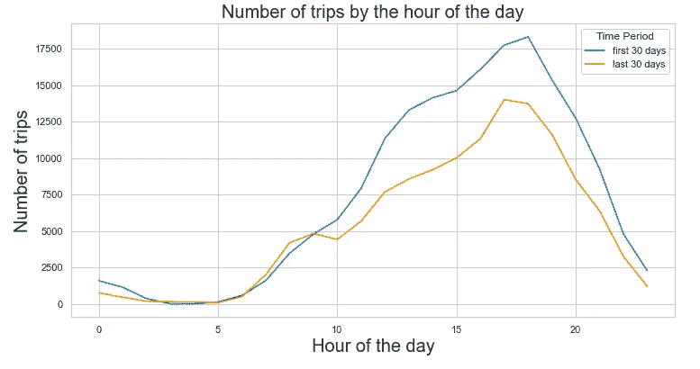
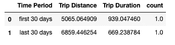
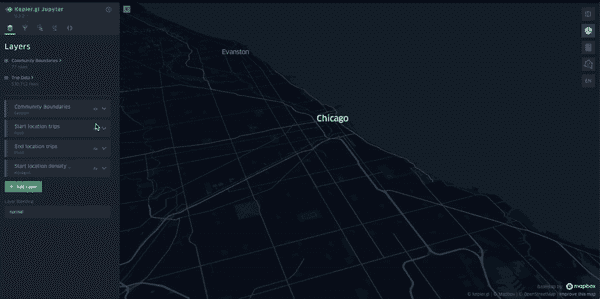

# 用 Python 分析芝加哥的电动滑板车出行

> 原文：<https://medium.com/analytics-vidhya/analyzing-e-scooter-trips-in-chicago-with-python-c985611a33e1?source=collection_archive---------9----------------------->

今天，共享电动滑板车(或电动滑板车)已经成为世界上大多数大城市的常见景观，因为许多人使用这些滑板车进行运输和休闲。最终用户可以轻松地使用任何运营商的应用程序来找到最近的可用滑板车，解开滑板车并骑到他们想去的地方。这些服务的设计方式导致产生了大量关于如何以及在哪里使用服务的数据。

在本文中，我将通过探索 2019 年芝加哥电动滑板车试点项目，展示分析用户模式是多么容易。数据集可以在芝加哥市的网站上获得(在[这个链接](https://data.cityofchicago.org/Transportation/E-Scooter-Trips-2019-Pilot/2kfw-zvte))，可以通过他们的 API 访问或者直接以许多不同的文件格式导出。我选择以 CSV 格式下载。

## 数据集

现在您已经下载了数据，让我们更深入地了解它的结构和包含的内容。幸运的是，芝加哥市在记录数据集方面做得很好。从上面的链接我们可以看到总共有 711K 行和 18 列。每一行代表一次旅行。我们特别感兴趣的数据点是开始时间、结束时间、行程距离(以米为单位)、行程持续时间(以秒为单位)、坐标(行程的开始和结束)以及行程开始和结束的社区区域。

出于隐私方面的考虑，该数据集被略微处理过，并不完全准确。例如，开始和结束时间被四舍五入到最接近的小时。关于地理位置，没有提供确切的纬度和经度。取而代之的是，给出了旅行开始的普查区域的中心位置。如果人口普查区域不可用于该行，则将位置设置为社区区域的中心。换句话说，位置和起止时间是不准确的。就本文而言，准确性本身并不重要，但重要的是要意识到数据集的局限性。

## **用 Python 探索和分析数据**

大多数操作都是通过熊猫图书馆完成的。Matplotlib 和 Seaborn 用于显示数据的图形表示，而我选择使用 Kepler.gl 来可视化地图中的地理数据。与 JSON、CSV、Datetime 和 Numpy 相关的其他库也用于较小的任务。包含数据探索所有步骤的笔记本可在[此链接](https://github.com/loksoy/chicago_e_scooter_trips/blob/main/Scooter_trips_data_exploration.ipynb)处获得，文章末尾的地图可视化笔记本可在[此处](https://github.com/loksoy/chicago_e_scooter_trips/blob/main/Scooter_trip_map_visualization.ipynb)处获得。

如前所述，数据集总共包含 711K 行。很可能并非所有这些行都是实际的行程。例如，可能会有这样的情况，最终用户已经开始了一次旅行，但由于踏板车没有完全发挥作用(例如，轮胎被扎破或刹车失灵)而很快结束了旅行。我们将把数据集限制在我们认为是真实旅行的情况下。我们创建以下规则:

1.  一次旅行至少需要一分钟。
2.  一次旅行的长度至少需要 100 米。

将数据集转换为数据帧后，我们根据这些规则过滤数据集。为了执行这些规则，我们首先需要确保包含“旅行距离”和“旅行持续时间”的列是数字格式的。Pandas to _ numeric-函数是一种将字符串值转换成数字格式的简单方法。

```
#Converting columns to numeric formatscooter_trips_df['Trip Distance'] = pd.to_numeric(scooter_trips_df['Trip Distance'])scooter_trips_df['Trip Duration'] = pd.to_numeric(scooter_trips_df['Trip Duration'])#Filtering dataset based on rules: Dropping rows where distance is less than 100 meters or time is less than 60 secondstrips_df = trips_df.drop(<trips_df[(trips_df['Trip Distance'] < 100) | (trips_df['Trip Duration'] < 60)].index)
```

当我们检查数据集的长度时，我们可以看到旅行的次数已经大大减少了。我们现在总共有 53 万次旅行。

## 用户模式概述

我们想做的下一件事是获得整个数据集的概览，以查看每天有多少次旅行被注册。这将给我们一个指示，如果有一个上升或下降的旅行次数。为此，我们为每行添加一个计数值为 1 的列，并根据行的日期对数据帧进行分组。计数行将向我们显示每个日期有多少个实例。

我们还希望看到试验项目的整个时间段内每天的平均出行次数。这可以通过使用计数列上的均值函数来计算:

```
#Creating a DataFrame that can be used for showing amount of trips per datetrips_by_date = analysis_data.groupby(pd.Grouper(key='Start Time', freq='D')).sum().reset_index()

#Calculating average linedaily_average_pilot = trips_by_date['count'].mean()daily_average_pilot
```

对于图形绘制，我们使用 Seaborn 和 Matplotlib。这种设置非常容易理解，可以在以后的可视化中重复使用。我们或多或少只是根据我们想要看到的图(例如，是线形图、条形图等)来改变代码的第二部分。)代码如下图所示，第二张图是代码的输出。



从上面的可视化中，我们看到了两件事:

1.  **试点期间出行次数减少。**
2.  在 9 月 30 日之后，有一段时间根本没有旅行，直到 10 月 15 日。

因为我们从试点项目描述中知道试点项目从 6 月 15 日运行到 10 月 15 日，这意味着有一些数据丢失(并且我们的日平均值受到这一事实的影响)。为了以后比较试点的前 30 天和后 30 天，我们需要确保将截止日期设置在 9 月 30 日之后。

此外，我们使用 groupby 函数来汇总每个工作日的旅行次数和一天中的时间，并将它们绘制成图表。



这些图表告诉我们，最活跃的日子是星期五和星期六，从一天开始到下午 6 点，出行次数逐渐增加。

## **用户行为会随着时间而改变吗？**

我们希望通过比较前 30 天和后 30 天来了解用户行为是否会随着时间的推移而改变。使用查询功能，我们通过过滤掉前 30 天和后 30 天来创建新的数据框架。两个数据帧中都添加了一个名为“时间段”的新列。该列包含字符串值“前 30 天”或“后 30 天”，这取决于它所适合的时间段。我们将两个数据帧连接成一个。这个新的数据框架只包含第一天和最后 30 天的乘车记录。我们可以使用这个新创建的数据框架来查看一周中每一天的旅行次数，以及一天中每一小时的旅行次数——针对这两个时间段。



从这些图表中，我们可以看到一些有趣的趋势。首先，对于一周中的所有日子，从第一时段到第二时段，旅行的次数已经减少。然而，周一出行的减少并不像一周中其他几天那么显著。在第二张图中，我们可以看到每小时的旅行次数。该图显示，与前 30 天相比，最近 30 天早上 6-9 点之间的出行次数实际上更高。

另一个有趣的方面是旅行距离和持续时间。我们再次使用 groupby 函数按照时间段列的平均值对数据帧进行分组。这给了我们两个时间段的平均行程距离和行程持续时间。

```
#Calculating average Trip Distance and Trip durationfirst_last_month_average = first_last_month.groupby('Time Period').mean().reset_index()
```



从输出中，我们可以看到第一个月的平均旅行持续时间为 939 秒，而过去 30 天为 669 秒，减少了 40.3%。然而，平均出行距离增加了 35.4%，从 5065 米增加到 6859 米。

总的来说，我们看到清晨的出行次数实际上增加了，出行持续时间减少了，而出行距离增加了。所有这些发现表明，用户模式已经从休闲转向更多地使用电动滑板车作为一种交通方式。

## 地理空间虚拟化

对于地理空间可视化，我选择使用 kepler.gl 的 Python 库。根据我在地理空间数据方面的短暂经验，这是在漂亮的交互式地图中可视化大量数据的最简单的方法——您只需要几行代码就可以创建强大的可视化效果。一旦创建了包含您的数据的地图，您就可以直接在笔记本中与它进行交互。创建开普勒地图的几个步骤如下所示。

```
import keplergl#Creating base map
map1 = keplergl.KeplerGl(height=600, widht=800)#Adding layer containing community boundary-polygons
map1.add_data(data=boundaries, name="Community Boundaries")#Adding second layer containing e-scooter trips
map1.add_data(data=all_trips, name="Trip Data")#Display map
map1
```

此外，如果你想保存你的地图可视化显示给他人，开普勒让你保存你的 HTML 格式的地图。我们还需要将配置保存到我们的地图中，以便在打开文件时，其他人能够看到与我们完全相同的地图。

```
#Saving configuration
my_config= map1.config#Saving map to html
map1.save_to_html(config=my_config, file_name="chicago_electric_scooters.html")
```

地图的最终结果如下所示。尽管只涉及了几行代码，但最终结果很好地概括了电动滑板车旅行，并且易于交互。



## 结论

通过对芝加哥 2019 年电动滑板车试点项目的数据探索，我们看到，在实施后，开始时有大量的电动滑板车出行。试点期间，出行次数慢慢减少。每天的旅行次数似乎在下午 5-6 点达到高峰，这是大多数人结束工作的时间。一周中出行最多的日子是周末、周五、周六和周日。尽管每日出行的次数随着时间的推移而减少，但用户模式显示，与试点开始时相比，在试点结束时，用户在更短的时间内行驶了更远的距离。这表明用途已经从休闲和娱乐变成了从一个地方到另一个地方的明确的运输方式。通过地图可视化，很明显，这些行程中的大部分位于芝加哥的西侧、北侧和西北侧。