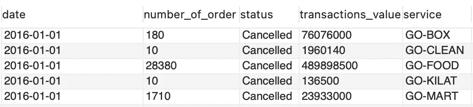
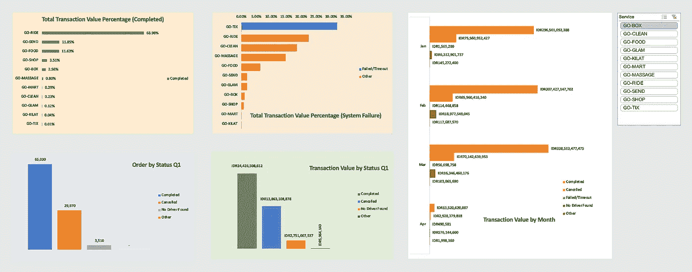
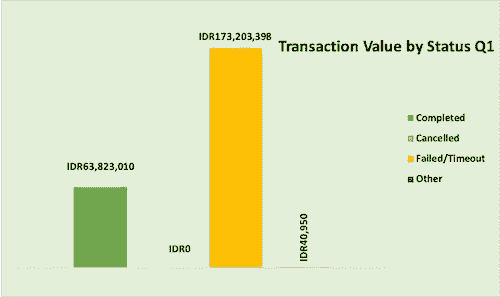

# 分析 Gojek 数据集—我第一次接触数据分析

> 原文：<https://medium.com/analytics-vidhya/analyzing-gojek-dataset-my-very-first-time-exposed-to-data-analytics-c22b69e0537a?source=collection_archive---------12----------------------->

作为一名化学工程专业的毕业生，并拥有工程学士学位，使我成为一名热情的数据爱好者，但如何做到这一点呢？这一切都是从我大学放假的时候开始的，那时我应该还在写我的本科毕业论文。但是自从疫情来了，科罗娜突然把所有的日常活动都推到了完全不同的事情上，我不得不休息一下。长话短说，在大约 2 个月的不思进取之后，我终于意识到我必须做点什么(嗯，除了我的论文，但由于我不能去实验室，我不能做更多的事情)。在那之后不久，我偶然发现了一个由 Lingkaran 设计的项目，叫做职业准备项目。你可以说，这有点像初学者研讨会，由专家指导，在那里你会学到基础知识，并给你一个小项目，稍后再讨论。CRP 项目届时提供 4 个项目供您选择，分别是数据分析、*产品管理、* UX 设计和数字营销。在做了小小的研究后，我最终选择了数据分析(关于我为什么选择数据分析以及为什么坚持下去的故事，将在另一个时间讲述)。

# 我的第一个任务

在这个项目的第一周，我拿到了一些学习材料，我必须就给我的几个主题进行自学。学习材料包括*数据分析入门、* Excel 数据分析基础和数据可视化。从这些话题中，我了解了数据分析流程，以及与其他数据相关工作(如数据科学家、数据工程师等)的区别。)、Excel for analysis(透视表&可视化)、SQL。经过一周的自学，我们终于见到了导师，并向实际的专家学习。导师是[卡洛琳·c·拉图奥利维亚](https://www.linkedin.com/in/caroline-ratuolivia/)，当时她是 Gojek 的商业智能分析师。在这次指导会议中，我们接触到了更多关于数据分析的知识，并为我们在该计划中的最终项目提供了一些建议和提示。

# 分析 Gojek 数据集

## 它是关于什么的…

在这个项目中，我们得到了一个数据集，在这个例子中，是 Gojek 数据集。如果你从一个经常处理数据的人的角度来看，它甚至不算大，只有大约 3000 行(嗯，当我第一次查找它时，我认为它是一个巨大的数字)。指令很简单，我们被要求可视化数据并提取任何信息来展示 Gojek 的表现，并发现是否有任何问题。作为一个真正的初学者，我回到学习材料，看看我必须做什么。做了一段时间的笔记后，我想出了这些过程和结果。

## 流程…

*   好的，首先也是最重要的，在进行任何数据处理之前，您必须了解存储的数据是什么。Gojek 数据集表包含 5 列，日期范围从 1 月 1 日到 4 月 1 日。状态栏中有 5 个类别:已完成、已取消、未找到驱动程序、失败/超时和其他。看到这个表之后，我知道它与每项服务的收入和状态有关。

表格预览

*   然后，我列出了我想要显示的信息。看完表格后，我决定为我想要显示的每一件事情制作一个单独的数据透视表，它们是:
    -每种状态所占的百分比(例如，完成订单、失败等。)每项服务。
    -每种状态的交易值。
    -每个状态的月交易额，
    -每个状态的订单分组数。
*   在为每一项制作了数据透视表之后，我使用 excel 数据透视图进行了可视化。我决定为它们中的每一个使用基本的条形图，只是因为对于这种类型的信息，我想最好使用条形图。

2016 Q1 青奥会 Gojek 性能仪表盘

## 以下是我的发现…

*   收入最高的 5 大服务:
    1。GO-RIDE
    2。GO-SEND
    3。GO-FOOD
    4。逛商店。GO-BOX
*   收入逐月上升
*   在 Q1 发生的系统故障中，GO-TIX 的比例最高。削减产生的潜在收入高达 1.73 亿印尼盾，而完成的订单远远落后于 6300 万印尼盾。

去 TIX 交易价值

*   最后，从整体系统故障来看，对于一些服务来说，故障排除也是必要的。

好吧，老实对你说，回顾我当时做的事情，并不是很好。我的意思是，从我的角度来看，我认为这里有几个问题，我认为是:

*   我认为在展示了你的分析结果之后，你必须陈述解决方案或者至少下一步应该采取的措施。而这正是它所缺乏的。
*   没有数据清理部分。我觉得有必要在分析之前清理一下你的数据，很遗憾，我在这里跳过了。
*   最后，可视化部分，我认为它不是很切题，看起来有些混乱(特别是在“交易价值百分比”部分)。

出于这几个原因，我将在第二部分 中向您展示我会做哪些不同的事情，我将尝试在哪些方面做出更好的分析过程和结果。