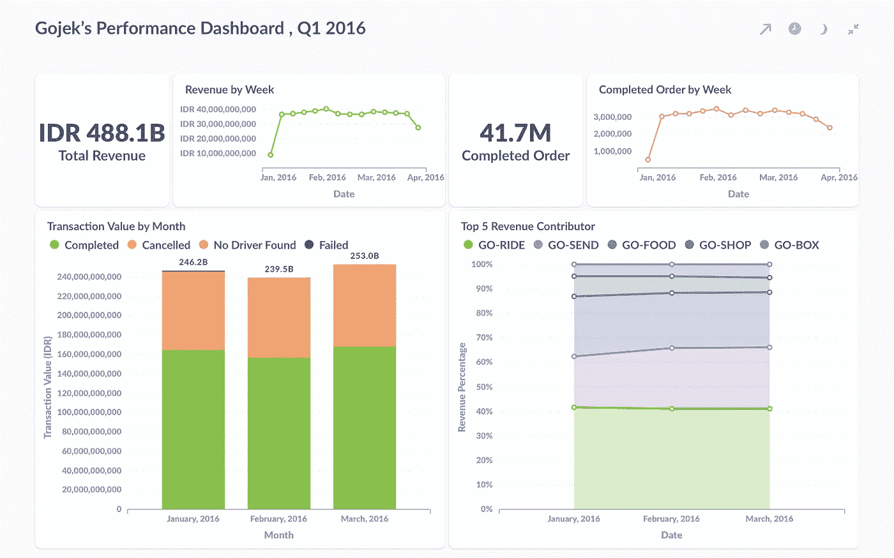
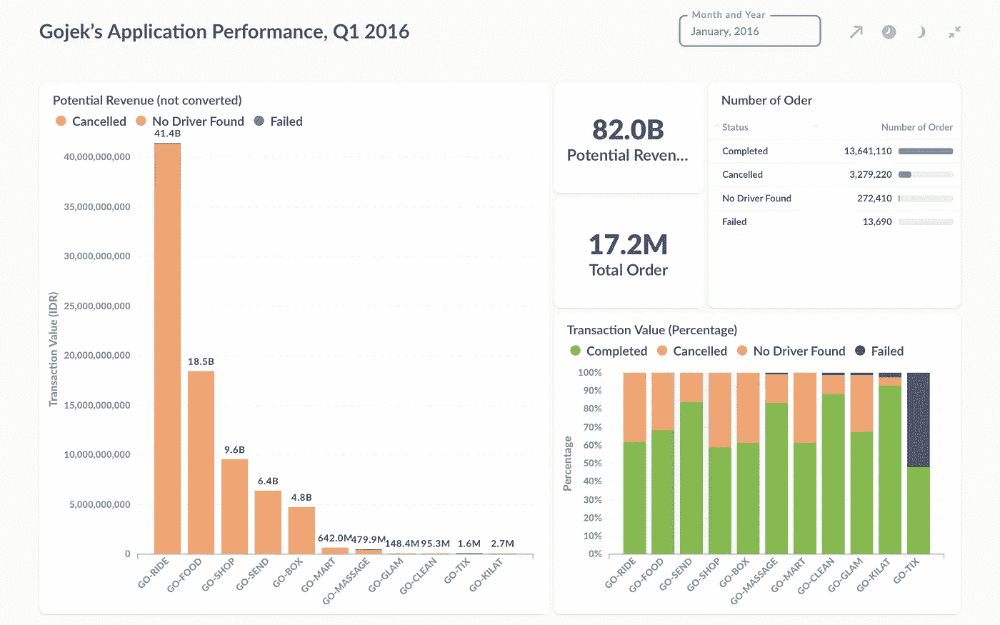

# 分析 Gojek 数据集—我第一次接触数据分析(第二部分)

> 原文：<https://medium.com/analytics-vidhya/analyzing-gojek-dataset-my-very-first-time-exposed-to-data-analytics-part-2-fd66cd9fcc5c?source=collection_archive---------10----------------------->

正如我在上一部分中提到的，我将尝试重做我之前对 Gojek 数据集所做的工作。在进一步学习数据分析并回顾我的第一次分析后，我意识到有相当多的事情可以做得更好。在这一部分中，我将介绍我会采取哪些不同的做法。反正第一部分没查过的可以看[这里](https://gharind.medium.com/analyzing-gojek-dataset-my-very-first-time-exposed-to-data-analytics-c22b69e0537a)。

# 我错过了什么

根据我的第一次分析，有几件事情没有出现，但我认为应该在第一时间出现，其中之一是数据分析师最重要的事情之一。数据清理。

## 数据清理…

根据我从许多数据分析师那里了解到的情况，数据清理几乎占据了他们数据分析流程总时间的 50%-80%。所以，永远不要放弃你的清洁任务。在前进之前，总是检查您可以做些什么来使您的数据质量更好，并在接下来的步骤中使您的数据处理更容易。

> 垃圾进，垃圾出，记得吗？是的，为了我们的结果，让我们做最不喜欢的数据分析部分；).

即使你认为你的数据在到达你面前时已经很好了，最好也要经常验证。这样做的另一个原因是**它实际上可以帮助你更好地理解你的数据**。至于我的情况，当我第一次看它时，它看起来已经很干净了，但正如我所说的，再扫描一遍。我是这样做的:

*   首先，我将 CSV 文件加载到 MySQL(仅供参考，我只在第一次使用 excel)。
*   然后，在探究了表格之后，我想出了几件我认为应该做的事情。
*   首先，我将事务值和订单数列中的 NULL 值更改为 0。我这样做是因为通常 NULL/missing 值要么被删除，要么被赋予其他值。在这种情况下，我简单地使用 0，并将状态更改为“失败”(稍后将详细介绍)。请注意，如果您忘记了并且仍然保留 NULL，那么如果您尝试基于数字列进行一些计算，您可能会遇到问题，所以请记住这一点。
*   然后，我把状态栏里的“失败/超时”和“其他”改成了“失败”。因为他们实际上有相同的意思，所以这样做是为了避免将来混淆。
*   接下来，我将状态指定为“失败”,其中订单数为 0 或者 transactions_value 为 0。即使它的状态是“完成”、“取消”或其他，我认为上面的其中一个也不能包含 0。因为如果是这样的话，就订单数量和交易价值而言，服务之间的比较就不会是苹果对苹果(想象一下，GO-FOOD 中有 0 个订单，但有 100000 个交易价值，GO-JEK 中有 10 个订单，但有 50000 个交易价值)。我认为实际的最佳做法是，与数据收集团队交谈并核实数据，而不是直接将他们归入“失败”类别。但是既然我们不能这样做，就假设数据收集团队已经告诉我们所有的都是“系统错误/失败”
*   最后，我删除了四月份的所有行，因为在四月份，我们只有一天的数据。因为我们要做季度报告，所以有必要在四月份删除数据。

# 关键见解

思考的过程和上次差不多，只是这次我试图以更清晰的方式和形象化的方式来总结，当然也是以更有趣的方式。

## Gojek 的表演看起来怎么样…

*   就 Q1 而言，Gojek 累计总收入为 4881.8 亿印度卢比，完成订单总数为 4170 万份。
*   看周营收和完成订单，Gojek 有一条相当稳定的线。
    *附言*:开始时，周划分开始于 2015 年 12 月 27 日，结束时，周划分结束于 2016 年 4 月 2 日，这两者实际上都不在数据集中
*   gojek 2016 年 2 月的收入略有下降，但在 2016 年 3 月迅速反弹。
*   产生最高收入的服务是 GO-RIDE，其次是 GO-SEND、GO-FOOD、GO-SHOP 和 GO-BOX。

## 让我们也看看 Gojek 的应用程序性能…

在框架中:仪表板过滤于 2016 年 1 月

*   至于 Q1 Gojek，平均累计订单总数为 1700 万，完成订单的 78%左右，取消订单的 19%。
*   从潜在收入来看，我们可以看到 gojek 错过了每月 820 亿美元的潜在转换。
*   很明显，大部分潜在收入来自取消的订单，这意味着我们必须更深入地研究可能导致订单取消的问题。
*   另一件引起我注意的事情(也许你也一样)是在其中一张图中有一种明显的黑色。是的，是 **GO-TIX** 。正如你所看到的，GO-TIX 有一个非常严重的问题，即**系统错误/失败**(超过一半的交易金额处于“失败”状态)**。**

# 我应该建议什么呢？

> 数据分析师在陈述结束前做的最后一件重要事情是给出建议。所以我们就这么做吧。

关注第二个控制面板，我首先要提到的是整体取消率。我强烈建议数据团队进一步分析和钻研另一个数据来回答“如何降低我们的取消率？”。有很多可能性可以做到，但由于我们没有任何资源(即数据)来实际做任何事情，我们只能猜测。我认为团队可以从查看每种状态的“寻找驱动程序”时间开始，是否有任何模式将每种状态与其他状态区分开来。取消的那个会让顾客等得更久吗？或者，他们可以调查车手之星与订单状态之间的关系。

> 它有什么有趣的模式能给我们线索吗？是的，我知道我说得好像数据分析师是某种侦探一样(或者也许他们是，嗯，在某种程度上)。

你能想到任何可能给你“我们怎样才能……”这个问题答案的想法，包括关于取消的那个。正如你所猜测的，Gojek 的人们绝对意识到了这个问题，并试图回答它，是的，他们做到了。他们现在已经实现了一个名为 Trip Advisor 的功能。

> Trip Advisor 试图根据历史数据预测客户行为，并为司机提供他们可以采取哪些措施来避免潜在的取消。

关于这个的更多见解，你可以在这里阅读[。不用说，这是一个非常酷的想法。](https://blog.gojekengineering.com/how-one-feature-helps-gojek-reduce-booking-cancellations-466cb0359691)

最后，你可能已经猜到了我们应该对围棋 TIX 提出什么建议。是的，我们必须做大量的故障排除和错误修复，我们可以说把它留给软件工程师，他们是这类事情的佼佼者；).

*另外，感谢我的朋友托，他也是一位了不起的软件工程师，是一位了不起的、支持我的朋友；).你可以在这里查看他的简介*

*如你所见，与我做的第一个分析相比，我认为这个更清晰，我很喜欢它。不过话虽如此，我也不讨厌我的第一次分析。我的意思是，我能不断前进，不断学习只是因为我迈出了第一步。我无法想象如果我坐着做我不喜欢做的事情，而不是做我喜欢做的事情和学习数据分析(我认为能够选择你想做的事情是一种特权，所以我永远心存感激)。*

*以后继续关注我的空间有更多像这样的关于数据分析的帖子！干杯；).*