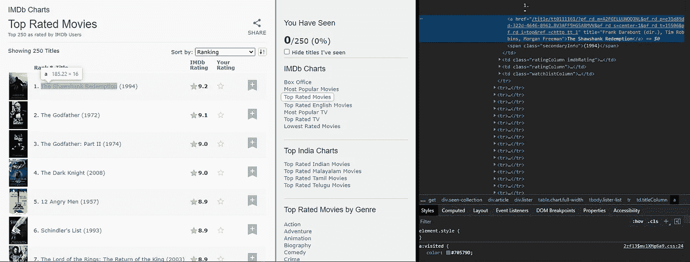
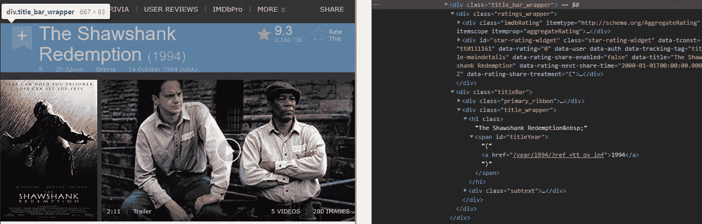
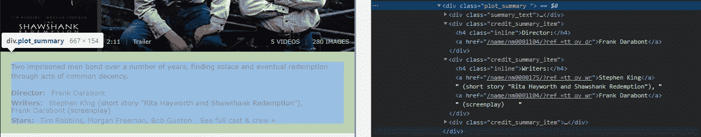
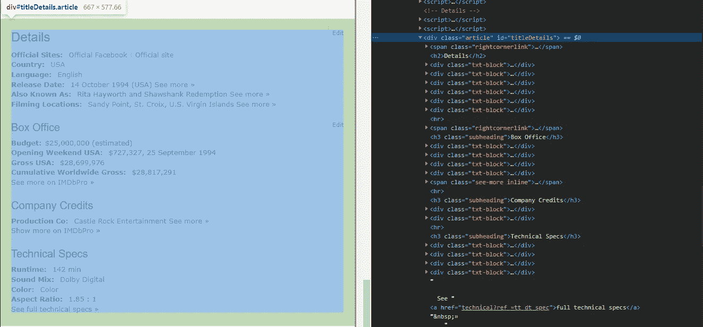
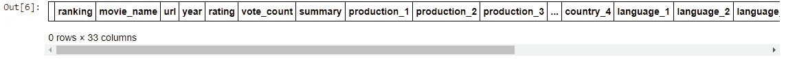
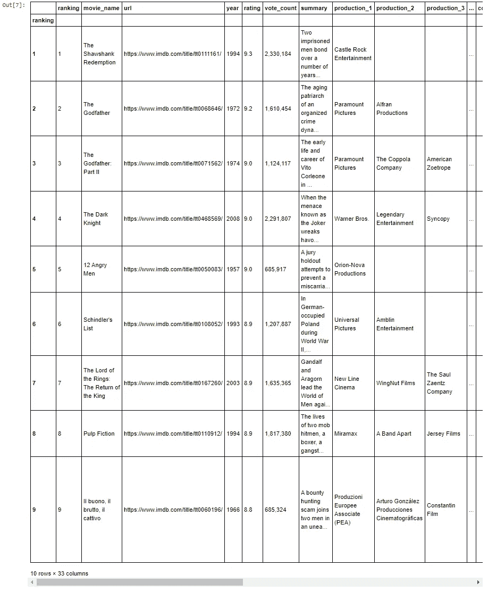

# 分析 IMDb 电影 250 强:第一部分:让我们收集一些数据

> 原文：<https://medium.com/analytics-vidhya/analyzing-imdbs-top-250-movies-part-1-let-scrape-some-data-a422adc3eb8d?source=collection_archive---------3----------------------->

网页抓取 IMDb 前 250 部电影的数据，对数据进行统计分析


丹尼斯·简斯在 [Unsplash](https://unsplash.com?utm_source=medium&utm_medium=referral) 拍摄的照片

# 介绍📔

上个月，当我们和一个朋友出去喝几杯时，我们开始讨论今年上映的许多电影，就像在这种情况下人们会做的那样。在我们冒险看电影的过程中，我被朋友问我的一个问题引起了兴趣；

> **什么因素决定一部电影是否成功？**

这引起了我足够的兴趣，以至于我想对这些电影进行统计分析。得益于[](https://www.imdb.com/)****(互联网电影数据库)，获取电影数据相当容易。顺便提一下，值得一提的是 IMDb 提供了一个相当庞大的数据字典，有将近 700 万个标题。但是这是一个我不想打开的难题(我以后会深入研究它，但至少不是现在)。这里，我将使用 IMDb 排行榜中排名最高的电影(IMDb 前 250)。****

# ****让我们收集数据🔍****

****分析 IMDb 250 强数据的第一步是从网站上抓取数据，并从中创建一个合理的数据集。Python 为我提供了一些有用的包，如[*beautiful soup*](https://pypi.org/project/beautifulsoup4/)*和[*Requests*](https://pypi.org/project/requests/)*，让我可以轻松地从这些电影中抓取有用的数据。让我们首先分析页面及其底层 HTML 代码，以获得所需的数据。******

> ******对于那些不想了解整个网络废弃过程的人来说。这里是 [Github 链接](https://github.com/SDhanush163/NoMoIMDb/blob/main/imdb-data-processing.ipynb)到 Python Jupyter 笔记本。(*如果你觉得有用就去做⭐️吧💛)*******

************

******imdb.com/chart/top 的 IMDb 顶级电影([)和相应的源代码](https://www.imdb.com/chart/top)******

******该页面包括显示前 250 部电影的表格。表格中的每一行都包含这部电影的海报、它的排名和标题，以及它的 IMDb 评分(它还有一些其他列，但这些是我感兴趣的)。电影的标题是一个超链接，将我们带到特定电影的详细信息页面。我感兴趣的就是这个链接。一旦有了这些链接，我就可以深入到每部电影的各个页面，获得更多的数据。******

```
****url = 'https://www.imdb.com/chart/top'
url_text = requests.get(url).text
soup = BeautifulSoup(url_text, 'html.parser'template = 'https://www.imdb.com%s'
**title_links** = [template % a.attrs.get('href') *for* a *in* url_soup.select( 'td.titleColumn a' )]****
```

******通过这个简单的代码，我获得了所有电影的链接。现在只需要浏览每一页(当然是用 for 循环)并收集我需要的数据。******

************

******[《肖申克的救赎》](https://www.imdb.com/title/tt0111161/)展示 div 的电影页面******

******现在来谈谈整个 web 报废操作的主要内容。第一组也是最重要的一组数据来自标题栏。所有这些数据都打包在一个类名为`title_bar_wrapper`的 div 中。******

*******由此，我们可以导出以下字段:*******

******🚀电影名称
🚀发布日期和年份
🚀IMDb 电影分级
🚀审查委员会对电影的评价(U，U/A，R 等。)
🚀其总运行时间
🚀它的类型******

```
******movie_name** = (page_soup.find("div",{ "class":"title_wrapper" }).get_text( strip=True ).split('|')[0]).split('(')[0]**year** = ((page_soup.find("div",{ "class":"title_wrapper" }).get_text( strip=True ).split('|')[0]).split('(')[1]).split(')')[0]**rating** = page_soup.find("span",{"itemprop":"ratingValue"}).text
**vote_count** = page_soup.find("span",{"itemprop":"ratingCount"}).textsubtext= page_soup.find("div",{ "class":"subtext" }).get_text( strip=True ).split('|' )****
```

******上面的代码把上面提到的所有字段和潜台词都刮了。潜台词包含其余的数据。但是有一个问题，很少有电影被审查委员会分级。当电影未分级时，潜台词数组没有它的字段。所以我想出了下面的代码来解决这个问题。当电影未分级时，潜台词数组没有它的字段。因此，在这种情况下，我只是给这些电影增加了一个名为`No Rating`的审查评级。******

```
*****if* len(subtext) < 4:
   *# Setting values when the movie is unrated* **censor_rating** = "No rating"
   **movie_length** = subtext[0]**genre_list** = subtext[1].split(',')
   *while* len(genre_list) < 4: 
      genre_list.append(' ')release_date_and_country = subtext[2].split('(')
   **release_date** = release_date_and_country[0]*else*:
   **censor_rating** = subtext[0]
   **movie_length** = subtext[1]

   **genre_list** = subtext[2].split(',')
   *while* len(genre_list) < 4: 
      genre_list.append(' ')release_date_and_country = subtext[3].split('(')
   **release_date** = release_date_and_country[0]****
```

******在海报、视频和电影图片的下面，是我能收集到的下一组数据点；剧情概要(*我真的没有这个打算。我现在只是把它拼凑起来，因为如果我决定用它来执行 NLP 或其他什么的话，我就懒得做了*、电影导演的名字、电影的编剧以及电影中的主要明星。情节摘要更容易，因为它可以从类名为`summary_text`的 div 中的文本中提取。******

************

******电影《肖申克的救赎》的剧情概要和其他与剧情相关的演职员表******

******删除其余的细节会稍微棘手一些。其他三个细节都用类名`credit_summary_item`包装在一个单独的 div 中。这意味着我必须找到一种方法，将它们作为一个单一的对象，然后将它们分开。这就是 BeautifulSoup 的`find_all()`方法派上用场的地方。这让我可以一次刮下所有的 div，并把它们列成一个清单。一旦我有了这个列表，我可以从列表中弹出每一个，就这样，我得到了我想要的数据。******

```
******# Getting the movie summary**
**summary** = page_soup.find("div", {"class":"summary_text"}).get_text( strip=True ).strip()**# Getting the credits for the director and writers**
credit_summary = []for summary_item in page_soup.find_all("div",{ "class" : "credit_summary_item" }):
   credit_summary.append(re.split( ',|:|\|' ,summary_item.get_text( strip=True )))**stars** = credit_summary.pop()[1:4]
**writers** = credit_summary.pop()[1:3]
**director** = credit_summary.pop()[1:]while len(stars) < 3:
   stars.append(" ")while len(writers) < 2: 
   writers.append(" ")writer_1, writer_2 = writers
writer_1 = writer_1.split('(')[0]
writer_2 = writer_2.split('(')[0]****
```

******我感兴趣的最后一个部分是页面底部的数据量极大的部分，称为电影细节。该部分包含大量数据点，例如******

******🚀电影拍摄的国家。
🚀电影中使用的语言。
🚀票房详情。
🚀制作公司的详细信息和其他类似的详细信息。******

************

******电影详情[肖申克的救赎](https://www.imdb.com/title/tt0111161/)******

******现在，这一部分也和包含导演、编剧和明星的部分有着同样的困境；因为它们都在不同的 div 中，有相同的类名`txt-block`。因此，虽然使用前面的方法可能有效，但我发现更好的解决方法是使用字典并将所有这些 HTML 资源存储在这个字典中。这样，我可以很容易地使用提供的名称获得我正在寻找的数据，处理它，并获得我想要的数据点。在这种情况下，这是一种更好的方法，因为我有许多具有相同类名的字段，并且我需要其中的几个数据点。******

```
****box_office_details = []
box_office_dictionary = {'Country':'','Language':'','Budget':'', 'Opening Weekend USA':'','Gross USA':'','Cumulative Worldwide Gross':'','Production Co':''}*for* details *in* page_soup.find_all("div",{"class":"txt-block"}):
   detail = details.get_text(strip=True).split(':')*if* detail[0] in box_office_dictionary:
    box_office_details.append(detail)*for* detail *in* box_office_details:
   *if* detail[0] in box_office_dictionary:
      box_office_dictionary.update({detail[0] : detail[1]})**country** = box_office_dictionary['Country'].split("|")
*while* len(country) < 4: 
   country.append(' ')**language** = box_office_dictionary['Language'].split("|")
*while* len(language) < 5: 
   language.append(' ')**budget** = box_office_dictionary['Budget'].split('(')[0]
**opening_week_usa** = ','.join((box_office_dictionary['Opening Weekend USA'].split(' ')[0]).split(',')[:-1])
**gross_usa** = box_office_dictionary['Gross USA']
**gross_worldwide** = box_office_dictionary['Cumulative Worldwide Gross'].split(' ')[0]**production_list** = box_office_dictionary['Production Co'].split('See more')[0]
**production** = production_list.split(',')
*while* len(production) < 4: 
   production.append(" ")****
```

# ******保存数据💾******

******万岁。我终于从这些电影中搜集到了所有的数据。现在我可以把这些数据存储在某个地方，然后不用它做任何事情…我只是在开玩笑(在我的博客中使用幽默——✅😆).我想以两种形式存储数据；作为 JSON 对象和 DataFrame。DataFrame 允许我使用 Python 轻松地提取我需要的特性和相关性，并将这些数据存储为 JSON 对象将使其他编程语言使用这些数据变得容易。所以让我们从简单的开始。******

## ******1.存储为 JSON 对象******

******现在我已经收集了所有我想要的数据，我创建了一个包含这些数据点的字典，并用它创建了一个列表，为所有 250 部电影创建了一个电影细节数组。******

```
****imdb_movie_list = []***... #For loop* movie_dict** = { 'ranking': i+1, 'movie_name': movie_name, 'url': page_url, 'year': year, 'rating': rating, 'vote_count': vote_count, 'summary': summary, 'production': production, 'director': director, 'writers': [writer_1, writer_2], 'stars': stars, 'genres': genre_list, 'release_date': release_date, 'censor_rating': censor_rating, 'movie_length': movie_length, 'country': country, 'language': language, 'budget': budget, 'gross_worldwide': gross_worldwide, 'gross_usa': gross_usa,'opening_week_usa': opening_week_usa}
***... #For loop ends here***imdb_movie_list.append(movie_dict)****
```

******我还在混合中添加了一个时间戳，这样我就可以跟踪我下一次抓取数据的时间，为了将它存储为一个 JSON 对象，我使用 Python 的包`json`并将数据转储到`imdb_movies_data.json`文件中。******

```
****timestamp =  datetime.now().strftime('%Y-%m-%dT%H:%M:%S.%f')
**imdb_list** = {
   "timestamp" : timestamp,
   "imdb_movies" : imdb_movie_list
}*with* open('imdb_movies_data.json', 'w') *as* file:
   json.dump(imdb_list, file)****
```

## ******2.将数据帧存储到 CSV 中******

******Pandas DataFrame 是一种数据结构，包含带有相应标签的二维数据。它比表格或电子表格更快、更容易使用、更强大，因为它们是 Python 和 NumPy 生态系统不可或缺的一部分。在外部，我可以将数据帧保存为 CSV(逗号分隔值)文件，供以后随时使用。******

******首先，我需要创建数据帧。我选择用属性列表来设置列。我有 33 列，并将某些属性分成多列，而不是将它们保存为列表对象。这将减少我的工作量，当我不得不从这个属性集中提取数据时。******

```
****dataframe_columns = [ 'ranking', 'movie_name', 'url', 'year', 'rating', 'vote_count', 'summary', 'production_1', 'production_2', 'production_3', 'director', 'writer_1', 'writer_2', 'star_1', 'star_2', 'star_3', 'genre_1', 'genre_2', 'genre_3', 'genre_4','release_date', 'censor_rating', 'movie_length', 'country_1', 'country_2', 'country_3', 'country_4', 'language_1', 'language_2', 'language_3', 'language_4', 'language_5', 'budget', 'gross_worldwide', 'gross_usa','opening_week_usa']dataframe = pd.DataFrame(columns=dataframe_columns)****
```

************

******使用列表设置列的空数据帧******

******创建数据帧的最后一步是存储数据。这很容易实现，因为我已经聪明地将所有数据存储在所有电影的字典列表中。我现在要做的就是遍历列表，将字典设置到相应的列。******

```
****for i in range(0, len(imdb_movie_list)):
 dataframe.at[i,'ranking'] = imdb_movie_list[i]['ranking']
 dataframe.at[i,'movie_name'] = imdb_movie_list[i]['movie_name']
 dataframe.at[i,'url'] = imdb_movie_list[i]['url']
 dataframe.at[i,'year'] = imdb_movie_list[i]['year']
 dataframe.at[i,'rating'] = imdb_movie_list[i]['rating']
 dataframe.at[i,'vote_count'] = imdb_movie_list[i]['vote_count']
 dataframe.at[i,'summary'] = imdb_movie_list[i]['summary']dataframe.at[i,'production_1']= imdb_movie_list[i]['production'][0]
 dataframe.at[i,'production_2']= imdb_movie_list[i]['production'][1]
 dataframe.at[i,'production_3']= imdb_movie_list[i]['production'][2]

 dataframe.at[i,'director'] = imdb_movie_list[i]['director'][0]
 dataframe.at[i,'writer_1'] = imdb_movie_list[i]['writers'][0]
 dataframe.at[i,'writer_2'] = imdb_movie_list[i]['writers'][1]
 dataframe.at[i, 'star_1'] = imdb_movie_list[i]['stars'][0]
 dataframe.at[i, 'star_2'] = imdb_movie_list[i]['stars'][1]
 dataframe.at[i, 'star_3'] = imdb_movie_list[i]['stars'][2]dataframe.at[i,'genre_1'] = imdb_movie_list[i]['genres'][0]
 dataframe.at[i,'genre_2'] = imdb_movie_list[i]['genres'][1]
 dataframe.at[i,'genre_3'] = imdb_movie_list[i]['genres'][2]
 dataframe.at[i,'genre_4'] = imdb_movie_list[i]['genres'][3]dataframe.at[i,'release_date'] = imdb_movie_list[i]['release_date']
 dataframe.at[i,'censor_rating'] = imdb_movie_list[i]['censor_rating']
 dataframe.at[i,'movie_length'] = imdb_movie_list[i]['movie_length']dataframe.at[i,'country_1'] = imdb_movie_list[i]['country'][0]
 dataframe.at[i,'country_2'] = imdb_movie_list[i]['country'][1]
 dataframe.at[i,'country_3'] = imdb_movie_list[i]['country'][2]
 dataframe.at[i,'country_4'] = imdb_movie_list[i]['country'][3]dataframe.at[i,'language_1'] = imdb_movie_list[i]['language'][0]
 dataframe.at[i,'language_2'] = imdb_movie_list[i]['language'][1]
 dataframe.at[i,'language_3'] = imdb_movie_list[i]['language'][2]
 dataframe.at[i,'language_4'] = imdb_movie_list[i]['language'][3]
 dataframe.at[i,'language_5'] = imdb_movie_list[i]['language'][4]dataframe.at[i,'budget'] = imdb_movie_list[i]['budget']
 dataframe.at[i,'gross_worldwide'] = imdb_movie_list[i]['gross_worldwide']
 dataframe.at[i,'gross_usa'] = imdb_movie_list[i]['gross_usa']
 dataframe.at[i,'opening_week_usa'] = imdb_movie_list[i]['opening_week_usa']dataframe = dataframe.set_index(['ranking'], drop=False)dataframe.to_csv('imdb_movies_data.csv')****
```

************

******这是我对 IMDb 250 强电影分析的第一部分。收集了所有这些数据后，接下来是提取我喜欢的数据集，并对它们进行统计分析。一旦分析完成，我将与你分享我的所有发现。******

******同样，完整的代码可以在 Python Jupyter Notebook 的 GitHub 上[这里](https://github.com/SDhanush163/NoMoIMDb/blob/main/imdb-data-processing.ipynb)获得。如果你喜欢，就把它丢给⭐️。******

******我希望您喜欢并从这篇文章中学到一些关于收集数据的有趣的东西。谢谢你陪我走过这段旅程。如果您对此有任何问题、疑问或想法，请随时👏并评论。谢谢！******

************

******照片由[普里西拉·杜·普里兹](https://unsplash.com/@priscilladupreez?utm_source=medium&utm_medium=referral)在 [Unsplash](https://unsplash.com?utm_source=medium&utm_medium=referral) 上拍摄******