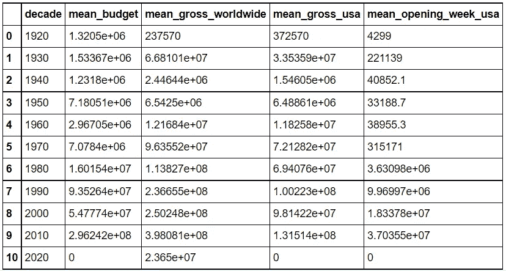

# 分析 IMDb 电影 250 强:第二部分:提取有用的数据集

> 原文：<https://medium.com/analytics-vidhya/analyzing-imdbs-top-250-movies-part-2-extract-useful-datasets-e17f7ba15563?source=collection_archive---------12----------------------->

从 IMDb 250 强电影数据框架中提取有用信息


Avel Chuklanov 在 [Unsplash](https://unsplash.com?utm_source=medium&utm_medium=referral) 上拍摄的照片

这篇文章是我分析[IMDb 250 强电影](https://www.imdb.com/chart/top)之旅的第二部分。在[第一部分](/analytics-vidhya/analyzing-imdbs-top-250-movies-part-1-let-scrape-some-data-a422adc3eb8d)；早在一月份，我经历了如何从收视率最高的电影中搜集 IMDb 排行榜的数据，并从中创建一个广泛的数据框架。可悲的是，生活挡住了我的去路，直到现在我都无法回到过去。所以，我关于不对第 1 部分中的数据做任何事情的玩笑实现了😝

无论如何，在这一部分，我将回顾我是如何从主数据框架中提取信息并创建有用的数据集的。这将允许我策划和分析这些电影，并帮助我理解 ***决定一部电影是否成功的因素是什么？***

> 同样，对于那些不想通读全文而只是对代码感兴趣的人来说，这里有到 Python Jupiter 笔记本的 [Github 链接](https://github.com/SDhanush163/NoMoIMDb/blob/main/imdb-data-analytics-extractor.ipynb)。如果你喜欢，就把它丢给 a⭐️。

# 在我们开始提取数据之前

原始数据帧包含每部电影的 30 多个唯一数据点。这包括名称、评级和发行年份等细节；电影制作细节，如制作公司、导演、编剧和明星；它的预算细节，语言，流派，等等。

在我开始提取数据集之前，为了让我的生活更轻松，我选择将电影分成几十年。用一行代码就可以很容易地将它添加到数据帧中；将 year 列中的值除以底数，然后乘以 10。

```
**movie_data['decade']** = ((movie_data['year'] // 10).astype(int) * 10)
```


我选择按年代对电影进行分组，背后有一个很好的理由。有几个字段，如电影的数量，评级等。我想比较一下世界反应时。假设数据只包含 250 个不同的点，发布年份从 1921 年到 2020 年，在最坏的情况下，我可能会得到过于平坦的数据，其中很多年份都没有或只有一个数据点。

> 注:十年从定义十年的年份开始。因此，假设 2010 年从 2010 年开始，到 2019 年结束

# 让我们开始提取📁

如前所述，我已经列出了几个领域，我相信这些领域会提供有用的信息。我感兴趣的另一种比较是分类数据的比较。概括地说，我将提取过程分为两个部分:

1.  为基于时间的比较提取数据集。
2.  分类数据集的提取。

## 用于基于时间的比较的数据集提取⏰

第一个也是最容易提取的数据集是每十年的电影数量。现在，您可能会认为我需要某种计数器来计算每个特定十年的电影数量，然后根据该十年存储它们。是的，这是实现它的一种方式。但是让我告诉你如何用一种更简单的方法来实现。

```
**no_movies_per_decade** = pd.DataFrame({
   "decade" : movie_data['decade'].value_counts().index,
   "movies" : movie_data['decade'].value_counts()
}).sort_values('decade').reset_index(drop = True)no_movies_per_decade_json = no_movies_per_decade.to_dict('records')
```


正如他们所说，“这是非常基本的，亲爱的。”你看，我不需要把每部电影都与一个独特的十年相对照。“十年”字段为我做了这件事。我所要做的就是计算每个十年重复多少次，瞧，我得到了我想要的结果。此外，代码中的最后一行是将数据集从 Pandas DataFrame 转换为 JSON 数组。

我想提取的下一组数据集是每十年电影获得的平均评分和投票。在这一点上，需要注意的是，虽然 pandas 可以隐式地识别数值和非数值，但是它在执行这种识别时的智能程度非常有限。因此，虽然它正确地将评级标识为`float64`，但投票被标识为`object`，这意味着在计算平均值之前，我必须将它们转换为`int`。

```
**movie_rating_per_decade** = pd.DataFrame({
   "decade" : movie_data['decade'].value_counts().index,
   "mean_rating" : None
}).sort_values('decade').reset_index(drop = True)*for* i *in* range(len(movie_rating_per_decade)):
   decade_filter = movie_data['decade'] == 
                   movie_rating_per_decade.iloc[i,0]
   filtered_movies = movie_data[decade_filter]
   movie_rating_per_decade.iloc[i,1] = 
                   round(filtered_movies['rating'].mean(), 3)
```

提取每十年电影平均收视率的过程非常简单。我从一个包含每个独特十年和平均评级栏的数据框架开始。但是，在数据框架定义期间，我没有向“平均评级”列添加任何值。对于这个专栏，我将筛选特定十年的电影，然后从这些筛选出的电影中，找到这十年的平均评级。

好了，现在让我们来处理一下投票被识别为对象而不是整数的小烦恼。


老实说，解决方案非常简单，应该早点解决。我所要做的就是用一个简单的 lambda 过滤投票列中的值，只允许数字。类似`int(‘’.join(filter(lambda x : x.isdigit(), movies_data.iloc[i,6] )))`的东西

```
decade_to_vote =  pd.DataFrame({
   'decade' : movie_data['decade'].values,
   'votes' : movie_data['vote_count'].values
})*for* i *in* range(len(decade_to_vote)):
   decade_to_vote.iloc[i,1] = int(''.join(filter(lambda x : x.isdigit(), decade_to_vote.iloc[i,1] )))*for* i *in* range(len(movie_votes_per_decade)):
   decade_filter = decade_to_vote['decade'] == 
                   movie_votes_per_decade.iloc[i,0]
   filtered_votes = decade_to_vote[decade_filter]
   movie_votes_per_decade.iloc[i,1] = 
                   round(filtered_votes['votes'].mean(), 3)
```

这里，我添加了一点额外的逻辑来帮助我提取数据集。首先，我添加了一个 DataFrame 来分别获取 Decade 和 vote 列。然后，我执行了类型转换和过滤，类似于这个数据帧上的评级。

我想创建的最后一个数据集涉及票房数据。这意味着预算，全球，美国的总收入，以及在美国的开幕周。检索它们与我创建平均投票数据集所做的是一样的，但是这里不是有一列，而是有 4 列。

> 我知道我必须将这四个字段转换成整数，因为我选择了包含它们的货币符号。


```
movie_budget_per_decade = pd.DataFrame({
   "decade" : movie_data['decade'].value_counts().index,
   "mean_budget" : None,
   "mean_gross_worldwide" : None,
   "mean_gross_usa": None,
   "mean_opening_week_usa":None
}).sort_values('decade').reset_index(drop = True
```

这意味着数据帧看起来像这样。



每十年票房详情

## 分类数据集及其处理方法

我感兴趣的列包含非有序分类数据。看到这一点，许多人可能会选择对数据进行编码，然后处理这一大堆蠕虫。如果以前没有人说过，让我第一个告诉你，你不必每次遇到分类数据都执行编码。不需要对数据进行编码就可以直接获得大量信息。

现在，让我向您展示为什么`Pandas`是处理数据的首选库，以及它如何能够大大简化我的生活。


1.  `value_counts()`是 Pandas 提供的一种方法，它返回一个包含唯一值计数的序列。它完全简化了唯一值的计数。您不再需要执行一次性编码，然后计算出现次数。`Pandas`那就去办吧。
2.  `Pandas`有多种方法，如`isnull(), notnull(), dropna()`等。，它可以帮助我们直接从数据帧中找到并处理丢失的数据。

## 🧮分类数据集的提取

对于分类数据，我希望获得两个主要指标，每个唯一点的出现次数，以及与之相关的平均 IMDB 评分。至于我对哪些数据感兴趣；我想提取一些与电影相关的细节和一些一般的细节。这些是:

1.  导演、制作公司、审查等级和类型。
2.  使用的语言和电影拍摄的国家。

```
director_data = pd.DataFrame({
   'director' : movie_data['director'].value_counts().index,
   'count' : movie_data['director'].value_counts(),
   'mean_imdb_rating' : None
}).sort_values('director').reset_index(drop = True)
```

对于每个数据集，过程是相同的。首先，我创建了一个数据框架，其中包含指数、计数和一个 IMDb 平均评级字段。`value_counts()`方法让我可以轻松获得每个数据点的索引和计数。计算平均 IMDb 评分的过程类似于我之前写的。

此外，对于没有值的字段，如第二、第三和第四语言等。，我选择将这些字段转换成`NaN`，然后使用 Pandas 提供的方法`dropna()`删除它们。

```
secondary_language_data['language'].replace(' ', np.nan, inplace=True)secondary_language_data.dropna(subset=['language'], inplace=True)
```

所以最后，提取分类数据的整个代码*(记住它们都遵循或多或少相同的前提)*看起来像这样:

```
**primary_language_data** = pd.DataFrame({
   'language' : movie_data['language_1'].value_counts().index,
   'count' : movie_data['language_1'].value_counts(),
   'mean_imdb_rating' : None
}).sort_values('language').reset_index(drop = True)primary_language_data['language'].replace(' ', np.nan, inplace=True)
primary_language_data.dropna(subset=['language'], inplace=True)*for* i *in* range(len(primary_language_data)):
   language_filter = movie_data['language_1'] == 
                     primary_language_data.iloc[i,0]
   filtered_movies = movie_data[language_filter]
   primary_language_data.iloc[i,2] = 
                     round(filtered_movies['rating'].mean(), 3)**primary_language_data_json**= primary_language_data.to_dict('records')
```

提取了我想要的所有数据集后，最后一步是将它们保存为所需的格式，以便我可以绘制和分析数据。与第 1 部分类似，我将所有数据集保存在一个 JSON 对象中，并将每个数据帧保存为一个 CSV 文件。我不打算在这里重复我是如何拯救他们的，因为我已经在这里解释过。

好了，我旅程的第二部分到此结束。剩下的就是绘制和分析数据。当我完成分析后，我会尽快公布结果。与此同时，我希望您喜欢并找到一些有用的信息，以便提取有用的数据。我也希望我能够提供一些关于熊猫作为一个数据操作库有多强大的提示。

同样，完整的代码可以在 GitHub 的 Python Jupyter 笔记本[这里](https://github.com/SDhanush163/NoMoIMDb/blob/main/imdb-data-analytics-extractor.ipynb)获得。如果你喜欢，就把它丢给⭐️。如果您对此有任何问题、疑问或想法，请随时👏并评论。谢谢！


皮特·佩德罗萨在 [Unsplash](https://unsplash.com?utm_source=medium&utm_medium=referral) 上的照片