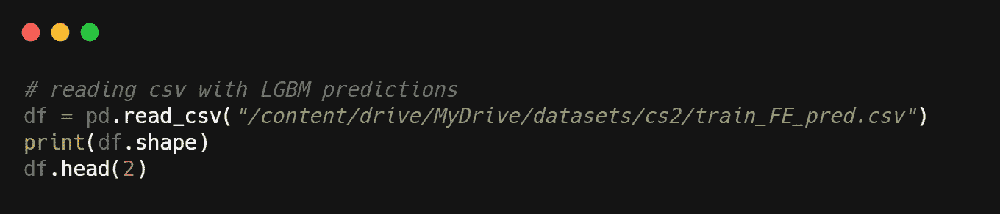

# 桑坦德银行客户交易预测问题的机器学习模型误差分析

> 原文：<https://medium.com/analytics-vidhya/analyzing-machine-learning-model-errors-on-santander-customer-transaction-prediction-problem-d59cad403e7c?source=collection_archive---------5----------------------->

## LinkedIn [简介](https://www.linkedin.com/in/ankit-shah-643ab3217) & [GitHub](https://github.com/ankitshah-dev/Analyzing-machine-learning-model-errors) 简介

你有没有想过为什么你的一些机器学习模型预测是不正确的，尽管准确性很高，其他性能指标？

> 获得良好的准确性就像在比赛前赢得掷硬币比赛一样。很好，但是还有很多工作要做。

一般来说，当你得到低准确度分数时，你可以尝试调整模型超参数，看看这是否有助于提高你的准确度，这里我们将更多地关注**数据驱动方法**。

在本文中，我们将重点关注**分析机器学习模型产生的错误，找出数据中的错误。然后，对您的数据进行一些更改并重新训练您的模型。**

下面是我们将要经历的部分:

1.  问题的介绍和概述
2.  数据概述
3.  将现实世界的问题映射到最大似然问题
4.  电子设计自动化(Electronic Design Automation)
5.  特征工程
6.  机器学习建模
7.  分析模型产生的错误

# 1.问题的介绍和概述

## **1.1。概述**

我们将使用 Kaggle 的**桑坦德银行客户交易预测**问题。

桑坦德银行是西班牙的一家银行，但自 2013 年以来一直为东北部的客户提供服务，在东北部和佛罗里达州设有分行和 2000 多台 ATM。

桑坦德银行过去曾举办过 4 次 Kaggle 比赛，其中“桑坦德银行客户交易预测”是 2019 年的最新一次。竞争是关于**识别哪些客户将在未来进行特定的交易，而不考虑交易的金额。**

## 1.2.ML 公式

我们在这里的任务是对客户是否会在未来进行交易进行分类。

## 1.3.业务限制

*   没有提到延迟限制
*   我们假设可解释性并不重要，因为在 Kaggle 提交页面上并没有将其作为一个约束条件

# 2.数据概述

您将获得一个匿名数据集，其中包含 **200 个数字特征变量**、**二进制** `**target**` **列**和**字符串** `**ID_code**` **列**。

## 文件描述

*   **train.csv** —训练集。
*   **test.csv** —测试集。测试集包含一些不包括在评分中的行。

**链接到数据集:**[https://www . ka ggle . com/c/Santander-customer-transaction-prediction/data](https://www.kaggle.com/c/santander-customer-transaction-prediction/data)

# 3.将现实世界的问题映射到最大似然问题

## 3.1.机器学习问题的类型

这是一个二元分类问题。

## 3.2.评估指标

根据这个 Kaggle 竞赛的规则，我们将使用预测概率和观察目标之间的 ROC 曲线 下的 [**区域。**](http://en.wikipedia.org/wiki/Receiver_operating_characteristic)

# 4.探索性数据分析

**我刚刚在这里添加了所需的代码片段。您应该可以找到我的 GitHub repo 的链接，了解详细的代码实现。**

# 4.1.数据集基本分析

## 4.1.1.首先让我们导入所有必要的库

## 4.1.2.读取训练和测试 csv 文件

**“我们有 20 万行用于训练和测试集。“目标”是训练集中的附加列，因此有 202 列“**

## 4.1.3.检查训练和测试数据集中的重复项

**“训练集和测试集中没有重复的行”**

## 4.1.4.检查训练和测试数据集中的空值

**“训练集和测试集中均无‘空’”**

## 4.1.5.训练和测试数据观察:

*   训练数据包含 200k*202 个形状。
*   测试数据包含 200k*201 形状。目标是这里缺失的列
*   在训练和测试数据中都“没有重复和缺失的值”

# 4.2.单变量分析

## 4.2.1.目标在训练数据中的分布

**“目标明显不平衡”**

## 4.2.2.按目标划分的所有 200 个特征的分布图

**左:**前 100 个特征的分布，**右:**后 100 个特征的分布

## 4.2.3.单变量分析观察值

*   目标明显不平衡，约 10%的客户进行了交易，其余的没有
*   如果我们观察分布图，两个类别之间的分布图大部分重叠，有几个特征，如 var0、var2、var6、var9 等。这可能是我们区分阶级的重要特征之一

# 4.3.多变量分析

## 4.3.1.特征之间的相关性

“正如我们所见，特征之间没有关联”

## 4.3.2.多元分析观察值

*   没有一个特征(X)是相互关联的，这就是为什么要模拟训练数据的原因

# 4.4.训练集和测试集是否属于同一分布？

为了实现这一点，我们将对训练集使用伪目标 1，对测试集使用伪目标 0，然后使用逻辑回归来分割伪目标。如果我们获得了良好的 AUC 分数，那么我们的训练和测试分布是不同的，否则它们是相同的。

“正如我们所见， **AUC 得分为 0.51** ，这很糟糕。因此**训练和测试装置具有相同的分布**

# 5.特征工程

我尝试了几个特性，试图生成新的特性。**我刚刚在这里添加了所需的代码片段。您应该可以找到我的 GitHub repo 的链接，以获得特性工程的详细代码实现。**

## 5.1.数字特征的频率编码

我们将在现有的 200 个特征上增加 200 个新的频率编码特征。因此，我们将用于培训的**总功能是 400** 。

演职员表:[https://www . ka ggle . com/cdeotte/200-magic-models-Santander-0-920](https://www.kaggle.com/cdeotte/200-magical-models-santander-0-920)

**“我们的培训和测试集的最终形状”**

# 6.机器学习建模

**你可以查看我的 GitHub repo 所有的模型实验。在这里，我将展示我们的二元分类问题的最佳模型结果。**

## 6.1.LGBM 模型

“如您所见，我们成功实现了 0.90 的**交叉验证 AUC 分数。”**

**使用 Kaggle 上的上述提交，我设法获得了 0.90383 的 AUC 分数，这是提交中的前 10%。**

" Kaggle 提交分数"

# 7.分析模型产生的错误

在本节中，我们将查看由模型产生的**错误，并尝试找出**为什么会产生**错误，以及是否有方法**通过使用 EDA** 获得洞察力来纠正错误。**

## 7.1.导入必要的库

## 7.2.读取带 LGBM 预测的 csv

"新列 **lgbm_predictions** 已添加到定型数据集中"

## 7.3.预测概率的分布

**观察:**看下面的图，我们可以使用阈值，而不是使用 0.5 来决定等级 0 或 1，我们可以使用 0.4，因为我们可以看到等级 0(蓝色)在大约 0.4 之后呈指数下降。

## 7.4.混淆矩阵

**观察:**由于数据集不平衡，我们可以看到占少数的**类 1(进行交易的客户)**表现不佳。需要看“假阴性”。

## 7.5.最错误分类的类别

**观察:**正如我们在上面看到的，类别 1 是分类错误最多的类别，一个原因是类别 1 的训练数据点很少。

## 7.6.深入了解 1 类

在这里，我们试图在错误分类的类 1 中找到一个模式，看看我们是否可以纠正数据，使模型表现得更好。

**观察:**正如我们在上面**看到的，超过 50%的 1 类被错误分类。**

## 7.7.使用降维技术

在这里，我们首先使用 **PCA 来解释约 95%的差异**，因为有 400 个特征，使用 T-SNE 会缓慢减少，然后使用 **T-SNE 进一步减少到 2 维**并可视化。

“使用 PCA，我们可以减少到 4 个特征，解释 95%的差异”

**“此处蓝色代表分类错误的 1 级”**

**观察:**不幸的是，这个训练数据集在放到 Kaggle 上之前已经进行了很好的特征设计，以至于错误分类均匀分布，没有显示出太多的模式。

## 7.8.“正确分类的 1 级分”和“错误分类的 1 级分”是同一个分布吗？

在本节中，我们将**将伪目标**添加到“正确分类的 1 级点”和“错误分类的 1 级点”中，并通过逻辑回归对它们进行运行，检查它们是否具有相同的分布。

" AUC 分数= 0.7588 "

**观察结果:**由于我们得到的 AUC 分数为 0.75，因此“正确分类的类别 1 点”和“错误分类的类别 1 点”的分布是不同的— ***这是一个重要的观察结果，因为它告诉我们为什么模型错误分类了类别 1。***

## 7.9.获取“前 n 名”功能以供进一步分析

在本节中，我们将使用 XGboost 来帮助我们了解可以用于进一步分析的前 15 个特性。

## 7.10.绘制分布图

在本节中，我们将针对上述导出的前 15 个特征，绘制**“0 级”**和**“错误分类 1 级点”的分布图。**

**“前 15 个特征分布图”**

**观察:**正如我们在下面看到的，“错误分类的 1 类”和“0 类”的分布基本相同，因此模型将一些数据点的 1 类错误分类为 0 类— ***这是一个重要的观察结果。***

# 最后意见

## 使用基本统计和一些可视化，我们可以得出以下结论:

*   使用降维 PCA 和 T-SNE，我们可以得出结论，错误分类和正确分类的第 1 类没有显示任何模式，并且均匀分布，因此对于错误分类的第 1 类点没有检测到异常值
*   更深入地观察前 15 个特征的分布，我们可以看到错误分类的第 1 类点与第 0 类分布非常相似，因此出现了错误分类。为了纠正这一点，我们需要查看错误分类的点或将其从数据集中移除，然后检查分数是否提高— ***。在移除数据点策略的情况下，我们需要小心不要过度拟合训练数据*** 。或者，我们可以检查这些错误分类的点的地面真实类标签是否不正确，以及当它们被标记时是否有错误

# 参考

1.  【https://www.kaggle.com/gpreda/santander-eda-and-prediction 
2.  [https://www . ka ggle . com/cdeotte/200-magic-models-Santander-0-920](https://www.kaggle.com/cdeotte/200-magical-models-santander-0-920)

# 个人资料链接

**GitHub:**[https://GitHub . com/ankitshah-dev/Analyzing-machine-learning-model-errors](https://github.com/ankitshah-dev/Analyzing-machine-learning-model-errors)

**领英:**[www.linkedin.com/in/ankitshah91](http://www.linkedin.com/in/ankitshah91)