# 分析电影评论情感

> 原文：<https://medium.com/analytics-vidhya/analyzing-movie-reviews-sentiment-911816f345e4?source=collection_archive---------11----------------------->

眼前的问题是情感分析或观点挖掘，我们希望分析一些文本文档，并根据文档的内容预测他们的情感或观点。

一般来说，情感分析似乎对主观文本最有效，人们在主观文本中表达观点、感受和情绪。

从现实世界的行业角度来看，情感分析被广泛用于分析公司调查、反馈调查、社交媒体数据以及电影、场所、商品等的评论。这个想法是分析和理解人们对特定实体的反应，并根据他们的情绪采取有见地的行动。

**设置依赖关系**

我们将使用几个专门针对文本分析、NLP 和机器学习的 Python 库和框架。在开始实习项目之前，你需要确保你已经安装了 pandas、numpy、scipy 和 scikit-learn。

将使用的 NLP 库；包括 spacy、nltk 和 gensim。一定要记得检查您安装的 nltk 版本至少是> = 3.2.4，否则，ToktokTokenizer 类可能不存在。

对于 nltk，在使用 pip 或 conda 安装 nltk 之后，您需要从 Python 或 ipython shell 中键入以下代码。import nltk nltk.download('all '，halt_on_error=False)

对于 spacy，您需要在 Unix shell/windows 命令提示符下键入以下代码，以安装库(如果您不想使用 conda，请使用 pip install spacy)并获得英语模型依赖项。

$ conda 配置—添加通道 conda-forge

$ conda 安装空间

$ python -m 空间下载 en

# **让我们开始逐步构建我们的项目:**

## 进口:

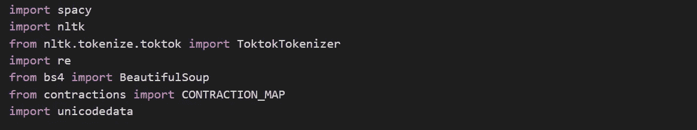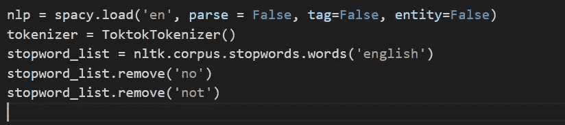

## **文本预处理和归一化:**

在进入特征工程和建模过程之前的一个关键步骤包括清理、预处理和规范化文本，以将短语和单词等文本组件转换为某种标准格式。这实现了跨文档语料库的标准化，这有助于构建有意义的特征，并有助于减少由于许多因素(如不相关的符号、特殊字符、XML 和 HTML 标签等)而引入的噪声。

## **清洗文字:**

我们的文本经常包含像 HTML 标签这样不必要的内容，这些内容在分析情感时不会增加多少价值。因此，我们需要确保在提取特征之前移除它们。BeautifulSoup 库在为此提供必要的函数方面做得非常出色。

我们的 strip_html_tags(…)函数完成了这项工作。

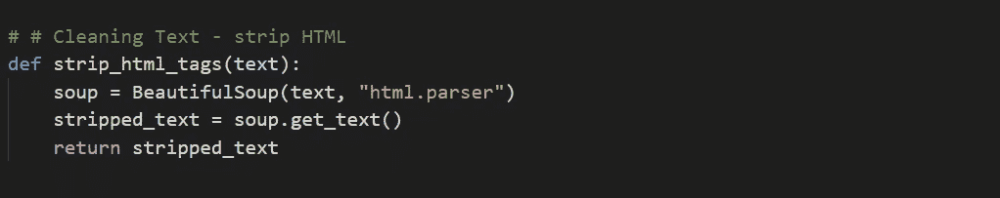

## **删除重音字符**:

在我们的数据集中，我们处理的是英语评论，所以我们需要确保任何其他格式的字符，尤其是重音字符都被转换并标准化为 ASCII 字符。一个简单的例子就是将é转换成 e。

我们的 remove_accented_chars(…)函数可以完成这项工作。

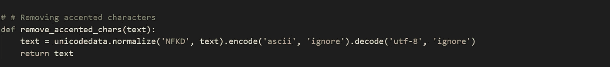

## **扩张收缩:**

在英语中，缩写基本上是单词或音节的缩写。这些现有单词或短语的缩短版本是通过删除特定的字母和声音创建的。例如，将“不要”扩展为“不做”和“我愿意”。缩写在文本规范化中造成了一个问题，因为我们必须处理像撇号这样的特殊字符，并且我们还必须将每个缩写转换为其扩展的原始形式。

我们的 expand _ constructions(…)函数完成了这项工作。

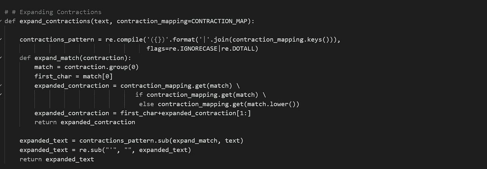

## **删除停用词:**

特别是当从文本构建有意义的特征时，具有很少或没有意义的词也被称为停用词。像 a、an、the 等词被认为是停用词。没有通用的停用词表，但是我们使用来自 nltk 的标准英语停用词表。如果需要，您还可以添加自己的特定于域的停用词。

函数 remove_stopwords(…)帮助我们删除停用词，并保留语料库中最有意义和上下文的词。

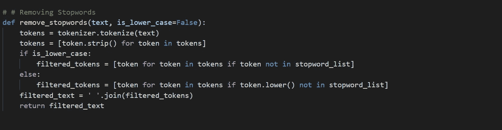

## **词干化和词汇化:**

词干通常是可能单词的基本形式，可以通过在词干上附加前缀和后缀等词缀来创建新单词。这就是所谓的变调。获取单词基本形式的相反过程称为词干提取。一个简单的例子是手表、手表和手表。他们有词根词干表作为基本形式

nltk 包提供了广泛的词干分析器，如 PorterStemmer 和 LancasterStemmer。词汇化与词干化非常相似，我们去掉词缀来获得单词的基本形式。然而，在这种情况下，基本形式被称为词根，而不是词干。区别在于词根总是字典上正确的单词(存在于字典中),但是词干可能不是这样。我们将只在规范化管道中使用词汇化来保留词典正确的单词。

lemmatize_text(…)函数在这方面帮助了我们。

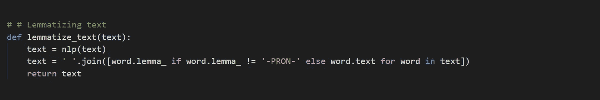

我们使用所有这些组件，并在下面这个名为 normalize_corpus(…)的函数中将它们联系在一起，这个函数可以用来将一个文档语料库作为输入，并返回带有干净和规范化的文本文档的相同语料库。

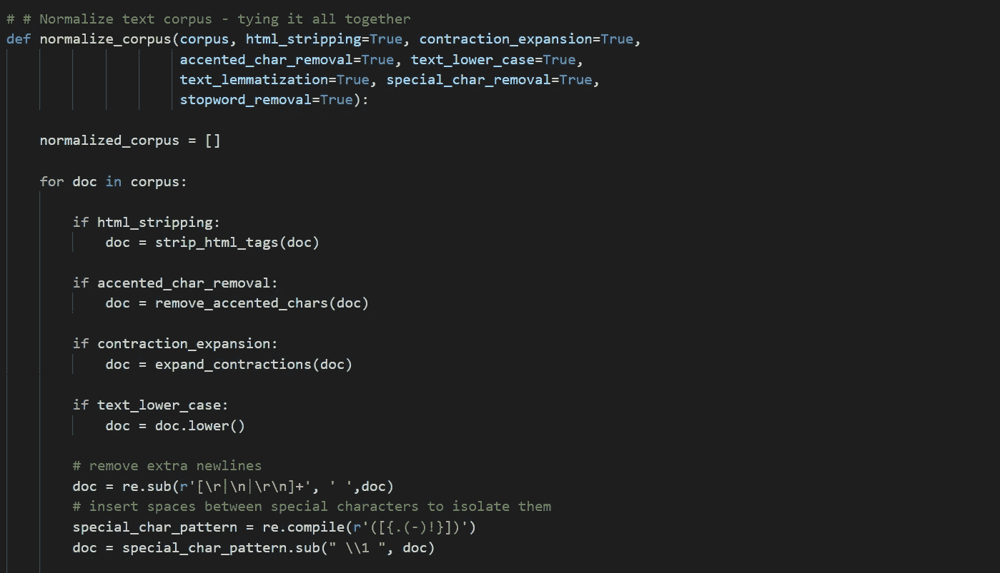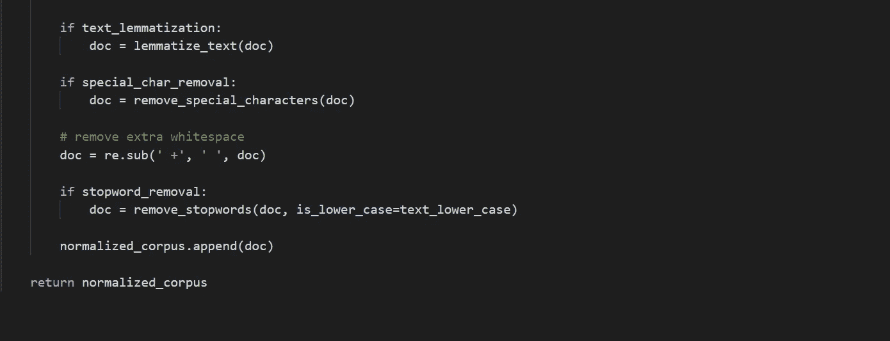

# **第一种方法:使用无监督的基于词典的模型进行情感分析**

无监督的情感分析模型使用精心策划的知识库、本体、词典和数据库，这些数据库具有关于主观单词、短语的详细信息，包括情感、情绪、极性、客观性、主观性等等。词典模型通常使用词典，也称为词典或专门用于情感分析的词汇。通常这些词典包含与正面和负面情绪、极性(负面或正面分数的大小)、词性(POS)标签、主观性分类器(强、弱、中性)、语气、情态等相关联的单词列表。您可以使用这些词典，并通过匹配词典中特定单词的存在来计算文本文档的情感，查看其他附加因素，如否定参数、周围单词、整体上下文和短语的存在，并合计整体情感极性分数来决定最终的情感分数。有几种流行的词汇模型用于情感分析。

其中一些提到如下。

*   刘冰的词汇
*   MPQA 主观性词汇
*   模式词典
*   AFINN 词典
*   SentiWordNet 词典
*   VADER 词典

**第一种方法的结论:**

*   AFINN 词典

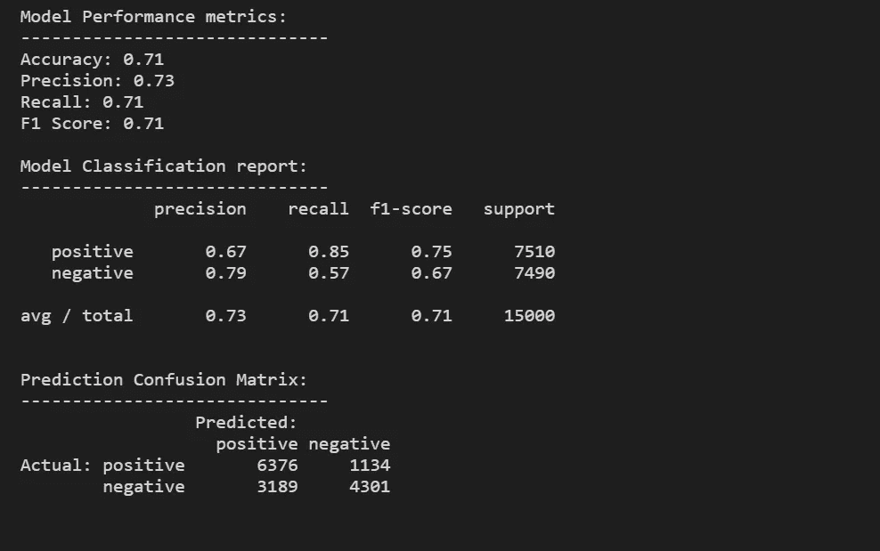

*   SentiWordNet 词典

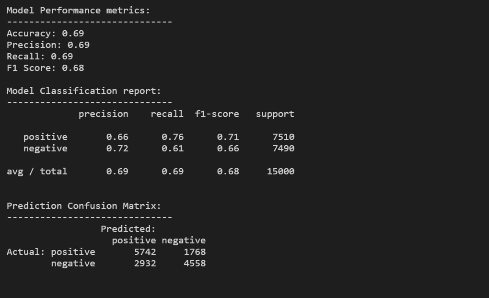

*   VADER 词典

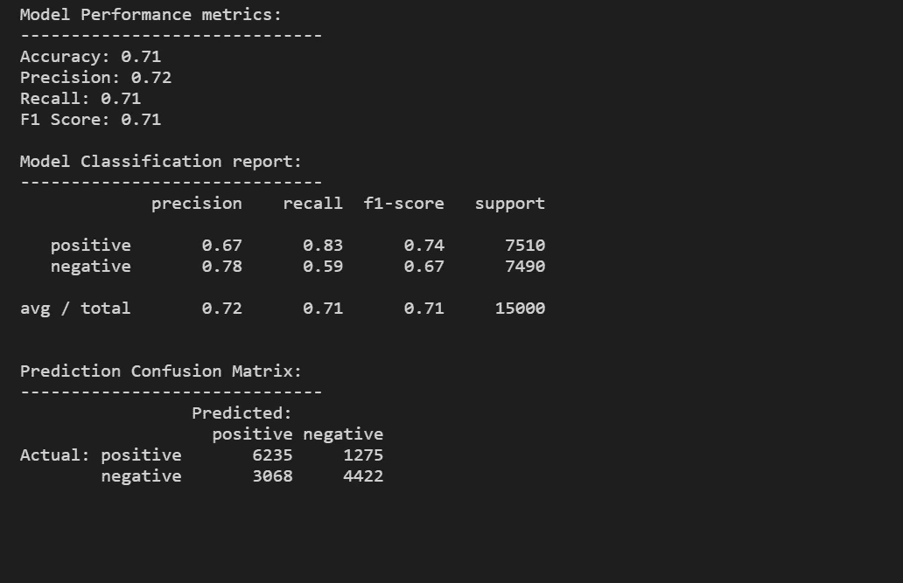

**谁是这次模特大赛的冠军？？**

我们可以清楚地看到，AFINN Lexicon 是获胜者，因为它具有 0.71 的准确度、0.73 的精确度和 0.71 的 F1 分数。

# **第二种方法:用监督学习对情感进行分类**

另一种建立模型以理解文本内容并预测基于文本的评论的情感的方法是使用监督机器学习。更具体地说，我们将使用分类模型来解决这个问题。

实现这一目标的主要步骤如下:

1.准备训练和测试数据集(可选的验证数据集)

2.预处理和规范化文本文档

3.特征工程

4.模特培训

5.模型预测和评估

## **第二种方法的结论:**

**蝴蝶结特征的 Logistic 回归模型**

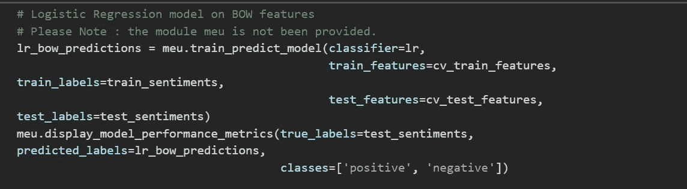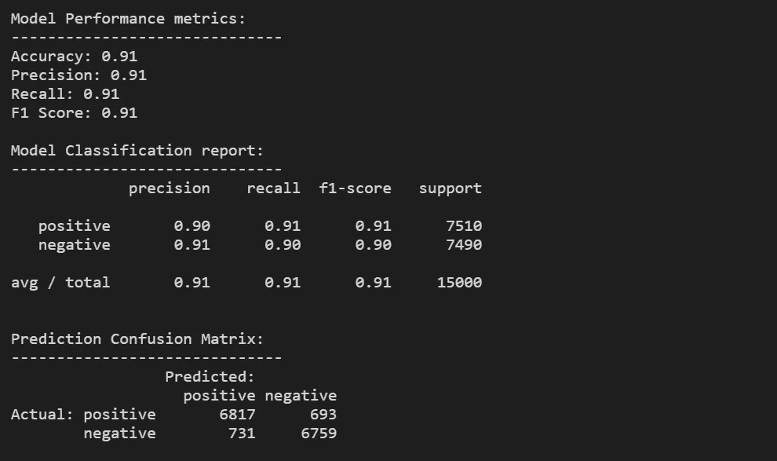

**关于 TF-IDF 特性的逻辑回归模型**

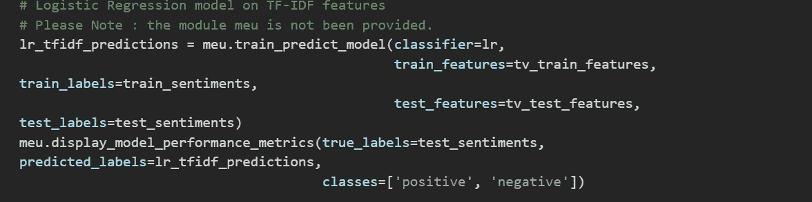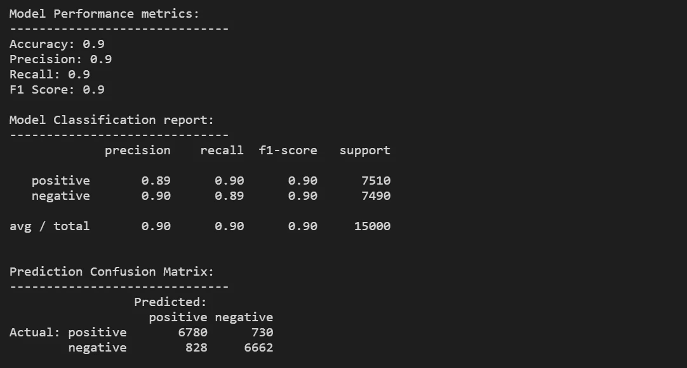

**SVM 模型上的蝴蝶结特征**

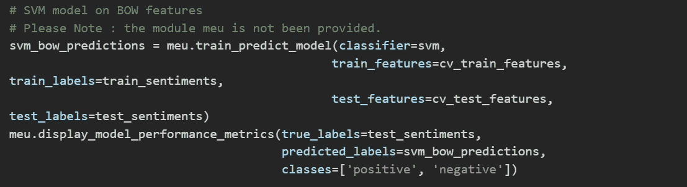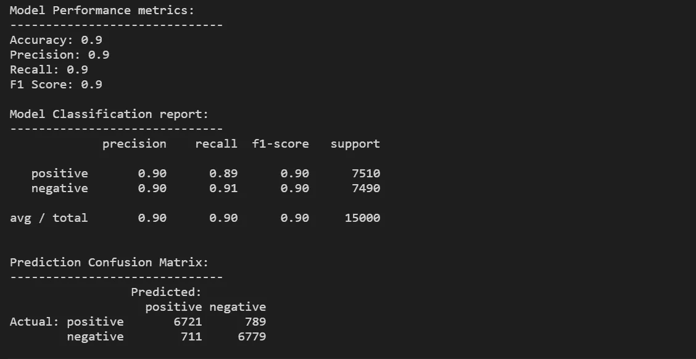

**关于 TF-IDF 特点的 SVM 模型**

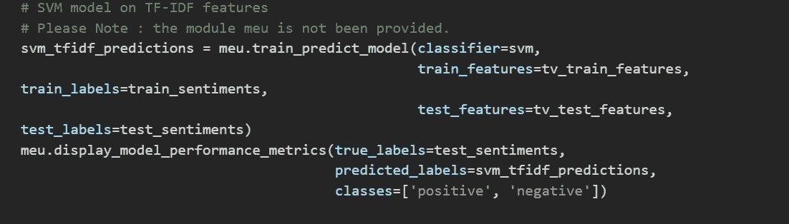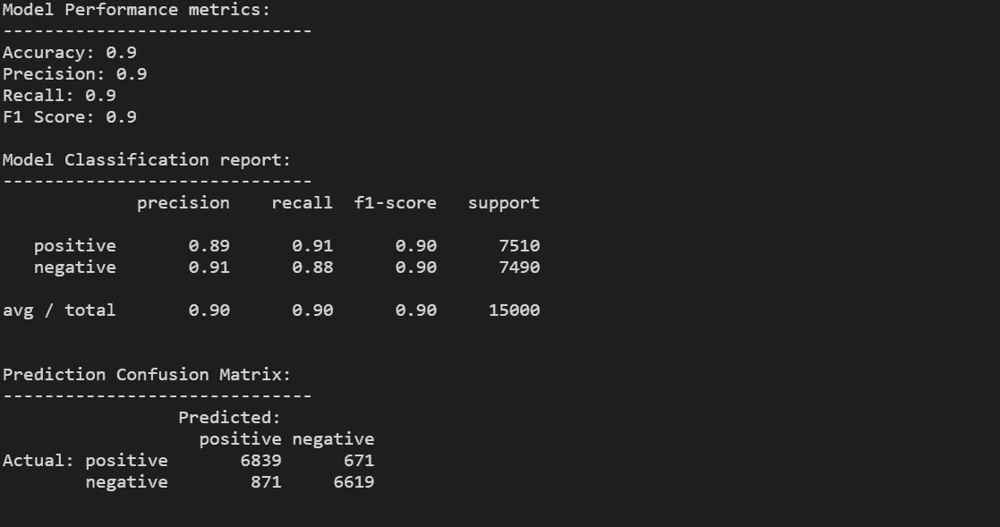

快乐学习:)