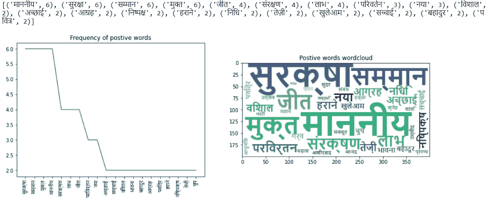

# 用文本分析法分析纳莫的西孟加拉邦演讲

> 原文：<https://medium.com/analytics-vidhya/analyzing-namos-west-bengal-speech-with-text-analytics-7a17f0c95917?source=collection_archive---------16----------------------->

# 介绍

我们知道日常生活中产生的大部分数据是非结构化数据。我们使用 WhatsApp、脸书、Instagram 等。我们发送消息，张贴图片，视频等。从这个角度来看，非结构化数据的分析是至关重要的，因为它具有价值&我们可以从中提取可操作的见解。在本文中，我们将以印度总理纳伦德拉·莫迪的西孟加拉邦选举集会演讲的文本数据为案例，分析其演讲的显著性度量。

> **言语是心灵的镜子；一个人说什么，他就是什么。**
> 
> -普布利柳斯·西鲁斯

# 让我们开始工作吧

## **正在初始化**

我们导入用于分析的基本库。

```
*#Import the requisite packages for analysis*import pandas as pd     
from urllib.request import Request,urlopen   
from bs4 import BeautifulSoup as soup
import nltk   #required library for text analytics
import operator  
from nltk.corpus import stopwords
from wordcloud import WordCloud
import matplotlib
import matplotlib.pyplot as plt
%matplotlib inline
```

这里，主要的库是*URL lib*&*beautiful soup*以可读格式访问数据。我们有 *nltk* 库用于一些基本的文本预处理& *matplotlib，WordCloud* 用于可视化。

# **访问数据**

```
*#store the web url in variable url*
url = '[https://www.bjp.org/en/speechdetail/4542801/Salient-points-of-speech-of-Hon-ble-Prime-Minister-Shri-Narendra-Modi-addressing-public-meetings-in-West-Bengal-'](https://www.bjp.org/en/speechdetail/4542801/Salient-points-of-speech-of-Hon-ble-Prime-Minister-Shri-Narendra-Modi-addressing-public-meetings-in-West-Bengal-')*# Launch a formal request to the website server*
req = Request(url,headers={'User-Agent':'Mozilla/5.0'})*#Read the webpage*
webpage = urlopen(req).read()*#Use Beautiful Soup to parse the html webpage*
Soup = soup(webpage,"html.parser")# Get the text from the soup & store in data
data = Soup.getText()
```

2021 年 4 月 10 日，印度总理纳伦德拉·莫迪在西里古里的一次选举集会上发表了演讲。你可以访问网址阅读整个演讲。请注意-演讲是在印度。

# **文本预处理**

现在我们有了数据。让我们看看变量“数据”包含什么。

```
print(data)
```


我们看到美汤方法提取了网站的所有文字。我们必须清理提取的文本，以便只留下我们需要的单词。

在这里，我们进行如下操作:

1.  **符号化&规范化:**我们将从这个文本中删除所有标点符号&不必要的字符。仔细观察，我们使用*‘replace’*方法替换文本中的下列字符&使用*‘split’*将句子转换为单词列表

```
#Remove garbage charachters, then, Tokenize & Normalize.tokens = data.replace("\n"," ").replace('*'," ").replace(',',' ').replace('।'," ").lower().split()print(tokens)
```


***标记化:*** *将一个句子或段落拆分成更小的单元。用我们的话说。*

***规范化:*** *将文本数据转换为标准形式。在我们的例子中，我们将所有的英文单词转换成小写。对于印地语文本，我们在这个例子中不做任何标准化。*

2.**停用词移除:**停用词是一种语言中可能存在于文本数据中但可能不会给句子本身增加太多价值的任何词。由于本网页的主要语言是印地语，我们将需要一个印地语停用词语料库。我们在这种情况下使用一个 [***库***](#source -> https://www.kaggle.com/ruchi798/hindi-stopwords) 。我们有 3 组停用词。一个是包含印地语单词的普通停用词文件。一个文件有积极的话&另一个表示消极情绪的话。我们将它们导入&并存储在一个列表中。

```
*#Defining the stopwords for Hindi.*
sw_hi = pd.read_csv("sw.txt", sep="\t",names=['stopword'])*#dataframe of stop words indicating positive & negative sentiments.* 
pos_hi = pd.read_csv("pos.txt", sep="\t", names=['positive'])
neg_hi = pd.read_csv("neg.txt", sep="\t", names=['negative'])***#source ->*** [***https://www.kaggle.com/ruchi798/hindi-stopwords***](https://www.kaggle.com/ruchi798/hindi-stopwords)*#Defining the stopwords for English using NLTK.*
sw_en = set(stopwords.words('english'))
```

# **词频绘图&绘图**

现在，我们将检查单词列表中的每个单词是否出现在停用词文件中&将它们分离为阳性、阴性和过滤的单词(不出现在任何列表中)

```
# Stopwords filteringfiltered_words =[] *#stores words which are not in any stopword list*
en_sw = []   *#stores english stopwords*
hi_sw = []   *#stores hindi stopwords*
hi_possw=[]  *#stores hindi postive stopwords*
hi_negsw=[]  *#stores negative positive stopwords*
        for w in tokens:
        if w in neg_hi:
            hi_negsw.append(w)
        elif w in sw_en:
            en_sw.append(w)
        elif w in sw_hi:
            hi_sw.append(w)
        elif w in pos_hi:
            hi_possw.append(w)
        else:
            filtered_words.append(w)
```

接下来，我们将创建一个频率分布&按降序对其进行排序，以获得使用频率最高的单词的数据。

```
Freq_dist_fil =nltk.FreqDist(filtered_words)
Freq_dist_pos =nltk.FreqDist(hi_possw)
Freq_dist_neg =nltk.FreqDist(hi_negsw)sorted_fil = sorted(Freq_dist_fil.items(),key=operator.itemgetter(1),reverse=True)sorted_pos = sorted(Freq_dist_pos.items(),key=operator.itemgetter(1),reverse=True)sorted_neg = sorted(Freq_dist_neg.items(),key=operator.itemgetter(1),reverse=True)
```

接下来，我们将绘制每个词分布的频率线图&词云。

```
*# filtered words*
print(sorted_fil[0:20])
fil= pd.DataFrame(filtered_words,columns=['fil_words'])        
filter_words = fil.groupby('fil_words').agg({'fil_words':'count'}).rename(columns={'fil_words':'Frequency'}).sort_values(by='Frequency',ascending=False)*# Generate a word cloud image*
wordcloud = WordCloud(font_path='NirmalaB.ttf',stopwords = sw_hi,background_color='white')
data = dict(sorted_fil)
word = wordcloud.generate_from_frequencies(data)

plt.figure(figsize=(15,5))
plt.subplot(121)
plt.plot(filter_words[:20])
plt.xticks(fontname='Nirmala UI',rotation='vertical')
plt.title('Frequency of Words used in website')
plt.subplot(122)
plt.imshow(word.to_image())
plt.title('Wordcloud Frequency')
plt.show();
```


```
*#positive words*
print(sorted_pos[0:20])
pos= pd.DataFrame(hi_possw,columns=['pos_words'])        
pos_words = pos.groupby('pos_words').agg({'pos_words':'count'}).rename(columns={'pos_words':'Frequency'}).sort_values(by='Frequency',ascending=False)data_pos = dict(sorted_pos)
word_pos = wordcloud.generate_from_frequencies(data_pos)plt.figure(figsize=(15,5))
plt.subplot(121)
plt.plot(pos_words[:20])
plt.xticks(fontname='Nirmala UI',rotation='vertical')
plt.title('Frequency of postive words')
plt.subplot(122)
plt.imshow(word_pos.to_image())
plt.title('Postive words wordcloud')
plt.show();
```



```
*#negative words*
print(sorted_neg[0:20])
neg= pd.DataFrame(hi_negsw,columns=['neg_words'])        
neg_words = neg.groupby('neg_words').agg({'neg_words':'count'}).rename(columns={'neg_words':'Frequency'}).sort_values(by='Frequency',ascending=False)data_neg = dict(sorted_neg)
word_neg = wordcloud.generate_from_frequencies(data_neg)plt.figure(figsize=(15,5))
plt.subplot(121)
plt.plot(neg_words[:20])
plt.xticks(fontname='Nirmala UI',rotation='vertical')
plt.title('Frequency of negative words')
plt.subplot(122)
plt.imshow(word_neg.to_image())
plt.title('Negative words wordcloud')
plt.show();
```


# 洞察力

**过滤后的单词:**

('दीदी'，76 岁)，('टीएमसी'，15 岁):他的讲话集中在执政党&被广泛称为“迪迪”的世行首席部长身上。

('बंगाल'，59 岁) :这是一个显而易见的词，因为集会是在世界银行。

(“印度人民党”，30),('भाजपा'，20):这些话可能与印度人民党作为执政党能拿出什么有关，他经常提到他的政党。

**正面词:**

('सुरक्षा', 6),('सम्मान', 6) ,('मुक्त', 6),('संरक्षण', 4), ('लाभ', 4) ('परिवर्तन', 3), ('नया', 3).这些词在演讲中被认为是积极的词。这些词可能会影响公众的心态，预示着骄傲、安全、变革的承诺&一个新时代的到来。

**否定词:**

('समस्या', 8), ('सख्त', 5), ('भय', 5), ('गलत', 5), ('गुस्सा', 5), ('हार', 4), ('अत्याचार', 3), ('अपमान', 3), ('बुराई', 2),('हिंसक', 2), ('खिलवाड़', 2), ('डराने', 2), ('डर', 2), ('अन्याय', 2), ('बोझ', 2), ('हत्या', 2).演讲中的这些话可能表明孟加拉人民遭受的暴行或不公正。

# 结论:

词频分析可以帮助我们在一张快照中总结出给定文本中使用了什么情感或主要词汇。将非结构化数据结构化将带来洞见，有助于改变模式或理解现象为何如此。