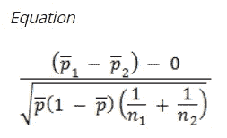

# 通过假设检验分析 Paytm 的妇女节广告(金融知识的性别差距)

> 原文：<https://medium.com/analytics-vidhya/analyzing-paytms-women-s-day-ad-gender-gap-in-financial-literacy-through-hypothesis-testing-c9e0fa9b25b8?source=collection_archive---------20----------------------->

## 质疑一切！用数据回答！

# **广告背景:**

*   Paytm 在国际妇女节进行了一项关于女性和男性在金融知识方面巨大差异的社会实验。
*   共有 30 人——15 名男性和 15 名女性——参与了实验。
*   如果你没看过这个广告，那就来看看:【https://www.youtube.com/watch?v=F9CLFiPnOd8
*   这则广告在社交媒体上疯传；它也让我们大多数人大开眼界，因为它描绘了男性和女性在金融知识方面的明显差异。

衡量男性和女性两个群体的金融知识水平

# **关于实验的问题！**

然而，看着这个广告，我有一些疑问。

> 他们怎么可能用 30 个人进行实验，然后推广到整个人群？30 个人怎么能真正代表地球上 75 亿人？30 个样品够吗？

举个简单的例子，考虑这个场景。

> 你随机挑选两名女性，问她们是否喜欢冰淇淋。但是他们两个都讨厌冰淇淋。你也可以随机选择两个男人，他们都喜欢冰淇淋。
> 
> 根据这个实验，我们能得出一个结论:所有女人都讨厌冰淇淋，所有男人都喜欢冰淇淋吗？如果我们这样做了，那会在多大程度上反映男性和女性的实际偏好？

同样，关于广告，我们怎么知道实验中明显的性别差异是整个人口的反映呢？我们怎么知道被选中参加实验的 30 个人之间不仅仅是巧合呢？

这就是假设检验派上用场的地方！

**注:**如果对统计部分不感兴趣，最后跳到总结部分。

# **分析社会实验—假设检验:**

当您想知道两个群体(即男性和女性)在某个单一特征上是否有显著差异时，可以使用 ***两个样本比例的 z 得分检验*** 。

两个样本比例的 z 得分公式

> 让我们考虑一下，
> Pₘ:有财务知识的男性比例。
> P𝓌:懂得财务知识的妇女比例。
> 
> 零假设:同等比例的男性和女性具备金融知识。
> Pₘ = P𝓌(或)
> Pₘ-P𝓌= 0
> 
> 另一种假设:男性中懂金融的比例比女性高。
> pₘ>p𝓌
> pₘ-p𝓌>0

在参与实验的 30 人中，有 15 名男性和 15 名女性。广告说 Pₘ和 P𝓌之间有很大的不同，但是他们没有分享到底是什么不同。

因此，让我们假设最好的情况和最坏的情况。

> ***案例 1*** :极端性别差距:在 30 人中，只有 14/15 的男性和 1/15 的女性具备金融知识。
> 
> ***案例二*** *:* 轻微的性别差距:在 30 人中，只有 8/15 的男性和 7/15 的女性具备金融知识。

# 案例 1:

样本数量:n𝓌nₘ=15 = 15
懂金融的人比例:
pₘ= 14/15 = 0.93
p𝓌= 1/15 = 0.06

总体样本比例，pHat = (14+1)/(15+15) = 0.5

> z 得分=(pₘ-p𝓌)/sqrt(phat*(1-phat)*((1/nₘ)+(1/n𝓌)))
> = 0.87/sqrt(0.03)
> = 0.87/0.18257
> = 4.7

在 95%的置信水平下，对于单尾检验，z-score 为 **1.645。**

## **推论:**

*   由于 4.7 > 1.645，测试统计落入拒绝区域。所以我们**拒绝零假设**。
*   也就是说，在 95%的置信水平下，实验中两组(Pₘ-P𝓌>0).
*   如果我们计算 z 值为 4.7 的累积概率，结果为 0.999999

> 在这种情况下，有 99.9999%的把握，我们可以得出这样的结论:懂金融的男性比例高于女性。
> 
> 然而，我们不知道男性的领导比例。请注意，我们只证明了(Pₘ-P𝓌)>0.所以，在实际人口中(Pₘ-P𝓌)可以是 0.1 或 0.9

# 案例二:

样本数量:n𝓌nₘ=15 = 15
懂金融的人比例:
pₘ= 8/15 = 0.53
p𝓌= 7/15 = 0.46

总体样本比例，pHat = (14+1)/(15+15) = 0.5

> z 得分=(pₘ-p𝓌)/sqrt(phat*(1-phat)*((1/nₘ)+(1/n𝓌)))
> = 0.07/sqrt(0.03)
> = 0.07/0.18257
> = 0.383

在 95%的置信水平下，对于单尾检验，z 得分为 **1.645** 。

## 推论:

*   因为 0.38 < 1.645, the test statistic falls in the acceptance region.
    所以我们**无法拒绝零假设**。
*   也就是说，在 95%的置信水平下，实验中两组(Pₘ-P𝓌=0).
*   如果我们计算 z 值为 0.383 的累积概率，结果为 0.649

> 在这种情况下，在 95%的置信水平下，没有足够的统计证据证明金融素养存在显著的性别差距。
> 
> 然而，如果有 65%的把握，我们可以得出这样的结论:懂金融的男性比例高于女性。这也意味着，有 35%的机会，男人和女人是平等的财务知识。
> 
> 理想情况下，我们需要收集更多的样本(例如，对更多的人进行实验)来加强证据，并增加信心。

# 回到问题“30 个人能代表整个世界的人口吗？”

*   从上面的分析来看，如果我们随机抽取 30 个人(15 男 15 女)进行实验，结果可能是也可能不是结论性的。
*   也就是说，案例 1 的结果将是决定性的，在该案例中，性别差距存在极端的分野(Pₘ-P𝓌 = 0.87)。
*   案例 2 的结果将是不确定的，其中在性别差距上只有轻微的差异(Pₘ-P𝓌 = 0.07)。
*   那么，拐点在哪里？什么样的最小比例差异会产生统计学意义，这样我们就可以将实验结果推广到整个人群？
*   通过逆向工程，在 95%的置信水平下，我们需要 1.645 的最小 z 分数，以使比例差异显著。

使用与上面相同的 z 分数公式，

> z 得分=(pₘ-p𝓌)/sqrt(phat*(1-phat)*((1/nₘ)+(1/n𝓌)))
> 1.645>=(pm-pw)/0.1825
> 
> (pm-pw)>= 1.645 * 0.1825
> (pm-pw)>= 0.30

也就是说，如果从社会实验中得出的男女性别差距至少为 30%，那么结果将是决定性的，并具有统计学意义。

因此，即使只有 30 人参与，实验结果也可以推广到整个人群。

# 假设检验中的最小可检测效应

从上面的分析中，我们得出结论，只有在 30 个样本的情况下，只有当分界点为 30%或更高时，该实验才具有结论性和统计显著性。

这 30%是实验的最小可检测效应。

# 假设检验中样本量的影响—直觉

回到冰淇淋的例子，虽然两个女人都讨厌冰淇淋，两个男人都喜欢冰淇淋，但我们不能肯定地说所有女人都讨厌冰淇淋，所有男人都喜欢冰淇淋。那你会怎么做？调查更多男性和女性的偏好。

而不是两个，如果你分别调查 100 个男人和女人，即使 100 个女人都讨厌冰淇淋，100 个男人都喜欢冰淇淋，这一次我们会比只调查两个人更有信心。

这也正是我们对统计数据所做的。

*   如果测试结果不确定，请向实验中添加更多样本，然后重新运行实验。
*   如果你想对你的推断更有信心，就在实验中加入更多的样本。

# 分析摘要:

对于用 30 个人(15 个男人和 15 个女人)进行的社会实验，

> 只有在实验中，具备金融知识的男性和女性的比例差异大于 30%，我们才能以 95%的信心说，在整个人口中，具备金融知识的男性比例高于女性。
> 
> 但是，请注意，社会实验中 30%的性别差距并不意味着整个人口中有 30%的性别差距；这只意味着整个人口中存在性别差距。可能是 1%或 80%，我们不知道。
> 
> 可以进行额外的测试来找出差距，但这不是我们要做的。

# 进一步思考:

1.  上述统计分析只有在 30 个人是从整个人口中随机抽样的情况下才有效。然而，从视频来看，这似乎不是真正的随机样本。
2.  根据性别和财务知识卓越中心的数据，35%的男性具备财务知识，而全球女性的这一比例为 30%。这种性别差距在世界各地的发达经济体和新兴经济体中都存在。
3.  我对这则广告的看法是，Paytm 的营销团队想在国际妇女节这一天强调金融知识方面的性别差距。因此，他们没有使用有两个条形图的信息图——一个有 30%的女性，另一个有 35%的男性——而是使用这个视频作为一种有影响力的方式来交流差异。
4.  所以我们需要从营销传播的角度来看这个广告，而不是统计实验。

# 感谢阅读！

如果你喜欢我的工作，想支持我…

1.  支持我的最好方式就是在[媒体](/@vinodhini-sd)上关注我。
2.  我在 [LinkedIn](https://www.linkedin.com/in/vinodhini-sd/) 上分享#数据工程# ml #操作的技巧、诀窍和见解。
3.  请随意鼓掌，这样我就知道这篇文章对你有多大帮助了。