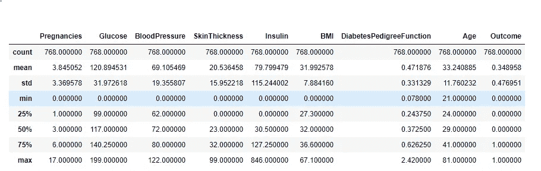
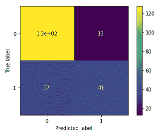

# 分析 Pima-印度-糖尿病数据集

> 原文：<https://medium.com/analytics-vidhya/analyzing-pima-indian-diabetes-dataset-36d02a8a10e5?source=collection_archive---------4----------------------->

*使用分类技术*


# **简介:**

[糖尿病](https://www.niddk.nih.gov/health-information/diabetes/overview/what-is-diabetes)是一种血糖过高的疾病。血糖是你的主要能量来源，来自你吃的食物。胰岛素是一种由胰腺产生的激素，它帮助食物中的葡萄糖进入你的细胞，用于提供能量。有时你的身体不能产生足够的胰岛素，或者不能很好地利用胰岛素。葡萄糖会留在你的血液中，不会到达你的细胞。

根据世卫组织的数据，全世界大约有 4.22 亿人患有糖尿病。因为糖尿病影响全球的大量人口，并且这些数据集的收集是一个连续的过程，并且它包括各种与患者相关的属性，例如年龄、性别、症状、胰岛素水平、血压、血糖水平、体重等。我们正在处理皮马印第安人糖尿病数据集(PIDD)，该数据集是从加州大学欧文分校(UCI)的机器学习库中提取的。

# **数据集:**

PIDD 由几个医学参数和一个二进制值的从属(结果)参数组成。该数据集主要针对女性，数据集描述如下

具有 8 个独立参数和一个结果参数的 9 列，具有唯一识别的 768 个观察值，其中 268 个为糖尿病阳性(1 ), 500 个为糖尿病阴性(0)

1.**怀孕次数:**怀孕次数

**2。葡萄糖:**口服葡萄糖耐量试验结果

葡萄糖耐量试验是一项实验室测试，旨在检查你的身体如何将糖从血液转移到肌肉和脂肪等组织中。该测试通常用于诊断糖尿病。

[**如何进行测试**](https://www.diabetes.co.uk/oral-glucose-tolerance-test.html)

最常见的葡萄糖耐量试验是口服葡萄糖耐量试验(OGTT)。测试开始前，将抽取血液样本。然后你会被要求喝一种含有一定量葡萄糖(通常是 75 克)的液体。在您喝完溶液后，每 30 到 60 分钟将再次抽取您的血液。


**3。血压:**舒张压值(毫米汞柱)

舒张压读数，或底部的数字，是心脏在两次跳动之间休息时动脉中的压力。这是心脏充满血液并获得氧气的时候。

这就是你的舒张压数值的含义:

*   正常:低于 80
*   第一阶段高血压:80–89
*   2 期高血压:90 或以上
*   高血压危象:120 或以上

大多数糖尿病患者最终都会有高血压。

**4。**三头肌皮褶厚度(mm)

皮褶厚度，从而可以预测身体脂肪的总量。三头肌皮褶是计算上臂肌肉周长所必需的。它的厚度给出了身体脂肪储备的信息，而计算出的肌肉质量给出了蛋白质储备的信息。

对于成年人，三头肌皮褶的标准正常值是 2.5 毫米(男性)或大约 20%的脂肪；18.0mm(女性)或 30%左右脂肪。这些值的测量值的一半或更少代表大约第 15 个百分位数，并且可以被认为是临界的或脂肪耗尽的。超过 20 毫米(男性)和 30 毫米(女性)的数值代表大约第 85 百分位，可以考虑。

**5。胰岛素:** 2 小时血清胰岛素(μU/ml)

胰岛素是一种激素，帮助将血液中的糖分，也就是葡萄糖，从你的血液转移到你的细胞中。

2 小时血清胰岛素:大于 150μU/ml 与胰岛素治疗有关

胰岛素治疗是 1 型糖尿病患者和许多二型糖尿病患者治疗的关键部分。胰岛素治疗的目标是将您的血糖水平保持在目标范围内。

**6。身体质量指数:**体重指数

身体质量指数(身体质量指数)提供了一种简单而准确的方法来评估患者是否存在体重过重或过轻的风险。然而，比例较大的瘦体重和/或骨架尺寸会导致明显的超重。例如，许多运动员会被认为“超重”，然而皮褶试验显示脂肪组织量低于正常水平。用病人的体重(公斤)除以他们身高(米)的平方就可以很容易地计算出来。

身体质量指数=体重(公斤)/[身高(米)]


**7。糖尿病谱系功能:**糖尿病谱系功能

糖尿病谱系功能，它提供了一些关于亲属中的糖尿病史以及这些亲属与患者的遗传关系的数据。这种对遗传影响的测量让我们了解了糖尿病发病时的遗传风险。

**8。年龄:**以年为单位的年龄

**9。结果:**1 级表示患有糖尿病，0 级表示其他。

# 数据可视化:

让我们通过使用可视化技术找到每个特征和结果的相关性来开始数据集的可视化。



这些统计数据是使用“df.describe()”方法生成的

*   count 告诉我们特性中非空行的数量。
*   平均值告诉我们该特征的平均值。
*   std 告诉我们该特征的标准偏差值。
*   min 告诉我们该特性的最小值。
*   25%、50%和 75%是每个特征的百分位数/四分位数。这种四分位数信息有助于我们发现异常值。
*   max 告诉我们该特性的最大值。

遵循直方图将有助于我们将单个变量和结果之间的关系可视化。下面，我们将看到每个参数和结果之间的关系。

```
histo = df.hist(figsize = (10,10))
```


# 数据预处理:

对于归一化，首先识别并去除任何噪声或不完整的数据点

```
Zero Counts of BP :(35, 9),BMI : (11, 9) , Insulin : (374, 9) , Glucose : (5, 9) , skin : (227, 9)
```

这里出现了一些方法，要么完全消除缺失值，要么用平均值或中值对它们进行归一化。通过使用方法一，我们将丢失大约 50%的数据集，然后我们的训练模型将没有太多的数据要训练。通过使用方法二，有一些非常重要的参数，如葡萄糖和血压，将对结果产生最大的影响。

考虑到这些因素，我们将使用混合方法，去除对结果影响最大的参数的缺失值，并使用平均值或中值对其他参数进行归一化。

```
## The median is the middle point of a number set, in which half the numbers are above the median and half are below
## replace null value with median
df_copy[‘Insulin’].fillna(df_copy[‘Insulin’].median(),inplace=True)
df_copy[‘SkinThickness’].fillna(df_copy[‘SkinThickness’].median(),inplace=True)# pre-process Blood Pressure , BMI & Glucose invalid values 
# as blood pressure & glucose are critical for determing diabeties it should not be invalid 
# their null fraction is very small so it should better to remove invalid entries
df_copy=df_copy[(df_copy[‘BloodPressure’]!=0) & (df_copy[‘BMI’]!=0) & (df_copy[‘Glucose’]!=0)]
```

现在我们已经清理了我们数据，让我们使用 sk-learn 训练分离技术将它分成训练 70%和测试 30%数据集

```
from sklearn.model_selection import train_test_split
X=df_copy.drop('Outcome',axis=1)
y=df_copy['Outcome']
X_train,X_test,y_train,y_test=train_test_split(X,y,test_size=0.30,random_state=10)
print(X_train.shape)
print(X_test.shape)
print(y_train.shape)
print(y_test.shape)
```

# 分类模型:

我们现在可以训练我们的模型了。我们将使用 5 种不同的分类算法。因为模型在 sklearn 中很容易获得，所以训练过程非常容易，我们可以用几行代码就可以完成。

## 朴素贝叶斯

```
from sklearn.naive_bayes import GaussianNB
naive=GaussianNB()
naive.fit(X_train,y_train)
predicted_naive=naive.predict(X_test)
cm_naive=metrics.confusion_matrix(y_test,predicted_naive)
accuracy_naive=metrics.accuracy_score(y_test,predicted_naive)
```


```
Accuracy : 0.7752293577981652
```

## k-最近邻

```
# KNN Implementationknn=KNeighborsClassifier(n_neighbors=11)knn.fit(X_train,y_train)predicted_knn=knn.predict(X_test)cm_knn=metrics.confusion_matrix(y_test,predicted_knn)accuracy_knn=metrics.accuracy_score(y_test,predicted_knn)
```



```
# k=3 (accuracy  0.7385321100917431) k=5 ( Accuracy :0.7522935779816514 )# k=11 (Accuracy :  0.7706422018348624) k=13 ( Accuracy :  0.7614678899082569 )Best at k=11
```

## 决策图表

```
# decision treed_tree=tree.DecisionTreeClassifier()d_tree.fit(X_train,y_train)predicted_tree=d_tree.predict(X_test)accuracy_tree=metrics.accuracy_score(y_test,predicted_tree)Accuracy : 0.6972477064220184
```

## 逻辑回归

```
# Logistic regressionlogisticRegr= LogisticRegression()logisticRegr.fit(X_train,y_train)predict_lg = logisticRegr.predict(X_test)accuarcy_lg=metrics.accuracy_score(y_test,predict_lg)Accuracy : 0.7752293577981652
```

## 线性判别分析

```
lda=LinearDiscriminantAnalysis()lda.fit(X_train,y_train)predict_lda=lda.predict(X_test)accuracy_lda=metrics.accuracy_score(y_test,predict_lda)Accuracy : 0.7798165137614679
```

# 结论:

在对所获得的训练集运行实验时，基于每个分类器算法的性能来比较训练模型。前面提到的最终获得的精度测量值的比较如下所示


下表显示了对于 30%测试数据(218)上的每个分类算法，获得了正确分类的实例和错误分类的实例。该矩阵描述了分类模型的性能，并允许算法性能的可视化。


对于未来的工作，可以考虑相同的方法，并且可以考虑许多其他机器学习分类器算法来比较最准确的算法。该方法也可以在各种其他疾病和医学数据集上实现。

[GitHub 库](https://github.com/aaliashraf/Classification-Algorithms-on-Pima_Indian_Diabetes-dataset)