# 分析 GitHub 上流行的存储库

> 原文：<https://medium.com/analytics-vidhya/analyzing-popular-repositories-on-github-f6ee81e7ad4e?source=collection_archive---------14----------------------->


[来源](https://unsplash.com/photos/wX2L8L-fGeA)

GitHub 是最流行的版本控制和源代码管理平台之一。也是程序员最大的社交网站之一。软件开发人员用它来向招聘人员和招聘经理展示他们的技能。通过分析 GitHub 上的存储库，我们可以获得有价值的见解，如用户行为，是什么使存储库受欢迎，或者什么技术在当今的开发人员中流行，等等。


图片:[来源](https://www.reddit.com/r/ProgrammerHumor/comments/836tsw/um_actually/)

[***你可以在这里找到文章中使用的全部代码***](https://www.kaggle.com/padhmam/analysing-popular-repositories-on-github)

我使用了来自 Kaggle 的*[【GitHub Repositories 2020】](https://www.kaggle.com/vatsalparsaniya/github-repositories-analysis)数据集，因为它更近一些。*

# *履行*

*让我们从导入必要的库和读取输入数据开始，*

*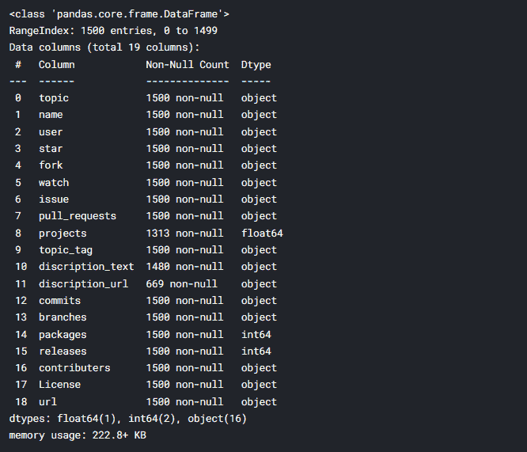*

*数据集包含 19 列，我根据最流行的 GitHub 术语以及与本次分析上下文相关的术语从中挑选了 11 列。您可以看到列名中有拼写错误，为了更清楚起见，我对它们进行了重命名。*

*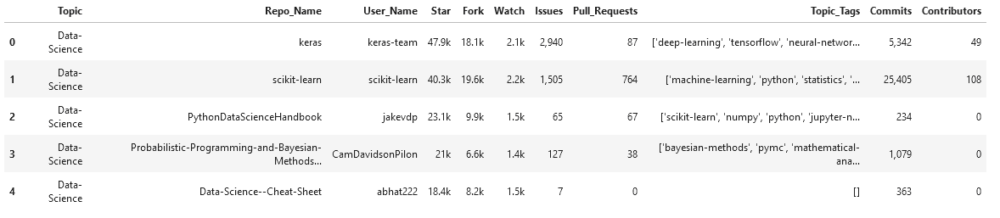*

*关于数据中的列的简要介绍，*

*   ***主题** —描述回购的字段或域的标签*
*   ***回购名称** —回购名称(存储库的简称)*
*   ***用户名** —存储库所有者的姓名*
*   ***星级** —回购获得的星级数*
*   ***分叉** —回购被分叉的次数*
*   ***观看** —观看回购的用户数量*
*   ***问题** —未解决问题的数量*
*   ***拉取请求** —提出的拉取请求总数*
*   ***主题标签** —用户添加到报告中的主题标签列表*
*   ***提交** —提交的总数*
*   ***贡献者** —参与回购的人数*

*请注意*星形*、*叉状*和*手表*列包含*k 的*来表示千，所以让我们将它们转换成 1000 的倍数。另外，替换*问题*和*提交*列中的*’、*(逗号)。*

*既然列是数字的，我们可以从中获得一些基本的统计信息。*

```
*# display basic statistical details about the columns github_df.describe()*
```

*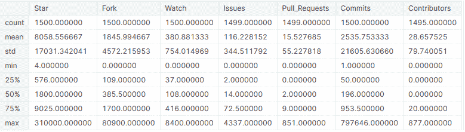*

# *1.基于流行度的顶级知识库分析*

**是什么让 GitHub 回购流行起来？*这个问题可以用 3 个指标来回答——星、表和叉。*

*   *明星——当用户喜欢你的回购协议，或者他们想表达一些感激之情时，他们就会开始。*
*   *观察—当用户希望得到回购中所有活动的通知时，他们就观察它。*
*   *Fork——当用户想要一份回购协议或打算做出任何贡献时，他们会使用 Fork。*

```
*# create a dataframe with average values of the columns across all topics pop_mean_df = github_df.groupby('Topic').mean().reset_index() pop_mean_df*
```

*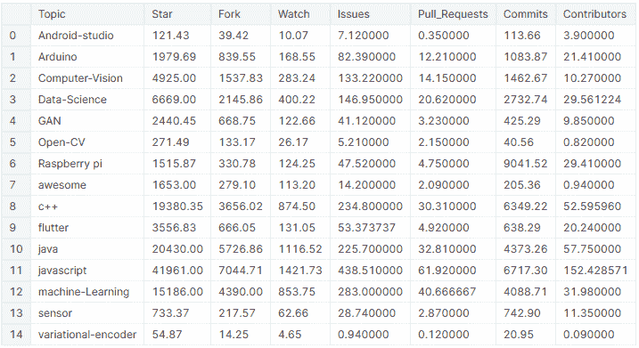*

## *1.1 恒星分析*

*可视化每个主题的平均星星数，*

*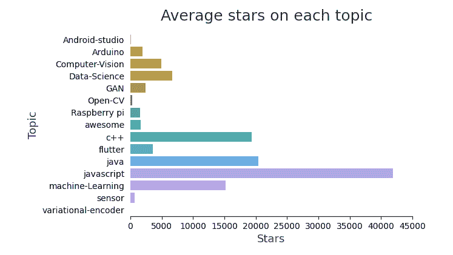*

```
*# top 10 most starred repos
github_df.nlargest(n=10, columns='Star')['Repo_Name','Topic','Star']]*
```

*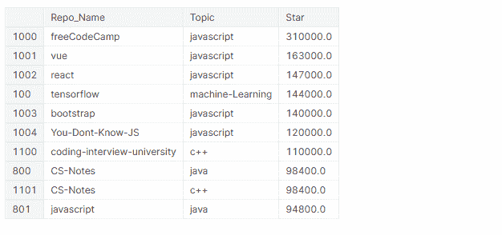***

****在排名前 10 的最受欢迎的资源库中，有 4 个是框架(Vue、React、TensorFlow、BootStrap)，其中 6 个是关于 JavaScript 的。****

## *1.2 手表分析*

*可视化每个主题的平均观看人数，*

*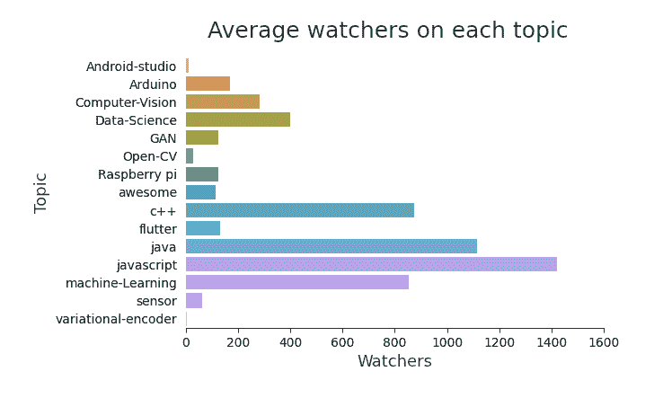*

**注意:除了列名之外，上图的代码与“每个主题的平均星级”相同。为了避免重复，我没有添加相同的内容。**

```
*# top 10 most watched repos 
github_df.nlargest(n=10, columns='Watch')[['Repo_Name','Topic','Watch']]*
```

*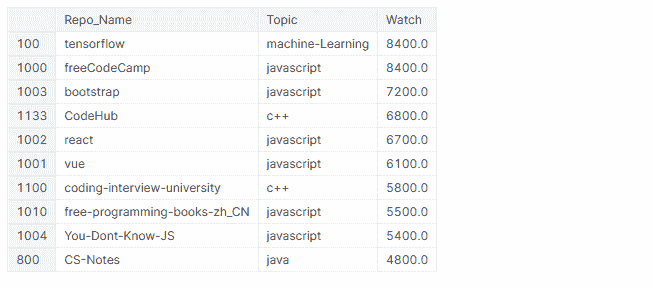***

****在最受关注的 10 个资源库中，有 4 个是框架(TensorFlow、BootStrap、React、Vue)，6 个是关于 JavaScript 的，其中 5 个包含程序员的学习内容。****

## *1.3 分叉分析*

*可视化每个主题的平均分叉数，*

*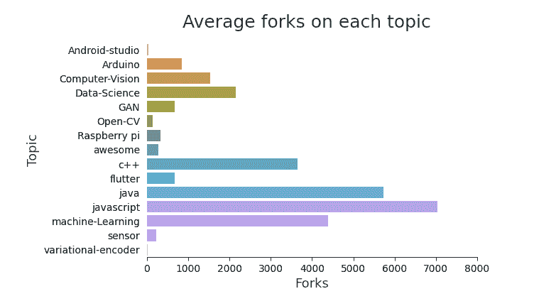*

```
*# top 10 most forked repos 
github_df.nlargest(n=10, columns='Fork')['Repo_Name','Topic','Fork']]*
```

*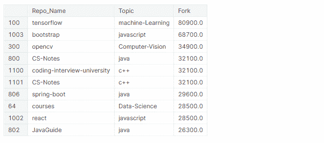***

****前 10 个分叉最多的知识库中，4 个是框架(TensorFlow、bootstrap、spring-boot、react)，其中 5 个包含程序员学习内容。****

## *1.4 星形、叉形和手表之间的关系*

*当用户想要参与回购时，他们通常会选择回购。所以，我们来探讨一下星叉和表叉的关系。*

*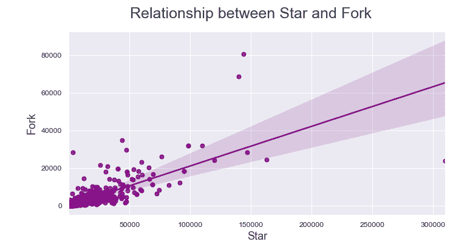*

```
*# set figure size and dpi 
fig, ax = plt.subplots(figsize=(8,4), dpi=100) # set seaborn theme for background grids 
sns.set_theme('paper') # plot the data 
sns.regplot(data=github_df, x='Watch', y='Fork', color='purple'); # set x and y-axis labels and title 
ax.set_xlabel('Watch', fontsize=13, color = '#333F4B') ax.set_ylabel('Fork', fontsize=13, color = '#333F4B') fig.subtitle('Relationship between Watch and Fork',fontsize=18, color = '#333F4B')*
```

*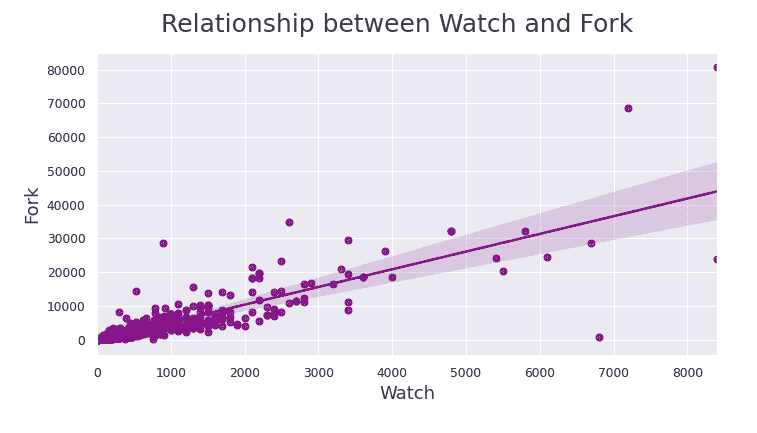*

*与星形和叉形相比，数据点更接近手表和叉形之间的回归线。*

****由此我们可以得出结论，如果一个用户正在看回购，那么他最有可能叉掉它。****

# *2.对拥有更多存储库的用户进行分析*

*让我们看看拥有更受欢迎的存储库的用户。*

*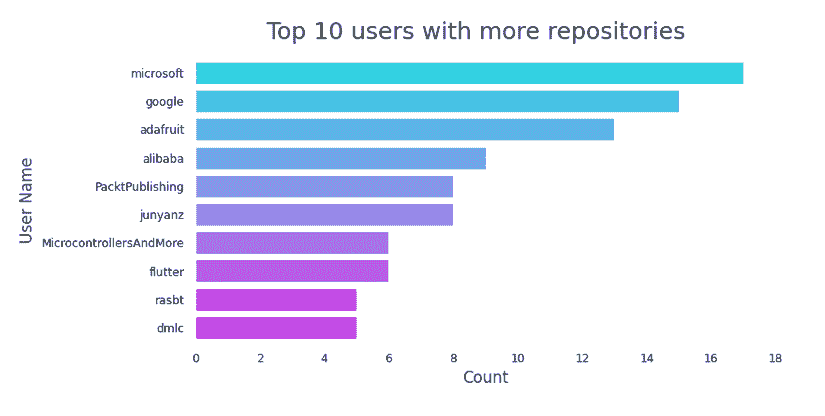*

*在拥有更多存储库的前 10 名用户中，*

*   ****微软以 17 次回购高居榜首。****
*   *谷歌以 15 次回购紧随其后。*
*   **【其中 6 家是公司或被公司拥有(微软、谷歌、Adafruit、阿里巴巴、PacktPublishing、flutter】**
*   *****3 个是个人用户(junyanz、rasbt、MicrocontrollersAndMore)*****

# **3.理解跨存储库的贡献活动**

***GitHub 以贡献图闻名。***

**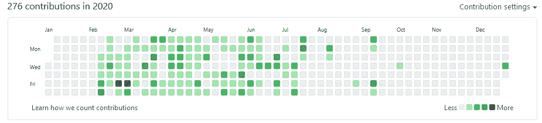**

**这个图表记录了用户所做的所有贡献。每当用户提交、打开一个问题或提出一个拉取请求时，它都被视为贡献。在我们的数据集中有四列与贡献相关，*问题、Pull_Requests、Commits、Contributors* 。让我们看看他们之间有没有真正的关系。**

**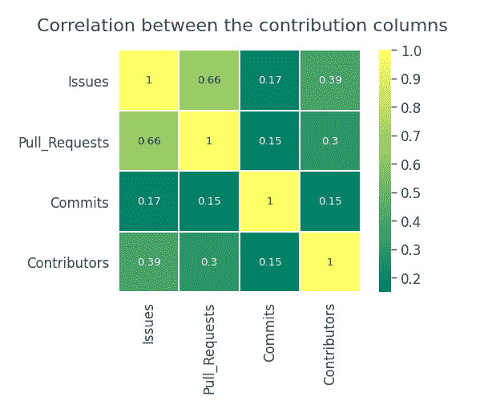**

**提交的数量不依赖于发布、拉请求或贡献者。问题和拉取请求之间存在适度的正相关关系。**

**让我们探索一下前 100 个流行的存储库，看看是否相同，**

**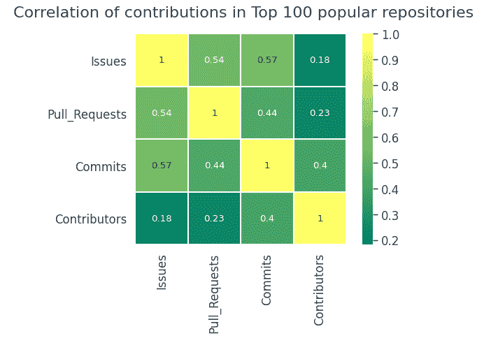**

**在前 100 个流行的存储库中，它几乎与整个数据集中的一样。**

**让我们检查拥有更多存储库的用户，**

**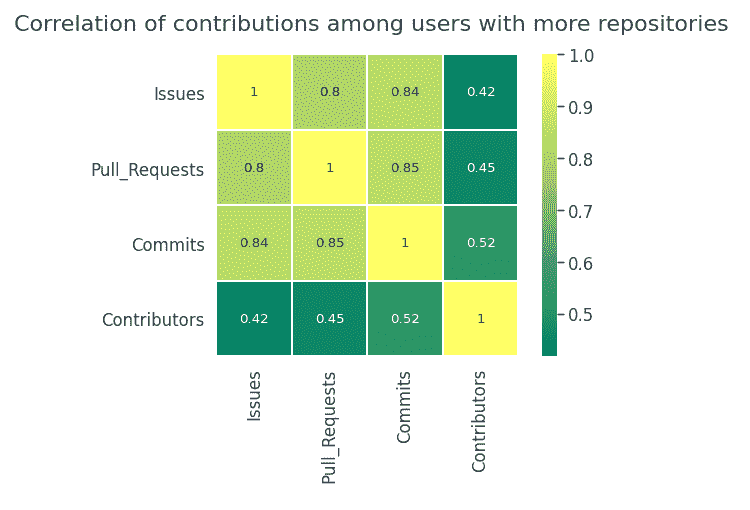**

**令人惊讶的是，拥有更多回购的用户往往更活跃。之间有很强的正相关关系**

*   **提交和提取请求**
*   **提交和发布**
*   **问题和拉取请求**

**就捐款而言，**

*   *****整体数据集中的投稿活动之间没有真实的关系。*****
*   *****热门回购前 100 名的贡献也没有相关性。*****
*   *****如果用户倾向于拥有更多的回购，那么贡献的机会就相当高。*****

# **4.话题标签分析**

**向存储库添加标签是用主题对它们进行分类的一种方式。它有助于其他用户找到并参与回购，也有助于您按照类型、领域、技术等探索跨平台的主题。,**

**topic_tags 列由列表组成。为了找到流行的标签，将整个列转换为列表的列表，并计算每个标签的出现次数。这样，我们可以可视化一些最受欢迎的主题标签，并查看哪些主题更容易被标记。**

**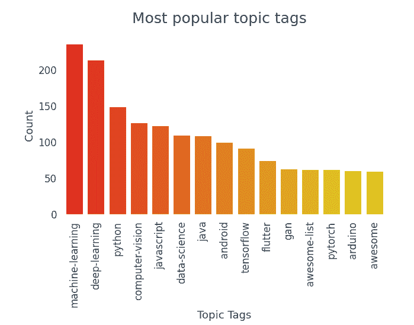**

*****前 15 个最受欢迎的标签中，有 10 个属于数据科学领域。*****

```
**# length of tags list in each column 
len_tags = [len(tag) for tag in topic_tags] # create a new column -> total_tags 
github_df['Total_Tags'] = len_tags # group based on topic and calculate total_tags in each topic topic_wise_tags = github_df.groupby('Topic').sum()['Total_Tags'].reset_index(name='Total Tags') # set figure size and dpi 
fig, ax = plt.subplots(figsize=(7,4), dpi=100) # remove background grids 
ax.grid(False) 
ax.set_facecolor('white') 
sns.despine() # plot the data 
sns.barplot(data=topic_wise_tags,x='Total Tags', y='Topic', ci=None, palette='gist_rainbow') # set x and y-axis labels and title 
ax.set_xlabel('Total Tags', fontsize=13, color = '#333F4B') ax.set_ylabel('Topic', fontsize=13, color = '#333F4B') fig.subtitle('Tags distribution across topics',fontsize=18, color = '#333F4B')**
```

**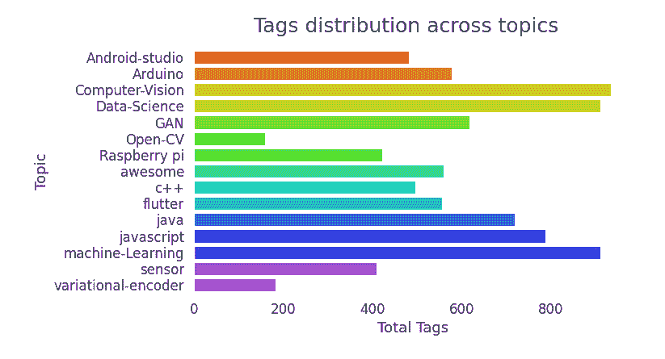**

*****以计算机视觉、数据科学和机器学习为主题的知识库往往被标记得更多。*****

**让我们以 topic_tags 的文字云作为结束，**

**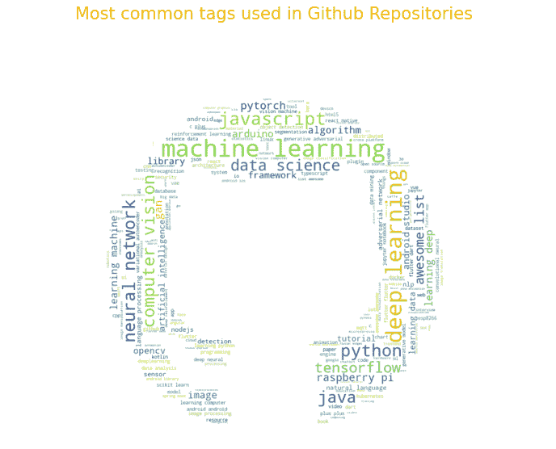**

# **推论:**

*   **在最受关注的前 10 个库中，有 4 个是框架。**
*   **Tensorflow 是最受关注和分叉的知识库。**
*   **如果用户正在查看一个存储库，那么他们最有可能分叉它。**
*   **微软和谷歌倾向于使用更受欢迎的存储库。**
*   **在拥有更受欢迎的存储库的前 10 名用户中，有 6 个是公司。**
*   **贡献活动(发布、拉请求、提交)之间没有实际的关系。**
*   **使用最多的标签是机器学习、深度学习、Python、计算机视觉、JavaScript。**
*   **主题为计算机视觉、数据科学和机器学习的存储库有更多的标签。**

**如果我们分析十年前的数据，这些趋势会完全不同。就像数据科学在过去几年里有了惊人的增长！**

**感谢您一路观看！我喜欢在 LinkedIn 上联系**

**如果你有任何问题、反馈或批评，请在评论区告诉我。祝你今天开心！玩的开心！**

***原载于 2021 年 7 月 12 日*[*【https://www.analyticsvidhya.com】*](https://www.analyticsvidhya.com/blog/2021/07/analyzing-popular-repositories-on-github/)*。***