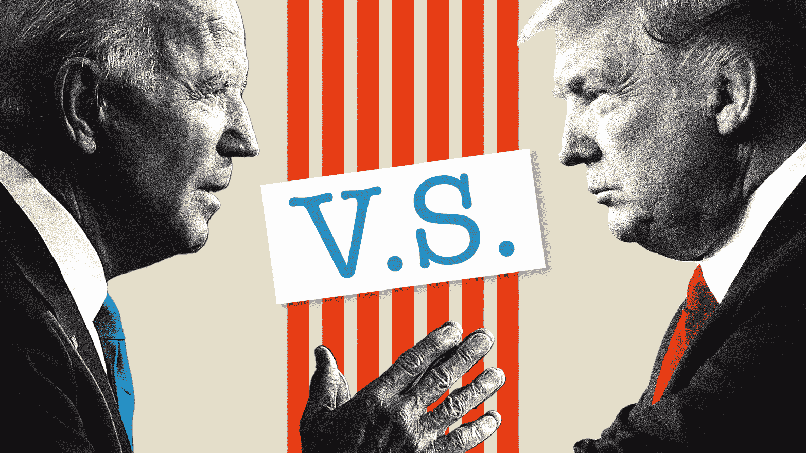
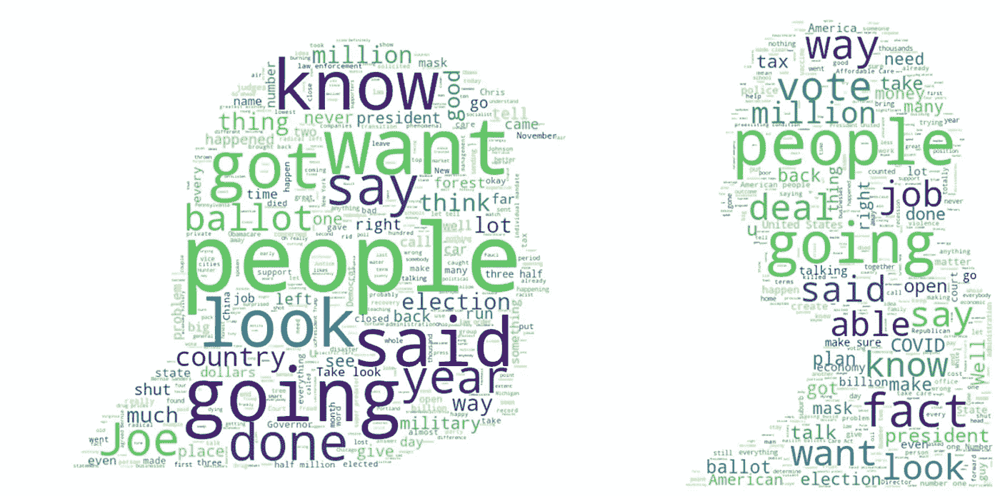
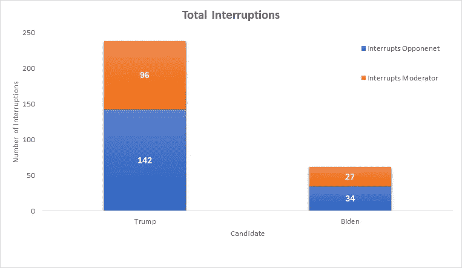
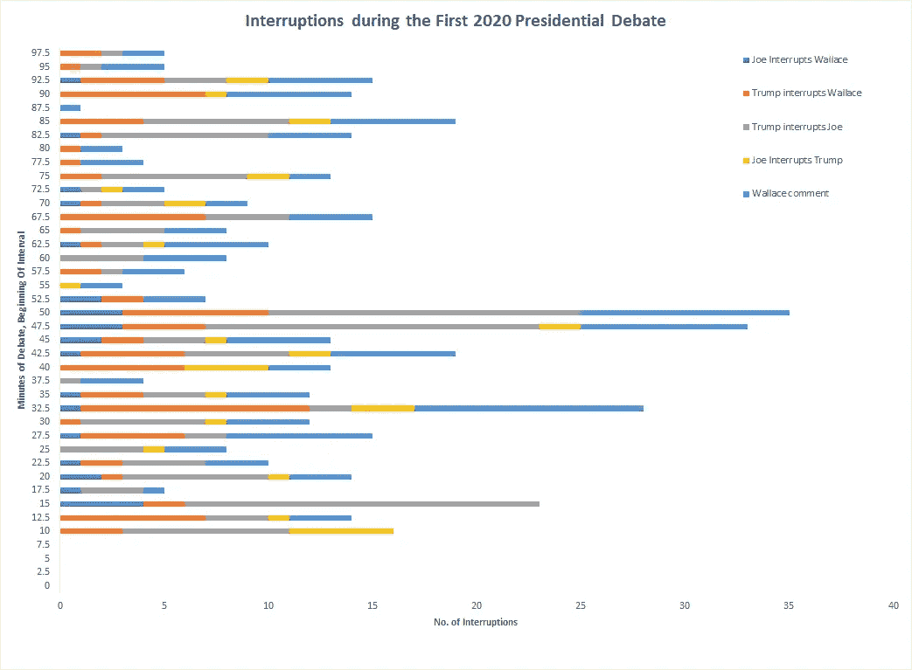
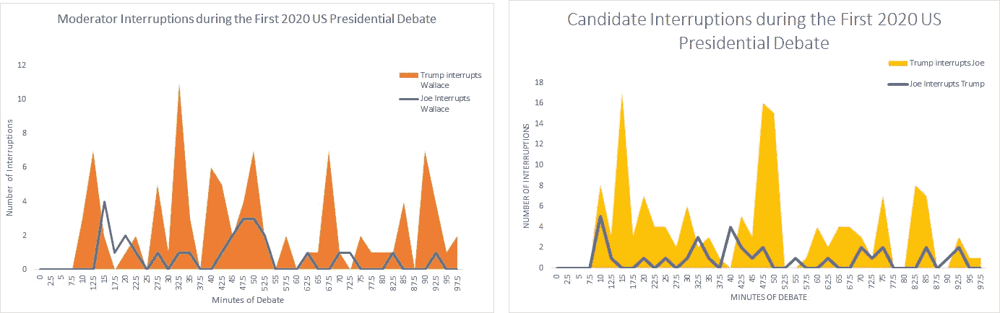
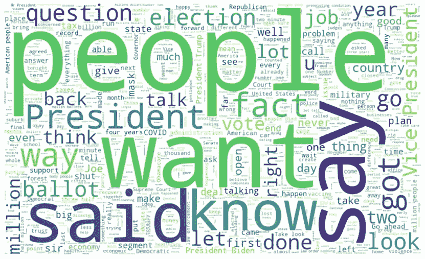
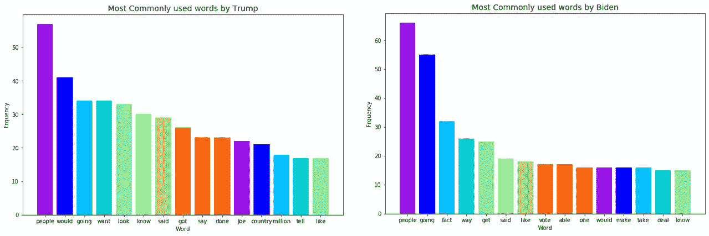
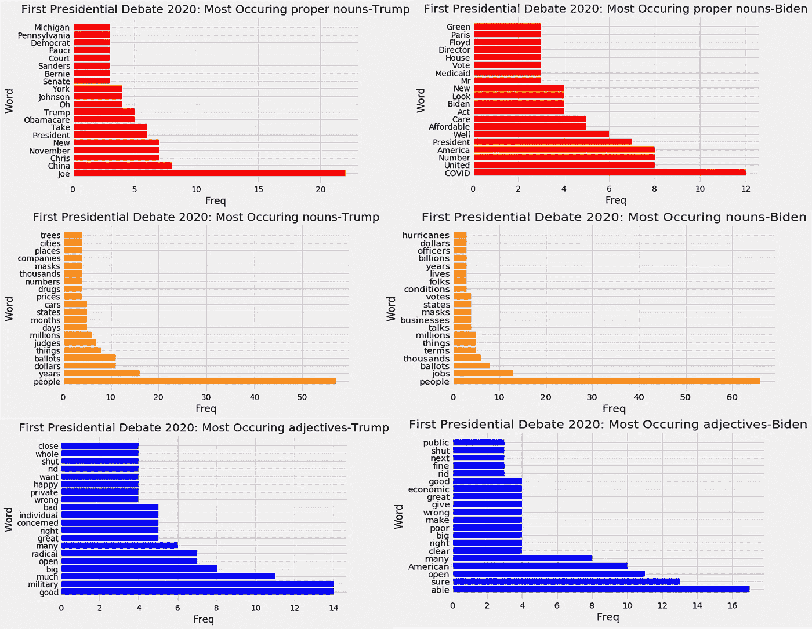

# 使用 Python 和 Excel 分析 2020 年第一次美国总统辩论的灾难

> 原文：<https://medium.com/analytics-vidhya/analyzing-the-disaster-that-was-the-first-us-presidential-debate-of-2020-d6293bcdf453?source=collection_archive---------24----------------------->



伊丽莎白·布罗克韦/每日野兽/盖蒂摄影说明

> 最后一年:2020 年，标志着十年的结束，给了我们许多东西:新冠肺炎，整个世界都被封锁，在家工作，然后它给了我们:**2020 年美国总统辩论的第一场热闹的灾难。**

作为一名国际学生，当我住在美国时，观看我的第一次美国总统辩论真的很有趣。想象一下我有多失望:我以为我能看到一场真正的辩论，但却看到两个成年人像孩子一样打架和争吵。我们都同意，即使是参加大学辩论的孩子也有更好的礼仪。但是，我在这里不是要讨论我的政治观点或羞辱甚至不是来自我的国家的政治领导人，而是提出我发现的有趣的分析。

当我在空闲时间寻找一个新项目时，我偶然发现了 Reddit 帖子中的这个美丽的宝石:[数据美丽](https://www.reddit.com/r/dataisbeautiful/)。那里的一些形象化的东西给了我灵感，让我自己深入这场辩论。



作者图片:Wordcloud 显示了特朗普(左)和拜登(右)在第一场辩论中最常用的词

我们在辩论中看到了大量的迷因，但是你能想象你通过数据得到的美丽形象吗？虽然迷因可能只是嘲笑和不准确地表达辩论，但数据永远不会说谎！

## 中断…中断…中断

我从 [Rev](https://www.rev.com/blog/transcripts/donald-trump-joe-biden-1st-presidential-debate-transcript-2020) 那里得到了辩论的文本数据，里面有完整的文字记录和视频。对我来说，这是最快的方法来下载抄本，从下载的 word 文档中复制并粘贴原始抄本到 Excel 中，并使用文本到列，F5 - >选择空白- >删除选择的行来创建数据集。



作者图片:候选人打断的总次数

为了创建所有的中断图表，我使用了 Excel。
我将文字记录分成 30 秒的间隔，并根据在这段时间内*“应该”发言的人/*“技术上”发言的人来记录打断的次数。如果有一段值得注意的相声，我不会把它算在任何一个候选人的头上。我甚至不得不看理货的视频。)



作者图片:按分钟计算的总中断和评论

如果 Wallace 表示这是候选人回答问题的机会，我认为时间是“专门”给候选人的。因此，如果华莱士问了拜登一个问题，无论是最初的 2 分钟还是直接反驳的机会，都算作拜登的时间。华莱士的评论是对候选人的任何交叉问题或当他要求他们停止。为了让辩论分钟的图表更易读，我把 30 秒的间隔算成了 2.5 分钟。



作者图片:跟踪打断主持人的候选人(左)和打断对方的候选人(右)

你能在所有的图像中看到一个模式吗？特朗普主要打断了乔·拜登和克里斯·华莱士。川普总共打断了 **238 次**，而**拜登**总共只打断了 **61 次**。水平堆积图和面积图都让我们看到特朗普*比拜登*打断的频率更高。

# 对 Python 越来越感兴趣



作者图片:2020 年第一次总统辩论中使用最多的词——“人民”

正如我前面提到的，总结一下中断的次数，我必须观看整个辩论视频，通过 Python 进行的语音/视频分析似乎超出了我的范围，因为我想做一些快速分析。于是，我转到了下一个最好的事情:*文本分析！*

首先，我将 Excel 抄本放入一个熊猫数据框，然后根据说话者将其分开。然后，我必须清理和预处理文本数据，以创建良好的可视化效果。

## 数据预处理:

以下是我执行的清洁步骤:

*   首先，我扩大了宫缩。缩略词不过是扩展词，比如我是我是或者你是你是。这一步至关重要，因为当你试图在不扩展的情况下删除标点符号时，你最终会得到奇怪的单词，如 you、im 等。如果它们没有被下一步的停用词删除所处理。
*   删除停用词意味着删除最常用的单词、代词、文章，这些都不是分析所必需的。我甚至不得不将额外的大写停用词添加到预先存在的停用词列表中。
*   接下来，我将文本保存为 JSON 格式，这样就可以轻松地删除数字和特殊字符。

```
### Performing pre-processing functions on text data
def clean_data(dfname):
##expanding contractions : means words like I'm, you're ----> get converted to I am, you are
    dfname['text1'] = dfname['text'].apply(lambda x: [contractions.fix(word) for word in x.split()]) #breaks into list
    dfname['text'] = [' '.join(map(str, l)) for l in dfname['text1']]                                #joining list to make sentences#####remove stopwords from dataframe column
    dfname['text'] = dfname['text'].apply(lambda x: ' '.join([item for item in x.split() if item not in stopword]))#####convert dataframe to JSON object and take only records eg: {label:records}
    preprocessed_text=dfname['text'].to_json(orient='records')####remove numbers    
    preprocessed_text = ''.join(c for c in preprocessed_text if not c.isdigit())

###remove special characters
    preprocessed_text=''.join(c for c in s if c not in punctuation)

##return cleaned text data
    return preprocessed_text
```

在我对数据进行标记之前，我使用蒙版单词云快速将其可视化，这基本上是一种通过使用图像作为轮廓来创建任何形状的单词云的奇特方式。

```
mask = np.array(Image.open(image_name,"r")) 
    wc = WordCloud(stopwords=STOPWORDS, #font_path=font_path,
                   mask=mask, background_color="white",
                   max_words=2000, max_font_size=256,
                   random_state=42, width=800,
                   height=800)#mask.shape[1] #mask.shape[0]
    wc.generate(biden_text_cleaned)
    plt.figure(figsize=(16,9))
    plt.imshow(wc, interpolation="bilinear")
    plt.axis('off')
    plt.show()
```

## 词频:

接下来，我对这个预处理过的文本进行了标记，并创建了一个计算字数的函数。下图显示了特朗普和拜登最常用的 15 个词。正如上面的单词 clouds 所示，“people”是两位候选人最常用的单词。乔·拜登反复使用这个短语: ***看，事情是这样的*** ，所以像事实和交易这样的词出现在这个图表中就不足为奇了。



作者图片:两位候选人最常用的 15 个单词

## 词性标注:

你问的词性标注或词性标注是什么？这是当你将文本语料库中的所有单词标记为英语中的 8 个词类，如名词、动词、代词、副词、形容词、介词、连词和感叹词。NLTK 库甚至给出了额外的标签，如过去分词、最高级形容词等。

出于分析的目的，我坚持使用三种词性:NNS:复数名词，NNP:专有名词，JJ:形容词。*(我的灵感来自于* [*fylim 的博客*](https://towardsdatascience.com/analyzing-the-chaotic-presidential-debate-2020-with-text-mining-techniques-238ed09d74c1) *)。她已经使用了 R nrc()软件包。如果你想看一些很酷的情绪分析，我强烈推荐你去看她的帖子。)*

```
pos_tagged = nltk.pos_tag(removing_stopwords)
    adj=dict(Counter(list(filter(lambda x: (x[1] == 'JJ' ), pos_tagged))).most_common(20)) 
    grammar_word,count=unpack_dictionary(adj)
    plot_pos_freq(grammar_word,count,"blue","adjectives",speaker)
```

我标记了所有标记化的单词，然后使用计数器和 lambda 函数找到前 20 个形容词、名词和专有名词。将代码中的‘JJ’*(形容词)*改为‘NNP’，就可以找到所有的专有名词。你可以在这里找到 POS 的所有代码及其含义[。](https://pythonprogramming.net/part-of-speech-tagging-nltk-tutorial/)



作者图片:特朗普(左)和拜登(右)使用的前 20 个专有名词、名词和形容词(从上到下)

*   可以看到两位辩手最常用的名词是**人**。
*   而川普关注的最热门的专有名词分别是: ***他对手的名字*** 和 ***中国，*** 乔拜登关注的 ***乔维德*** ！
*   具有讽刺意味的是，特朗普使用形容词*最多，但他甚至同样使用极性词，如 ***【部首】******【错误的】******【坏的】*** 。拜登重点介绍了形容词 ***【能干】******开放*** ， ***美国*** 。有趣的是，两位参与者使用形容词“闭嘴”的次数相同。(*他们俩互相说了很多‘闭嘴’！*)*

# ***结论**:*

*这场辩论是一个令人着迷和奇怪的事件，这是一个非常有趣和准确的 SNL 短剧，并受到了美国国民和每日晚间节目主持人的足够多的批评，这使得他们在第二场辩论和副总统辩论中采取了更好的方法。*

*在所有的想象中，有一个特别的词让我印象深刻，那就是——‘T0’*人* 。”接下来是类似于 ***百万******选票******选举、*** 和 ***美元*** 的词语。此外，打断的图表清楚地显示了特朗普总统通过打断他们来测试主持人克里斯·华莱士和他的对手乔·拜登的耐心的次数。*

# *外卖:*

1.  *我会说**跟踪打断是非常困难的**，因为你需要强有力的定义规则(*尽管我做了一些* ) **关于什么构成打断，什么算反驳，什么算讨论**和**在一个正在进行的演讲中，这些界限会很快变得模糊**。我很高兴我使用 Python 手动完成了这项工作，因为我要花相当长的时间来确定如何使用 Python 完成所有的中断规则设置。*
2.  *由于时间限制，我没有在我的分析中执行**词条化**、**词干化**，或者将抄本变成**小写**。这些是文本分析中最常执行的步骤，通过删除后缀和前缀，有助于将文本还原到其根形式。比如 ***去了，去了，去了，去了，*** 都是指 ***同根词 go*** 。至于小写，在标注名词时会导致词性标注的问题。
    我强烈推荐大家在文本分析中使用**词干** ( *去除后缀&前缀*)和**词汇化** ( *去词根*)，因为这有助于去除冗余。*

***看看以下启发/帮助我的资源，希望它们也能帮助你:***

*   *许多人每隔一天想象一些事情*
*   *分析辩论的简单而肮脏的方法:[第一次总统辩论:按数字统计](https://towardsdatascience.com/1st-presidential-debate-by-the-numbers-dee50b35f4ac)*
*   *通过 R: [用数据科学看辩论用文本挖掘技术分析 2020 年总统辩论](https://towardsdatascience.com/analyzing-the-chaotic-presidential-debate-2020-with-text-mining-techniques-238ed09d74c1)*
*   *创建任意形状的文字云:[文字云遮罩](https://towardsdatascience.com/create-word-cloud-into-any-shape-you-want-using-python-d0b88834bc32)*