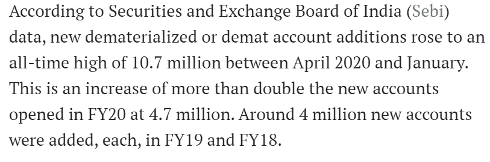
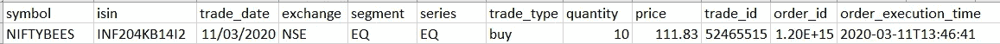
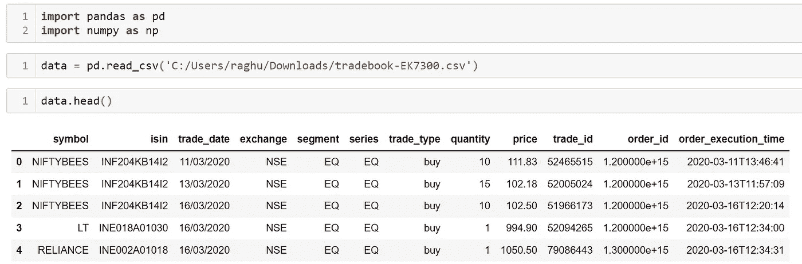
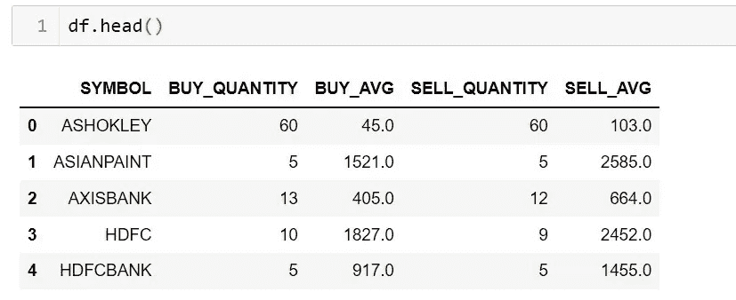
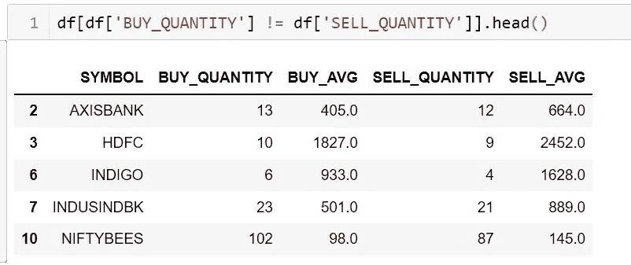
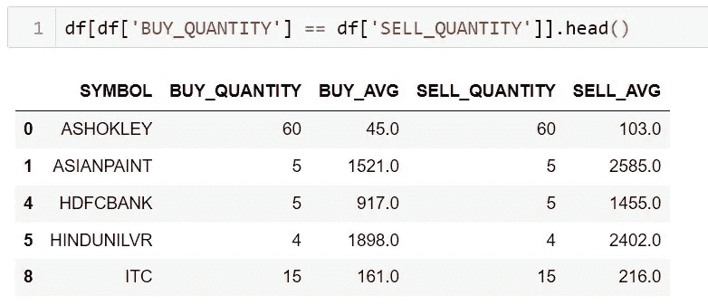

# 使用 PYTHON 分析贸易帐簿

> 原文：<https://medium.com/analytics-vidhya/analyzing-trade-book-using-python-77cbac9db1aa?source=collection_archive---------5----------------------->


马克西姆·霍普曼在 [Unsplash](https://unsplash.com/s/photos/stock-market?utm_source=unsplash&utm_medium=referral&utm_content=creditCopyText) 上的照片

新冠肺炎是一个持续的局势，也是一个不可预测的局势。向牺牲生命的一线工人表示哀悼，向仍在战斗的其他人表示问候。几乎每个人都受到了影响，有些人比其他人更严重，但还没有结束。多亏了它，我们的生活陷入了停滞。

新冠肺炎的爆发也影响了许多证券交易所，包括印度国家证券交易所，印度国家证券交易所的指数(NIFTY 和 SENSEX)出现了大幅调整。许多人失去了他们的财富；其他人看到了这个投资机会。但一如既往，有些人从整个事件中获利。在疫情冠状病毒肆虐期间，Zerodha、Upstox 和 5paisa.com、Samco Securities、AliceBlue 等在线经纪公司的投资者和交易活动激增。



[https://www . livemint . com/news/India/new-demat-accounts-jump-to-a-record-high-in-fy21-11615229292551 . html](https://www.livemint.com/news/india/new-demat-accounts-jump-to-a-record-high-in-fy21-11615229292551.html)

虽然一些保持耐心的人实现了财务独立，一些人失去了他们的血汗钱，但在这两种情况下，理解贸易书是必不可少的，以了解哪里出了问题。人们不需要每天分析交易账簿，但每周一次是有益的。

在本指南中，我们使用 Python 分析交易簿数据。该数据以 CSV 格式从 Zerodha 下载。它包含“符号”、“isin”、“交易日期”、“交换”、“段”、“系列”、“交易类型”、“数量”、“价格”、“交易标识”、“订单标识”、“订单执行时间”。



如果不深入分析，对股票的平均买价和平均卖价进行肤浅的分析会有所帮助。

**导入库和数据**



**使用符号对数据进行分组并计算平均买卖价格**



有了这个数据框架，我们也可以确定我们的平仓或开仓头寸。" **BUY_QUANTITY** "和" **SELL_QUANTITY** "不相等的行，表示还有一些未结头寸。

**关闭和打开位置**

```
df[df['BUY_QUANTITY'] != df['SELL_QUANTITY']] # Open Positions
df[df['BUY_QUANTITY'] == df['SELL_QUANTITY']] # Closed Positions
```



**平仓利润百分比**

```
closed_pos = df[df['BUY_QUANTITY'] == df['SELL_QUANTITY']]buy_amt = (df['BUY_QUANTITY']*df['BUY_AVG']).sum()
sell_amt = (df['SELL_QUANTITY']*df['SELL_AVG']).sum()
print(((sell_amt - buy_amt)/buy_amt)*100)
```

这将表明在过去的时间里交易的好坏。但是对于完整分析，还应该考虑经纪和其他服务成本。

本指南到此结束。希望它能提供一些知识。