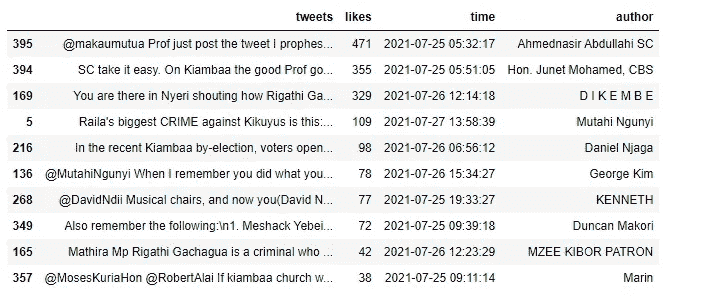
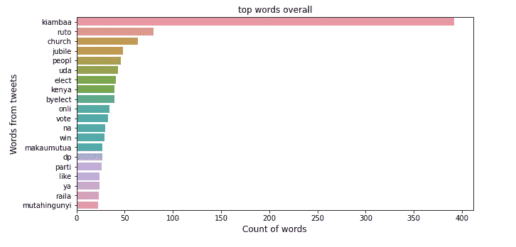
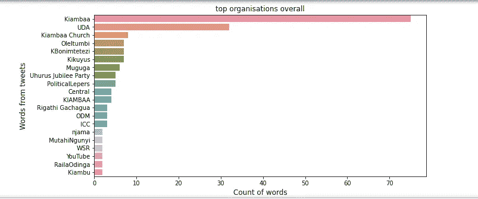
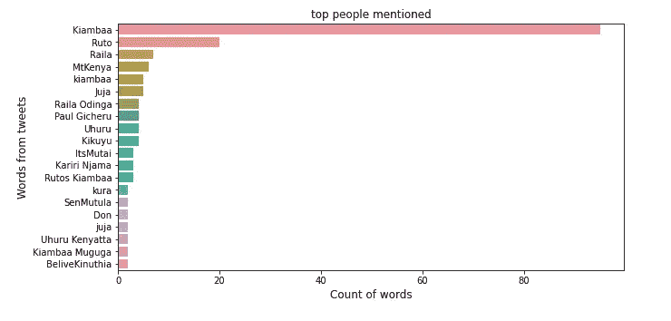

# 使用 Twitter 数据和自然语言处理分析 Kiambaa 补选的选民情绪

> 原文：<https://medium.com/analytics-vidhya/analyzing-voter-sentiment-for-the-kiambaa-by-election-using-twitter-data-and-natural-language-faf7ad2cffc1?source=collection_archive---------9----------------------->

在这篇文章中，我将集中讨论三件事:情感分析、自然语言处理和令人惊叹的 Twitter API——为那些不知道的人提供的应用程序编程接口。我展示的数据来自 twitter 用户，并不代表我的观点。我们开始吧！

## **情感分析**

你可能会问自己什么是情感分析。情感分析也称为意见挖掘，是一种用于分析数据是正面、负面还是中性的技术。文本数据被输入到计算机中，使用一些精心制作的规则，计算机程序能够识别句子的主观性，例如，如果一个句子包含像 good、great、best、amazing、beautiful 这样的词，程序将能够知道在哪里对这个句子进行分类。

## 自然语言处理

然而，计算机不能像我们一样理解单词，因此非常聪明的人发明了自然语言处理 NLP 简而言之，它是人工智能的一个分支，涉及到让计算机能够像人类一样理解文本和口语单词。

## Twitter api

我知道读这篇文章的每个人都知道 twitter 是什么，你知道，我们去那个地方获取我们每天的八卦和我们邻居对昨天的足球比赛应该如何进行的意见。为了这个项目，我利用 Twitter 的惊人的 API ( *底部的 API 是什么的描述*)来获取最近在肯尼亚激烈竞争的 Kiambaa 选举的数据，所以让我们开始吧！

## 十大最受欢迎的推文

我挑选了最近 1000 条提到 Kiambaa 这个词的推文。我保存了这些数据并做了一些分析，这就是我的发现

在数千条经过处理的推文中，最受欢迎的推文是 Ahmednasir Abdullahi SC 的推文，有 470 多个赞。尊贵的 Junet Mohamed CBS 的推文获得了 355 个赞，twitter 用户 DIKEMBE 的推文获得了 329 个赞，排名第三。每个人都喜欢的政治分析家和推特用户 Mutahi ngunyi 排名第四，而推特用户 Daniel Njaga 排名第五，他的推特获得了 98 个赞。

关于选举结束的 Kiambaa 的前 5 条推文

## 总体热门词汇

在数千条关于基安巴选举的推文中，最热门的词似乎是:

Kiambaa 这个词出现了超过 400 次，DP William Ruto 的名字出现了第二多，超过 100 次，教会仍然是肯尼亚政治的中心，被提及近 100 次。其他关键词是投票、胜利、大庆、人民和木塔欣贡伊。

## 顶级组织整体

至于组织，提到最多的组织如下:

顶级组织整体

一些排名靠前的组织有 UDA、DP Rutos 党、Kiambaa 教会、自称为“骗子之国”发言人的 Dennis Itumbi 也在名单上。其他组织，如乌呼鲁的禧年党，ODM，国际商会，WSR 和 Youtube 也在推特上被肯尼亚人高度提及。

## 提到的顶级人物

至于提到最多的人，名单是这样的:

提到的顶级人物

DP William Ruto 的叙述被提及 20 多次，Raila Odinga 紧随其后。其他被提及的有保罗·吉切鲁，久比利候选人卡里里·恩贾马，乌胡鲁·肯雅塔，相信肯努西亚也在推特上被高度提及。令人惊讶的是，选举的实际获胜者，来自肯尼亚民主联盟的 Njuguna Wanjiku，并没有出现在排名靠前的地方，这让我不禁要问，作为肯尼亚人，当我们进行政治对话时，我们在谈论什么，是竞选的人和他们的政策，还是他们所代表的政党。

这就是全部，直到下一次我亲爱的读者，阅读下面关于 API 使用菜单的细节，餐馆隐喻。

## 应用程序接口

在这个项目中，我使用了 Twitter API，它是应用程序编程接口的缩写。基本上，API 的作用是帮助我从 Twitter 或 Spotify 等其他程序中获取信息，并将其插入到我自己的程序中。为了进一步说明，以此为例；

你在家，你很饿，你很懒。该点菜了。

您决定从 Jack's Burgers 点餐，所以您浏览了他们的菜单以查看选项，然后通过下订单要求特定的菜肴。杰克汉堡店收到订单后，会将订单传递到厨房，然后执行一系列步骤来制作这道菜。那道菜被送到你面前，很快就被吃掉了。

好吃。

好吧，你还是很饿。但是你不想再吃汉堡了。这次你决定选吉尔的披萨。

当你打电话给吉尔比萨店点餐时，如果你想点杰克汉堡菜单上没有的菜，你认为会发生什么？你可能会遇到困惑。你肯定吃不到你想点的菜。

在上面的类比中，你是一个程序，而餐馆是你想与之互动的程序。要从另一个程序(餐厅)接收你想要的(食物)，你需要以特定的方式(由菜单定义)提出请求(下订单)。如果你试图以错误的方式要求，你就不会得到你想要的。

API 就像菜单。菜单定义了一道菜的清单，当有人点了其中一道菜时，餐馆会做一堆事情，然后把要求的菜送回来。API 定义了一个命令列表，当一个程序使用其中一个命令时，另一个程序会做一些事情，然后发送回该命令所请求的内容(通常是某种数据)。希望能澄清一些事情😊。