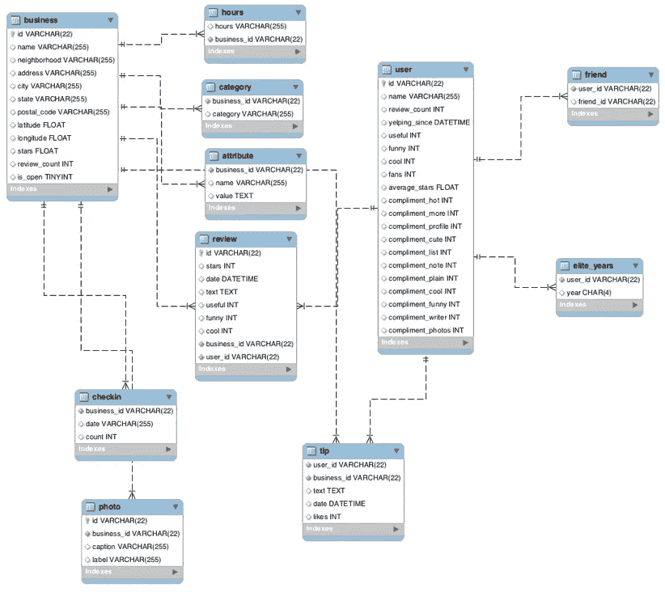

# 用 SQL 分析 Yelp 数据集

> 原文：<https://medium.com/analytics-vidhya/analyzing-yelp-dataset-with-sql-147157a4caed?source=collection_archive---------5----------------------->


马库斯·斯派克在 Unsplash 上拍摄的照片

SQL 是数据科学专业人员军械库中的关键一环。分析师需要 SQL 来处理存储在关系数据库中的结构化数据

SQL 已经存在几十年了。我们传递和消化信息的速度日益加快。为了根据数据做出明智的决策，世界各地的组织都在雇用业务分析师和数据科学家等数据专业人士，从庞大的数据宝库中挖掘和挖掘见解。

其中一个最重要的工具是——你猜对了——SQL！

我最近参加了一个来自 coursers.org[的加州大学戴维斯分校的 SQL(结构化查询语言)课程。这是 SQL 和使用数据的基础知识的预备知识，这样您就可以开始出于数据科学的目的对其进行分析。你将开始问正确的问题，想出好的答案，为你的组织提供有价值的见解和重要的知识。本课程从具体细节开始，并承认你没有任何 SQL 方面的信息或技能。](https://www.coursera.org/learn/sql-for-data-science)

对于想学 SQL 还没上过这门课的人，我强烈推荐这门课。

# 以下是本课程的学习目标

*   区分用于数据科学应用程序的 SQL 和用于更常见的数据管理操作的 SQL。
*   从一列或一组列中确定所需数据的子集，并编写 SQL 查询来限制这些结果。
*   了解 WHERE、BETWEEN、IN、OR、NOT、LIKE、ORDER BY 和 GROUP BY 如何工作。使用通配符功能搜索更具体的记录或部分记录，包括它们的优点和缺点，以及如何最好地利用它们
*   使用基本的数学运算符以及聚合函数(如 AVERAGE、COUNT、MAX、MIN 等)开始分析数据。
*   学习如何编写子查询，包括它们的优缺点，以及何时使用它们。
*   识别和定义几种类型的连接，包括笛卡尔连接、内部连接、左右连接、完全外部连接和自连接。此外，使用别名和预限定符来使您的 SQL 代码更加整洁和高效。
*   使用函数操作字符串、日期和数字数据，将不同来源的数据集成到具有正确格式的字段中进行分析。
*   使用 Case / When 语句记录一组数据，以便在不同的级别进行分组(例如，从城市到地区)。
*   确定组织、治理、业务和数据条件，这些条件表明使用联接来准备用于分析的数据。

本课程的期末项目是分析 Yelp 提供的公共数据集，Yelp 是一个供用户提供评论并对他们与各种组织的互动进行评级的平台，这些组织包括企业、餐馆、健身俱乐部、医院、地方政府办公室、慈善组织等。

下面是我们将要用来分析数据的 Yelp 数据集的实体图(ER 图)。



我来给你解释一下实体关系图。

任何对象，例如实体、实体的属性、关系集和关系集的属性，都可以借助 ER 图来表示。

*   表格中的黄色键图标(例如业务表格中的-id)是业务表格的主键
*   红色菱形图标是另一个表的外键(例如，review 表中的 business_id 是 business 表的外键。

`**Note** : If you are not familiar with the idea of Primary and Foreign Keys. Check what are [[Primary and Foreign Keys]](https://www.guru99.com/difference-between-primary-key-and-foreign-key.html?utm_source=sms&utm_campaign=primary_and_foreign_key)`

*   穿过表的虚线显示了表之间的关系(例如，业务表与其他表有一对多的关系)

现在我们知道了 SQL 做什么，什么是阿尔图，让我们试着深入一点，看看我们如何检索数据和解决一些业务问题。

获得数据后，我们要做的第一件事是检查有多少条记录，以及我们要使用的列中是否有空值。

1.  查找业务表中的记录总数。

```
***********SQL CODE**********
SELECT COUNT(*)
FROM Business*****************************
```

2.检查用户表中是否有空值

```
***********SQL CODE**********
SELECT * FROM user WHERE
id is null or 
name is null or 
review_count is null or
yelping_since is null or 
useful is null or
funny is null or
cool is null or
fans is null or
average_stars is null or
compliment_hot  is null or
compliment_more is null or
compliment_profile is null or
compliment_cute is null or
compliment_list is null or
compliment_note is null or
compliment_plain is null or 
compliment_cool is null or 
compliment_funny is null or 
compliment_writer is null or
compliment_photos is null*****************************
```

3.按降序列出评论最多的城市:

```
***********SQL CODE**********
    SELECT city,SUM(review_count)
    FROM business
    ORDER BY  review_count DESC***************************** 
-----------------+-------------------+
| city            | SUM (review_count) |
+-----------------+-------------------+
| Las Vegas       |             82854 |
| Phoenix         |             34503 |
| Toronto         |             24113 |
| Scottsdale      |             20614 |
| Charlotte       |             12523 |
| Henderson       |             10871 |
| Tempe           |             10504 |
| Pittsburgh      |              9798 |
| Montréal       |              9448 |
| Chandler        |              8112 |
| Mesa            |              6875 |
| Gilbert         |              6380 |
| Cleveland       |              5593 |
| Madison         |              5265 |
| Glendale        |              4406 |
| Mississauga     |              3814 |
| Edinburgh       |              2792 |
| Peoria          |              2624 |
| North Las Vegas |              2438 |
| Markham         |              2352 |
| Champaign       |              2029 |
| Stuttgart       |              1849 |
| Surprise        |              1520 |
| Lakewood        |              1465 |
| Goodyear        |              1155 |
+-----------------+-------------------+
```

4.查找雅芳市企业的星级分布

```
***********SQL CODE**********
SELECT stars,COUNT (stars) AS star_count
FROM business
WHERE city='Avon'
GROUP BY  1
***************************** 
+-------+------------+
| stars | star_count |
+-------+------------+
|   1.5 |          1 |
|   2.5 |          2 |
|   3.5 |          3 |
|   4.0 |          2 |
|   4.5 |          1 |
|   5.0 |          1 |
+-------+------------+
```

5.根据评论总数查找前 3 名用户:

```
***********SQL CODE**********
SELECT name,review_count
FROM user
ORDER BY review_count DESC
LIMIT 3
***************************** +--------+--------------+
| name   | review_count |
+--------+--------------+
| Gerald |         2000 |
| Sara   |         1629 |
| Yuri   |         1339 |
+--------+--------------+
```

6.发表更多评论会带来更多粉丝吗？

不一定相关。拥有最多粉丝的杰拉德只有 253 条评论。尤里只有 76 个粉丝，却有 1339 条评论。还应该考虑其他一些因素。

```
***********SQL CODE**********
SELECT name, review_count, fans
FROM USER
ORDER BY fans DESC***************************** 
+-----------+--------------+------+
| name      | review_count | fans |
+-----------+--------------+------+
| Amy       |          609 |  503 |
| Mimi      |          968 |  497 |
| Harald    |         1153 |  311 |
| Gerald    |         2000 |  253 |
| Christine |          930 |  173 |
| Lisa      |          813 |  159 |
| Cat       |          377 |  133 |
| William   |         1215 |  126 |
| Fran      |          862 |  124 |
| Lissa     |          834 |  120 |
| Mark      |          861 |  115 |
| Tiffany   |          408 |  111 |
| bernice   |          255 |  105 |
| Roanna    |         1039 |  104 |
| Angela    |          694 |  101 |
| .Hon      |         1246 |  101 |
| Ben       |          307 |   96 |
| Linda     |          584 |   89 |
| Christina |          842 |   85 |
| Jessica   |          220 |   84 |
| Greg      |          408 |   81 |
| Nieves    |          178 |   80 |
| Sui       |          754 |   78 |
| Yuri      |         1339 |   76 |
| Nicole    |          161 |   73 |
+-----------+--------------+------+
(Output limit exceeded, 25 of 10000 total rows shown)
```

7.有更多带有“爱”字或“恨”字的评论吗？

是的，有爱情这个词的评论比较多。

总评论与爱-1780

带有仇恨的评论总数— 232

```
***********SQL CODE**********
SELECT COUNT(CASE WHEN text LIKE '%love%' THEN text END) AS Love_count,
COUNT(CASE WHEN text LIKE '%hate%' THEN text END) AS Hate_count
FROM review
***************************** 
+------------+------------+
| count_love | count_hate |
+------------+------------+
|       1780 |        232 |
+------------+------------+
```

8.找到拥有最多粉丝的前 10 名用户

```
***********SQL CODE**********  
SELECT name,fans
FROM user
ORDER BY fans DESC
LIMIT 10
***************************** +-----------+------+
| name      | fans |
+-----------+------+
| Amy       |  503 |
| Mimi      |  497 |
| Harald    |  311 |
| Gerald    |  253 |
| Christine |  173 |
| Lisa      |  159 |
| Cat       |  133 |
| William   |  126 |
| Fran      |  124 |
| Lissa     |  120 |
+-----------+------+
```

我们可以使用上面讨论的这些小检查作为起点来了解我们的项目，并在以后进行深入分析时参考它。

任何分析的第一步都是理解表之间的关系，并进行基本检查，如:

我们的数据中有空值吗？

表中的主键和外键是什么？

表格之间的关系是什么？是一对多还是多对多等等

检查数据的标题行(前 10 行)

# 技术说明

以上所有查询都是在 Coursera 的 SQL 环境中执行的。参加本课程，了解有关数据集的更多信息。

链接:[coursers.org](https://www.coursera.org/learn/sql-for-data-science)