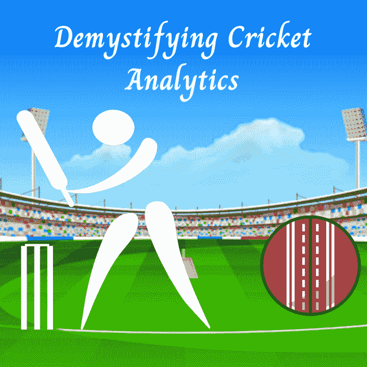

# 板球分析剖析

> 原文：<https://medium.com/analytics-vidhya/anatomy-of-cricket-analytics-e0438bbfe440?source=collection_archive---------9----------------------->

作者图片

每个人如何在比赛中控制球的流动，那些在比赛中做得更好的人总是会赢。一个四个字母的单词对体育界产生了深远的影响；当我们考虑一个击球手如何把球棒打到球上，当我们考虑投球手如何把球传给远离球棒的人。定性或定量地形象化这一点不是很有趣吗？

然而，当我们谈论板球分析时，我们可以考虑的所有事情是什么，以及如何揭开它的神秘面纱？在这篇文章中，我将构建一个关于蟋蟀分析的故事，涵盖各个方面。

让我们从板球分析的菜单开始:

*   描述统计学
*   监督学习
*   无监督学习

在描述性统计拼盘中，我们可以收集一个团队或特定球员的会话细节，无论是击球手、投球手还是外场手。如果你有单个团队的整个会议数据，你可以找出平均值、好球率、半个世纪或一个世纪得分数、三柱门数、经济率等与**性能指标相关的数据。**

特定团队的教练为您提供数据来分析团队的体能数据，这些数据可能包括身体成分分析、心血管耐力(溜溜球测试)、力量、肌肉骨骼耐力和许多其他与**体能指标相关的测试数据。**

> 六个距离与击球手的体能属性如上肢力量、下肢力量、力量和手眼协调有关系，类似地，投球速度与上肢力量、下肢力量、投球手的核心力量有关系。因此，有必要纳入健康指标。
> 
> ***我们都知道地理区域(气候和球场条件)等外在因素在板球运动中起着至关重要的作用。***

每当一个团队从一个本地地区到另一个比赛环境，挑战就出现了。例如，澳大利亚队将在印度参加五项测试赛系列赛，他们面临的挑战是气候和场地。假设你给了一个任务去测量气候和音高条件的影响；怎么做呢？

*我们可以建立一个监督学习模型，该模型将数据标记为赢或输，其特征包括气候(热、湿或阴)条件、球场(干、硬或草)、对手球员的影响(根据 ICC 排名)、击球区和击球手击球区的热图。如果你必须建立一个球员或球队的指标，我们可以测量这些因素* ***表现指标，健康指标和外在指标。*** *如果你能够建立一个机器学习模型——监督学习；然后我们就可以给这些指标赋予权重。* ***外在指标。*** *如果你必须知道外在因素的影响，我们可以测量同样的系数。*

> *OI=总体影响*
> 
> *PM =绩效指标*
> 
> *WPM =绩效指标的权重 FM=健康指标*

**现在在我们的烹饪中是监督学习，通过监督学习的含义，我们能够开发上述指标。板球分析学中监督学习的另一个贡献是** [**预测单个球员或球队的跑动**](https://analyticsindiamag.com/machine-learning-approach-in-fantasy-sports-cricket/)**；对输赢的预测，对投球手击球次数的预测。**

> *WFM =绩效指标的权重 EM=外在指标*
> 
> *WEM=外部指标的权重*
> 
> **OI = PM * WPM+FM * WFM+EM * WEM**

然而，当无监督学习模型可以帮助一个团队根据他们的适应度对他们进行分类时；记得教练问你吗？所以。你可以向教练建议最佳健身、一般健身或差健身组。

我们忘记了讨论经济。通过上述分析，我们可以将经济影响联系起来，并帮助各种团队管理。

快乐学习…！！