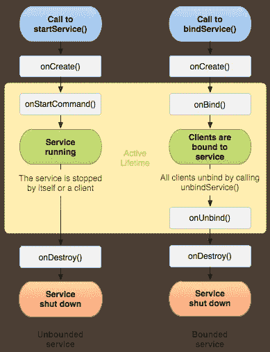

# Android 服务:教程

> 原文：<https://medium.com/analytics-vidhya/android-services-a-tutorial-a4fb8b5ae7d7?source=collection_archive---------24----------------------->

# 什么是服务

一个 ***服务就是正在运行的*** 代码，而这个代码，没有 GUI。除非代码创建了一个可运行的线程，或者在一个单独的进程中运行，否则代码在它的应用程序(宿主进程)的主线程上运行。

代码可以显示一个通知，表明它正在运行，在这种情况下，它是 ***前台代码*** 。当使用麦克风或摄像机时，必须显示通知。

代码可以不显示它正在运行的指示，在这种情况下，它是 ***后台代码*** ，例如清空应用程序的缓存文件夹。

代码可以被交互，例如发送特定的请求，或者接收给定的结果。在这种情况下，代码是可用的，只要与它交互的代码是可用的。这是 ***绑定码*** 。

一个 ***代码可以*** *被*绑定，并且显示通知，或者显示不通知，或者一个代码可以被解除绑定，并且显示通知，或者显示不通知。

一个服务，所以可以绑定的代码，或未绑定的，或显示的，或不显示通知的， ***使用****`Service`类创建，并使用`Intent`启动。*

# *服务寿命和生命周期*

*一个类的实例的代码有 ***一个生命期*** ，这是该实例存在的周期。所以一役也，有一生。*

*一个生命周期 ***有一个周期*** ，这个周期就是实例第一次被创建，最后一次被销毁，以及两者之间发生的事情。*

*来自 [android 开发者](https://developer.android.com/guide/components/services.html)的服务生命周期如下*

**

*例如，当`startService`被调用时，`onStartCommand`中指定的代码将被执行，它可以用来显示一个通知，所以服务将是一个 ***前台服务*** ，或者没有通知，所以服务将是一个 ***后台服务*** 。*

*之后，可以调用`bindService`。将执行`onBindService`中指定的代码。它必须返回一个接口，该接口允许与代码进行通信。代码被绑定到客户端的生命周期，因此这被称为 ***绑定服务*** 。*

# *生存期标志*

*一个`Service`的实例，可以设置一些标志。这些 ***标志控制`Service`实例的*** 生存期。*

*这些标志仅适用于通过调用`startService` 启动的服务。当所有绑定的客户端都解除绑定时，只调用了`bindService()` 方法的服务被销毁。*

*`***START_STICKY***` *标志*声明，当`Service`的一个实例被销毁时，例如在低内存上，该服务的另一个实例将被创建，这样`onCreate`和`onStartCommand`将被调用。正在执行的代码从零开始重新启动，不保留任何状态。最初的`Intent`启动了`Service`的第一个实例，没有被重新传递给`onStartCommand`，因此为空。*

*`***START_REDELIVER_INTENT***` *标志*规定，当一个`Service`的实例被销毁时，所发生的是`Service`的另一个实例被创建。正在执行的代码从零开始重新启动，执行`onCreate`和`onStartCommand`功能，在这种情况下，`onStartCommand` 将接收服务的初始`Intent`，它启动了较早的实例。*

*`***START_NOT_STICKY***` *标志*表示，当`Service`的实例被销毁时，它不会被重新创建，因此必须手动重新创建。*

*显示通知 的 ***服务与在前台运行的应用程序具有相同的优先级，因此它不太可能因内存不足而被终止，但需要记住的重要一点是，这并不重要。****

# *注册服务*

*服务 ***必须在应用程序的清单中声明*** ，方法是将`service`元素作为子元素添加到`application`元素中。*

*如果服务是前台服务，那么`***uses-permission***`前台服务，必须在 manifest 中指定。*

*同样，如果服务是前台服务，那么使用`foregroundServiceType`，它必须 ***声明它的类型*** ，可以是一个或多个，例如`camera`或`camera | microphone`*

*唯一必需的属性，是*`***name***`***属性*** ，它指定了实现服务的类的名称。类名可以是完全限定的，通过指定这个类所属的包，或者它可以以点`.`开始，在这种情况下，它属于清单中指定的包。**

**一个服务可以运行在一个不同的进程上，然后默认为应用程序创建的进程，通过使用****属性*** 。如果 process 属性中的字符串名称以冒号`:`开头，那么服务将在一个新创建的进程中运行，该进程专用于它的应用程序。如果字符串名称以小写字母开头，则服务将在全局进程中运行，并具有指定的名称。***

# **启动和停止服务**

**一个服务 ***可以通过调用*** `startService`启动，一个服务通过调用`startService`启动，被称为一个 ***启动的服务*** 。**

```
**Intent intent = new Intent (this , Service_ClassName.class );
startService (intent );**
```

*****数据可以添加*** 到一个意向中，像指定一些选项一样，给服务。**

```
**Intent intent = new Intent (this , Service_ClassName.class );
intent .putExtra ("do" , "what" );
intent .putExtra ("what-arg" , 0.5 );
startService (intent );**
```

**`startService`法，可多次称为*，同样的`onStartCommand`，也可多次称为。***

***使用`startService`方法启动的服务， ***可以使用***`stopService`方法停止。***

```
**Intent intent = new Intent (this , Service_ClassName.class );
stopService (intent );**
```

**它 ***也可以自行停止*** ，使用:`stopSelf (int startId )`。`stopSelf`中的`startId`，是从`onStartCommand` 接收的。如果发出了新的`startService`调用，它用于防止服务自行停止，但是如果使用了最近的`startId`，那么服务将自行停止，而不考虑任何先前的`startService`调用。**

**已启动的服务可以显示其正在运行的通知，并且 ***通过使用`startForeground`方法将其自身提升为前台*** 服务，该方法将用户定义的通知 id 和实际通知作为参数显示给用户。**

```
**startForeground (int id,  Notification notification)**
```

**要 ***将前台服务*** 降级，恢复为后台服务，可以调用`stopForeground`方法。这不会停止服务的运行。也可以向`stopForeground`方法传递`boolean` true，以移除任何显示的通知。现在该服务被降级为后台服务，可以使用`stopSelf`或`stopService`如前所述停止它。**

**一个 ***服务可以通过调用`bindService`方法来启动*** ，该方法有如下签名:**

```
**public abstract boolean bindService (Intent intent, 
                ServiceConnection events, 
                int options)**
```

**意图仅仅是 ***一个常规意图*** 来启动一个服务，如前所示。**

**事件，只是一个接口的实例，它必须响应 ***不同的绑定事件*** ，例如发生`onBindingDied`，或者`onServiceConnected`，或者`onServiceDisconnected`。**

**options 只是对 ***控制绑定过程的选项*** ，例如 flag `BIND_AUTO_CREATE`，会自动创建服务。**

**如果服务类存在，并且允许客户端绑定到它，则`bindService` ***方法返回*** true，否则返回 false。**

**当执行绑定时，调用`onBind`方法，它必须返回一个`IBinder`接口的实例。 ***绑定更多的是与*** 进程间的通信相关，所以不同进程之间可以进行通信，但是可以在所有情况下使用。binder 类实现了允许执行进程间通信的方法，我们可以扩展它，以提供我们自己的方法，作为对客户端的服务。**

**一个绑定的服务， ***可以解除绑定*** ，使用`unbindService`方法停止。**

**只调用了其 bindService 方法的服务， ***会自动销毁*** ，当所有绑定的客户端解除绑定后，调用`onUnbind`方法。**

**如果已经使用`startService`方法、**方法、*方法启动了一个服务，并且还使用`bindService`方法启动了*方法和**方法，那么调用`stopService`或`stopSelf`方法将不会销毁该服务，直到所有绑定的客户端都已解除绑定，反之亦然，当所有客户端都已解除绑定，但未调用`stopSelf`或`stopService`方法时，该服务将不会被销毁。**

# **从服务中获取结果**

**一个服务使用`startService`方法开始， ***可以使用*** 例子一个祝酒词，或者一个通知，或者一个广播…来提供或显示一些结果。它也可以被绑定，以便在必要时检索结果。**

# **演示应用程序**

**这个应用 ***说明了*** 的所有要点，前面讲过。它有三个服务，一个用于清除缓存目录的内容，第二个用于录制音频，第三个用于与一些代码进行交互，所以只是为了计算`n`数字的加法，以及停止一个已经开始的录制会话。**

*****服务源代码*** 如下:**

*****主要活动*** 源代码如下:**

**而 ***清单源代码*** 如下:**

# **IntentService**

**一个 ***IntentService，是*** 一个服务，是`IntentService`类的一个实例。`IntentService`类是`Service`类的子类。**

**`IntentService`类*，* ***使用单个工作线程*** ，当调用`startService`时，不执行自己的线程。该线程不同于应用程序主线程。**

**在这个新创建的线程上，对`startService`的调用被依次处理，一个接一个，并且当不再有 ***工作要做时`IntentService`自动停止。*****

**`IntentService` ***已弃用*** *，必须改用*`JobIntentService`。**

***原载于 2021 年 2 月 16 日*[*https://twiserandom.com*](https://twiserandom.com/android/android-services-a-tutorial/)*。***