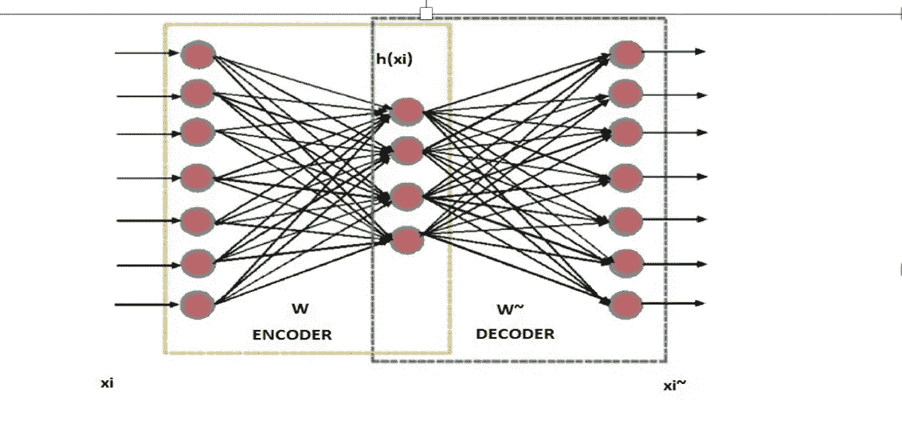
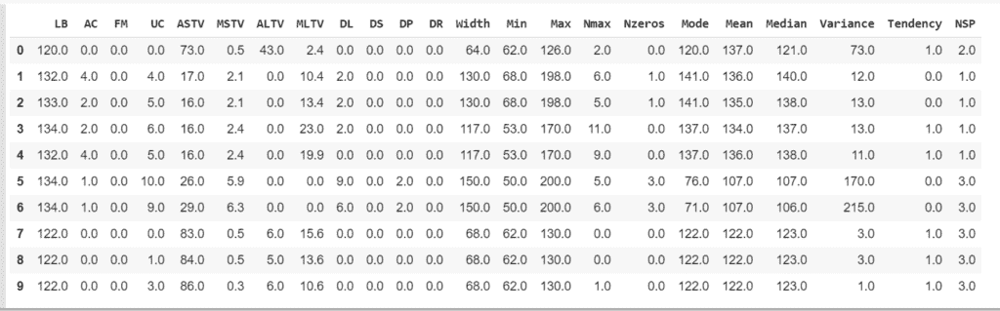
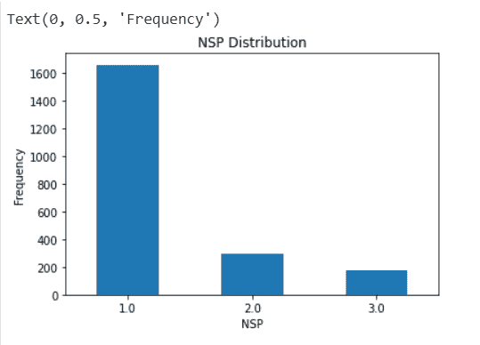
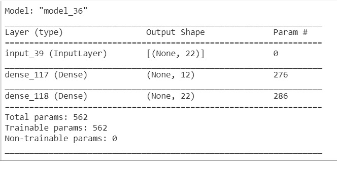
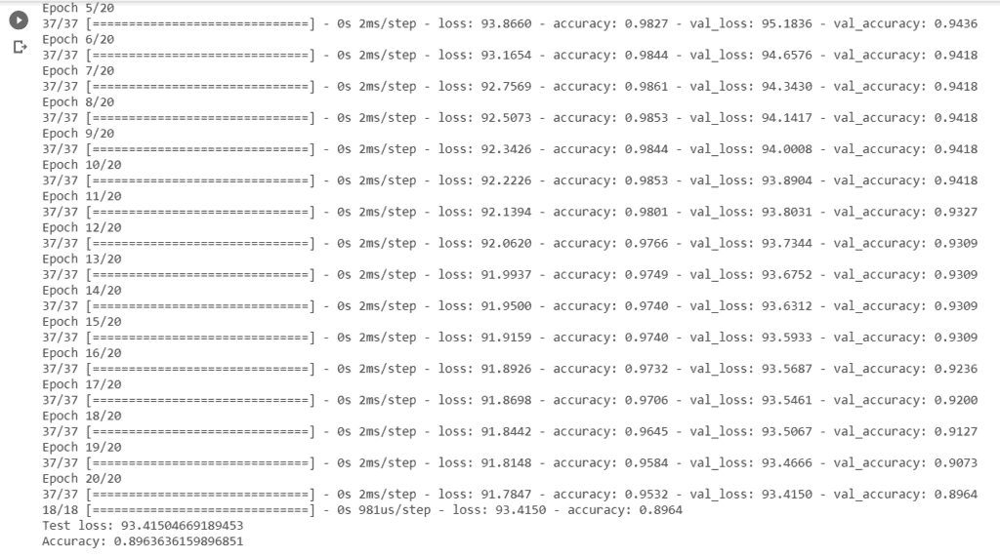
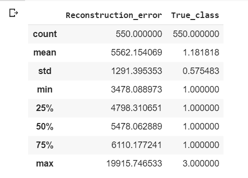
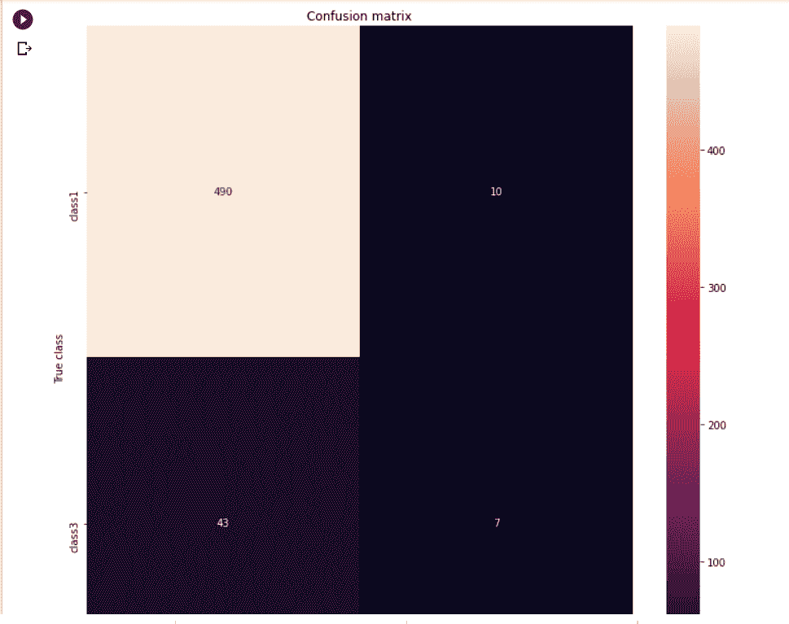
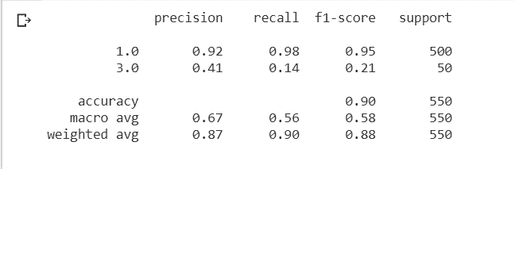

# 使用深度学习技术的心脏数据集中的异常检测:自动编码器

> 原文：<https://medium.com/analytics-vidhya/anomaly-detection-in-cardio-dataset-using-deep-learning-technique-autoencoder-fd24ca9e5c69?source=collection_archive---------1----------------------->

自过去许多年以来，自动检测并正确地将异常事物分类为异常一直是一个挑战。当涉及到高维数据时，它变得更加复杂，因为传统的机器学习方法无法捕捉不平衡数据中的复杂结构。这就是异常检测的深度学习方法可以用于该任务的地方。在所有深度学习技术中，我们使用 Autoencoder 进行异常检测。

因此，在这篇博客中，我们将了解以下内容:

*   什么是 Autoencoder？
*   自动编码器的应用
*   自动编码器的架构。
*   不同类型的自动编码器
*   简单的自动编码器
*   稀疏自动编码器
*   深度自动编码器
*   卷积自动编码器
*   降噪自动编码器
*   可变自动编码器
*   自动编码器的优势
*   自动编码器如何用于异常检测？
*   使用张量流的心脏数据集中的异常检测。

## 自动编码器的应用:

*   **异常检测:**自动编码器以一种特殊的方式使用神经网络的属性来完成一些训练网络学习正常行为的有效方法。当异常数据点到达时，自动编码器不能很好地编码它。它学会了表现这些数据中不存在的模式。当试图从其紧凑表示中重建原始数据时，重建将不会类似于原始数据。从而有助于在异常发生时检测到它们。这种过程的目标是试图从编码数据中重建原始输入，这在构建异常检测模块中是至关重要的。
*   **降维**:可以学习非线性变换，具有非线性激活函数和多层。自动编码器的目标是学习给定数据的压缩分布式表示，我们可以使用它来降低维数。
*   **特征提取:**这里，在减少构造错误的过程中，自动编码器的编码部分有助于学习输入数据中存在的重要隐藏特征。由此，模型生成一组新的原始特征的组合。
*   **序列到序列预测:**基于 LSTMs 的自动编码器使用可以在机器翻译过程中捕获句子的时间结构的编码器-解码器模型。
*   **推荐系统:**我们可以使用深度自动编码器来了解用户的偏好，以推荐电影、书籍或其他物品。以下是使用 autoencoder 构建推荐系统的步骤:
*   输入数据是基于兴趣的相似用户的聚类。
*   用户的兴趣通过观看的视频、每个视频的观看时间等来分类，
*   可以使用来自上述过滤器的相似种类的数据来创建聚类。
*   编码器部分将捕捉用户的兴趣
*   解码器部分将试图将兴趣投射到两个部分:现有的看不见的内容
*   来自内容创作者的新内容

## 什么是 AUTOENCODER？

自动编码器是神经网络，能够发现高维数据的低维表示。由此，它应该能够从输出中重建输入。

自动编码器架构有 3 个主要部分，如下所示:

*   **编码器，**将高维数据集的维度降低到低维。
*   **代码**，包含输入解码器的输入的简化表示。
*   **解码器**，将低维数据扩展为高维数据。

这里，压缩和解压缩函数是

*   特定于数据，这意味着模型将能够压缩它所训练的那些数据。模型的这一特性有助于压缩不平衡数据集的多数类。
*   有损，这意味着解压缩后的输出与原始输入相比质量下降。
*   从示例中自动学习，这意味着它可以更好地处理特定类型的输入。



## 对建筑的理解

编码器部分是特征提取函数 f，它根据输入 xi 计算特征向量 h (xi)。我们定义 h(xi)=f(xi)，其中 h(xi)是特征表示。

解码器部分是恢复函数 g，它从特征空间 h(xi)重建输入空间 xi，使得 xi~=g(h(xi))

自动编码器正试图学习一个近似值，使 xi 与 xi 相似。这意味着，它试图获得尽可能低的重建误差 E (xi，xi~)，该误差测量 xi 和 xi~之间的差异。因此得到了下面的方程 E (xi，xi~)=||xi-xi~||

自动编码器主要是作为多层感知器(MLP)开发的。编码器和解码器最常用的形式是保持共线性后跟随非线性的变换:

f (xi)=sf(b+W)

g(xi)=gf(c+W~)

其中 sf 和 sg 是编码器和解码器激活函数，例如 sigmoid 和 tanh

b 和 c 是编码器和解码器偏置向量，

W 和 W~是编码器和解码器权重矩阵。

## 自动编码器的类型:

简单的自动编码器:

编码器网络接收输入，并将其转换为更小、更密集的表示，也称为输入的潜在表示。然后，解码器网络可以使用它尽可能将其转换回原始输入。当我们的输入具有许多特征时，生成压缩表示有助于压缩训练样本的输入。因此，当神经网络遍历所有训练数据并微调所有隐藏层节点的权重时，权重将真正代表我们通常看到的输入类型。因此，如果我们尝试输入一些其他类型的数据，例如带有噪声的数据，自动编码器网络将能够检测到噪声。那么当产生输出时，它至少去除了一部分噪声。这真是太棒了，因为现在我们有可能从数据中去除噪声。

我们需要创建一个完全连接的神经层作为编码器和解码器模型，用优化器、损失和评估指标编译模型。损失函数通常是输出和输入之间的均方误差或交叉熵，我们称之为“重建损失”。它惩罚了产生不同于输入的输出的网络。然后，我们需要用测试数据来拟合我们的模型。

创建简单自动编码器的步骤

我们将构建一个简单的全连接神经层作为编码器和解码器来读取图像中的数字

*   让我们定义编码表示的大小。
*   encoding _ dim = 32 #假设输入大小= 882 浮点数，压缩因子=27.6
*   input_img=Input(shape=(882，)#这是我们的输入占位符
*   encoded=Dense(encoding_dim，activation = ' relu ')(input _ img)# " encoded "是输入的编码表示
*   decoded=Dense(882，activation = ' sigmoid ')(encoded)# ' decoded '是输入的有损重建
*   autoencoder=model(input_img，decoded)#该模型将输入映射到其重建
*   让我们创建一个单独的编码器模型
*   encoder=model(input_img，encoded)#这个模型将输入映射到它的编码表示
*   让我们创建一个单独的解码模型
*   encoded _ Input = Input(shape =(encoding _ dim，))#为编码(32 维)输入创建占位符
*   decoded _ layer = auto encoder . layers[-1]#检索自动编码器模型的最后一层
*   decoder=model(encoded_input，decoder _ layer(encoded _ input))#创建解码器模型
*   现在，让我们训练我们的自动编码器来重建数字
*   auto encoder . compile(optimizer = ' ada '，loss='binary_crossentropy ')
*   准备训练数据:x_train 和测试数据:x_test
*   让我们训练 50 个纪元的自动编码器
*   autoencoder.fit(x_train，x_train，epochs=50，batch_size=250，shuffle=True，validation_data=(x_test，x_test))
*   现在，我们将尝试可视化重建的输入和编码表示
*   encoded _ img = encoder . predict(x _ test)
*   decoded _ img = decoded . predict(encoded _ img)

稀疏自动编码器

稀疏自动编码器是其训练标准包括稀疏惩罚的自动编码器。我们将通过惩罚隐藏层的激活来构造我们的损失函数。结果，当单个样本被馈送到网络中时，只有少数节点被鼓励激活。通过确保 autoencoder 实际学习潜在的表示而不是输入数据中的冗余信息，较少的节点被激活。

值得注意的是，激活的已训练模型的单个节点是数据相关的，不同的输入将导致通过网络激活不同的节点。

这个事实的一个结果是，我们允许我们的网络使单个隐藏层节点对输入数据的特定属性敏感。欠完整自动编码器将对每个观测值使用整个网络，而稀疏自动编码器将根据输入数据选择性地激活网络区域。因此，我们限制了网络记忆输入数据的能力，而没有限制网络从数据中提取要素的能力。这允许我们分别考虑网络的潜在状态表示和正则化。然后，我们可以根据给定的数据上下文选择有意义的潜在状态表示，同时通过稀疏性约束施加正则化。我们可以通过两种主要方式来施加这种稀疏性约束；两者都涉及测量每个训练批次的隐藏层激活，并向损失函数添加一些项，以便惩罚过度激活。这些术语是

**L1 正则化:**对于 L1 正则化，除了 w=0 时，梯度不是 1 就是-1，这意味着不管 w 的值是多少，L1 正则化总是以相同的步长将 w 移向零，当 w=0 时，梯度变为零，不再进行更新。

**KL-散度:** Kullback-Leibler (KL)散度罚项量化了一个概率分布与另一个概率分布的差异程度。

两个分布 Q 和 P 之间的 KL 散度表示为 KL(P || Q)

其中“||”运算符表示“*发散*或与 q 的 Ps 发散。

KL(P | | Q)=—sum X in X P(X)* log(Q(X)/P(X))描述了 P 中每个事件的概率的负和乘以 Q 中事件的概率对 P 中事件的概率的对数。

KL(P | | Q)= sum X in X P(X)* log(P(X)/Q(X))描绘了 P 中每个事件的概率的正和乘以 P 中事件的概率对 Q 中事件的概率的对数。

当来自 P 的事件的概率很大，但是来自 Q 的相同事件的概率很小时，就有很大的差异。当来自 P 的概率很小，来自 Q 的概率很大时，也有很大的散度，但没有第一种情况大。

在上面的例子中，隐藏层正在学习降维(PCA)的近似值。压缩表示的另一种方式是通过向我们的`Dense`层添加`activity_regularizer`来对隐藏表示的活动添加稀疏性约束:

创建稀疏自动编码器的步骤

*   encoded=Dense(encoding_dim，activation='relu '，activation _ regulator = regulators . L1(10e-5))(input _ img)

卷积自动编码器:

每当我们的输入是图像时，使用卷积神经网络(convnets 或 CNN)作为编码器和解码器是有意义的。Autoencoder 对重建原始观察足够敏感，但对训练数据不够敏感，因此模型学习可概括的编码和解码。换句话说，概化模型会稍微破坏输入数据。但是仍然将未被破坏的数据作为我们的目标输出。使用这种方法，我们的模型不能简单地开发记忆训练数据的映射，因为我们的输入和目标输出不再相同。相反，该模型学习用于将输入数据映射到低维流形的矢量场。如果这个流形准确地描述了自然数据，我们就有效地“抵消”了增加的噪声。

创建卷积自动编码器的步骤

*   编码器由 Conv2D 层和 MaxPooling2D 层组成。
*   x=Conv2D(20，(3，3)，activation='relu '，padding='same') (input_img)
*   x=MaxPooling2D((2，2)，padding='same') (x) #SAME 将填充应用于输入图像，以便输入图像完全被过滤器和指定步幅覆盖，其中输出将与输入相同。所以，这被称为相同的填充
*   x=Conv2D(10，(3，3)，activation='relu '，padding='same') (input_img)
*   x=MaxPooling2D((2，2)，padding='same') (x)
*   x=Conv2D(10，(3，3)，activation='relu '，padding='same') (input_img)
*   encoded=MaxPooling2D((2，2)，padding='same') (x)
*   解码器由 Conv2D 层和 UpSampling2D 层组成。

可变自动编码器

在变型自动编码器中，来自一些已知概率分布的编码可以被解码以产生合理的输出，即使它们不是实际图像的编码。如果我们从这个分布中采样点，我们可以生成新的输入数据样本:VAE 是一个“生成模型”。

首先，编码器网络将输入样本 x 转换成潜在空间中的两个参数:z_mean 和 z_log_sigma。然后，我们通过 z = z _ mean+exp(z _ log _ sigma)* epsilon 从假设生成数据的潜在正态分布中随机采样相似点 z，其中 epsilon 是随机正态张量。最后，解码器网络将这些潜在空间点映射回原始输入数据。模型的参数通过两个损失函数来训练:

*   重建损失迫使解码样本匹配初始输入。
*   学习的潜在分布和先前分布之间的 KL 散度，作为正则化项。

创建变分编码器的步骤

*   首先，在编码器模型中，我们必须将输入映射到我们的潜在分布参数。
*   x =输入(批处理形状=(批处理大小，原始尺寸))
*   h=Dense(intermediate_dim，activation='relu')(x)
*   z _ mean =密集(潜在尺寸)(h)
*   z _ log _ sigma = Dense(latent _ dim)(h)
*   现在，我们可以使用这些参数来获得潜在空间中新的相似点的样本。
*   现在，我们可以将这些采样的潜在点映射回重建的输入。
*   现在，我们可以实例化 3 个模型:
*   将输入映射到重建的端到端自动编码器
*   将输入映射到潜在空间的编码器。
*   可以在潜在空间中取点并将输出相应的重构样本的生成器。
*   在此之后，我们需要使用端到端模型进行训练，然后用测试数据进行拟合。

**去噪自动编码器:**

去噪自动编码器会在输入图像中添加一些噪声，并学习如何消除这些噪声。因此，它试图避免在不了解数据特征的情况下将输入复制到输出。这些自动编码器在训练以恢复原始的未失真输入时，采用部分损坏的输入。然后学习用于将输入数据映射到描述自然数据的较低维度的矢量场，以抵消添加的噪声。通过这种方式，编码器将提取最重要的特征，并学习数据的更鲁棒的表示。

创建变分编码器的步骤

*   模型创建步骤类似于卷积自动编码器。唯一的区别是，我们将生成合成的噪声数字:我们只是应用高斯噪声矩阵，并在 0 和 1 之间裁剪图像。

## 使用案例:

为心脏生育描记术(Cardio)数据集构建异常检测模型

**数据集:**在这里，我们将使用 UCI 机器学习库中可用的心育图(Cardio)数据集建立一个模型，该数据集由胎儿心率(FHR)和子宫收缩(UC)的测量值组成。产科专家对心脏分娩图上的特征进行了分类，对所有特征进行了评估，并将每个病例分为正常、可疑和病理性 NSP。对于异常值检测，他们将正常类称为内部类，而将病理(异常值)类称为异常值。我们已经丢弃了可疑类。数据集存在于以下位置:

[心脏分娩数据集](http://odds.cs.stonybrook.edu/cardiotocogrpahy-dataset/)

数据集显示在这里:

以下是一个很好的异常检测数据集存储库:

[离群点检测数据集(ODDS)](http://odds.cs.stonybrook.edu/)

自动处理了 2126 张胎心监护图。三位产科专家对测量的相应诊断特征和 ctg 进行分类，并给他们每个人分配一个分类标签。已经根据形态学模式(A、B、c……)和胎儿状态(N、S、P)进行了分类。因此，数据集可以用于 10 类或 3 类实验，我们已经考虑了 3 类实验来构建我们的模型。

数据集是从 UCI 机器学习知识库收集的，呈现在这里:

**数据字典:**

属性信息:

LB —心率基线(每分钟心跳数)
AC —每秒加速度数
FM —每秒胎动数
UC —每秒子宫收缩数
DL —每秒轻度减速数
DS —每秒重度减速数
DP —每秒持续减速数
ASTV —短期变异性异常的时间百分比
MSTV —短期变异性的平均值
ALTV —短期变异性异常的时间百分比 长期可变性
MLTV —长期可变性的均值/平均值
宽度— FHR 直方图的宽度
最小值—FHR 直方图的最小值
最大值—FHR 直方图的最大值
Nmax —直方图峰值的数量
Nzeros —直方图零点的数量
模式—直方图模式
均值—直方图均值
中值—直方图中值
方差—直方图方差
趋势—直方图趋势
类—FHR 模式类代码 s =嫌疑人；p =病理性

在这里，我们认为 NSP=1 是内部值，NSP=3 是外部值

内联程序的总数=1658

异常值总数=178

**使用自动编码器的异常检测**

步骤 1:导入所有需要的库来构建模型

```
import tensorflow as tffrom tensorflow import kerasfrom tensorflow.keras import optimizersfrom tensorflow.keras.models import Sequential, Modelfrom tensorflow.keras.layers import Dense, Input, Dropout, Embedding, LSTMfrom tensorflow.keras.optimizers import RMSprop, Adam, Nadamfrom tensorflow.keras.preprocessing import sequencefrom tensorflow.keras.callbacks import TensorBoardimport sklearnfrom sklearn.preprocessing import StandardScalerfrom sklearn.preprocessing import MinMaxScalerfrom sklearn.model_selection import train_test_splitfrom sklearn.metrics import confusion_matrix, roc_auc_score, classification_reportimport seaborn as snsimport pandas as pdimport numpy as npimport matplotlib.pyplot as pltimport matplotlib.gridspec as gridspec​
```

第二步:第二步:在 Google Colab 中上传数据集。如果我们使用 Jupyter Notebook，那么我们可以使用 read_csv()从本地系统直接访问数据集。

```
from google.colab import filesuploaded=files.upload()import ioctg = pd.read_csv(io.BytesIO(uploaded['CTG.csv']))
```

步骤 3:获取关于数据集的更多信息。

```
ctg.head(10) # To access first 10 rows in the datasetlist(ctg) # To know the features present in the datasetctg.shape # To know the size of the datasetctg.describe() # To get the descriptive statstics for each feature
```



步骤 4:用目标变量:NPS 的模式填充缺少的值

```
ctg['NSP'].fillna(ctg['NSP'].mode()[0], inplace=True)
```

第五步:获得目标变量“NSP”不同值的数据分布。数据集中的其余特征是预测因素。

```
count_classes = pd.value_counts(ctg['NSP'], sort = True)count_classes.plot(kind = 'bar', rot=0)plt.title("NSP Distribution")plt.xlabel("NSP")plt.ylabel("Frequency")
```



步骤 6:丢弃所有 NSP=2 的数据点，因为这不是我们感兴趣的。

```
ctg=ctg.dropna()ctg=ctg.drop(ctg[ctg['NSP']==2].index)ctg.shape
```

(1831, 23)

步骤 7:计算“正常”和“异常”类的数据点数量

```
pd.value_counts(ctg['NSP'])
```

1.0 1655 3.0 176 姓名:NSP，数据类型:int64

第八步:拆分训练，测试数据。

```
from sklearn.model_selection import train_test_splittrain_x, test_x = train_test_split(ctg, test_size=0.3, random_state=42)train_x = train_x[train_x.NSP == 1] #where normal transactionstrain_x = train_x.drop(['NSP'], axis=1) #drop the class columntest_y = test_x['NSP'] #save the class column for the test settest_x = test_x.drop(['NSP'], axis=1) #drop the class columntrain_x = train_x.values #transform to ndarraytest_x = test_x.valuestrain_x.shape, test_x.shape
```

((1155, 22), (550, 22))

步骤 9:用 input_dim=1(对于 2 类分类器)，encoding_dim=12 建立模型。激活函数=编码层的 tanh 和解码层的 sigmoid。

```
encoding_dim=12input_dim=train_x.shape[1]inputArray=Input(shape=(input_dim,))encoded=Dense(encoding_dim, activation='tanh')(inputArray)decoded=Dense(input_dim, activation='softmax')(encoded)autoencoder=Model(inputArray, decoded)autoencoder.summary()
```



步骤 10:用 optimizer=ADAM，loss=binary-crossentropy，metrics=accuracy 编译模型。

步骤 11:用 batch_size=32 和 epochs=20 来拟合模型。

第 12 步:评估模型。

```
autoencoder.compile(optimizer=ADAM,loss='binary_crossentropy',metrics=['accuracy'])batch_size=32epochs=20history=autoencoder.fit(train_x,train_x,batch_size=batch_size,epochs=epochs,verbose=1,shuffle=True,validation_data=(test_x,test_x))score=autoencoder.evaluate(test_x, test_x, verbose=1)print('Test loss:', score[0])print('Accuracy:', score[1])
```



步骤 13:重构误差和真实类

```
test_x_predictions = autoencoder.predict(test_x)mse = np.mean(np.power(test_x - test_x_predictions, 2), axis=1)error_df = pd.DataFrame({'Reconstruction_error': mse,'True_class': test_y})error_df.describe()
```



步骤 14:绘制混淆矩阵

```
from sklearn.metrics import confusion_matriximport seaborn as snsLABELS = ["class1","class3"]threshold_fixed = 4000pred_y = [1.0 if e > threshold_fixed else 3.0 for e in error_df.Reconstruction_error.values]conf_matrix = confusion_matrix(error_df.True_class, pred_y)plt.figure(figsize=(12, 12))sns.heatmap(conf_matrix, xticklabels=LABELS, yticklabels=LABELS, annot=True, fmt="d");plt.title("Confusion matrix")plt.ylabel('True class')plt.xlabel('Predicted class')plt.show()
```



步骤 15:打印分类报告

```
print(classification_report(test_y,pred_y))
```



## 结论:

在这篇博客中，我们建立了一个自动编码器模型来检测心脏数据中的异常，它有两个分类器:正常和异常。在我们的下一篇博客中，我们将学习一种构建异常检测模型的新技术。

[https://web.stanford.edu/class/cs294a/sparseAutoencoder.pdf](https://web.stanford.edu/class/cs294a/sparseAutoencoder.pdf)

[https://www . quora . com/What-the-kull back-lei bler-KL-divergence](https://www.quora.com/What-is-the-Kullback-Leibler-KL-divergence)