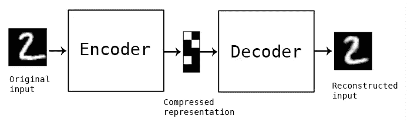

# 图像中的异常检测—自动编码器

> 原文：<https://medium.com/analytics-vidhya/anomaly-detection-in-images-autoencoders-b780abf88f51?source=collection_archive---------2----------------------->

# 简介:

****自动编码*** *“是一种数据压缩算法，其中压缩和解压缩函数为:**

1.  ****数据特定:*** *这意味着他们只能压缩与他们所受训练相似的数据。**
2.  ****有损:*** *这意味着解压缩后的输出与原始输入相比会降低质量**
3.  ****从例子中自动学习，而不是由人设计:*** *这意味着很容易训练算法的特定实例，这些实例将在特定类型的输入上表现良好。它不需要任何新的工程，只需要适当的训练数据。**

**它是一种* ***无监督*** *学习技术，其中我们利用神经网络来完成* ***表征学习*** *的任务。**

*   ****自动编码器*** *由一个* ***编码器*** *网络和一个* ***解码器*** *网络组成。编码器将高维输入编码成低维潜在表示，也称为* ***【瓶颈】*** ***层*** *。解码器采用这种低维潜在表示，并重构原始输入。**

**

*   **如上所述，我们可以将一个未标记的数据集构建为一个监督学习问题，任务是输出* ***x̂*** *，原始输入*****x****的**重构。这个网络可以通过* ***训练，最小化*** ***重构*******误差*******【l(x,x̂】****，从而度量出* ***之间的差异*******

# **应用:**

****自动编码器**有趣的实际应用有:**

1.  *****数据去噪*** 、**
2.  *****降维进行数据可视化:*** *通过适当的维度和稀疏约束，* ***自动编码器*** *可以学习比****PCA****或其他基本技术更有趣的数据投影。因为神经网络能够学习非线性关系，这可以被认为是 PCA* *的* ***更强大的(非线性)一般化。****PCA 试图发现描述原始数据的低维超平面，而自动编码器能够学习非线性流形。*******
3.  *****图像识别、异常检测和语义分割。*****
4.  ****推荐引擎。****

## **结构相似指数(SSIM)损失函数:**

*   ****SSIM** *用作度量标准来衡量两个给定图像之间的相似性。***
*   *****【SSIM】****结构相似度从一幅图像中提取 3 个关键特征:* ***亮度、对比度和结构。*****

****

**来源:[https://www.cns.nyu.edu/pub/eero/wang03-reprint.pdf](https://www.cns.nyu.edu/pub/eero/wang03-reprint.pdf)**

*   *****两个给定图像之间的结构相似性指数*** *是介于-1 和+1 之间的值。值+1 表示两个给定图像* ***非常相似或相同*** *，而值-1 表示两个给定图像* ***非常不同。*****
*   *****对于相似的图像，SSIM 损失函数会更小，而对于异常的图像，SSIM 损失函数会更大。*****

# **问题陈述:**

*   ***给出了****【n】幅时尚图片——MNIST 数据*** *，其中包含了几幅****【m】幅图片来自 MNIST 手写数据*** *。我们需要* ***在不使用任何迁移学习技术的情况下过滤掉异常。*****

# **让我们看看如何处理这个问题陈述:**

*   *****导入所需库*****

****

*   *****加载时尚 MNIST 训练和测试数据集，对其进行归一化和整形。*****

****

## **构建自动编码器架构:**

****

*   *****构建编码器部分*** : *编码器将高维输入编码成低维潜在表示，也称为瓶颈层。***

****

*   *****构建解码器部分*** : *解码器将对潜在表示进行解压缩，以重建输入数据。***

****

*   ***输出层使用一个 sigmoid 激活函数，因为它将输出展平到范围[0，1]内。***
*   *****定义结构相似指数(SSIM)损失函数:*** *对于相似的图像，***损失函数会比较小，对于异常的图像，SSIM 损失函数会比较大。****

****

*   *****定义自动编码器:*** *乐观者:亚当，损失:SSIM 损失***

****

*   *****让我们来看看我们的自动编码器神经网络*** 的架构**

****

*   *****设置 TENSORBOARD 为回调，用于测井损耗度量和训练:*** *训练 10 个历元，批量为 128。***

****

*   *****我们来查看一下 TENSORBOARD 中的训练和测试损耗:*** *多运行几个历元的实验可以得到更好的结果。***

****

*   *****为测试数据重建时尚 MNIST 图像并可视化:*** *将测试数据集传递给* ***自动编码器*** *并预测重建的数据。* ***使原始图像和重建图像可视化。*****

****

## **现在，我们的自动编码器已经被训练来从时尚 MNIST 数据中重建图像。**

*   *****现在，让我们介绍 MNIST 手写图像数据，我们的自动编码器模型将使用 SSIM 损失将其视为异常。*****
*   *****加载 MNIST 手写的训练和测试数据，归一化并整形。*****

****

*   **现在，使用我们在时尚-MNIST 数据集上训练的自动编码器来预测时尚-MNIST 数据和 MNIST 手写数据，并检查那里的 SSIM 损失。**

****

# **观察:**

*   ***从上图可以看出，对于训练数据集(时尚 MNIST 数据集)的重建而言，* ***SSIM 损失最小，然而，对于没有训练自动编码器的数据集(即 MNIST 手写)而言，SSIM 损失较高。*****

# **结论:**

*   ***自动编码器适用于* ***识别异常*** *。因为* ***自动编码器*** *学习如何基于属性压缩数据(* ***ie。输入特征向量*** *)之间的相关性在* ***训练*** *期间从数据中发现，这些模型通常只能重建与模型在训练期间观察到的观察值类别相似的数据。***

**感谢你阅读这篇博客。如果你喜欢它，请鼓掌，关注并分享。**

# **在哪里可以找到我的代码？**

****

****Github**:[https://github.com/SubhamIO/AnomalyDetection 深度自动编码器](https://github.com/SubhamIO/AnomalyDetection---Deep-AUTOENCODERS)**

# **参考资料:**

*   **[http://colah.github.io/posts/2014-03-NN-Manifolds-Topology/](http://colah.github.io/posts/2014-03-NN-Manifolds-Topology/)**
*   **[https://www.jeremyjordan.me/autoencoders/](https://www.jeremyjordan.me/autoencoders/)**
*   **[https://www.cns.nyu.edu/pub/eero/wang03-reprint.pdf](https://www.cns.nyu.edu/pub/eero/wang03-reprint.pdf)**
*   **[https://medium . com/SRM-mic/all-about-structural-similarity-index-ssim-theory-code-in-py torch-6551 b 455541 e](/srm-mic/all-about-structural-similarity-index-ssim-theory-code-in-pytorch-6551b455541e)**