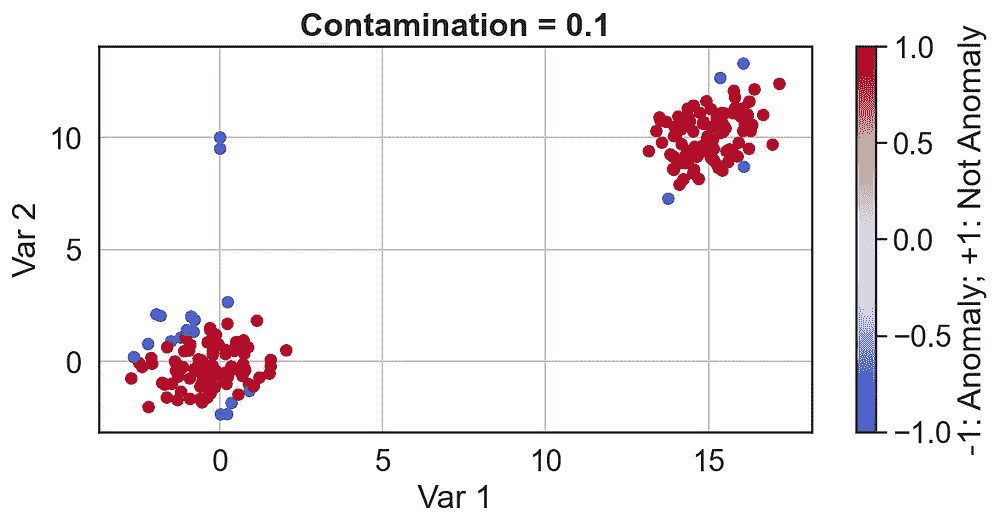

# Python 中的异常检测——第 1 部分:基础知识、代码和标准算法

> 原文：<https://medium.com/analytics-vidhya/anomaly-detection-in-python-part-1-basics-code-and-standard-algorithms-37d022cdbcff?source=collection_archive---------0----------------------->

异常/异常值是明显偏离正常/常规数据的数据点。异常检测问题可以分为 3 种类型:

1.  **监督:**在这些问题中，数据包含异常和干净的数据，以及告诉我们哪些例子是异常的标签。我们使用分类算法来执行异常检测。
2.  **半监督:**在这里，我们只能在培训期间访问“干净”的数据。该模型试图捕捉“正常”数据的样子，并在预测过程中将看起来“异常”的数据标记为异常值。自动编码器在这一类中被广泛使用。
3.  **无监督:**这里，数据包含干净的和异常的例子——但是没有标签告诉我们哪些例子是异常的。这是最常遇到的类别。

*在本文中，我们将讨论* ***无监督*** *执行异常/异常值检测的方法。我将在以后的文章中讨论半监督和监督方法。*

**无监督异常检测问题可以通过 3 种方法解决:**

1.  **基于业务/领域的 EDA**
2.  **单变量方法(图基方法、z 得分等)**
3.  **多元方法(马氏距离(使用 MCD)、一类 SVM、隔离森林等)**

我们将使用 fastcd 讨论**马氏距离法，这是一种相对更详细的多变量方法，因为多变量方法不太为人所知，但非常有用。让我们看看每一类，并从实用的角度来理解它们。**

我们还应该记住，异常点需要进一步关注——必须从领域的角度进行分析。因此，在大多数情况下，当我们说一个点是异常时，我们的意思是它值得更多的分析。

# 基于业务/领域的 EDA

这是必须尝试的第一种方法——它应该是贯穿整个异常检测或 ML 管道的持续过程。目标是通过数据可视化执行领域分析来识别异常行为。以下是一些好的开始方式:

1.  制作箱线图和直方图，以确定稀缺数据和极值的状态。如图所示，稀缺数据也可能存在于两种模式之间。
2.  可视化散点图——特别是因变量(因变量或共线变量)之间的散点图。当模式已经存在时，很容易发现偏差。


一些常见的潜在异常可以用简单的 EDA 检测出来。

散点图显示了一个有趣的场景——如果只看边缘直方图，两个孤立的高亮点看起来不像异常。只有当我们在散点图中绘制这两个变量时，我们才会看到 Var1、Var2 的值的组合是不寻常的，而不是 Var1 或 Var2 的单个值。**这是一个绘制单变量直方图无法识别异常情况的例子。**这种异常是一种**多元异常**，将在本文后面讨论。

# 单变量方法

单变量方法易于实现，执行速度快。他们的结果也很容易向商业利益相关者解释。这个想法是一次查看一个变量**,并确定以下任一区域:**

1.  **稀缺数据存在*(和/或)***
2.  **数据取极值**

**我们将简要讨论**图基的方法**，该方法将数据中的极值视为异常值/异常值:**

**在 Tukey 的方法中，我们定义了一个下限和一个上限。在这些限制范围内的数据被认为是“干净的”。下限和上限以**鲁棒**的方式确定。这意味着上限和下限不会受到异常值的影响。这是与其他一些方法(如 z 分数法)的区别，z 分数法的下限和上限受异常值的影响。一般来说，最好使用健壮的方法。**

**上限和下限定义如下:**

****下限=第 25 百分位— k*IQR****

****上限=第 75 百分位+ k*IQR****

**其中，k 通常为 1.5，但如果需要，必须进行调整。IQR 是变量的四分位数范围(IQR =第 75 个百分点-第 25 个百分点的数据)。数据中低于下限或高于上限的值称为异常值。**

****

**通过 tukey 的方法发现的异常值可以使用典型的箱线图可视化。剧情举例。在这种方法中，极值被认为是异常的。**

**以下函数用 **NaN** 替换 tukey 方法识别的异常值(超出上述定义的限值):**

```
def tukey(x, k = 1.5):
    x = np.array(x).copy().astype(float)
    first_quartile = np.quantile(x, .25)
    third_quartile = np.quantile(x, .75)

    # Define IQR
    iqr = third_quartile - first_quartile

    ### Define the allowed limits for 'Normal Data'
    lower_allowed_limit = first_quartile - (k * iqr)
    upper_allowed_limit = third_quartile + (k * iqr)

    #set values below the lower limit/above the upper limit as nan
    x[(x<lower_allowed_limit) | (x>upper_allowed_limit)] = np.nan
    return x
```

**其他一些单变量方法是 z-score 方法和中位数绝对偏差方法-各有利弊。**

# **多元方法**

**让我们理解什么是多元异常值。考虑一辆汽车，想象我们测量的两个特征:**

1.  **odo:它显示汽车上的里程表读数，并以英里/小时为单位测量汽车的速度。**
2.  **每分钟转数:它测量汽车车轮每分钟转动的次数。**

**假设 *odo* 取值范围为 0–50 英里/小时，而 *rpm* 取值范围为 0–650 rpm。我们希望这两个特征的读数相互关联，即大的转速会导致里程表记录更高的速度。**

**现在，假设我们在 rpm 传感器上记录了一个 0 值。我们断定汽车没有移动。同样，比方说在开车时，如果里程表显示 25 英里/小时，我们可以断定汽车正在行驶。然而，这些值都不是异常值，因为它们代表了完全正常的操作模式。**

**然而，让我们想象一下，我们注意到 odo 读数为 25，但同时*，rpm 读数为 0。这看起来不合理。25 的 odo 值本身不是不合理的；而 rpm 为 0 也不是不合理的(如上所述)*但是对他们来说同时取那些值是不合理的。* **这是一个多元异常值的例子。多元异常值是指特征值组合不太可能出现的观测值。**这里重要的是同时考虑所有特性的值，而不是像我们讨论单变量方法时那样一次只考虑一个特性。 ***多元异常值需要专门的方法——并且通常无法通过单变量方法检测到，除非特征单独取极值。它们也很难检测到——上面的例子有 2 个变量(odo 和 rpm ),这就是为什么我们可以很容易地发现异常值——但是，当我们有数百个变量时，这个问题就不可能手动解决了。即使在处理数百个变量时，使用多变量方法也可以使过程变得简单。******

***现在让我们来看一个检测多元异常/异常值的算法。正如开始时所讨论的，我们将讨论无监督的情况——已知数据被异常值污染，但不知道精确的异常观察值。***

## ***使用 FastMCD 算法的马氏距离法；***

***我们将使用 sklearn 实现这个方法。让我们首先讨论这种方法的机制。 *马氏距离可以有效地被认为是一种度量点与分布之间距离的方法。*当使用它来检测异常时，我们将“干净”数据视为分布。**如果一个点与“干净”数据的马氏距离很大，我们认为这是一个异常。**该方法假设干净数据是多元正态的，但在实践中，它甚至可以用于各种其他情况。***

***马氏距离与多元正态分布密切相关。以下是它的一些特征:***

1.  ***如果数据遵循多元正态分布，则具有相同概率的所有点与分布平均值的马氏距离相同。***
2.  ***一个点离正态分布均值的马氏距离越高，该点的概率越低。现在，从统计学的角度来看，这是有意义的-至于为什么具有大马氏距离的点是潜在的异常-因为它们对应于低概率。***

***正态分布由其均值和协方差矩阵唯一确定，需要根据数据进行估计。但是，我们使用 **FastMCD 算法**来确定正态分布的均值和协方差矩阵。我们使用 **FastMCD** 算法，因为我们想要对均值和协方差进行稳健的估计。如果我们使用均值和协方差的直接公式，那么异常值也会有助于计算均值和协方差——这不是我们想要的。以下是了解 FastMCD 的一个好资源:【https://onlinelibrary.wiley.com/doi/epdf/10.1002/wics.1421 ***

***幸运的是，Scikit-learn 有一个非常方便的方法来使用这个方法。以下是步骤:
1。**将 sklearn .协方差. EllipticEnvelope()拟合到数据:**这将使用 FastMCD 算法计算数据的稳健平均值和协方差。我们需要将**污染**的值传递给它，这是我们预计异常的数据部分的估计值。
2。**预测:**预测每个数据点的异常值/异常状态。由算法标记为-1 的点是异常，+1 不是异常。***

***这是之前的例子:***

******

***我们希望使用 Mahalanobis 距离方法将左上角的 2 个点检测为异常值。***

```
*### Create the Data
d1 = np.random.multivariate_normal(mean = np.array([-.5, 0]),
                               cov = np.array([[1, 0], [0, 1]]), size = 100)d2 = np.random.multivariate_normal(mean = np.array([15, 10]),
                               cov = np.array([[1, 0.3], [.3, 1]]), size = 100)outliers = np.array([[0, 10],[0, 9.5]])
d = pd.DataFrame(np.concatenate([d1, d2, outliers], axis = 0), columns = ['Var 1', 'Var 2'])### The outliers added above are what we want to detect ####
############# Use Mahalanobis distance method to detect them ##### Define the Elliptic Envelope
el = covariance.EllipticEnvelope(store_precision=True, assume_centered=False, support_fraction=None, 
                                    contamination=0.0075, random_state=0)
# Fit the data - this is where FastMCD is used by sklearn
el.fit(d)# Create column that shows anomaly status
d['Anomaly or Not'] = el.predict(d)# Create scatterplot and color the anomalies differently
plt.figure(figsize = (9, 4))
ax = plt.scatter(d['Var 1'], d['Var 2'], c = d['Anomaly or Not'], cmap = 'coolwarm')
plt.xlabel('Var 1')
plt.ylabel('Var 2')
plt.colorbar(label = '-1: Anomaly; +1: Not Anomaly')
plt.grid()* 
```

***污染输出= 0.075:***

******

***如我们所见，该算法将左上角的两个示例标记为异常。试验污染值以找到正确的值很重要。***

***正如我们所看到的，这种方法是有效的——它检测多元异常。它可以用于具有数百个维度的数据。设置污染非常重要。为了看到这一点，让我们检查算法的结果，因为我们设置了不同的污染值。***

************************

***对于较小的污染值，该算法是保守的，检测到的异常很少。随着污染的增加，它将更多的“外部”点标记为异常。***

***正如我们所见，设置正确的污染是非常重要的。*污染应设置为我们对异常数据点比例的最佳估计值。****

## ***如果我们没有对污染的估计，该怎么办？***

***然后，我们从稳健平均值直接计算每个点的 Mahalanobis 距离，并基于数据中 Mahalanobis 距离的分布为其设置截止值。我们执行以下操作:***

1.  ***将 **sklearn .协方差. EllipticEnvelope()** 拟合到数据。***
2.  ***使用`[**mahalanobis**](https://scikit-learn.org/stable/modules/generated/sklearn.covariance.EllipticEnvelope.html#sklearn.covariance.EllipticEnvelope.mahalanobis)()`方法计算每个数据点与稳健平均值的马氏距离。***
3.  ***可视化数据中的马氏距离分布。确定一个阈值，超过该阈值的点将被称为异常值-通过可视化距离**或**的分布，对距离使用单变量异常检测算法来找出哪些距离是异常的。***

***另外，请注意，污染值在这种方法中并不重要，因此我们设置为任意值。***

```
*# Create Data - with Anomaly - as before.
d1 = np.random.multivariate_normal(mean = np.array([-.5, 0]),
                               cov = np.array([[1, 0], [0, 1]]), size = 100)d2 = np.random.multivariate_normal(mean = np.array([15, 10]),
                               cov = np.array([[1, 0.3], [.3, 1]]), size = 100)outliers = np.array([[0, 10],[0, 9.5]])
d = pd.DataFrame(np.concatenate([d1, d2, outliers], axis = 0), columns = ['Var 1', 'Var 2'])###### Fit Elliptic Envelope ##############contamination = .4 # We can set any value here as we will now use our own threshold
el = covariance.EllipticEnvelope(store_precision=True, assume_centered=False, support_fraction=None, 
                                    contamination=contamination, random_state=0)
# Fit the data
el.fit(d)
############# New Part ################# Create column that measures Mahalanobis distance
d['Mahalanobis Distance'] = el.mahalanobis(d)# Create scatterplot and color the anomalies differently
plt.figure(figsize = (12, 6))
ax = plt.scatter(d['Var 1'], d['Var 2'], c = d['Mahalanobis Distance'], cmap = 'coolwarm')
#plt.title('Contamination = Does not matter for this method', weight = 'bold')
#ax = sns.scatterplot(d['Var 1'], d['Var 2'], c = d['Anomaly or Not'])
plt.xlabel('Var 1')
plt.ylabel('Var 2')
plt.colorbar(label = 'Mahalanobis Distance')
plt.grid()* 
```

************

***如我们所见，两个异常的马氏距离大于其余数据的马氏距离。***

***现在让我们确定一个马哈拉诺比斯距离的阈值。一种方法是对计算的马氏距离应用单变量异常检测算法，这是有意义的，因为我们通过计算马氏距离将 2D 数据转换为 1D 数据。现在，这个距离代表我们在 1D 的数据，我们可以对它使用单变量异常检测方法。让我们对数据中的马哈拉诺比斯距离作一个箱线图，并用图基的方法找出极限距离。***

******

***我们可以在 100 附近看到 2 个明显的异常值——事实上，这是我们迄今为止发现的 2 个异常点。***

***我们现在清楚地看到 100 附近的 2 个点是强异常。20 附近还有一个点被贴上了异常的标签——需要进一步分析。***

***我们刚才所做的是一项标准技术— **我们通过计算每个点与稳健平均值的马氏距离，将多变量异常值检测问题转化为单变量异常值检测问题。然后，我们在这个距离上应用单变量方法。*****

***或者，我们可以简单地制作一个直方图，直观地确定一个好的阈值。***

*****注意:**马哈拉诺比斯距离方法甚至适用于数百个特征。为了便于可视化，我在讨论中使用了两个变量。***

# ***摘要***

***我们讨论了异常检测中的三大类问题以及用于解决这些问题的三大类技术。我们讨论了多元方法的重要性，当我们拥有高维数据时，多元方法通常可以提供 EDA 无法提供的见解。我们讨论了针对单变量和多变量情况执行异常检测的稳健方法。对于多变量技术，我们讨论了 Mahalanobis 距离方法的稳健变化，并讨论了**将多变量异常检测问题转化为单变量问题的一般方法。在接下来的文章中，我们将讨论自动编码器、隔离森林、OC-SVM 等方法。*****

***如果您有任何反馈，请随时告诉我。***