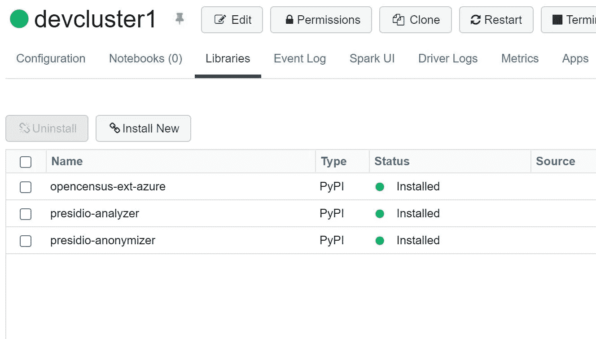
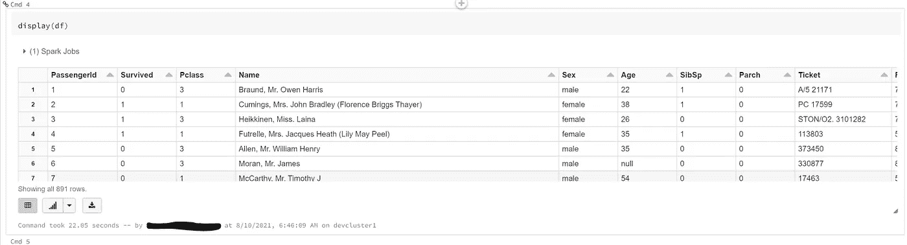
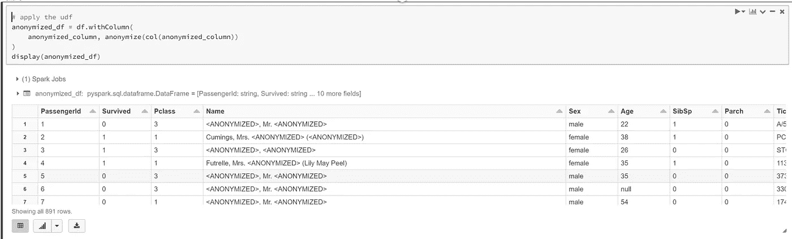

# 使用 Presidio 匿名化 Spark 中的 PII 数据(基于 ML)

> 原文：<https://medium.com/analytics-vidhya/anonymize-pii-data-in-spark-using-presidio-ml-based-34164650e410?source=collection_archive---------1----------------------->

# 通过 PII 使用 Azure Databricks 匿名化文本

# 用例

*   能够匿名化数据集中的 PII 数据
*   用于数据工程
*   用于机器学习

# 先决条件

*   Azure 帐户
*   Azure 存储帐户
*   Azure 数据块
*   安装库

```
presidio-analyzer 
presidio-anonymizer
```

# 参考

*   支持的 PII 实体—[https://microsoft.github.io/presidio/supported_entities/](https://microsoft.github.io/presidio/supported_entities/)
*   Presidio 的回购—[https://github . com/Microsoft/presi dio/tree/main/docs/samples/deployments/spark](https://github.com/microsoft/presidio/tree/main/docs/samples/deployments/spark)

# 火花代码

*   确认安装了上述 presidio 库



*   现在让我们编写代码
*   把所有进口货都带来

```
from presidio_analyzer import AnalyzerEngine
from presidio_anonymizer import AnonymizerEngine
from presidio_anonymizer.entities.engine import OperatorConfig
from pyspark.sql.types import StringType
from pyspark.sql.functions import input_file_name, regexp_replace
from pyspark.sql.functions import col, pandas_udf
import pandas as pd
import os
```

*   加载样本泰坦尼克号数据集

```
df = spark.sql("Select * from default.titanictbl")
```

*   现在显示数据

```
display(df)
```



*   初始化分析仪

```
analyzer = AnalyzerEngine()
anonymizer = AnonymizerEngine()
broadcasted_analyzer = sc.broadcast(analyzer)
broadcasted_anonymizer = sc.broadcast(anonymizer)
```

*   创建要匿名的 UDF

```
def anonymize_text(text: str) -> str:
    analyzer = broadcasted_analyzer.value
    anonymizer = broadcasted_anonymizer.value
    analyzer_results = analyzer.analyze(text=text, language="en")
    anonymized_results = anonymizer.anonymize(
        text=text,
        analyzer_results=analyzer_results,
        operators={"DEFAULT": OperatorConfig("replace", {"new_value": "<ANONYMIZED>"})},
    )
    return anonymized_results.text def anonymize_series(s: pd.Series) -> pd.Series:
    return s.apply(anonymize_text) # define a the function as pandas UDF
anonymize = pandas_udf(anonymize_series, returnType=StringType())
```

*   设置匿名化列名
*   只会匿名链接中设置的实体—【https://microsoft.github.io/presidio/supported_entities/ 

```
anonymized_column = "Name"
```

*   现在匿名化数据

```
# apply the udf
anonymized_df = df.withColumn(
    anonymized_column, anonymize(col(anonymized_column))
)
display(anonymized_df)
```



*原载于*[*https://github.com*](https://github.com/balakreshnan/Samples2021/blob/main/adb/presidiotest.md)*。*