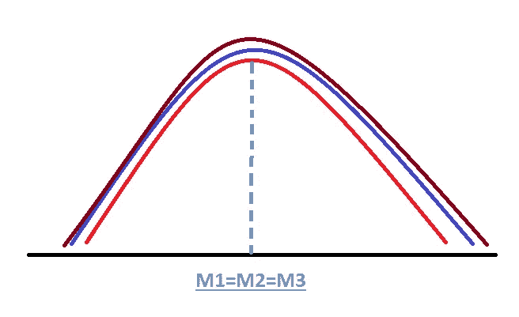
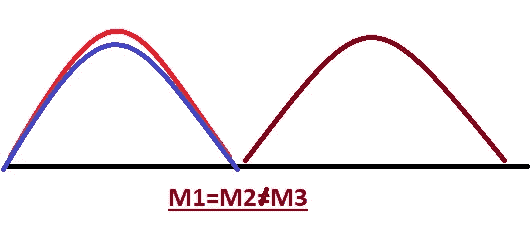
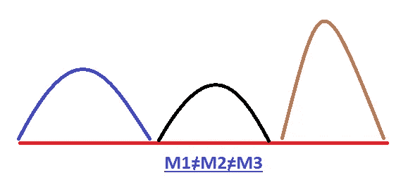
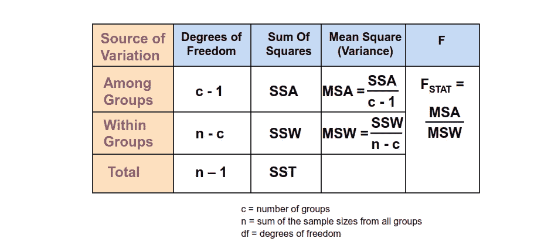
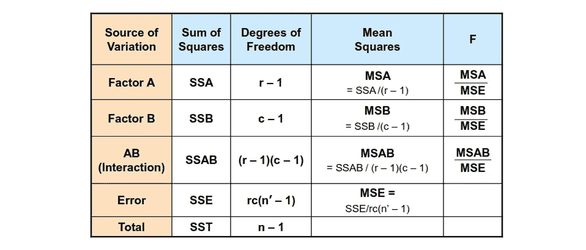
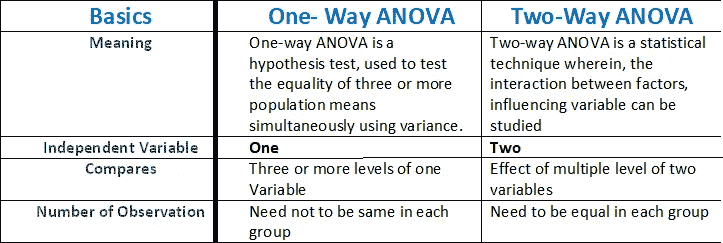

# 方差分析及其在决策中的意义

> 原文：<https://medium.com/analytics-vidhya/anova-and-its-significance-in-decision-making-853a5bb35c46?source=collection_archive---------10----------------------->

我属于印度的一个中产阶级，我总是想知道不同品牌的润滑油是否会对我的自行车里程产生不同的影响？

作为一名农民，我想，未来我的种子品种不同会对产量产生不同的影响吗？

作为一名杂货店老板，我思考着我的平均销售额在一周的不同日子里会有所不同吗？

我怎样才能从统计学上知道，真的有可以观察到的差异吗，哪个因素对我的结果影响最大？

**方差分析及其由来**

1918 年，罗纳德·费雪创立了方差分析方法，ANOVA。它也被称为 Fisher 方差分析，是 t 检验和 z 检验的扩展。这个术语在 1925 年出现在费希尔的书《研究人员的统计方法》中后变得广为人知。

ANOVA 测试允许同时比较两个或两个以上的组，以确定它们之间是否存在关系。方差分析公式的结果，即 F 统计量(也称为 F 比率)，有助于分析多组数据，以确定样本之间和样本内部的变异性。

ANOVA 的目的:方差分析(ANOVA)是一种假设检验技术，用于确定两个以上群体的平均值是否相同。

**方差分析的类型:**

我们将详细讨论两种类型的方差分析问题:

I .单因素方差分析:当回答取决于单一因素时

二。二。双向方差分析:当反应取决于两个因素时，这两个因素之间可能相互作用，也可能不相互作用。

**案例研究:-**

比方说，我想确定不同的自行车的里程数是否因不同的润滑剂而不同。我有理由相信，自行车的品牌(本田、KTM、Bajaj 等)和润滑剂(Mak、嘉实多、伺服等)可能是导致自行车里程增加或减少的因素。为此，我将对我所在地区最近注册的所有自行车进行随机抽样，并比较不同品牌自行车和润滑油的里程数。

这个问题本质上是一个识别数据中变化来源的问题。方差分析将被用于观察

里程仅取决于自行车的品牌(单向方差分析)

里程仅取决于润滑剂的品牌(单向 ANOVA)

里程取决于自行车的品牌和润滑剂(双向方差分析)。

**方差分析的假设** 从不同人群中抽取的样本具有独立性和随机性。
所有群体的响应变量呈正态分布。
所有群体的方差相等。

**单因素方差分析的假设:
零假设** :-所有总体均值相等。例如，所有牌子的自行车平均行驶里程都相等。

**备选假设** :-不是所有的总体均值都相等。(对于至少一对，总体均值不相等)。-至少有一种品牌的自行车，其平均里程数不同。

在我们的情况下可能有两种可能性

零假设为真。

#即所有品牌的自行车都有相同的里程数。

其中，M1、M2、M3 =品牌 1、2 和 3 自行车的平均里程，这可能会增加更多品牌的自行车。

~替代假设为真

**ANOVA 如何工作** ANOVA 通过实际分析方差来进行两个以上总体均值相等的检验。

它将总变差分解为变差的组成部分。即解释由这些成分引起的响应变量的变化。

总平方和(SST) ≡治疗平方和(SSB) +误差平方和(SSW)

SST-总变化量(所有自行车的平均里程)

SSB-各组之间的差异(各种品牌的平均里程)

SSW-组内变异。(相同品牌自行车的平均里程)

单词 treatment 是通用的，因此在我们的例子中可以表示不同的品牌、制造商。

响应变量(因变量)的平方和的变化仅由治疗引起，治疗无法解释的任何事情都归因于误差项。

另一个重要的概念是自由度(𝐷𝐹).这等于构成平方和的独立量的数量。每个定义的平方和都有相应的 DF。将每个 SS 除以适当的 DF；获得了平方和的平均值。

组间平方和均值计算如下:
𝑀𝑆𝐵 = 𝑆𝑆𝐵 /(c — 1)

组内平方和的平均值计算为
𝑀𝑆𝑊= 𝑆𝑆𝑊/(𝑛-c)

其中，
𝑐:组数或级别数
n:观察次数

MSB 和 MSW 之间的比率提供了关于是否可以接受零假设的指示。这个比率被定义为𝐹-𝑆𝑇𝐴𝑇 = 𝑀𝑆𝐵 /𝑀𝑆W

根据上面解释的基本原理，如果 MSB 与 MSW 相比太大，则零假设被拒绝。𝐹𝑆𝑇𝐴𝑇和𝑑𝑓服从 f 分布(𝑐 — 1，𝑛 — 𝑐).因为𝐹-𝑆𝑇𝐴𝑇是两个正数的比值，所以它总是正的。因此，拒绝规则是:拒绝𝐻0 𝑖𝑓 𝐹-𝑆𝑇𝐴𝑇 > 𝐹

ANOVA 的典型输出如下所示

F 值根据具体情况确定，对应于不同水平的变化概率，理想概率为 0.05

**双向方差分析**

双因素方差分析比较在两个独立变量(称为因子)上分开的组之间的平均差异。

双向 ANOVA 的主要目的是了解两个自变量与因变量之间是否存在交互作用。

*   例如，为了了解候选人的年龄和教育水平对工作经验的影响，年龄(25-30 岁)和教育水平(本科/研究生)是自变量，工作经验是因变量。

双向方差分析的汇总表如下:

**结论**

因此通过使用方差分析，我们可以决定:-

1.  哪辆自行车的里程数更好？
2.  哪种润滑油对里程比较好？
3.  哪种润滑剂对哪种类型的自行车有更好的行驶里程？

敬请关注即将推出的更多博客。